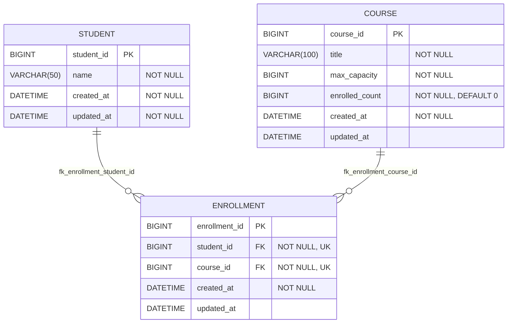

# Distributed Lock Benchmark

본 프로젝트는 대규모 트래픽 환경에서 발생할 수 있는 데이터 정합성 문제를 해결하기 위해 다양한 분산 락(Distributed Lock) 구현 방식의 성능과 안정성을 비교 분석합니다.

## 시스템 아키텍처

- **Load Tester:** nGrinder
- **Web Server:** Nginx (L4 Load Balancer)
- **Application Server:** Spring Boot (Java)
- **Distributed Lock:** Redis (Lettuce, Redisson) / MySQL (Pessimistic Lock)

---

## 기술 스택

- **Language:** Java 21
- **Framework:** Spring Boot 3.x, Spring Data JPA
- **Database:** MySQL 8.0
- **NoSQL:** Redis (Distributed Lock Management)
- **Load Testing Tool:** nGrinder

---

## 데이터 모델링 (ERD)

본 프로젝트는 수강신청 시나리오를 바탕으로 동시성 이슈를 재현하며, 다음과 같은 핵심 도메인으로 구성되었습니다.

- **COURSE:** 동시성 제어의 핵심 타겟 (공유 자원)
- **STUDENT:** 부하 테스트를 위한 사용자 더미 데이터
- **ENROLLMENT:** 중복 신청 방지를 위한 Unique Constraint(`student_id`, `course_id`)가 적용된 매핑 테이블

---

## 비교 분석 대상

|          방식          |      구현 도구       |
|:--------------------:|:----------------:|
| **Pessimistic Lock** |   MySQL (JPA)    |
|    **Spin Lock**     | Redis (Lettuce)  |
|   **Pub/Sub Lock**   | Redis (Redisson) |

