# [논문 번역] An Evaluation of Distributed Concurrency Control (2017)

## 논문 정보

- **제목:** An Evaluation of Distributed Concurrency Control
- **저자:** Rachael Harding, Dana Van Aken, Andrew Pavlo, Michael Stonebraker
- **학술지/발행처:** VLDB 2017
- **참고 링크:** [VLDB 논문 링크](https://www.vldb.org/pvldb/vol10/p553-harding.pdf)

---

## 논문 번역

### 0. 초록

트랜잭션 양이 증가함에 따라 **분산 트랜잭션 처리(distributed transaction processing)** 에 대한 관심이 다시 높아지고 있습니다.
특히, 데이터를 여러 서버에 분할하여 배치하면 서버들이 트랜잭션을 병렬로 처리할 수 있게 되어 **처리량(throughput)** 을 향상시킬 수 있습니다.
하지만 여러 서버에 걸쳐 트랜잭션을 실행하는 방식은 결과적으로 이러한 시스템의 확장성(scalability)과 성능을 제한하게 됩니다.

본 논문에서 저희는 분산 환경이 **동시성 제어 프로토콜(concurrency control protocols)** 에 미치는 영향을 정량화합니다.
**'Deneva'** 라고 불리는 인메모리 분산 데이터베이스 평가 프레임워크를 통해 6가지의 고전적 및 현대적 프로토콜을 평가하여, 각 프로토콜 간의 **공정한 비교(apples-to-apples
comparison)** 를 제공합니다.

연구 결과, 분산 트랜잭션 처리 엔진의 심각한 한계가 드러났습니다.
또한 분석을 통해 각 프로토콜별로 발생하는 고유한 **확장성 병목 현상(scalability bottlenecks)** 을 확인했습니다.
결론적으로 진정한 확장성을 달성하기 위해서는, 분산 동시성 제어 솔루션이 **차세대 네트워크 하드웨어**(로컬 영역 내)나 **애플리케이션**(데이터 모델링 및 시멘틱 인식 실행을 통한 방식),
또는 이 둘 모두와 더 **긴밀하게 결합**되어야 한다고 판단됩니다.

### 1. 서론

데이터 생성량과 쿼리 처리량이 단일 서버 데이터베이스 관리 시스템(DBMS)의 수용 능력을 앞지르고 있습니다.
그 결과, 조직들은 데이터를 여러 서버에 분할하여 배치하고 있으며, 이때 각 파티션은 전체 데이터베이스의 일부분만을 보유하게 됩니다.
이러한 **분산 DBMS**는 쿼리가 단일 파티션의 데이터만 필요로 할 경우, 자원 경합을 완화하고 높은 처리량을 달성할 수 있는 잠재력을 가집니다.
하지만 많은 **온라인 트랜잭션 처리(OLTP)** 애플리케이션에서는 모든 쿼리가 단일 파티션만 액세스하도록 보장하는 방식으로 데이터를 나누는 것이 매우 어렵거나 사실상 불가능합니다.
필연적으로 일부 쿼리는 **여러 파티션에 걸쳐 있는 데이터에 액세스**해야만 하는 상황이 발생합니다.

불행하게도, 여러 파티션에 걸쳐 실행되는 **직렬화 가능 동시성 제어(serializable concurrency control)** 프로토콜은 심각한 성능 저하를 초래합니다.
하나의 트랜잭션이 네트워크를 통해 여러 서버에 액세스하게 되면, 해당 트랜잭션과 자원을 놓고 다투는(경합하는) 다른 모든 트랜잭션들은 그 처리가 끝날 때까지 대기해야 할 수도 있습니다.
이는 시스템의 **확장성(scalability)** 측면에서 잠재적으로 재앙적인 상황입니다.

본 논문에서 저희는 다음과 같은 현상을 조사합니다.
즉, **분산 동시성 제어가 언제 성능에 이득이 되고, 특정 워크로드에서 언제 분산 방식이 오히려 더 나쁜 결과를 초래하는가?** 하는 점입니다.
분산 트랜잭션 처리의 비용은 이미 잘 알려져 있지만, 높은 확장성과 탄력성을 제공하는 **현대의 클라우드 컴퓨팅 환경**에서의 트레이드오프(상충 관계)에 대해서는 이해가 부족한 실정입니다.

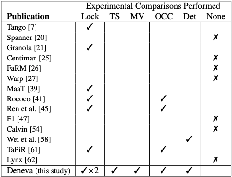

**표 1: 직렬화 가능한 분산 트랜잭션을 위해 최근 발표된 프로토콜들의 실험적 평가 비교**
(Lock: 2단계 잠금, TS: 타임스탬프 기반 프로토콜, MV: 다중 버전 동시성 제어, OCC: 낙관적 동시성 제어, Det: 결정론적 방법)

새로운 분산 프로토콜을 제안하는 최근 논문들 중 두 가지 이상의 다른 접근 방식과 비교하는 경우는 거의 없습니다.
예를 들어, [표 1]에 나열된 2012년 이후 발표된 논문 중 그 어떤 것도 타임스탬프 기반이나 다중 버전(Multi-version) 프로토콜과 비교하지 않았으며, 그중 7개는 다른 직렬화 가능 프로토콜과 전혀
비교하지 않았습니다.
결과적으로, 논문마다 하드웨어 및 워크로드 설정이 제각각이기 때문에 제안된 프로토콜들을 서로 비교하기가 매우 어려운 상황입니다.

저희의 목표는 인메모리 DBMS를 위한 기존의 분산 동시성 제어 프로토콜들을 **정량화하고 비교**하는 것입니다.
저희는 [표 1]에 나열된 일부를 포함하여 고전적인 프로토콜과 새로 제안된 프로토콜들을 두루 사용해, 현대적인 클라우드 컴퓨팅 인프라에서 분산 트랜잭션이 어떻게 동작하는지에 대한 **실증적인 이해**를 도출했습니다.

또한, 여러 분산 직렬화 가능 동시성 제어 프로토콜의 성능과 트레이드오프를 평가하기 위해 **'Deneva(데네바)'** 라고 불리는 경량형 분산 메인 메모리 DBMS 평가 프레임워크를 개발했습니다.
이는 프로토콜 간의 **공정한 비교(fair comparison)** 를 보장하는 통합 플랫폼이며, 다양한 워크로드 조건에서 각 프로토콜의 행동을 정량적인 관점으로 바라보게 해줍니다.
저희가 아는 한, 이것은 클라우드 컴퓨팅 인프라상에서 이루어진 동시성 제어 프로토콜에 대한 **가장 포괄적인 성능 평가**입니다.
Deneva는 트랜잭션 처리 연구 커뮤니티를 위해 오픈 소스 및 확장 가능한 프레임워크로도 공개되어 있습니다.

Deneva를 사용하여, 저희는 마이크로벤치마크와 표준 OLTP 워크로드의 조합을 통해 공용 클라우드 인프라에서 6가지 동시성 제어 프로토콜의 동작을 분석합니다.
연구 결과, **모든 프로토콜의 확장성이 제한적임**을 확인했습니다.
특정 워크로드 특성에 따라 분산 환경에서 적합한 기존 프로토콜이 다르다는 점이 결과로 나타났습니다.

경합이 낮고 업데이트가 적은 워크로드에서는 모든 프로토콜이 우수한 성능을 보였습니다.
그러나 **업데이트 속도가 높은 워크로드**의 경우, **'대기 없는 2단계 잠금(2PL with no waiting)'** 방식이 다른 비결정론적 프로토콜보다 최대 $54\%$ 더 나은 성능을 보였으며, 경합이
심한 워크로드에서는 최대 $78\%$ 더 우수한 성능을 나타냈습니다.
**결정론적 프로토콜(Deterministic protocols)** 은 단순 트랜잭션에 대해 가장 높은 경합 수준과 업데이트 속도 하에서 다른 모든 프로토콜을 압도했습니다.
하지만 워크로드에 **외래 키(foreign key) 조회**가 포함된 경우, 결정론적 프로토콜은 클러스터 크기가 커짐에 따라 성능이 확장되지 않는 유일한 프로토콜이었습니다.

본 논문의 나머지 구성은 다음과 같습니다.
**2장**에서는 분산 동시성 제어 프로토콜의 동작을 평가하기 위한 저희의 경량 프레임워크인 **Deneva**의 설계 및 구현을 제시합니다.
**3장**에서는 본 논문에서 연구하는 동시성 제어 프로토콜 및 최적화 기법들에 대한 개요를 제공합니다.
**4장**에서는 각 프로토콜을 평가하고 그들의 **확장성 병목 현상**을 식별하며, **5장**에서는 그에 대한 가능한 해결책들을 제시합니다.
마지막으로 **6장**의 관련 연구 고찰과 **7장**의 향후 연구 계획 및 결론으로 논문을 마무리합니다.

### 2. 시스템 개요

오늘날 OLTP 애플리케이션은 은행 업무, 이커머스, 그리고 주문 처리 등을 포함하여 어디서나 찾아볼 수 있습니다.
OLTP DBMS는 이러한 애플리케이션에 **트랜잭션 지원** 기능을 제공합니다.
즉, 공유된 여러 데이터 레코드에 대해 일련의 연산 과정을 처리하는 능력을 부여합니다.
실제로 OLTP 애플리케이션의 트랜잭션은 다음과 같은 특징을 보입니다.
(1) **수명이 짧고**, (2) 한 번에 **적은 수의 레코드**에만 액세스하며, (3) 서로 다른 입력 매개변수를 사용하여 **반복적으로 실행**됩니다.

본 연구에서 저희는 트랜잭션 처리의 가장 이상적인 목표인 **'직렬화 가능 실행(serializable execution)'** 을 조사합니다.
이 모델 하에서 트랜잭션은 마치 단일 데이터베이스 상태에 대해 한 번에 하나씩 차례대로 실행되는 것처럼 동작합니다.
각 트랜잭션이 애플리케이션의 정확성(또는 무결성) 기준(예: 사용자 아이디의 고유성 등)을 유지한다면, 직렬화 가능 실행은 애플리케이션의 무결성을 보장합니다.
**동시성 제어 프로토콜**의 역할은 직렬화 가능 시맨틱의 까다로운 요구 사항을 충족하면서도 최대한의 병렬성을 끌어내는 것입니다.
실제로 많은 OLTP 데이터베이스는 'Read Committed'나 '스냅샷 격리(Snapshot Isolation)'와 같은 비직렬화 가능 시맨틱을 사용하여 트랜잭션을 구현합니다.
하지만 이러한 격리 수준은 애플리케이션의 무결성을 훼손할 수 있기 때문에, 저희는 **직렬화 가능 실행을 연구하는 데 주력**하기로 제한했습니다.

1970년대에 처음 도입된 이후, 단일 노드와 분산 환경 모두에서 **직렬화 가능성(serializability)** 을 강제하기 위한 수많은 기법이 개발되었습니다.
수십 년이 지난 지금도 학계와 상용 DBMS 모두에서 분산 직렬화 가능 동시성 제어의 새로운 변형들이 계속해서 등장하고 있습니다.
이러한 다양성으로 인해 어떤 전략이 다른 전략보다 우위에 있는지 판단하기가 어렵습니다.
[표 1]에서 볼 수 있듯이, 최근의 많은 연구는 한두 가지 대안(주로 2단계 잠금)과의 비교에만 국한되어 있습니다.
따라서 본 연구의 목표는 고전적인 문헌은 물론, **비관적(pessimistic)** 및 **타임스탬프 순서(timestamp-ordering)** 전략을 아우르는 지난 10년간의 프로토콜들을 동일한 프레임워크상에서
**정량적으로 평가**하는 것입니다.

이러한 프로토콜들을 적절하게 비교하기 위해, 저희는 인메모리 DBMS를 위한 **가벼운(lightweight) 분산 테스트 프레임워크**를 구현하였으며, 본 섹션의 나머지 부분에서 이에 대해 논의하도록 하겠습니다.

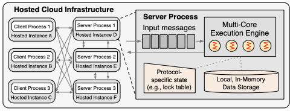

**그림 1: Deneva 프레임워크 아키텍처** – 퍼블릭 클라우드 인프라의 호스팅된 인스턴스(가상 머신 또는 베어메탈 서버) 세트에 배포된 클라이언트 및 서버 프로세스들의 집합입니다.
멀티 스레드 및 멀티 코어 기반의 실행 엔진은 **쉐어드 나싱(shared-nothing)** 방식의 인메모리 데이터 저장소를 유지하며, 각 프로토콜별 메타데이터를 저장하기 위한 보조 인메모리 데이터 구조를
포함합니다.

#### 2.1. 설계 원칙 및 아키텍처

저희는 분산 프로토콜에서의 **확장성 병목 현상(scalability bottlenecks)** 을 측정하고자 했으므로, 동시성 제어의 효과를 격리하고 이를 통제된 환경에서 연구할 수 있게 해주는 아키텍처가
필요했습니다.
이에 따라, 단일 플랫폼 내에서 여러 프로토콜을 구현하고 배포할 수 있는 **'Deneva'** 라는 프레임워크를 제작했습니다.
Deneva는 무관한 기능들로 인한 오버헤드를 피하기 위해 (기존 시스템을 개조하는 대신) **커스텀 DBMS 엔진**을 사용합니다.
또한 이를 통해, 기존의 구현체들에 고질적으로 존재하는 병목 현상에 방해받지 않고 분산 환경에서 프로토콜들을 평가할 수 있음을 보장합니다.

그림 1은 Deneva의 하이레벨 아키텍처를 보여줍니다.
Deneva는 미리 정의되어 있으나 확장 가능한 다양한 프로토콜을 사용하여, 광범위한 트랜잭션 워크로드를 실행하는 일련의 클라이언트 및 서버 프로세스를 제공합니다.
이 시스템은 **쉐어드 나싱(shared-nothing)** 구조로, 각 서버는 하나 이상의 데이터 파티션을 담당하며, 어떤 파티션도 두 개 이상의 서버에 의해 관리되지 않습니다.
Deneva는 여러 파티션에 걸친 분산 트랜잭션을 지원하지만, 복제(replication)나 결함 허용(fault tolerance) 기능은 제공하지 않습니다.
따라서 본 연구는 **장애가 발생하지 않는 시나리오(failure-free scenarios)** 로 제한됩니다.
잠재적인 확장 가능성에 대해서는 7장에서 논의합니다.

Deneva의 트랜잭션 모델, 실행 모델 및 서버 아키텍처를 설명하기에 앞서, 저희는 Deneva를 분산 동시성 제어 프로토콜의 **확장 가능하고 모듈화된 구현**이 가능하도록 설계했음을 밝힙니다.
새로운 프로토콜을 추가하려면 트랜잭션 코디네이터 로직, 원격 프로시저 호출(RPC), 그리고 서버 이벤트 핸들러 루틴만 새로 구현하면 됩니다.
시스템의 데이터 저장소, 네트워킹 및 실행 컴포넌트는 그대로 유지됩니다.
저희의 경험상, 각 프로토콜을 추가하는 데에는 **약 일주일 정도의 개발 시간**이 소요되었습니다.

#### 2.2. 트랜잭션 모델

Deneva의 모든 트랜잭션은 서버에서 실행되는 **저장 프로시저(stored procedures)** 형태로 수행됩니다.
각 프로시저는 데이터베이스 레코드를 읽거나 업데이트하는 쿼리와 프로그램 로직이 혼합된 구조를 가집니다.
Calvin, VoltDB, H-Store와 같이 **결정론적 실행(deterministic execution)** 에 의존하는 일부 프로토콜은
트랜잭션이 접근할 **읽기 및 쓰기 집합(read/write sets)** 을 미리 알고 있어야 하거나,
그렇지 않으면 비용이 많이 드는 '정찰(reconnaissance)' 단계를 통해 온라인으로 이를 계산해야 합니다.
따라서 더 공정하고 현실적인 비교를 보장하기 위해, 저희는 이러한 정보가 필요한 프로토콜들에 대해 정찰 단계를 수행하여 관련 정보를 계산합니다.

#### 2.3. 실행 모델

저희는 클라우드 컴퓨팅 인스턴스들에 클라이언트와 서버를 **전결합(fully connected) 토폴로지**로 배치했습니다.
인스턴스 간 통신을 위해 TCP/IP 기반의 확장 가능하고 스레드 안전한 소켓 라이브러리인 **nanomsg**를 사용했습니다.
별도로 명시하지 않는 한, 클라이언트와 서버 프로세스는 서로 다른 인스턴스에 위치합니다.
서버들은 **일치 해싱(consistent hashing)** 을 사용하여 배치되며, 클라이언트는 서버에 대한 파티션 매핑 정보를 미리 알고 있습니다.
이 매핑 정보는 실행 중에 변경되지 않습니다.

Deneva는 프로토콜의 다양한 측면을 테스트할 수 있는 워크로드를 제공합니다(4.1절).
이 프레임워크는 클라이언트 프로세스당 여러 개의 미결(outstanding) 트랜잭션을 허용하며, 저희는 이를 '시스템 부하(offered system load)'라고 부릅니다.
클라이언트가 트랜잭션을 실행하려 할 때, 먼저 워크로드 명세에 따라 대상 저장 프로시저의 입력 매개변수를 생성합니다.
그 다음, 트랜잭션이 처음으로 접근하는 데이터 파티션을 관리하는 서버로 요청을 보냅니다.
저희는 이 서버를 **코디네이터(coordinator)** 라고 부릅니다.
만약 트랜잭션이 여러 파티션에 접근한다면, 이를 **다중 파티션 트랜잭션(MPT)** 이라고 부릅니다.
MPT에 여러 서버가 관여될 때, 이 서버들을 **참여자(participants)** 라고 부릅니다.

#### 2.4. 서버측 실행

각 서버는 클라이언트 및 다른 서버를 대신하여 요청을 실행합니다.
서버가 새로운 트랜잭션 요청을 받으면 저장 프로시저를 호출하며, 이 프로시저는 로컬 파티션 또는 다른 서버가 관리하는 원격 파티션의 데이터에 액세스하는 쿼리들을 생성합니다.
만약 실행 중인 트랜잭션이 프로토콜 규약에 의해 중단(Abort)되면, 코디네이터는 다른 참여 서버들에 중단 메시지를 보냅니다.
그러면 각 참여 서버는 해당 트랜잭션이 로컬 파티션에 가한 모든 변경 사항을 롤백(Roll back)합니다.

그 후 코디네이터는 해당 요청을 다시 작업 큐에 넣습니다.
재시작 시 동일한 충돌로 인해 요청이 다시 실패할 가능성을 줄이기 위해, 코디네이터는 지수 백오프(exponential back-off) 패널티(10ms부터 시작)를 적용하여 중단된 요청을 재실행하기 전까지 대기할
시간을 지정합니다.
트랜잭션이 완료되면 코디네이터는 클라이언트에 확인 응답을 보내고, 해당 트랜잭션에 사용된 모든 내부 데이터 구조를 회수(Reclaim)합니다.

- **우선순위 작업 큐:**
    - 원격 프로시저 호출(RPC)은 트랜잭션, 연산, 그리고 그 반환 값들을 마샬링 및 언마샬링하는 일련의 **I/O 스레드**(본 연구에서는 서버당 8개)에 의해 처리됩니다.
    - 트랜잭션이나 개별 연산이 서버에 도착하면 작업 큐에 배치되는데, 이때 **이미 실행을 시작한 트랜잭션으로부터 발생한 연산**이 클라이언트로부터 새로 들어온 트랜잭션보다 우선적으로 처리됩니다.
    - 그 외의 경우, DBMS는 선착순(First-come, first-served) 방식으로 트랜잭션과 연산을 처리합니다.
- **실행 엔진:**
    - 작업자 스레드 풀(본 연구에서는 서버당 4개, 각각 전용 코어에 할당됨)이 작업 큐를 감시하며(polling) **비차단(non-blocking) 방식**으로 동시 연산을 실행합니다.
    - DBMS는 공유 자원을 기다려야 하거나(예: 레코드 락 접근) 원격 파티션의 데이터에 액세스해야 해서 강제로 중단될 때까지 트랜잭션을 실행합니다.
    - 후자의 경우(원격 액세스), DBMS는 원격 연산을 실행하는 데 필요한 트랜잭션 매개변수(예: 읽어야 할 레코드 정보 등)를 원격 서버로 전송합니다.
    - 이때 해당 **작업자 스레드는 다시 스레드 풀로 돌아가 다른 작업을 수락**할 수 있습니다.
    - 이는 트랜잭션 자체는 중단(block)될 수 있어도, **스레드는 중단되지 않음**을 의미합니다.
    - 트랜잭션이 특정 서버에서 다시 실행될 준비가 되면, 다음 연산 세트가 우선순위 큐에 추가되고 가용한 첫 번째 작업자 스레드에 의해 실행됩니다.
    - 저희는 구현 복잡도가 높아짐에도 불구하고, **고부하 상황에서 더 나은 확장성을 제공하고 스레드 경합(thrashing)을 줄여주는** 이 비차단 이벤트 모델을 선택했습니다.
- **저장 엔지:**
    - 각 서버는 최소한의 저장 오버헤드로 효율적인 기본 키(primary-key) 조회를 지원하는 **인메모리 해시 테이블**을 사용하여 자신의 파티션 데이터를 저장합니다.
    - 이 엔진은 불필요한 오버헤드를 피하기 위해 내구성을 위한 **로깅(logging)을 제공하지 않습니다.**
    - 분산 DBMS에서 회복(recovery) 및 체크포인트 메커니즘의 영향을 조사하는 것은 향후 연구를 위한 흥미로운 영역으로 남겨두었습니다.
    - Deneva에서 여러 동시성 제어 프로토콜을 지원하기 위해, 저희는 로컬 락 테이블 및 검증 메타데이터와 같이 **프로토콜별로 특화된 다양한 데이터 구조**를 구현했습니다.
    - 이에 대해서는 다음 섹션에서 자세히 논의하겠지만, 데이터베이스 **저장 메커니즘(해시 인덱스)을 이러한 데이터 구조들과 분리**했다는 점에 주목해 주십시오.
    - 저희는 효율성 측면에서 비교적 적은 대가를 치르면서도 구현의 **모듈성(modularity)** 을 제공하기 때문에 이러한 시스템 설계를 선택했습니다
- **타임스탬프 생성:**
    - 본 연구에서 다루는 여러 프로토콜은 실제 시간(wall-clock) 타임스탬프 사용에 의존합니다.
    - 저희는 Deneva 프레임워크에서 타임스탬프를 기본적인 프리미티브(primitive)로 제공합니다.
    - 각 서버는 로컬 시스템 시계를 읽어 고유의 타임스탬프를 생성하며, Deneva는 각 타임스탬프에 **서버 ID와 스레드 ID를 추가(appending)** 하여 전체 시스템에서의 **유일성(
      uniqueness)** 을 보장합니다.
    - 또한, `ntpdate`를 사용하여 서버들을 동기화함으로써 서버 간 시계 오차(skew)를 관리하며, 이러한 방식이 저희의 평가 지표인 처리량(throughput)에 성능 편차를 일으키지 않는다는 것을
      확인했습니다.

### 3. 트랜잭션 프로토콜

다음으로 저희가 연구한 프로토콜들과 분산 환경에서의 성능 향상을 위해 적용한 최적화 기법들에 대해 설명하겠습니다.
여기에는 실제 DBMS에서 현재 사용되고 있는 **고전적인 프로토콜(classic protocols)** 들과 지난 몇 년 사이에 제안된 **최신 프로토콜(state-of-the-art protocols)** 들이
포함됩니다.

#### 3.1. 2단계 잠금 (Two-Phase Locking, 2PL)

최초로 증명된 직렬화 가능 동시성 제어는 **2단계 잠금(2PL)** 이었습니다.
첫 번째 단계인 **확장 단계(growing phase)** 에서 트랜잭션은 접근이 필요한 모든 레코드에 대해 락을 획득합니다.
락은 트랜잭션이 데이터를 읽느냐 쓰느냐에 따라 각각 **공유(shared)** 또는 **배타(exclusive)** 모드로 획득됩니다.
공유 모드 락은 서로 호환이 가능하여, 동일한 데이터를 읽는 두 트랜잭션이 동시에 락을 가질 수 있습니다.
반면 배타 락은 공유 락이나 다른 배타 락과 호환되지 않습니다.
특정 데이터의 락이 이미 호환되지 않는 모드로 점유되어 있다면, 요청한 트랜잭션은 해당 락이 가용해질 때까지 기다려야 합니다.

트랜잭션이 보유한 락 중 하나를 해제하는 순간 2PL의 두 번째 단계인 **수축 단계(shrinking phase)** 로 진입합니다.
이 단계에 들어서면 새로운 락을 획득할 수 없지만, 이미 락을 보유하고 있는 객체에 대해서는 여전히 읽기나 쓰기 작업을 수행할 수 있습니다.
본 연구의 구현체에서 DBMS는 트랜잭션이 커밋되거나 중단될 때까지 락을 유지합니다(즉, **Strict 2PL**).
저희는 동시성을 극대화하기 위해 **레코드 수준의 락(record-level locks)** 을 사용합니다.
각 서버는 자신의 파티션 내 레코드들에 대해 어떤 트랜잭션이 락을 보유하고 있는지만 기록합니다.

2PL 구현체들은 충돌하는 락 유형으로 데이터를 획득하려는 트랜잭션의 동작을 변경함으로써 **데드락(deadlock)** 을 처리하는 방식에서 차이를 보입니다.
이제 본 논문에서 연구하는 두 가지 변형 방식을 설명하겠습니다.

**No-Wait** 방식에서는, 트랜잭션이 이미 잠긴 레코드에 액세스하려고 할 때 요청한 모드가 기존 락 모드와 호환되지 않으면, DBMS는 락을 요청한 해당 트랜잭션을 즉시 **중단(abort)** 시킵니다.
중단된 트랜잭션이 보유하고 있던 모든 락은 해제되며, 이를 통해 충돌 관계에 있던 다른 트랜잭션들이 해당 레코드에 접근할 수 있게 됩니다.
충돌이 발생할 때마다 트랜잭션을 중단시킴으로써 No-Wait는 **데드락(deadlock) 발생을 원천적으로 차단**합니다.
하지만 모든 충돌이 반드시 데드락(순환 대기)으로 이어지는 것은 아니기 때문에, 결과적으로 **수많은 불필요한 중단(abort)** 이 발생할 수 있습니다.

**Wait-Die** 프로토콜은 DBMS가 트랜잭션 시작 시 할당한 타임스탬프를 기준으로 순서를 정해 중단(abort)을 피하려고 시도한다는 점을 제외하면 (No-Wait와) 유사합니다.
충돌이 발생했을 때, 요청한 트랜잭션의 타임스탬프가 현재 락을 소유한 트랜잭션들보다 **더 작다면(즉, 더 오래된/먼저 시작된 경우)** DBMS는 해당 트랜잭션을 큐에 대기시킵니다.
만약 트랜잭션이 이미 공유 모드(Shared mode)로 잠긴 레코드에 공유 락을 요청한다면, 대기 큐를 거치지 않고 즉시 소유자 명단에 자신을 추가할 수 있습니다.
이러한 최적화는 쓰기 트랜잭션에 불이익을 줄 수 있지만, 저희는 이 방식이 성능에 유익하다는 것을 확인했습니다.

트랜잭션 접근 간의 순환 고리(cycle)를 확인하여 데드락을 탐지하는 방식을 구현할 수도 있습니다.
하지만 이 과정은 순환 고리를 찾아내기 위해 서버들 사이에 상당한 양의 네트워크 통신을 필요로 합니다.
따라서 이러한 데드락 탐지 메커니즘은 분산 환경에서 **비용이 매우 많이 들기(cost prohibitive)** 때문에 저희의 평가 대상에는 포함하지 않았습니다.

#### 3.2. 타임스탬프 순서 (Timestamp Ordering, T/O)

동시성 제어 프로토콜의 또 다른 부류는 **타임스탬프(timestamps)** 에 의존합니다.
이러한 프로토콜에서는 고유한 타임스탬프를 사용하여 트랜잭션의 순서를 정하고 데드락(deadlock)을 방지합니다.
본 논문에서 작동을 위해 타임스탬프를 필요로 하는 모든 프로토콜과 마찬가지로, 타임스탬프는 2.4절에서 설명한 Deneva의 메커니즘을 사용하여 생성됩니다.

이 부류의 가장 기본적인 알고리즘인 **TIMESTAMP**에서, 트랜잭션의 연산들은 할당된 타임스탬프에 의해 순서가 결정됩니다.
트랜잭션의 타임스탬프가 레코드에 대한 접근 권한을 지배하게 됩니다.
**WAIT_DIE**와 달리, 트랜잭션은 DBMS가 프로토콜 전용 데이터 구조를 통해 서버별로 저장하는 대기 큐를 우회할 수 없습니다.
이 프로토콜은 현재 레코드를 배타적으로 점유하고 있는 트랜잭션보다 **더 작은(오래된) 타임스탬프를 가진 트랜잭션을 중단(abort)** 시킴으로써 데드락을 방지합니다.
트랜잭션이 재시작될 때, DBMS는 재시작 시점의 시스템 시계를 기반으로 새롭고 고유한 타임스탬프를 할당합니다.

이와 대조적으로, **다중 버전 동시성 제어(MVCC)** 는 각 레코드에 대해 타임스탬프가 찍힌 여러 개의 복사본을 유지합니다.
이는 쓰기 작업이 아직 커밋되지 않았더라도 읽기 작업이 데이터의 이전 복사본에 접근할 수 있게 함으로써, 읽기와 쓰기가 최소한의 충돌로 진행될 수 있도록 합니다.
Deneva에서는 인메모리 데이터 구조에 각 레코드의 복사본을 여러 개 저장하며, 저장되는 복사본의 수를 제한합니다.
만약 가비지 컬렉션(garbage collection)으로 사라진 레코드에 접근하려는 트랜잭션이 있다면 이를 중단(abort)시킵니다.

#### 3.3. 낙관적 동시성 제어 (Optimistic Concurrency Control, OCC)

**낙관적 동시성 제어(OCC)** 는 트랜잭션을 동시에 실행하며, 커밋 시점에 해당 트랜잭션의 실행 결과가 실제로 직렬화 가능(serializable)했는지를 판단합니다.
즉, 커밋하기 직전에 DBMS는 해당 트랜잭션이 시작된 이후 커밋된 모든 트랜잭션이나 현재 검증 단계에 있는 트랜잭션들과 비교하여 **검증(validation)** 을 수행합니다.
만약 트랜잭션이 커밋 가능하다면, DBMS는 로컬에 기록된 쓰기 작업들을 데이터베이스에 반영하고 결과를 클라이언트에 반환합니다.
그렇지 않으면 트랜잭션을 중단(abort)시키고 데이터의 모든 로컬 복사본을 파괴합니다.

저희는 **MaaT** 프로토콜을 기반으로 OCC 버전을 구현했습니다.
전통적인 OCC와 비교하여 MaaT가 갖는 주요 이점은 불필요한 중단(abort)으로 이어지는 충돌 횟수를 줄여준다는 것입니다.
Deneva의 구현에는 세 가지 프로토콜 전용 데이터 구조가 필요합니다.

1. **프라이빗 작업 공간(private workspace):** 트랜잭션의 쓰기 집합(write set)을 추적합니다.
2. **타임테이블(timetable):** 각 서버별로 존재하는 테이블로, 활성 트랜잭션들이 가질 수 있는 잠재적 커밋 타임스탬프의 **범위(즉, 상한값과 하한값)** 를 포함합니다.
3. **레코드별 메타데이터:** 해당 레코드를 읽거나 쓰려는 트랜잭션들의 ID 세트(Reader/Writer IDs)와 해당 레코드에 마지막으로 접근했던 트랜잭션들의 커밋 타임스탬프를 저장합니다.

트랜잭션을 시작하기 전, 각 트랜잭션은 고유한 트랜잭션 ID를 획득한 후 서버의 로컬 타임테이블(timetable)에 이를 추가합니다.
이때 커밋 타임스탬프의 범위는 **하한값(lower bound) 0, 상한값(upper bound) $\infty$** 로 초기화됩니다.

트랜잭션 실행 중에 DBMS는 업데이트된 각 레코드를 **프라이빗 작업 공간(private workspace)** 으로 복사합니다.
이를 통해 트랜잭션은 실행 중에 차단(blocking)되거나 충돌을 확인하는 데 시간을 소비하지 않고 계속 진행할 수 있습니다.
DBMS는 트랜잭션이 레코드에 접근할 때마다 레코드별 메타데이터를 업데이트합니다.
**읽기(read)** 가 발생하면, DBMS는 해당 트랜잭션 ID를 '독자 ID 셋(reader ID set)'에 추가하고, 나중에 검증할 때 참고할 수 있도록 독자 ID 셋과 가장 최근의 읽기 커밋 타임스탬프를
모두 프라이빗 작업 공간으로 복사합니다.
쓰기(write) 연산의 경우, 시스템은 트랜잭션 ID를 레코드의 '저자 ID 셋(writer ID set)'에 추가하며, 독자 및 저자 셋의 ID들과 가장 최근의 읽기 커밋 타임스탬프를 모두 복사합니다.
트랜잭션이 원격 서버의 레코드를 처음으로 읽거나 쓸 때, DBMS는 해당 원격 서버의 타임테이블에도 그 트랜잭션을 위한 항목을 생성합니다.

OCC의 검증 단계는 트랜잭션이 완료되고 원자적 커밋 프로토콜(3.5절 참조)을 호출할 때 발생합니다.
타임테이블에 저장된 초기 타임스탬프 범위에서 시작하여, 각 참여 서버는 검증 중인 트랜잭션의 범위와 해당 트랜잭션의 독자/저자(reader/writer) ID 셋에 있는 트랜잭션들의 범위를 **충돌하는 트랜잭션들의
범위가 겹치지 않도록 조정**합니다.
DBMS는 타임테이블에서 수정된 범위들을 업데이트하며, 해당 트랜잭션은 다른 트랜잭션에 의해 더 이상 범위가 수정될 수 없는 '검증된 상태(validated state)'로 진입합니다.

이 과정이 끝났을 때 검증 중인 트랜잭션의 타임스탬프 범위가 여전히 유효하다면(즉, **상한값이 하한값보다 크다면**), 서버는 코디네이터에게 '커밋(COMMIT)' 검증 결정을 보냅니다.
그렇지 않으면 '중단(ABORT)' 결정을 보냅니다.
코디네이터는 모든 참여 서버로부터 검증 투표를 수집하고, 모든 서버가 커밋에 투표한 경우에만 트랜잭션을 커밋합니다.
그 후 코디네이터는 최종 결정을 다른 서버들에 통지합니다.
이 시점에서 해당 트랜잭션의 ID는 접근했던 모든 레코드의 독자/저자 셋에서 제거될 수 있으며, 트랜잭션이 커밋되면 레코드의 읽기 또는 쓰기 타임스탬프가 수정됩니다.

#### 3.4. 결정론적 프로토콜 (Deterministic, Det)

**결정론적 스케줄링**은 전통적인 동시성 제어 프로토콜에 대한 대안으로 최근 제안되었습니다.
트랜잭션의 결정론적 순서를 결정하는 중앙 집중식 코디네이터를 통해, 다른 동시성 제어 프로토콜에서 요구되는 서버 간 조율(coordination)의 필요성을 제거할 수 있습니다.
따라서 결정론적 프로토콜은 두 가지 이점을 가집니다.
첫째, 트랜잭션의 운명을 결정하기 위해 **원자적 커밋 프로토콜(3.5절)** 을 사용할 필요가 없습니다.
둘째, 더 단순한 **복제(replication) 전략**을 지원합니다.

저희는 Deneva의 결정론적 잠금 코디네이터(**CALVIN**) 구현을 Calvin 프레임워크를 기반으로 삼았습니다.
모든 클라이언트는 트랜잭션의 순서를 정하고 고유한 트랜잭션 ID를 할당하는 **시퀀서(sequencers)** 들로 구성된 분산 조율 계층으로 쿼리를 보냅니다.

시간은 **5ms 단위의 에포크(epoch)** 로 나뉩니다.
각 에포크가 끝날 때마다, 시퀀서들은 지난 에포크 동안 수집된 모든 트랜잭션을 일괄 처리(batch)하여 해당 트랜잭션이 접근하려는 레코드를 관리하는 서버들로 전달합니다.
각 서버에서는 **스케줄러(scheduler)** 라고 불리는 또 다른 구성 요소가 미리 정해진 순서에 따라 각 시퀀서로부터 레코드 수준의 락을 획득합니다.
즉, 각 스케줄러는 다른 시퀀서의 다음 배치를 처리하기 전에, 동일한 시퀀서로부터 온 전체 트랜잭션 배치를 사전에 정해진 순서대로 처리합니다.
만약 트랜잭션이 락을 획득하지 못하면, DBMS는 해당 락을 위해 트랜잭션을 큐에 대기시키고 스케줄러는 계속해서 다음 처리를 진행합니다.

DBMS는 필요한 모든 레코드 수준의 락을 획득한 후 트랜잭션을 실행할 수 있습니다.
실행은 여러 단계로 진행됩니다.
먼저, 트랜잭션의 읽기/쓰기 집합(read/write set)을 분석하여 **참여 서버**(참여자; 데이터를 읽거나 수정하는 모든 서버)와 **활성 서버**(작성자; 업데이트를 수행하는 모든 서버)를 결정합니다.
그다음, 시스템은 모든 로컬 읽기(local reads)를 수행합니다.
만약 이 로컬 읽기 데이터가 다른 서버에서의 트랜잭션 실행 중에 필요하다면(예: 데이터베이스의 값에 따라 트랜잭션 중단 여부를 결정해야 하는 경우), 시스템은 이를 활성 서버로 전달합니다.

이 시점에서 업데이트를 수행하지 않는 비활성 서버(non-active servers)는 실행을 마치고 데이터 락을 해제할 수 있습니다.
활성 서버는 데이터를 받기로 예정된 모든 참여자로부터 메시지를 받으면, 자신의 로컬 파티션에 쓰기 작업을 적용합니다.
이 단계에서 활성 서버들은 트랜잭션의 커밋 또는 중단 여부를 **결정론적으로(deterministically) 결정**하며, 락이 해제됩니다.
서버들은 시퀀서(sequencer)에게 응답을 보내고, 시퀀서는 모든 응답이 도착하면 클라이언트에게 확인 응답(acknowledgement)을 보냅니다.

Calvin에서 읽기 전용 트랜잭션은 활성 서버(active servers; 업데이트를 수행하는 서버)를 포함하지 않으며, 따라서 로컬 읽기 단계가 끝나면 완료됩니다.
이는 읽기 전용 트랜잭션의 경우 시퀀서(sequencer)와 서버 사이의 메시지만 필요할 뿐, **서버들 사이의 통신은 전혀 필요하지 않음**을 의미합니다.

Calvin은 결정론적 알고리즘이기 때문에, 트랜잭션의 읽기/쓰기 집합(read/write sets)이 **사전에(a priori)** 알려져 있어야 합니다.
만약 읽기/쓰기 집합을 알 수 없다면, 프레임워크는 실행 시간(runtime)에 이를 계산해야 합니다.
이로 인해 일부 트랜잭션은 두 번 실행됩니다.
즉, 읽기/쓰기 집합을 파악하기 위해 한 번 **추측성 실행(speculatively)** 을 하고, 그 다음 결정론적 프로토콜 하에서 실제로 실행하는 것입니다.
이 **정찰(reconnaissance)** 단계 동안 트랜잭션은 락을 획득하지 않고 진행할 수 있습니다.
하지만 정찰 단계와 실제 실행 단계 사이에 레코드 중 하나가 변경되면, 트랜잭션은 중단(abort)되고 전체 과정을 다시 시작해야 합니다.

Deneva에 구현된 저희 버전의 Calvin에서는 **시퀀서(sequencer)**, **스케줄러(scheduler)**, 그리고 **작업(worker) 계층**을 각각 별도의 스레드로 구현하여 동일한 서버에 함께
배치했습니다.
저희는 (기존 Deneva 서버 구조에서) **두 개의 작업자 스레드를 각각 하나의 시퀀서 스레드와 하나의 스케줄러 스레드로 교체**하였습니다.

#### 3.5. 2단계 커밋 (Two-Phase Commit, 2PC)

모든 서버가 커밋하거나 아니면 아무도 하지 않도록 보장하기 위해(즉, **원자적 커밋 문제**), Deneva에 구현된 모든 프로토콜(CALVIN 제외)은 **2단계 커밋(2PC)** 프로토콜을 사용합니다.
시스템은 **여러 파티션에서 업데이트를 수행하는 트랜잭션**에 대해서만 2PC를 요구합니다.
읽기 전용 트랜잭션과 단일 파티션 트랜잭션은 이 단계를 건너뛰고 즉시 클라이언트에게 응답을 보냅니다.
다만, **OCC는 읽기 전용 트랜잭션 규칙에서 예외**인데, 읽기 작업에 대해서도 검증(validate)을 수행해야 하기 때문입니다.

다중 파티션 업데이트 트랜잭션이 실행을 마치면, 코디네이터 서버는 각 참여 서버에 **준비(prepare)** 메시지를 보냅니다.
이 준비 단계 동안 참여자들은 트랜잭션을 커밋할지 아니면 중단할지 투표합니다.
본 논문에서는 하드웨어 장애를 고려하지 않으므로, OCC를 제외한 모든 프로토콜에서 준비 단계에 도달한 트랜잭션은 모두 커밋됩니다.
반면 OCC는 이 단계에서 검증(validation)을 수행하므로 트랜잭션이 중단될 수 있습니다.

참여자들은 코디네이터 서버에 커밋 또는 중단 응답을 보냅니다.
이 시점에서 프로토콜은 두 번째이자 마지막인 **커밋(commit)** 단계로 진입합니다.
만약 코디네이터를 포함한 어느 한 참여자라도 중단에 투표하면, 코디네이터 서버는 중단 메시지를 방송(broadcast)합니다.
그렇지 않으면 코디네이터는 커밋 메시지를 방송합니다.
참여자들은 최종 메시지를 받으면 커밋 또는 중단을 수행하고, 트랜잭션이 보유한 락을 해제하는 등의 필요한 정리 작업을 수행합니다.
그 후 참여자들은 코디네이터 서버로 확인 응답(acknowledgment)을 보냅니다.
코디네이터 역시 이 단계에서 정리 작업을 수행하지만, **참여자들로부터 모든 최종 확인 응답을 받은 후에야 클라이언트에게 응답**할 수 있습니다.

### 4. 성능 평가

이제 3절에서 설명한 6가지 동시성 제어 프로토콜에 대한 평가와 분석을 제시합니다.
별도의 언급이 없는 한, 저희는 **Amazon EC2**의 미국 동부 리전(US East)에서 **m4.2xlarge** 인스턴스 유형을 사용하여 Deneva 프레임워크를 배포했습니다.
클라이언트와 서버 인스턴스의 수는 가변적으로 조정하여 사용했습니다.
각 인스턴스는 **8개의 가상 CPU 코어와 32GB의 메모리**를 포함하며, '높음(high)' 등급의 네트워크 성능(**평균 왕복 시간(RTT) 1ms**)을 갖추고 있습니다.

각 실험을 시작하기 전에 테이블 파티션들이 각 서버에 로드됩니다.
실험 중에는 **서버당 10,000개의 오픈 클라이언트 연결(open client connections)** 이라는 부하를 가합니다.
처음 60초는 워밍업(warm-up) 기간이며, 그 후 다시 60초 동안 측정을 진행합니다.
처리량(throughput)은 워밍업 기간 이후 성공적으로 완료된 트랜잭션의 수로 측정합니다.
동시성 제어 프로토콜에 의해 결정된 충돌로 인해 트랜잭션이 중단(abort)되면, 일정 기간의 **패널티 시간(penalization period)** 을 거친 후 재시작됩니다.

4.2절부터 4.4절까지의 첫 번째 실험을 위해, 저희는 OLTP 워크로드의 특정 요소들을 미세하게 조정하여 프로토콜의 성능을 측정할 수 있는 **마이크로벤치마크(microbenchmark)** 를 사용합니다.
그다음 4.5절에서는 이들의 **확장성(scalability)** 을 측정하고, 트랜잭션 실행 시 DBMS의 시간이 어디에 소비되는지에 대한 세부 분석(breakdown)을 제공합니다.

이어서 4.6절에서는 **광역 네트워크(WAN)** 배포 환경을 시뮬레이션하여 프로토콜들을 비교합니다.
마지막으로 4.7절부터 4.9절에서는 다양한 애플리케이션 시나리오를 모델링한 실험들로 마무리합니다.

#### 4.1. 워크로드 (Workload)

다음으로 본 평가에 사용된 벤치마크들을 설명합니다.

- **YCSB:**
    - Yahoo! Cloud Serving Benchmark(YCSB)는 대규모 인터넷 애플리케이션을 평가하기 위해 설계되었습니다.
    - 이 벤치마크는 기본 키(primary key)와 각각 100바이트의 무작위 문자로 채워진 10개의 추가 열(column)을 가진 단일 테이블로 구성됩니다.
    - 모든 실험에서 저희는 파티션당 **약 1,600만 개의 레코드**를 가진 YCSB 테이블을 사용하며, 이는 노드당 약 **16GB**의 데이터베이스 크기를 나타냅니다.
    - 테이블은 해시 파티셔닝(hash partitioning)을 사용하여 기본 키에 따라 분할됩니다.
    - YCSB의 각 트랜잭션은 (별도로 명시되지 않는 한) **10개의 레코드**에 접근하며, 이는 무작위 순서로 발생하는 독립적인 읽기 및 업데이트 연산의 조합으로 이루어집니다.
    - 데이터 접근은 **집프 분포(Zipfian distribution)** 를 따르며, 핫 레코드(hot records) 세트에 대한 접근 빈도는 스큐(skew) 파라미터인 $\theta$(theta)를 통해
      조절됩니다.
    - $\theta$가 **0**일 때는 데이터가 균등한 빈도로 접근되며, **0.9**일 때는 매우 불균형하게(skewed) 접근됩니다.

- **TPC-C:**
    - 이 벤치마크는 창고 주문 처리 애플리케이션을 모델링하며, OLTP 데이터베이스 평가를 위한 업계 표준입니다.
    - TPC-C는 **9개의 테이블**을 포함하며, 모든 서버에 복제되는 읽기 전용 **item** 테이블을 제외하고는 각 테이블이 창고 ID(warehouse ID)별로 파티셔닝됩니다.
    - 저희는 기본 워크로드 구성의 **$88\%$** 를 차지하는 TPC-C의 두 가지 트랜잭션인 **Payment**와 **NewOrder**를 지원합니다.
    - 다른 트랜잭션들은 현재 Deneva에서 지원하지 않는 스캔(scan)과 같은 기능을 필요로 하므로 제외했습니다.
    - 또한, 저희는 **'생각 시간(think time)'** 을 포함하지 않으며, NewOrder 트랜잭션의 $1\%$를 중단(abort)시키는 사용자 데이터 오류도 시뮬레이션하지 않습니다.
    - **Payment** 트랜잭션은 최대 2개의 파티션에 접근합니다.
    - 트랜잭션의 첫 번째 단계는 연관된 창고(warehouse)와 구역(district)의 결제 금액을 업데이트하는 것입니다.
    - 모든 트랜잭션은 자신의 홈 창고(home warehouse)에 대한 독점적 접근(exclusive access)을 요청합니다.
    - 그 후 트랜잭션의 두 번째 부분에서 고객의 정보가 업데이트됩니다.
    - 고객이 원격 창고(remote warehouse)에 속할 확률은 **$15\%$** 입니다.
    - NewOrder 트랜잭션의 **첫 번째 단계**에서는 해당 홈 웨어하우스(Home Warehouse)와 구역(District) 레코드를 읽은 뒤, 구역 레코드를 업데이트합니다.
    - **두 번째 단계**에서는 재고(Stock) 테이블 내의 아이템 5~15개를 업데이트합니다.
    - 전체적으로 볼 때, 한 트랜잭션에서 업데이트되는 모든 아이템의 $99\%$는 해당 홈 파티션 내에 존재하며, 나머지 $1\%$만이 원격(Remote) 파티션에 위치합니다.
    - 결과적으로 이는 **전체 NewOrder 트랜잭션의 약 $10\%$가 멀티 파티션(Multi-partition) 형태로 실행됨**을 의미합니다.

- **PPS:**
    - **PPS(Product-Parts-Supplier)** 워크로드는 외래 키(Foreign Key) 조회를 수행하는 트랜잭션들을 포함하는 또 다른 OLTP 벤치마크입니다.
    - 이 워크로드는 다섯 개의 테이블로 구성됩니다.
    - 제품(Products), 부품(Parts), 공급업체(Suppliers) 테이블은 각각의 기본 키(Primary Key) ID에 따라 파티셔닝되며, 제품과 사용하는 부품을 매핑하는 테이블, 그리고
      공급업체와 그들이 공급하는 부품을 매핑하는 테이블이 추가로 존재합니다.
    - 이 벤치마크는 부품을 제품 및 공급업체에 균등 분포(Uniform Distribution)를 바탕으로 무작위하게 할당합니다.
    - 해당 벤치마크의 워크로드는 **단일 파티션(Single-partition)** 과 **멀티 파티션(Multi-partition)** 트랜잭션이 혼합된 형태입니다.
    - 멀티 파티션 트랜잭션인 **OrderProduct**는 먼저 특정 제품(Product)에 해당하는 부품(Parts) 목록을 조회한 뒤, 해당 부품들의 재고 수량을 감소시킵니다.
    - **LookupProduct** 트랜잭션도 이와 유사하게 특정 제품의 부품 목록과 재고 수량을 조회하지만, 레코드를 업데이트(수정)하지는 않습니다.
    - 이 두 가지 트랜잭션 유형 모두 하나 이상의 **외래 키 조회(Foreign Key Look-up)** 를 수행하며, 각 조회는 여러 파티션에 걸쳐 실행될 수 있습니다.
    - 마지막 트랜잭션인 **UpdateProductPart**는 데이터베이스 내의 무작위적인 '제품-부품 매핑(Product-to-part mapping)' 정보를 업데이트합니다.

#### 4.2. 경합 (Contention)

우리는 먼저 시스템 내 **경합(Contention)** 의 정도가 증가함에 따라 각 프로토콜에 미치는 영향을 측정하는 것부터 시작합니다.
경합은 OLTP 데이터베이스 애플리케이션의 성능에 영향을 미치는 가장 중요한 요소 중 하나이기 때문입니다.
경합은 여러 트랜잭션이 동일한 레코드에 대해 읽기 또는 쓰기를 시도할 때 발생합니다.
본 실험을 위해 우리는 **YCSB 워크로드**를 사용하며, 트랜잭션의 데이터 접근 패턴을 조절하기 위해 **스큐(Skew, 왜곡) 파라미터**를 변화시킵니다.
클러스터는 총 16대의 서버로 구성되었습니다.

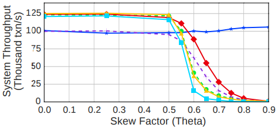

**그림 2: 경합(Contention)** - YCSB 워크로드의 스큐 인자(Skew Factor) 변화에 따른 16대 서버에서의 프로토콜별 측정 처리량(Throughput)

**그림 2**를 보면, 세타(theta) 값이 약 0.5에 도달할 때까지는 각 프로토콜의 처리량(Throughput)이 데이터 스큐(Skew)의 영향을 비교적 적게 받는 것을 알 수 있습니다.
하지만 이 지점을 넘어서면 대부분의 프로토콜 성능이 하락하기 시작하며, 그 하락 속도는 서로 다르게 나타납니다.
세타 값이 약 0.8에 이르면, 하나의 프로토콜을 제외한 나머지는 모두 동일하게 낮은 성능으로 수렴합니다.

**CALVIN**은 높은 스큐 상황에서도 우수한 성능을 유지하는 유일한 프로토콜입니다.
그 이유는 첫째, CALVIN에서는 스케줄링 계층이 병목 지점이 되기 때문입니다.
트랜잭션이 필요한 모든 잠금(Lock)을 획득하자마자 워커 스레드가 즉시 이를 실행하고, 실행 직후 곧바로 잠금을 해제합니다.
이는 스케줄러가 충돌하는 다른 트랜잭션을 처리하는 동안 잠금이 길게 유지되지 않음을 의미합니다.
둘째, 모든 트랜잭션의 데이터 접근이 독립적이므로 CALVIN은 읽기 단계와 실행 단계 사이에 메시지를 주고받을 필요가 없습니다.
따라서 다른 프로토콜과 달리 원격 서버로부터의 메시지를 기다리는 동안 잠금을 유지하지 않습니다.

**OCC**는 낮은 경합 상태에서 트랜잭션 실행 중 발생하는 검증(Validation) 및 복사(Copying) 오버헤드로 인해 다른 비결정적(Non-deterministic) 프로토콜들보다 낮은 성능을 보입니다.
그러나 경합 수준이 높아지면, 더 많은 충돌을 허용함으로써 불필요한 중단(Abort)을 방지하는 이점이 이러한 오버헤드보다 커지게 됩니다.

**MVCC**와 **TIMESTAMP**는 세타(theta) 값이 약 0.5에 도달하면 급격한 성능 저하를 보입니다.
이는 충돌이 발생하는 더 새로운(Newer) 트랜잭션들이 기존의 더 오래된(Older) 트랜잭션이 커밋될 때까지 차단(Block)되기 때문입니다.
MVCC에서는 일부 트랜잭션이 오래된 버전의 데이터를 읽음으로써 이러한 차단을 회피하기도 하지만, 이를 위해서는 읽기 트랜잭션이 해당 데이터에 대해 커밋되지 않은 쓰기 권한을 가진 모든 트랜잭션보다 더 오래되어야
합니다.
그러나 본 워크로드에서는 대개 그렇지 않은 경우가 많습니다.

#### 4.3. 업데이트 비율 (Update Rate)

다음으로 우리는 각 프로토콜이 트랜잭션의 업데이트 연산을 데이터베이스에 반영하는 방식을 비교합니다.
본 실험에서는 서버 수를 16개 노드로 고정한 상태에서, YCSB 트랜잭션 중 업데이트를 수행하는 트랜잭션의 비율을 변화시킵니다.
각 트랜잭션은 10개의 서로 다른 레코드에 접근합니다.
우리는 일부 트랜잭션을 레코드 읽기만 수행하는 **'읽기 전용(Read-only)'** 으로 지정하고, **'업데이트(Update)'** 트랜잭션은 5개의 레코드를 읽고 5개의 레코드를 수정하도록 설정했습니다.
이러한 업데이트 연산은 트랜잭션 내 임의의 시점에 실행되며, 동일한 트랜잭션에 의해 읽힌 레코드를 수정하는 경우는 없습니다.
이전 실험에서 적절한 경합을 제공하면서도 프로토콜에 과도한 부하를 주지 않는 것으로 확인된 **중간 정도의 스큐 설정(theta=0.6)** 을 적용했습니다.

**그림 3: 업데이트 비율(Update Rate)** - 중간 정도의 경합(theta=0.6)이 발생하는 YCSB 워크로드 혼합 환경에서 업데이트 트랜잭션(5개 읽기/5개 업데이트)과 읽기 전용 트랜잭션(10개
읽기)의 비율 변화에 따른 16대 서버에서의 프로토콜별 측정 처리량(Throughput)

**그림 3**의 결과는 업데이트 트랜잭션의 비율이 증가함에 따라 대부분의 프로토콜 성능이 하락함을 보여줍니다.
적은 수의 업데이트 트랜잭션이 도입되는 것만으로도 **WAIT_DIE**의 처리량은 급격히 감소합니다.
이는 트랜잭션이 락(lock)을 기다릴 수 있을 만큼 충분히 '오래된(old)' 상태가 되기 전에 핫 레코드(hot record)에 접근하려다 중단(abort)되는 경우가 많아지기 때문입니다(업데이트
비율 $10\%$ 기준, 트랜잭션당 평균 1.4회의 중단이 발생함).
더군다나 WAIT_DIE 방식의 트랜잭션들은 락을 획득하기 위해 시간을 소비하고도 결국 나중에 중단되는 경우가 빈번합니다.
반면, **NO_WAIT**는 필요한 락을 즉시 사용할 수 없으면 즉시 중단되므로 이러한 '지연된 중단' 문제에서 자유롭습니다.

**NO_WAIT, MVCC, TIMESTAMP**의 성능은 업데이트 트랜잭션 비율이 $10\%$를 넘기 전까지는 거의 동일하지만, 그 시점부터 MVCC와 TIMESTAMP가 분기되기 시작합니다.
업데이트 트랜잭션이 $100\%$에 도달하면 이들의 처리량은 NO_WAIT의 $33\%$ 수준에 머뭅니다.
MVCC와 TIMESTAMP는 읽기 비중이 높을 때 트랜잭션을 중첩(overlap)하여 실행할 수 있다는 장점이 있습니다.
그러나 업데이트 비율이 증가함에 따라 MVCC와 TIMESTAMP는 더 많은 트랜잭션을 차단(block)해야만 합니다.

MVCC의 경우, 차단되는 트랜잭션의 비율은 업데이트 비율이 $10\%$일 때 $3\%$에서, $100\%$일 때는 $16\%$까지 증가합니다.
이는 차단된 트랜잭션이 다른 레코드에서 또 다른 트랜잭션을 차단하게 만드는 연쇄 효과를 일으켜 성능에 부정적인 영향을 미칩니다.
반면 **NO_WAIT**는 레코드 수준의 잠금이 이미 공유 상태(shared state)인 경우 읽기 접근을 허용하므로 상대적으로 영향을 덜 받습니다.
모든 트랜잭션이 업데이트인 상황에서 NO_WAIT는 차순위 비결정적 알고리즘인 OCC보다 $54\%$ 더 우수한 성능을 보여줍니다.

**그림 3**은 워크로드 내 업데이트 트랜잭션의 비율이 낮을 때, **OCC**와 **CALVIN**이 다른 프로토콜들만큼 좋은 성능을 내지 못한다는 점 또한 보여줍니다.
OCC의 경우, 이는 데이터를 복사(Copying)하고 검증(Validation)하는 과정에서 발생하는 오버헤드 때문입니다.
트랜잭션이 쓰기 작업을 수행하면 더 많은 검증 단계가 필요해지므로 업데이트 비율이 증가할수록 OCC의 성능 역시 하락합니다.
그러나 OCC는 커밋 타임스탬프 할당에 유연성을 발휘하여 동일 레코드에 대한 동시 업데이트를 조정(Reconcile)할 수 있는 경우가 많기 때문에, 성능 하락폭이 다른 프로토콜들만큼 급격하지는 않습니다.

마지막으로, **CALVIN**의 성능은 다시 한번 다른 프로토콜들과는 다른 양상을 보입니다.
읽기 전용(Read-only) 트랜잭션으로 구성된 워크로드와 모든 트랜잭션이 업데이트를 수행하는 워크로드 사이에 성능 차이가 거의 존재하지 않습니다.
대신, CALVIN의 성능은 **단일 스레드 스케줄러(Single-threaded scheduler)** 에 의해 제한됩니다.
이 스케줄러는 다른 프로토콜의 멀티 워커 스레드(Multiple worker threads)와 동일한 속도로 트랜잭션을 처리하지 못하기 때문입니다.

각 트랜잭션은 필요한 모든 잠금(Lock)을 획득하는 즉시 처리됩니다.
이는 트랜잭션 실행이 종료되는 즉시 잠금이 해제됨을 의미하며, 결과적으로 DBMS는 스케줄러 내에서 경합을 유발할 만큼 잠금을 오래 유지하지 않습니다.
또한, CALVIN은 그 **결정적(Deterministic) 특성** 덕분에 다른 프로토콜들과 달리 메시지 전달 과정 중에 잠금을 유지할 필요가 없습니다.
YCSB의 모든 읽기 작업은 독립적이므로, CALVIN은 서버 간에 그 어떤 메시지도 주고받을 필요가 전혀 없습니다.

#### 4.4. 다중 파티션 트랜잭션 (Multi-Partition Transactions)

우리의 다음 실험은 멀티 파티션 트랜잭션의 조정 오버헤드가 성능에 어떠한 영향을 미치는지 측정합니다.
DBMS 클러스터의 총 서버 수를 16대로 고정한 상태에서, 각 트랜잭션이 접근하는 고유 파티션의 수를 변화시켰습니다.
각 트랜잭션 내 연산의 개수는 16개로 설정했으며, 읽기와 쓰기의 비율은 각각 50%씩 할당했습니다.
실험 회차별로 트랜잭션이 접근할 파티션의 개수를 설정하고, 이들을 무작위로 할당하였습니다.

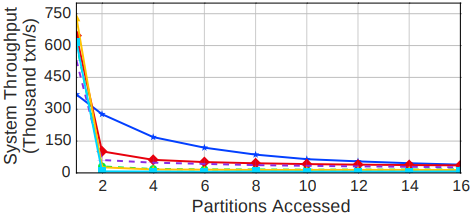

**그림 4: 멀티 파티션 프랜잭션(Multi-Partition Transactions)** - 각 YCSB 트랜잭션이 접근하는 파티션 수의 변화에 따른 처리량(Throughput) 측정 결과

**그림 4**의 결과는 각 트랜잭션이 접근하는 파티션의 수를 변화시킬 때 프로토콜들이 보여주는 성능을 나타냅니다.
**CALVIN**을 제외한 나머지 프로토콜들의 처리량은 트랜잭션이 하나 이상의 파티션에 접근하는 순간 급격히 곤두박질칩니다.
접근 파티션이 2개에서 4개로 늘어날 때 성능은 약 $12\sim40\%$ 하락합니다.
이러한 성능 저하의 원인은 두 가지입니다.

1. 트랜잭션 실행 중 원격 요청을 전송하고 다시 트랜잭션을 재개하는 과정에서 발생하는 오버헤드
2. **2단계 커밋(2PC)** 의 오버헤드와, 트랜잭션 실행 및 2PC 과정 사이에서 발생하는 여러 번의 네트워크 왕복 시간(Round trip times) 동안 잠금을 유지함에 따라 미치는 영향입니다.

단일 파티션에서 멀티 파티션 트랜잭션으로 넘어갈 때 CALVIN의 성능 하락폭은 다른 프로토콜들만큼 극단적이지 않습니다.
CALVIN의 서버들은 매 에포크(Epoch)마다 동기화됩니다.
설령 원격 시퀀서(Sequencer)로부터 멀티 파티션 트랜잭션이 도착하지 않더라도, 스케줄러는 결정적 트랜잭션 순서를 보장하기 위해 각 시퀀서로부터 확인 응답(Acknowledgement)을 받을 때까지 기다려야
합니다.
만약 일부 시퀀서가 다른 노드보다 뒤처지면 시스템 전체의 속도 저하를 유발할 수 있습니다.
이 때문에 Deneva가 단일 파티션 트랜잭션만 실행할 때는 CALVIN이 다른 프로토콜들만큼 16개 노드 규모에서 효율적으로 확장되지 못합니다.

#### 4.5. 확장성 (Scalability)

앞선 세 가지 실험에서는 고정된 클러스터 크기 내에서 다양한 워크로드 설정의 영향을 살펴보았습니다.
이번 섹션에서는 워크로드를 고정하고 클러스터 크기를 변화시키며, 서버 수가 증가함에 따라 프로토콜이 어떻게 **확장(Scale)** 되는지 평가합니다.
이번에도 YCSB를 사용하며, 서버 수에 비례하여 테이블의 크기를 확장합니다.
각 트랜잭션은 무작위로 선택된 파티션에서 집프 분포(Zipfian Distribution)에 따라 10개의 레코드에 접근합니다.

우리는 먼저 각 프로토콜의 성능 상한선(Upper-performance bound)을 측정하기 위해 경합이 없는(theta=0.0) **읽기 전용 워크로드**를 실행합니다.
그다음으로, 전체 트랜잭션의 $50\%$가 연산의 $50\%$를 레코드 수정(Update)에 사용하는 **중간 경합(theta=0.6)** 및 **높은 경합(theta=0.7)** 워크로드를 각각 평가합니다.

실행 시 통계뿐만 아니라, 본 프레임워크는 각 트랜잭션이 시스템의 다양한 구성 요소에서 소비하는 시간을 프로파일링합니다.
우리는 이러한 측정 결과들을 다음과 같은 여섯 가지 카테고리로 분류하였습니다.

- **유효 작업(USEFUL WORK):** 읽기 또는 업데이트 연산을 위해 워커(worker)가 실제 계산을 수행하는 데 소비한 모든 시간입니다.
- **트랜잭션 관리자(TXN MANAGER):** 트랜잭션 메타데이터를 업데이트하고 커밋된 트랜잭션을 정리(clean up)하는 데 소요된 시간입니다.
- **동시성 제어 관리자(CC MANAGER):** 프로토콜의 일환으로 잠금을 획득하거나 검증(validation)하는 데 소요된 시간입니다. CALVIN의 경우, 실행 순서 계산을 위해 시퀀서(sequencer)
  와 스케줄러(scheduler)가 사용한 시간이 포함됩니다.
- **2단계 커밋(2PC):** 2단계 커밋(two-phase commit)에서 발생하는 오버헤드입니다.
- **중단 처리(ABORT):** 중단된 트랜잭션을 정리하는 데 소요된 시간입니다.
- **유효 시간(IDLE):** 워커 스레드가 작업을 기다리며 보낸 시간입니다.

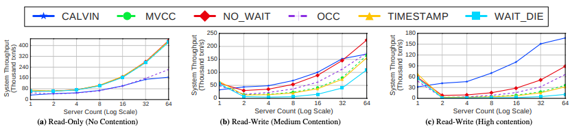

**그림 5: 확장성(처리량)** - YCSB 워크로드의 변형 및 다양한 클러스터 크기에 따른 프로토콜별 성능 측정 결과

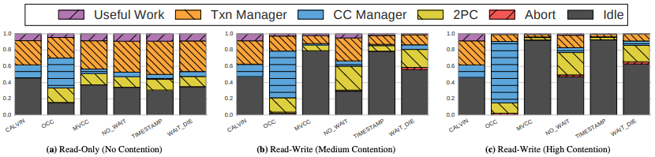

**그림 6: 확장성(처리량)** - 그림 5와 동일한 16대 서버 기반 YCSB 워크로드 변형들을 사용하여, 각 동시성 제어 프로토콜이 Deneva의 구성 요소별로 소비한 시간의 백분율을 나타냅니다.

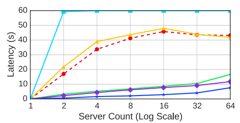

**그림 7: 99분위 지연 시간(99%ile Latency)** – 클러스터 크기 변화에 따른 트랜잭션의 최초 시작부터 최종 커밋까지의 지연 시간

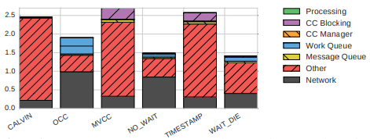

**그림 8: 지연 시간 세부 분석(Latency Breakdown)** - 커밋 전 트랜잭션의 최종 실행에 소요된 평균 지연 시간

- **읽기 전용 워크로드(Read-Only Workload):**
    - 그림 5a의 결과는 모든 프로토콜이 차단(blocking) 없이 읽기 작업을 수행할 수 있도록 허용함을 보여주며, 이에 따라 해당 결과는 어떠한 동시성 제어도 적용하지 않았을 때 달성되는 처리량에
      근접합니다.
    - OCC와 CALVIN을 제외한 프로토콜들의 처리량은 거의 동일합니다.
    - OCC의 처리량은 검증 단계 동안 참조를 위해 아이템을 복사하는 오버헤드와 검증 단계 자체의 비용으로 인해 제한됩니다.
    - CALVIN은 스케줄러에서의 병목 현상으로 인해 가장 낮은 처리량을 기록했습니다.
- **중간 경합 워크로드(Medium Contention Workload):**
    - 그림 5b를 보면 읽기/쓰기 혼합 워크로드로 전환됨에 따라 양상이 변하기 시작하는 것을 알 수 있습니다.
    - 워크로드에 업데이트가 포함되면서 경합이 주요 문제로 대두됩니다.
    - 모든 프로토콜이 단일 서버 대비 64개 노드에서 처리량이 향상되었으나, 그 증가 폭은 제한적입니다.
    - 64대 서버 환경에서 프로토콜들의 성능은 단일 서버 대비 1.7~3.8배 향상되는 데 그쳤습니다.
    - CALVIN이 단일 노드 대비 가장 높은 개선율을 보였음에도 불구하고, 모든 서버 대수에 걸쳐 가장 우수한 전체 성능을 기록한 것은 NO_WAIT였습니다.
    - 읽기 전용 결과와는 대조적으로, 서버가 2대 이상인 환경에서 OCC는 NO_WAIT와 CALVIN을 제외한 모든 프로토콜보다 뛰어난 성능을 보였습니다.
    - 이는 더 많은 충돌을 허용함으로써 얻는 이점이 복사 및 검증에 드는 비용을 상회하기 때문입니다.
    - 그림 6a의 읽기 전용 결과와 그림 6b의 세부 분석을 비교해 보면, **MVCC**와 **TIMESTAMP** 모두에서 **유휴 시간(IDLE time)** 이 증가한 것을 확인할 수 있습니다.
    - 이는 해당 프로토콜들이 더 오래된(older) 트랜잭션이 완료되기를 기다리는 동안 더 많은 트랜잭션을 버퍼링(buffering)하기 때문에 발생합니다.
    - 그림 7에서 클러스터 크기가 커짐에 따라 **99분위(99%ile) 지연 시간**이 증가하는 것을 관찰할 수 있습니다.
    - OCC의 99분위 지연 시간이 하락하는 것처럼 보이는 이유는 가장 긴 트랜잭션의 지연 시간이 실험 지속 시간을 초과했기 때문입니다.
    - 그림 8에서는 각 트랜잭션이 어디에서 시간을 소비하는지 더 잘 이해하기 위해, 16개 노드 클러스터에서 **성공한 트랜잭션**(가장 최근의 시작 또는 재시작부터 최종 커밋까지)의 평균 지연 시간을
      세부적으로 분석했습니다.
    - 트랜잭션 처리 및 동시성 제어 관리자 시간은 프로토콜의 일부로서 발생하는 차단(blocking) 시간, 작업 큐(work queue)에서의 대기 시간, 그리고 네트워크 지연 시간과 같은 다른 요인들에 비해
      그 비중이 매우 낮습니다.
    - 우리는 OCC의 트랜잭션이 대부분의 시간을 작업 큐에서 보내는 것을 확인할 수 있습니다.
    - 이것이 처음에는 직관에 어긋나는 것처럼 보일 수 있으나, 워커 스레드가 실행 시간의 $50\%$ 이상을 OCC의 **검증 단계(validation phase)** 에서 보낸다는 점에 주목해야 합니다.
    - 작업 큐는 다음 워커 스레드가 사용 가능해질 때까지 트랜잭션들이 자연스럽게 적체되는 곳입니다.
    - 따라서 OCC의 경우, 처리량과 지연 시간 측면에서 검증 단계가 병목 지점이 됩니다.
    - 타임스탬프 프로토콜인 MVCC와 TIMESTAMP에서는 대부분의 지연 시간이 프로토콜의 일부인 **차단(blocking)** 에 기인하며, 이는 트랜잭션이 빈번하게 중단(abort)되지 않더라도 레코드
      경합이 높은 경우 이러한 프로토콜들이 본질적으로 취약하다는 가설을 뒷받침합니다.
    - NO_WAIT는 성공 시 가용한 워커 스레드를 기다리는 시간의 영향만 받습니다.
    - 성공한 WAIT_DIE 트랜잭션 또한 차단이 발생할 수 있습니다.
- **높은 경합 워크로드(High Contention Workload):**
    - 그림 5c에 나타난 바와 같이, 경합의 강도를 더욱 높이면 **CALVIN**을 제외한 모든 프로토콜의 성능이 계속해서 저하됩니다.
    - 가장 큰 클러스터 구성에서 비결정적(non-deterministic) 프로토콜들의 처리량은 단일 서버 대비 **0.2~1.5배** 향상되는 데 그쳤습니다.
    - 이는 서버 수가 늘어남에 따라 선형적으로 확장(scale linearly)되었을 경우 기대할 수 있는 이상적인 처리 능력의 **$10\%$ 미만**으로 작동하고 있음을 의미합니다.
    - 반면, 경합이 높은 상황에서 CALVIN은 가장 큰 클러스터 기준으로 타 프로토콜보다 최대 **5.2배** 더 나은 성능을 보여줍니다.
    - CALVIN의 성능은 경합 설정이나 워크로드 혼합 비율에 관계없이 그림 5와 6의 모든 결과에서 거의 일정하게 유지됩니다.

우리는 프로토콜들이 **트랜잭션 모델**에 민감하게 반응한다는 것을 발견했습니다.
트랜잭션당 요청 수를 10개로 제한하고 서버당 하나의 파티션을 유지하기 때문에, 서버가 10대 이상인 클러스터 구성과 그 미만인 구성에서 서로 다른 동작 양상이 나타납니다.

또한, 프로토콜들은 **테스트베드(testbed) 설정**에도 민감합니다.
예를 들어, **2PL**은 트랜잭션 중단(abort) 시 적용되는 **백오프 페널티(back-off penalty)** 파라미터에 민감하게 반응합니다.
부하의 양 또한 처리량에 영향을 미치는데, 특히 **MVCC**와 **TIMESTAMP** 같은 프로토콜은 부하가 클수록 더 많은 트랜잭션을 처리하고 버퍼링할 수 있기 때문에 그 영향이 더욱 두드러집니다.

#### 4.6. 네트워크 속도 (Network Speed)

이번 섹션에서는 광역 네트워크(WAN) 지연 시간이 분산 데이터베이스 성능에 미치는 영향을 격리하여 분석합니다.
우리는 듀얼 소켓 Intel Xeon CPU E7-4830(CPU당 16코어, 하이퍼스레딩 포함 32코어)이 장착된 단일 머신에 2대의 서버와 2대의 클라이언트를 배치했습니다.

서버 인스턴스 간에는 송신 측에서 각 메시지를 목적지로 보내기 전 목표 지연 시간만큼 버퍼링하는 방식으로 인위적인 네트워크 지연을 삽입했습니다.
반면 클라이언트와 서버 간의 통신은 네트워크 지연의 영향을 받지 않았습니다.

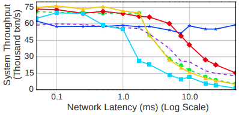

**그림 9: 네트워크 속도(Network Speed)** – 인위적인 네트워크 지연이 가해진 YCSB 워크로드 환경에서 동시성 제어 프로토콜별로 측정된 지속 처리량(Throughput)

그림 9의 결과는 네트워크 지연 시간(network latency)이 증가함에 따라 성능이 어떻게 저하되는지를 보여줍니다.
여기에 제시된 워크로드는 중간 정도의 경합(medium contention)과 $50\%$의 업데이트 트랜잭션 비율을 가진 YCSB입니다.
이러한 컴퓨팅 환경에서는 결과 간의 변동성이 높기 때문에, 이 섹션에 제시된 결과는 다섯 번의 실험 결과 중 최솟값과 최댓값을 제외한 평균치를 사용했습니다.

추가적인 네트워크 지연은 2단계 커밋(2PC) 프로토콜의 소요 시간을 길어지게 하며, 이는 네트워크 지연이 1ms를 초과할 때 DBMS의 처리량이 감소하는 주요 원인이 됩니다.  
반면, **CALVIN**은 YCSB 워크로드에서 2PC를 사용하지 않으므로 서버 간 메시지 교환이 발생하지 않으며, 결과적으로 네트워크 지연 증가에 따른 성능 저하가 나타나지 않습니다.

그러나 다른 프로토콜들의 경우, 2PC 프로토콜로 인해 트랜잭션 간 잠금 인계(lock hand-off) 시간이 길어집니다.
**2PL**에서는 잠금 점유 시간이 길어짐에 따라 새로운 트랜잭션이 중단(abort)되거나 차단(block)되는 현상이 발생합니다.
**WAIT_DIE** 방식에서는 분산 트랜잭션의 잠금 유지 시간이 길어지면서 버퍼링 가능한 충돌 트랜잭션의 비율이 1ms 지연 시 약 $45\%$에서 $12\%$로 급감하며, 이는 훨씬 높은 중단율을
초래합니다.  
또한 네트워크 지연이 증가함에 따라 트랜잭션이 이후 데이터 접근 과정에서 중단되기 전까지 버퍼에 머무는 시간도 길어질 수 있습니다.

**TIMESTAMP**와 **MVCC**의 경우, 아직 커밋되지 않은 이전 트랜잭션에 의해 읽기 및 쓰기 작업이 차단될 수 있습니다.
하지만 이들은 대부분의 트랜잭션을 버퍼링하고 중단율이 낮기 때문에 WAIT_DIE보다 네트워크 지연 변화에 더 강한 탄력성(resilient)을 보입니다.
**NO_WAIT**는 타임스탬프 기반 프로토콜들보다 중단율은 높지만, 프로토콜 특성상 차단이 발생하지 않아 잠금 유지 시간이 짧으므로 더 많은 트랜잭션이 성공적으로 진행(forward progress)될 수
있습니다.

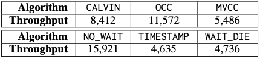

**표 2: 멀티 리전 클러스터(Multi-Region Cluster)** – AWS 미국 동부(US East) 및 미국 서부(US West) 리전에 서버를 둔 2개 노드 클러스터의 처리량

표 2에서는 실제 WAN 속도 하에서의 YCSB 성능을 측정합니다.
이 실험에서는 AWS 동부 지역(버지니아)과 서부 지역(캘리포니아)의 노드를 사용하여 가상 사설망(VPN)으로 통신하는 2개 노드 클러스터를 구성했습니다.

그림 5b와 비교했을 때, 프로토콜들이 LAN 환경의 결과(LAN-counterparts)보다 성능이 저하되는 것을 확인할 수 있습니다.
네트워크 속도가 시사하는 점(implications)에 대해서는 5.2절에서 논의합니다.

#### 4.7. 데이터 의존적 중단 (Data-Dependent Aborts)

이전 실험들에서 CALVIN은 시퀀서(sequencer)와의 통신 외에 2PC나 다른 메시지 전달을 사용할 필요가 없었기 때문에 유리했습니다.
YCSB의 읽기와 쓰기는 독립적이며, 트랜잭션이 읽은 값에 따라 조건부로 중단(abort)되지 않기 때문에, CALVIN은 읽기 단계와 쓰기 단계 사이에 서버 간 메시지를 교환할 필요가 없습니다.
그러나 이러한 속성(읽기-쓰기 간 의존성이 존재하는 경우)을 지닌 워크로드에서는, CALVIN 하에서 트랜잭션을 완료하기 위해 읽기를 수행하는 서버가 메시지를 보내고 쓰기를 수행하는 서버가 이를 받는 한 차례의
메시지 교환 과정이 필요합니다.

데이터 의존적 중단(data-dependent aborts)의 영향을 측정하기 위해, 우리는 중단 결정을 내리는 과정과 관련된 실행 로직을 모델링하고자 YCSB에 조건문을 추가했습니다.
그 후 수정된 YCSB 워크로드를 사용하여 실험을 재실행했습니다.
대부분의 프로토콜은 처리량이 2~10% 정도만 영향을 받았으나, **CALVIN**의 경우 16대 서버 환경의 중간 경합($\theta=0.6$, 50% 업데이트 트랜잭션) 조건에서 기존 YCSB 워크로드 대비
처리량이 $36\%$ 감소했습니다.
또한 경합 정도($\theta$)가 0.8에서 0.9로 증가함에 따라, CALVIN의 처리량이 초당 73,000개 트랜잭션에서 19,000개로 급감하는 것을 발견했습니다.

#### 4.8. TPC-C

다음으로 우리는 더 현실적인 워크로드를 사용하여 프로토콜을 테스트합니다.
TPC-C 벤치마크는 대부분의 트랜잭션이 단일 파티션에서 발생하고, 분산 트랜잭션은 대개 두 개의 파티션으로 국한되는 워크로드에서 각 프로토콜이 어떻게 작동하는지를 보여줍니다.
우리는 서버당 128개의 창고(warehouse) 규모로 데이터베이스 크기를 설정했습니다.
각 서버에는 여러 개의 창고가 존재하므로, 분산 트랜잭션이 동일한 서버 내에 위치한 두 개의 파티션에 걸쳐 발생할 수도 있습니다.

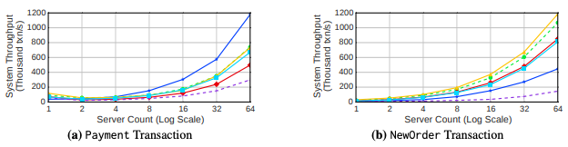

**그림 10: TPC-C** – 서버당 128개의 창고(warehouse)를 배치하여 클러스터를 확장함에 따라 측정된 프로토콜별 처리량

그림 10a의 첫 번째 실험은 결제(Payment) 트랜잭션이 어떻게 확장되는지 보여줍니다.
창고의 결제 정보를 업데이트하기 위해 배타적 접근(exclusive access)이 필요하기 때문에 홈 창고(home warehouse)가 병목 지점이 됩니다.
비록 이것이 처리량을 제한하기는 하지만, 서버 수, 시스템 부하, 그리고 창고 수가 증가함에 따라 프로토콜들이 선형적으로 확장하는 것을 막지는 못합니다.

NO_WAIT와 WAIT_DIE는 홈 창고에서의 경합으로 인해 높은 중단율(abort rates)을 보이며, 이로 인해 트랜잭션이 성공하기 전까지 여러 번 재시작하게 됩니다.
OCC 역시 홈 창고에서의 경합으로 인해 트랜잭션 검증을 위한 비충돌 범위(non-conflicting ranges)를 찾는 데 실패하며 높은 중단율을 기록합니다.
TIMESTAMP와 MVCC는 중단될 트랜잭션에 시간을 낭비하지 않기 때문에 다른 프로토콜보다 더 나은 성능을 보이는 경향이 있습니다.

그림 10b는 신규 주문(NewOrder) 트랜잭션에 대한 결과를 보여줍니다.
여기서 병목 지점은 트랜잭션이 속한 지구(district)의 주문 번호인 D_NEXT_O_ID를 업데이트하는 부분입니다.
하지만 창고당 10개의 지구가 존재하기 때문에, 결제(Payment) 트랜잭션에 비해서는 경합이 약간 적게 발생합니다.
따라서 OCC를 제외하면, 비결정적 프로토콜들이 이 워크로드에서 CALVIN보다 더 나은 성능을 보여줍니다.

#### 4.9. Product-Parts-Supplier

마지막으로, PPS 벤치마크를 사용하여 프로토콜의 확장성을 검토합니다.
다른 워크로드와 달리 PPS는 외래 키(foreign key) 조회를 통해 테이블을 업데이트하는 트랜잭션을 포함합니다.
워크로드의 이러한 특징은 CALVIN에 상당한 부하를 주는데, 외래 키를 조회하기 위해 '정찰(reconnaissance)' 단계를 수행해야 하며 트랜잭션이 중단될 수도 있기 때문입니다.

4.8절의 결과는 대부분의 프로토콜이 확장(scale) 가능함을 보여줍니다.
**CALVIN**은 초당 약 7,000건의 트랜잭션 부근에서 처리량이 더 이상 늘지 않고 정체된(flat-lined) 양상을 보였습니다.

이러한 현상은 몇 가지 요인에 의해 발생합니다.

- **첫째,** 워크로드 내 트랜잭션 중 두 가지가 전체 읽기 및 쓰기 집합(read and write set)을 결정하기 위해 **정찰 쿼리(reconnaissance queries)** 를 필요로 합니다.
- **둘째,** 제품과 부품을 매핑하는 테이블에 대한 무작위 업데이트로 인해, 트랜잭션이 실행될 때 읽기 및 쓰기 집합이 무효화(invalidated)되어 다른 트랜잭션들이 실패하게 됩니다.

다른 프로토콜들은 부품 번호 변경으로 인한 중단(abort) 문제를 겪지 않습니다.
**OCC**의 중단율은 $15\%$로 NO_WAIT만큼 높게 나타났습니다.
그러나 NO_WAIT와 달리, **OCC는 이미 실행이 완료된 트랜잭션 전체를 롤백해야 하므로** 계산 자원 및 기타 리소스의 낭비를 초래하게 됩니다.

### 5. 고찰

이전 섹션의 실험 결과는 현재 및 최신 분산 OLTP 트랜잭션 지원 메커니즘에 대해 상반된 전망을 제공합니다.
한편으로는 분산 트랜잭션을 포함한 워크로드가 확장 가능함을 보여주지만, 워크로드의 특성에 따라 단일 머신의 성능을 넘어서기 위해 매우 큰 규모의 클러스터가 필요할 수도 있습니다.
이 섹션에서는 분산 DBMS가 직면한 확장성 문제와 그에 따른 몇 가지 파급 효과를 논의합니다.

#### 5.1. 분산 DBMS의 병목 지점 (Distributed DBMS Bottlenecks)

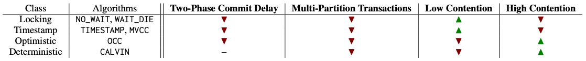

**표 3: 결과 요약(Results Summary)** – 본 연구에서 평가된 동시성 제어 프로토콜 실험 결과의 개요. 각 요소가 타 프로토콜 대비 **병목 지점(🔼)** 인지, **강점(🔽)** 인지, 아니면
상대적 성능에 **미미한 영향(–)** 을 미치는지에 따라 정리함

우리의 실험 결과는 평가된 모든 프로토콜이 확장성 문제에 직면했음을 보여줍니다.
우리는 관찰된 병목 현상들을 **표 3**에 요약했습니다.
무엇보다 중요한 점은 **커밋 프로토콜(commit protocol)** 이 처리량에 영향을 미치는 핵심 요인 중 하나라는 사실입니다.
대부분의 프로토콜은 커밋을 완료하기까지 두 번의 왕복 통신(round trip)을 필요로 합니다.
**CALVIN**은 특히 이러한 2PC의 영향을 완화하기 위해 설계되었지만, 만약 트랜잭션이 중단(abort)될 가능성이 있다면 로컬 노드에서 커밋을 수행하고 잠금을 해제하기 전에 한 차례의 메시지 브로드캐스트 및
수집 과정이 반드시 선행되어야 합니다.
모든 경우에 있어, 2PC를 수행하거나 메시지를 기다리는 동안 유지되는 **잠금(lock)** 은 애플리케이션이 다음 작업을 진행하는 것(**forward progress**)을 방해하게 됩니다.

분산 DBMS의 또 다른 주요 병목 현상은 두 가지 주요 요인에 의한 **데이터 경합(data contention)** 입니다.

**첫째, 레코드 업데이트(Update)가 없으면 경합도 발생하지 않습니다.**
YCSB 워크로드에서 업데이트 비율을 변화시키며 실험한 결과, 업데이트가 적을 때는 **2PL**이나 **타임스탬프(Timestamp)** 프로토콜처럼 오버헤드가 최소화된 프로토콜을 사용하는 것이 가장
합리적이었습니다.
그러나 이러한 프로토콜들은 쓰기(Write) 횟수가 증가함에 따라 성능이 급격히 저하되었으며, 특정 임계값을 넘어서면 **낙관적(Optimistic, OCC)** 또는
**결정적(Deterministic, CALVIN)** 프로토콜을 사용하는 것이 더 나은 선택이었습니다.

**둘째, 핫 레코드(hot records)에 대한 읽기 및 업데이트 빈도가 경합 발생 주기를 결정합니다.**
YCSB 워크로드 분석 결과, 데이터 편중(Skew)이 낮을 때는 2PL과 타임스탬프 프로토콜의 성능이 가장 좋았습니다.
하지만 동시 트랜잭션이 동일한 레코드에 접근할 만큼 스큐가 높아지면, 이 프로토콜들은 급격한 성능 하락을 겪게 됩니다.
**낙관적 동시성 제어(OCC)** 는 높은 스큐 상황에서 약간 더 탄력적(resilient)이지만, 스큐가 임계점에 도달하면 **CALVIN**이 가장 일관된 성능을 보여주는 프로토콜로 부상합니다.

#### 5.2. 잠재적 해결 방안 (Potential Solutions)

이러한 비관적인 전망을 바탕으로, 이제 우리는 분산 동시성 제어 프로토콜이 직면한 과제들을 해결하기 위한 **잠재적인 해결책**들을 논의해보고자 합니다.

- **네트워크 성능 개선(Improve the Network):**
    - 결국 분산 트랜잭션의 본질적 속성인 **네트워크 사용** 그 자체가 확장성을 가로막는 가장 큰 장애물입니다.
    - 따라서 확장성을 높이기 위한 가장 자연스러운 방향은 네트워크 성능 자체를 개선하는 것입니다.
    - 현재 우리가 사용하는 퍼블릭 클라우드 인프라는 어느 정도 납득할 만한 성능을 제공하지만, 최첨단 기술 수준에는 한참 못 미칩니다.
    - 오늘날 최고 사양의 프라이빗 데이터 센터 네트워크는 서버 간 **전체 이분 대역폭(Full Bisection Bandwidth)** 을 보장하며 지연 시간도 훨씬 낮습니다.
    - 과거에는 생소했으나 점차 보편화되고 있는 **RDMA(Remote Direct Memory Access)** 및 **RoCE(RDMA over Converged Ethernet)** 기술을 지원하는
      하드웨어를 활용하면, 분산 트랜잭션의 성능 오버헤드를 비약적으로 줄일 수 있습니다.
    - 현재 클라우드 인프라에서 발생하는 약 **500µs**의 지연 시간 대신 **5µs**의 메시지 지연 시간을 달성한다면, 훨씬 더 높은 수준의 병렬 처리가 가능해집니다.
    - 실제로 최신 프로토콜들 중 상당수가 이러한 하드웨어 역량을 활용하고 있습니다(6절 참조).
    - 네트워킹 하드웨어의 발전이 단일 데이터 센터 내부의 트랜잭션 처리 시스템에는 상당한 이득을 가져다주지만, **멀티 데이터 센터(Multi-datacenter)** 운영은 여전히 난제로 남아 있습니다.
    - 최근 양자 얽힘(Quantum Entanglement)의 가능성에 대한 흥미로운 소식들이 들려오곤 하지만, '빛의 속도'는 여전히 네트워크 통신 시간에서 넘기 힘든 강력한 물리적 하한선(lower
      bound)으로 작용하고 있습니다.
    - 가시선(line-of-sight) 통신이 불가능한 지리적 제약 조건 하에서 광역 통신(WAN)은 전파 지연 등으로 인해 훨씬 더 많은 비용을 수반합니다.
    - 결국 이는 **WAN 상에서 직렬화 가능(Serializable)한 트랜잭션**을 구현하는 것이 앞으로도 무기한(indefinitely) 높은 비용을 치러야 할 작업임을 시사합니다.
    - 물리학의 법칙은 데이터베이스 설계자에게도 참 야속한 장벽인 셈인 것입니다.
    - 따라서 우리는 단일 데이터 센터 내부에서는 (비범용 하드웨어의 채택, 가용성 및 안정화 여부에 따라) 성능 개선의 기회가 충분하다고 보고 있습니다.
    - 하지만 **데이터 센터 간(cross-datacenters)** 의 성능 개선은 결코 간단한 문제가 아닙니다.
    - 우리가 추가적인 검토가 필요하다고 믿는 또 다른 배포 시나리오는 점점 더 확산되고 있는 **모바일 및 유비쿼터스 센싱(ubiquitous sensing)** 분야입니다.
    - '사물인터넷(IoT)'이라는 개념이 여전히 모호하기는 하지만, 미래의 높은 분산도와 병렬성은 네트워크 운영의 한계로 인해 심각한 확장성 문제를 야기할 것입니다.
- **데이터 모델 최적화 (Adapt the Data Model):**
    - 분산 트랜잭션은 비용이 많이 드는 반면, 단일 노드(single node) 내에서만 실행되는 트랜잭션은 상대적으로 비용이 저렴합니다.
    - 결과적으로, 트랜잭션이 단일 노드 실행에 적합한 방식으로 구성된 애플리케이션은 우리가 본 연구에서 조사한 성능상의 불이익(penalties)을 받지 않게 됩니다.
    - 단일 노드 작업을 달성하기 위한 기본 전략은 **데이터 모델 내에서 파티셔닝(partitioning)** 을 수행하는 것입니다.
    - 예를 들어, **헬랜드(Helland)의 엔티티 그룹(entity group) 접근 방식**은 단일 서버에 수용 가능한 (잠재적으로 계층적인) 데이터 셋 내에 데이터를 저장합니다.
    - 이 방식은 표현할 수 있는 애플리케이션의 종류를 필연적으로 제한하며(예: DBMS가 엔티티 그룹 간의 외래 키 제약 조건을 강제할 수 없음), 결과적으로 그 부담을 **애플리케이션 개발자**에게
      전가합니다.
    - 그럼에도 불구하고, 파티셔닝이 용이한 애플리케이션(1980년대 중반 한 저자는 이를 "즐거운(delightful)" 애플리케이션이라 불렀습니다)의 경우, 엔티티 그룹 모델은 분산 트랜잭션 문제를 근본적으로
      해결해 줍니다.
    - 동시에, 연구 커뮤니티에서는 **정적(statically)** 및 **동적(dynamically)** 방식 모두를 활용하여 애플리케이션을 자동으로 파티셔닝하는 기술들을 개발해 왔습니다.
    - 이러한 기술들은 매우 유망해 보이지만, 아직 실제 산업 현장의 **주류 배포(mainstream deployments)** 단계까지는 이르지 못했습니다.
- **대체 프로그래밍 모델 탐색 (Seek Alternative Programming Models):**
    - 직렬화 가능성(serializability)을 유지하는 데 드는 막대한 비용을 감안할 때, 합리적인 대안을 찾는 것도 실질적인 방법입니다.
    - 흔히 비직렬화(non-serializable) 동작에 대한 논의는 '직렬화 및 애플리케이션 일관성'과 '이해하기 어렵고 오류가 발생하기 쉬운 대안' 사이의 **잘못된 이분법**을 제시하곤 합니다.
    - 여기서 기억해야 할 유용한 사실은, 직렬화 가능성이 애플리케이션 수준의 일관성을 달성하기 위한 **수단**일 뿐, 그 자체가 절대적인 필수 조건은 아니라는 점입니다.
    - 현재 존재하는 많은 비직렬화 격리 수준(예: Read Committed나 최종 일관성(eventual consistency))이 직관적이지 않은 것은 사실입니다.
    - 하지만 그렇다고 해서 모든 비직렬화 프로그래머 인터페이스가 반드시 난해해야 한다는 뜻은 아닙니다.
        - **Homeostasis Protocol:** 프로그램 내에서 비직렬화 실행이 가능한 지점을 분석하여, 개발자나 사용자가 눈치채지 못하게 특정 코드를 비직렬화 방식으로 자동 실행합니다.
        - **불변성 합류 분석(Invariant confluence analysis):** 많은 일반적인 데이터베이스 제약 조건들이 분산 조정(distributed coordination) 없이도 강제될 수
          있음을 보여줍니다. 이를 통해 분산 트랜잭션에 의존하지 않고도 확장 가능하면서 일관성을 유지하는 TPC-C 실행이 가능해집니다.
    - 시스템 및 프로그래밍 언어 분야의 관련 연구들도 이와 유사한 유망한 가능성을 보여주고 있습니다.
    - 사실상, 이러한 대안은 소위 **의미론 기반 동시성 제어(semantics-based concurrency control)** 방법에 대한 재조사를 촉구합니다.
    - 애플리케이션의 작동 원리나 의도(semantics)에 대한 정보가 부족한 상황에서, 직렬화 가능성(serializability)은 애플리케이션의 일관성을 보장하기 위한 일종의 '최적의' 전략입니다.
    - 하지만 우리가 목격한 확장성 문제들을 고려할 때, 이러한 추가적인 의미론을 데이터베이스 엔진 내부로 직접 전달(pushing down)하는 기술을 연구할 가치가 충분하다고 믿습니다.
    - 실제로 한 연구에 따르면, 웹 프레임워크(예: Ruby on Rails)를 사용하는 개발자들은 이미 자신의 애플리케이션 일관성 기준을 표현하기 위해 비트랜잭션 인터페이스(non-transactional
      interfaces)를 활용하고 있습니다.
    - 이는 기존의 '트랜잭션' 개념을 근본적으로 재고하고, 대안적인 프로그래밍 모델을 추구할 수 있는 아주 흥미로운 기회를 제공합니다.
- **요약:**
    - 해결책을 모색할 수 있는 방향은 새로운 하드웨어 도입부터 고급 데이터 모델링, 그리고 프로그램 분석에 이르기까지 매우 다양합니다.
    - 우리는 이들 각각이 잠재적으로 결실을 맺을 수 있는 연구 분야라고 믿으며, 혁신적인 연구는 물론 성능과 확장성 면에서 의미 있는 개선을 이룰 수 있는 많은 기회가 존재한다고 확신합니다.

### 6. 관련 연구

1980년대 이후 트랜잭션 처리 아키텍처를 비교하려는 다양한 노력이 있었습니다.
초기 연구의 상당수는 모델링 기법을 사용했지만, 본 연구와 마찬가지로 비교 실험 분석을 수행한 사례도 있었습니다.

최근에는 **OLTP-Bench** 프로젝트가 표준화된 OLTP 워크로드 세트를 개발했으며, **BigBench**, **BigDataBench**, 그리고 **Chen 등**의 연구는 빅데이터 분석 프레임워크를
위한 다양한 벤치마크와 워크로드를 제시했습니다.

이와 관련된 또 다른 연구들은 클라우드 컴퓨팅 플랫폼과 멀티테넌트(multi-tenant) 워크로드를 조사했으며, **Rabl 등**은 다양한 분산 데이터베이스를 평가했는데, 그중 트랜잭션을 지원하는 것은 단
하나뿐이었습니다.

우리는 **Deneva 프레임워크**를 개발하고 클라우드 컴퓨팅 인프라에서 6가지 프로토콜의 성능을 평가함으로써, 이러한 실증적 시스템 분석의 전통을 이어가고 있습니다.
우리가 아는 한, 이는 현대 하드웨어를 대상으로 한 가장 포괄적인 연구입니다.
본 연구와 가장 유사한 사례로는 최근 1,000개의 CPU 코어를 가진 단일 서버(비분산 환경)에서의 동시성 제어 프로토콜 조사 연구를 꼽을 수 있습니다.

우리의 연구 결과는 이전의 연구 결론들을 뒷받침하면서도, 클라우드 인프라의 규모와 운영 환경으로 인해 몇 가지 중요한 차이점을 보여줍니다.
예를 들어, 아그라왈(Agrawal) 등은 중단(abort) 발생 시 낙관적(optimistic) 방식의 비용이 매우 높으며, 부하가 가중되는 상황에서는 비관적(pessimistic) 방식이 더 견고한 동작을 제공할
수 있음을 발견했습니다.

우리의 실험 결과 또한 낙관적 방식이 우수한 성능을 보인다는 점을 확인했으나, 이는 오직 **이상적인 조건(idealized conditions)** 하에서만 그러했습니다.
나아가, 분산 환경에서는 메시지 지연(message delay)이 매우 중요한 함의를 갖습니다.
케리(Carey)와 리브니(Livny)가 네트워크 지연 대신 메시지 송수신에 드는 CPU 비용에 집중했던 것과 달리, 우리는 **네트워크 지연 자체가 효율성에 상당한 영향**을 미친다는 사실을 입증했습니다.

결과적으로 더 빠른 네트워크 하드웨어가 성능 향상을 위한 참으로 유망한 수단이라는 결론에 도달했습니다.
특히 1,000코어 환경과 비교했을 때, 클라우드 환경에서 최적의 성능을 내는 워크로드는 단일 서버나 시뮬레이션된 네트워크 환경에서의 결과와 자주 다르게 나타납니다.

본 연구에서 우리는 분산 환경에서 직렬화 가능성(serializability)을 구현하기 위한 6가지 동시성 제어 프로토콜을 조사했습니다.
표 1에서 암시했듯이, 현재 수많은 대안이 존재하며 매년 새로운 프로토콜들이 제안되고 있습니다.

이들 중 상당수는 우리가 본 연구에서 조사한 접근 방식들의 변형을 사용합니다:

- **2단계 잠금 (2PL):** **Spanner**와 **Wei** 등이 이를 구현합니다.
- **결정적 방법 (Deterministic):** **Granola**, **VoltDB**, **H-Store**, 그리고 본 연구에서 평가한 **Calvin**이 이 방식을 따릅니다.
- **낙관적 동시성 제어 (OCC):** **Centiman**, **FaRM**, **Warp**, **MaaT**, **Rococo**, **F1**, 그리고 **Tapir** 등이 OCC의 변형을 구현합니다.

이렇게 새로운 프로토콜이 쏟아져 나오는 상황에서, 우리는 **Bernstein과 Goodman의 1981년 기념비적 연구**와 유사한 분석을 수행할 아주 좋은 기회라고 믿습니다.
그들은 당시의 최신 동시성 제어 프로토콜들을 해체하여 거의 모든 제안이 결국 **잠금(Locking)** 또는 **타임스탬프(Timestamp)** 방식의 변형임을 보여주었습니다.

우리는 **Deneva** 프레임워크가 이러한 최신 시스템들이 보여주는 성능의 트레이드오프(trade-offs)를 이해하기 위한 정량적 틀을 제공할 수 있다고 믿으며, 7절에서 논의할 것처럼 향후 이러한 분석을
수행하는 데
큰 관심을 가지고 있습니다.

### 7. 향후 과제

우리는 우리의 평가 프레임워크(Deneva)와 새로운 분산 동시성 제어 프로토콜의 설계라는 두 가지 측면 모두에서, 향후 연구를 위한 몇 가지 유망한 방안들을 보고 있습니다.

첫째, 본 연구는 **파티셔닝된 데이터베이스(partitioned database)** 에서의 동시성 제어에 초점을 맞췄습니다.
이러한 결정은 확장성 병목 현상을 동시성 제어 서브시스템만으로 국한하여 독립적으로 분석할 수 있게 해주었습니다.
이는 다중 파티션 직렬화 가능 트랜잭션을 지원하는 우리의 프레임워크(Deneva) 설계에도 반영되어 있습니다.
향후 우리는 **복제(Replication)**(예: 액티브-액티브 vs 액티브-패시브 프로토콜)와 **장애 복구(Failure Recovery)**(예: 페일오버, 네트워크 파티션 발생 시의 동작)가 미치는 영향에
대해서도 조사할 계획입니다.
이들 각각은 확장성에 있어 무시할 수 없는(non-trivial) 영향을 미치며, 우리는 이를 향후 연구에서 깊이 있게 탐구하고자 합니다.

둘째, 본 연구는 6가지 특정 동시성 제어 프로토콜에 집중했습니다.
비록 이 연구가 최근 문헌 중 가장 포괄적이기는 하지만, 최근 제안된 여러 프로토콜의 성능은 기껏해야 몇 가지 다른 방식들과만 정량적으로 비교되었을 뿐입니다.
우리는 이러한 최신 기법 중 가장 유망한 것들을 정량적으로 평가하는 데 큰 관심을 가지고 있습니다.
우리는 **Deneva**를 오픈 소스로 공개함으로써 연구 커뮤니티가 각자의 프로토콜을 통합할 수 있는 동기부여가 되기를 희망합니다.
또한 지원하는 워크로드의 수를 늘리기 위해 Deneva 프레임워크를 **OLTP-Bench** 벤치마킹 스위트와 통합하는 것을 고려하고 있습니다.
이러한 통합 과정은 **CALVIN**처럼 읽기-쓰기 집합(read-write sets)을 사전에 선언해야 하는 특정 프로토콜들에게는 세심한 주의가 필요하겠지만, 충분히 가치 있는 엔지니어링 노력이 될 것입니다.

셋째, 우리는 **5.2절에서 설명한 잠재적 해결책들**의 효과를 심도 있게 조사하고자 합니다.
예를 들어, **RDMA(Remote Direct Memory Access)** 및 대안적인 네트워킹 기술들을 Deneva 프레임워크에 통합함으로써, 이러한 기술들이 가져다주는 비용 대비 이점에 대해 공정한 평가를
내릴 수 있을 것입니다.
또한, 최근 제안된 **의미론 기반 동시성 제어(semantics-based concurrency control)** 방식들과의 직접적인 비교(head-to-head comparison)를 수행하여, 기존 문헌들에서
약속했던 성능 향상 잠재력을 정량적으로 검증하는 것도 매우 흥미로운 작업이 될 것입니다.

### 8. 결론

우리는 현대적인 클라우드 컴퓨팅 환경에서 직렬화 가능한 분산 트랜잭션의 동작을 조사했습니다.
우리는 6가지 고전적 및 현대적 동시성 제어 프로토콜의 동작을 연구했으며, 많은 워크로드에서 클러스터상의 분산 트랜잭션 처리량이 단일 머신의 비분산 트랜잭션 처리량을 아주 근소한 차이로만 상회하는 경우가 많다는 점을
입증했습니다.
정확한 확장성 병목 현상은 프로토콜에 따라 다릅니다.
**2단계 잠금**은 중단(abort)으로 인해 높은 경합 상황에서 성능이 저하되고, **타임스탬프 순서 동시성 제어**는 버퍼링으로 인해 높은 경합 상황에서 제대로 작동하지 않으며, **낙관적 동시성 제어**는
검증 오버헤드가 있고, **결정적 프로토콜**은 불리한 부하와 데이터 편중 범위 전반에서 성능을 유지하지만 트랜잭션 스케줄링으로 인해 성능이 제한됩니다.
궁극적으로 이러한 결과는 분산 트랜잭션의 심각한 확장성 문제를 지적합니다.
우리는 해결책이 클라우드 인프라(최소한 단일 데이터 센터 내)의 네트워크 개선, 데이터 모델링, 그리고 의미론 기반 동시성 제어 기술의 조합을 통해 동시성 제어 엔진을 하드웨어 및 애플리케이션과 더 밀접하게 결합하는
데 있다고 믿습니다.
나아가, 우리는 Deneva 프레임워크가 다른 연구자들이 새롭고 대안적인 동시성 제어 기술에 대한 엄격한 평가를 수행할 수 있는 개방형 플랫폼을 제공하고,
종종 혼란스러운 동시성 제어 프로토콜 분야에 명확성을 가져다주기를 기대합니다.
