# [논문 번역] Concurrency Control in Distributed Database Systems (1981)

## 논문 정보

- **제목:** Concurrency Control in Distributed Database Systems
- **저자:** Philip A. Bernstein, Nathan Goodman
- **학술지/발행처:** ACM 1981
- **참고 링크:** [ACM 논문 링크](https://dl.acm.org/doi/10.1145/356842.356846)

---

## 논문 번역

### 초록

본 논문에서 우리는 **분산 데이터베이스 동시성 제어(distributed database concurrency control)** 분야의 **최신 기술(state of the art)** 을 조사, 통합 및
제시합니다.
우리 분석의 핵심은 **동시성 제어 문제(concurrency control problem)** 를
두 가지 주요 하위 문제인 **읽기-쓰기(read-write)** 및 **쓰기-쓰기(write-write) 동기화(synchronization)** 로 분해하는 것입니다.
우리는 각 하위 문제를 해결하기 위한 일련의 **동기화 기술(synchronization techniques)** 을 설명하고,
이러한 기술들을 결합하여 전체 동시성 제어 문제를 해결하는 **알고리즘(algorithms)** 을 만드는 방법을 보여줍니다.
이러한 알고리즘들을 **"동시성 제어 방법(concurrency control methods)"** 이라고 부릅니다.
우리는 문헌에 등장한 모든 실용적인 알고리즘과 몇 가지 새로운 알고리즘을 포함하여 **48가지의 주요 방법(48 principal methods)** 을 설명합니다.
우리는 동시성 제어 알고리즘의 **구조(structure)** 와 **정확성(correctness)** 에 집중합니다.
**성능(performance)** 문제는 부차적으로만 다룹니다.

- **주요어 및 문구(Keywords and Phrases):** 동시성 제어(concurrency control), 교착 상태(deadlock), 분산 데이터베이스 관리 시스템(distributed
  database management systems), 잠금(locking), 직렬화 가능성(serializability), 동기화(synchronization), 타임스탬프 순서화(timestamp
  ordering), 타임스탬프(timestamps), 2단계 커밋(two-phase commit), 2단계 잠금(two-phase locking)
- **CR 카테고리(CR Categories):** 4.33, 4.35

### 서론

#### 동시성 제어 문제 (The Concurrency Control Problem)

**동시성 제어(Concurrency control)** 는 **다중 사용자 데이터베이스 관리 시스템(multiuser database management system, DBMS)** 에서
데이터베이스에 대한 **병행 액세스(concurrent accesses)** 를 조정하는 활동입니다.
**동시성 제어(Concurrency control)** 는 각 사용자가 전용 시스템에서 혼자 실행 중이라는 **착각(illusion)** 을 유지하면서,
사용자들이 **멀티프로그래밍(multi-programmed)** 방식으로 **데이터베이스(database)** 에 액세스할 수 있도록 허용합니다.

이 목표를 달성하는 데 있어 주요한 기술적 어려움은 한 사용자가 수행하는 **데이터베이스 업데이트(database updates)** 가
다른 사용자가 수행하는 데이터베이스 검색(database retrievals)및 **업데이트(updates)** 를 방해하는 것을 방지하는 것입니다.
**동시성 제어 문제(concurrency control problem)** 는 **분산 DBMS(distributed DBMS, DDBMS)** 에서 더욱 심화되는데, 그 이유는 다음과 같습니다:

- **(1):** 사용자가 분산 시스템 내의 **여러 서로 다른 컴퓨터(many different computers)** 에 저장된 데이터에 액세스할 수 있습니다.
- **(2):** 한 컴퓨터의 **동시성 제어 메커니즘(concurrency control mechanism)** 은 다른 컴퓨터에서 발생하는 상호작용에 대해 **즉각적으로(instantaneously)** 알 수
  없습니다.

**동시성 제어(Concurrency control)** 는 지난 몇 년 동안 활발하게 연구되어 왔으며, **비분산 DBMS(nondistributed DBMS)** 에 대한 문제는 잘 이해되고 있습니다.
문제를 분석하기 위해 광범위한 **수학적 이론(mathematical theory)** 이 개발되었으며, **2단계 잠금(two-phase locking)** 이라 불리는 한 가지 접근 방식이
표준 솔루션으로 받아들여졌습니다.
**비분산 동시성 제어(non-distributed concurrency control)** 에 대한 현재 연구는 **2단계 잠금(two-phase locking)** 에 대한
진화적 개선, 상세한 성능 분석 및 최적화(performance analysis and optimization), 그리고 **수학적 이론(mathematical theory)** 의 확장 등에
초점을 맞추고 있습니다.

대조적으로 **분산 동시성 제어(Distributed concurrency control)** 는 극심한 혼란 상태에 있습니다.
DDBMS를 위해 20개 이상의 **동시성 제어 알고리즘(concurrency control algorithms)** 이 제안되었으며, 그중 몇몇은 구현되었거나 구현되고 있습니다.
이러한 알고리즘은 대개 복잡하고 이해하기 어려우며, 정확성을 증명하기 어렵습니다(실제로 많은 알고리즘이 부정확합니다(incorrect)).
이들은 서로 다른 용어로 설명되고 기저의 **DDBMS 환경(DDBMS environment)** 에 대해 서로 다른 가정을 하기 때문에, 제안된 많은 알고리즘을 질적인 측면에서조차 비교하기가 어렵습니다.
당연히 각 저자는 자신의 접근 방식이 최고라고 주장하지만, 그 주장을 뒷받침할 설득력 있는 증거는 거의 없습니다.

**최신 기술(state of the art)** 을 조사하기 위해, 우리는 **DDBMS 동시성 제어 알고리즘(DDBMS concurrency control algorithms)** 을
설명하기 위한 **표준 용어(standard terminology)** 와 **DDBMS 환경(DDBMS environment)** 을 위한 **표준 모델(standard model)** 을 도입합니다.
분석 목적을 위해 우리는 **동시성 제어 문제(concurrency control problem)** 를 **읽기-쓰기(read-write)** 및
**쓰기-쓰기(write-write) 동기화(synchronization)** 라고 불리는 **두 가지 주요 하위 문제(two major subproblems)** 로 분해합니다.
모든 **동시성 제어 알고리즘(concurrency control algorithm)** 은 각 하위 문제를 해결하기 위한 **하위 알고리즘(subalgorithm)** 을 반드시 포함해야 합니다.
**동시성 제어 알고리즘(concurrency control algorithm)** 을 이해하는 **첫 번째 단계(first step)** 는 각 하위 문제에 채택된 **하위 알고리즘(subalgorithm)** 을
분리하는 것입니다.

제안된 수많은 **알고리즘(algorithms)** 을 연구한 후, 우리는 그것들이 단지 몇 개의 **하위 알고리즘(subalgorithms)** 들의 **조합(compositions)** 이라는 것을 발견했습니다.
사실, 모든 실질적인 **DDBMS 동시성 제어 알고리즘(DDBMS concurrency control algorithms)** 에 사용되는 **하위 알고리즘(subalgorithms)** 은
단 **2가지 기본 기술(two basic techniques)** 의 변형입니다

- **2단계 잠금(two-phase locking)**
- **타임스탬프 순서화(timestamp ordering)**

따라서 **최신 기술(state of the art)** 의 상태는 문헌을 검토했을 때 나타나는 것보다 훨씬 더 **일관성(coherent)** 이 있습니다.

#### 동시성 제어 이상 사례 (Example of Concurrency Control Anomalies)

**동시성 제어(concurrency control)** 의 목표는 데이터베이스에 **동시에 액세스하는(simultaneously accessing)** 사용자들 사이의 **간섭(interference)** 을
방지하는 것입니다.
두 가지 **"표준적인(canonical)" 사용자 간 간섭(interuser interference)** 사례를 제시하여 문제를 설명해 보겠습니다.
두 사례 모두 **원격 자동 현금 입출금기(remote automated teller machines, ATMs)** 를 통해
액세스되는 **온라인 전자 자금 이체 시스템(on-line electronic funds transfer system)** 의 예시입니다.
고객의 요청에 응답하여, **ATM**은 데이터베이스에서 데이터를 검색하고, 계산을 수행하며, 결과를 다시 데이터베이스에 저장합니다.

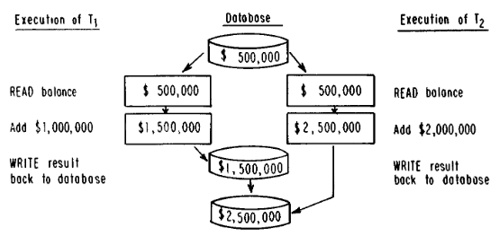

> **그림 1:** 갱신 손실 이상 현상

- **이상 현상 1: 갱신 손실(Anomaly 1: Lost Updates)**
    - 두 고객이 동시에 같은 계좌에 돈을 입금하려고 시도한다고 가정해 봅시다.
    - **동시성 제어(concurrency control)** 가 없는 상황에서, 이 두 활동은 서로 간섭할 수 있습니다(그림 1 참조).
    - 두 고객을 처리하는 두 **ATM**은 거의 동시에 계좌 잔액을 읽고, 병렬로 새로운 잔액을 계산한 다음, 새로운 잔액을 다시 데이터베이스에 저장할 수 있습니다.
    - 그 결과는 부정확합니다
        - 두 고객이 돈을 입금했음에도 불구하고, 데이터베이스는 단 하나의 활동만 반영하며, 다른 입금은 시스템에 의해 유실됩니다.

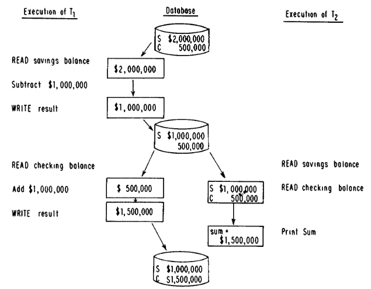

> **그림 2:** 모순된 판독 이상 현상

- **이상 현상 2: 모순된 판독(Anomaly 2: Inconsistent Retrievals)**
    - 두 고객이 동시에 다음 **트랜잭션(transactions)** 을 실행한다고 가정해 봅시다.
        - **고객 1:** Acme Corporation의 저축 계좌에서 당좌 예금 계좌로 **\$1,000,000** 을 이체합니다.
        - **고객 2:** Acme Corporation의 저축 및 당좌 예금의 총 잔액을 출력합니다.
        - **동시성 제어(concurrency control)** 가 없는 상황에서 이 두 **트랜잭션(transactions)** 은 서로 간섭할 수 있습니다(그림 2 참조).
        - 첫 번째 트랜잭션은 저축 계좌 잔액을 읽고, **\$1,000,000**을 뺀 뒤, 그 결과를 다시 데이터베이스에 저장할 수 있습니다.
        - 그런 다음 두 번째 트랜잭션이 저축 및 당좌 예금 계좌 잔액을 읽고 합계를 출력할 수 있습니다.
        - 그 후 첫 번째 트랜잭션이 당좌 예금 계좌 잔액을 읽고, **\$1,000,000**을 더한 뒤, 최종적으로 그 결과를 데이터베이스에 저장하며 자금 이체를 완료할 수 있습니다.

**이상 현상 1(Anomaly 1)** 과 달리, 이 실행에 의해 데이터베이스에 기록된 최종 값들은 정확합니다.
그럼에도 불구하고, 고객 2에 의해 출력된 잔액이 **\$1,000,000**만큼 부족하기 때문에 이 실행은 잘못된 것입니다.

이 두 사례가 병행 사용자가 간섭할 수 있는 모든 가능한 방법을 다 소진하는 것은 아닙니다.
그러나 이 사례들은 **DBMS**에서 발생하는 전형적인 **동시성 제어 문제(concurrency control problems)** 입니다.

#### 상호 배제 문제와의 비교 (Comparison to Mutual Exclusion Problems)

데이터베이스 **동시성 제어(concurrency control)** 문제는 몇 가지 측면에서 운영 체제의 **상호 배제(mutual exclusion)** 문제와 유사합니다.
후자의 문제는 **메모리(memory)**, **I/O 장치(I/O devices)** 및 **CPU**와 같은 시스템 리소스에 대한 **병행 프로세스(concurrent processes)** 의 액세스를 조정하는
것과 관련이 있습니다.
**잠금(locks)**, **세마포어(semaphores)**, **모니터(monitors)** 및 **직렬화기(serializers)** 를 포함하여 많은 해결 기술이 개발되었습니다(*BRIN73, DIJK71,
HEWI74, HOAR74*).

**동시성 제어(concurrency control)** 와 **상호 배제(mutual exclusion)** 문제는 둘 다 공유 리소스에 대한 **병행 액세스(concurrent access)** 를 제어하는 것과
관련이 있다는 점에서 유사합니다.
그러나 다음 예에서 볼 수 있듯이, 한쪽에서 작동하는 제어 체계가 다른 쪽에서도 반드시 작동하는 것은 아닙니다.

프로세스 $P_1$과 $P_2$가 실행 중 서로 다른 지점에서 리소스 $R_1$과 $R_2$에 대한 액세스를 요구한다고 가정해 봅시다.
**운영 체제(operating system)** 에서 이러한 프로세스들의 다음과 같은 **인터리브된 실행(interleaved execution)** 은 완벽하게 허용됩니다:

- $P_1$이 $R_1$을 사용하고, $P_2$가 $R_1$을 사용하며, $P_2$가 $R_2$를 사용하고, $P_1$이 $R_2$를 사용합니다.

하지만 **데이터베이스(database)에서는 이러한 실행이 항상 허용되는 것은 아닙니다.**
**예를 들어, $P_2$가 한 계좌($R_1$)에서 차변을 기입(인출)하고 다른 계좌**($R_2$)에 대변을 기입(입금)하여 자금을 이체한다고 가정해 봅시다.
만약 $P_2$가 두 잔액을 모두 확인한다면, $R_1$은 차변이 기입된 후의 상태로 보게 되지만, $R_2$는 대변이 기입되기 전의 상태로 보게 될 것입니다.
**동시성 제어(concurrency control)** 와 **상호 배제(mutual exclusion)** 사이의 다른 차이점들은 *CHAM74*에서 논의됩니다.

### 1. 트랜잭션 처리 모델 (TRANSACTION-PROCESSING MODEL)

**동시성 제어 알고리즘(concurrency control algorithm)** 이 어떻게 작동하는지 이해하려면, 그 알고리즘이 전체 **DDBMS**에 어떻게 부합하는지 이해해야 합니다.
이 섹션에서는 **DDBMS**가 사용자 상호작용을 처리하는 방식에 중점을 둔 **DDBMS**의 간단한 모델을 제시합니다.
나중에 우리는 이 모델의 맥락에서 **동시성 제어 알고리즘(concurrency control algorithms)** 이 어떻게 작동하는지 설명할 것입니다.

#### 1.1 기본 정의 및 DDBMS 아키텍처 (Preliminary Definitions and DDBMS Architecture)

**DDBMS**는 네트워크로 상호 연결된 **사이트들의 집합(collection of sites)** 입니다(*DEPP76, ROTH77*).
각 사이트는 다음 소프트웨어 모듈 중 하나 또는 둘 다를 실행하는 컴퓨터입니다:

- **트랜잭션 관리자(transaction manager, TM)** 또는 **데이터 관리자(data manager, DM)**

**TM**은 사용자와 **DDBMS** 사이의 상호작용을 감독하는 반면, **DM**은 실제 데이터베이스를 관리합니다.
**네트워크(network)** 는 컴퓨터 간 통신 시스템입니다.
네트워크는 **완벽하게 신뢰할 수 있다고(perfectly reliable)** 가정됩니다:

- 만약 사이트 $A$가 사이트 $B$로 메시지를 보내면, 사이트 $B$는 오류 없이 메시지를 받을 것임을 보장받습니다.
- 또한, 우리는 임의의 사이트 쌍 사이에서 네트워크가 메시지를 **보낸 순서대로(order they were sent)** 전달한다고 가정합니다.

사용자 관점에서 데이터베이스는 $X, Y, Z$로 표시되는 **논리적 데이터 항목(logical data items)** 의 집합으로 구성됩니다.
우리는 **논리적 데이터 항목(logical data items)** 의 **세분성(granularity)** 을 명시하지 않은 채로 둡니다.
실제로 이들은 **파일(files), 레코드(records)** 등일 수 있습니다.
**논리적 데이터베이스 상태(logical database state)** 는 데이터베이스를 구성하는 **논리적 데이터 항목(logical data items)** 에 값을 할당하는 것입니다.

각 **논리적 데이터 항목(logical data item)** 은 시스템 내의 어떤 **DM**에도 저장될 수 있으며, 여러 **DM**에 **중복하여(redundantly)** 저장될 수도 있습니다.
**논리적 데이터 항목(logical data item)** 의 저장된 복사본을 **저장된 데이터 항목(stored data item)** 이라고 부릅니다.
(혼동의 여지가 없을 때, 우리는 **저장된 데이터 항목(stored data item)** 대신 **데이터 항목(data item)** 이라는 용어를 사용합니다.)
**논리적 데이터 항목** $X$의 저장된 복사본들은 $x_1, \dots, x_m$으로 표시됩니다.
우리는 일반적으로 **임의의 저장된 데이터 항목(arbitrary stored data item)** 을 나타내기 위해 $x$를 사용합니다.
**저장된 데이터베이스 상태(stored database state)** 는 데이터베이스 내의 **저장된 데이터 항목(stored data items)** 에 값을 할당하는 것입니다.

사용자들은 **트랜잭션(transactions)** 을 실행함으로써 **DDBMS**와 상호작용합니다.
**트랜잭션(Transactions)** 은 독립된 **질의어(query language)** 로 표현된 **온라인 쿼리(on-line queries)** 일 수도 있고,
**범용 프로그래밍 언어(general-purpose programming language)** 로 작성된 **응용 프로그램(application programs)** 일 수도 있습니다.
우리가 연구하는 **동시성 제어 알고리즘(concurrency control algorithms)** 은 트랜잭션에 의해 수행되는 **계산(computations)** 에는 주의를 기울이지 않습니다.
대신, 이러한 알고리즘은 트랜잭션이 **읽고 쓰는(reads and writes) 데이터 항목(data items)** 을 기반으로 모든 결정을 내리므로,
트랜잭션 형태의 세부 사항은 우리의 분석에서 중요하지 않습니다.
그러나 우리는 트랜잭션이 완전하고 정확한 **계산(computations)** 을 나타낸다고 가정합니다

- 각 트랜잭션은 초기 상태가 일관된 데이터베이스에서 단독으로 실행될 경우, 종료되고 정확한 결과를 생성하며 데이터베이스를 일관된 상태로 유지할 것입니다.

트랜잭션의 **논리적 판독 집합(logical readset)**(그에 상응하는 **기록 집합(writeset)**)은
트랜잭션이 읽는(또는 쓰는) **논리적 데이터 항목(logical data items)** 의 집합입니다.
마찬가지로, **저장된 판독 집합(stored readsets)** 과 **저장된 기록 집합(stored writesets)** 은
트랜잭션이 읽고 쓰는 **저장된 데이터 항목(stored data items)** 입니다.

**동시성 제어 알고리즘(concurrency control algorithm)** 의 **정확성(correctness)** 은 **트랜잭션 실행(transaction execution)** 에 관한
사용자들의 **기대치(expectations)** 에 비추어 정의됩니다.
두 가지 **정확성 기준(correctness criteria)** 이 존재합니다:

1. 사용자들은 시스템에 제출된 각 **트랜잭션(transaction)** 이 결과적으로 실행될 것이라고 기대합니다.
2. 사용자들은 각 **트랜잭션(transaction)** 에 의해 수행되는 **계산(computation)** 이 전용 시스템에서 단독으로 실행되든, **멀티프로그래밍 시스템(multi-programmed
   system)** 에서 다른 트랜잭션들과 **병렬(parallel)** 로 실행되든 동일하기를 기대합니다.

이러한 기대치를 실현하는 것이 **동시성 제어(concurrency control)** 의 **주요 쟁점(principal issue)** 입니다.

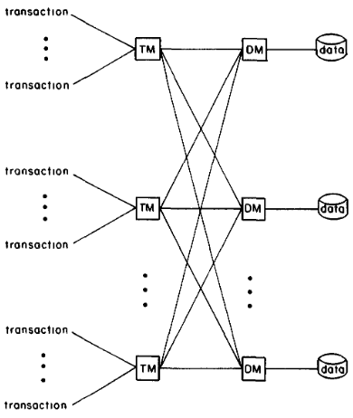

> **그림 3:** DDBMS 시스템 아키텍처

**DDBMS**는 **4가지 구성 요소(four components)** 를 포함합니다(그림 3 참조):

- **트랜잭션(transactions)**, **TM(transaction managers)**, **DM(data managers)**, 그리고 **데이터(data)**

**트랜잭션(Transactions)** 은 **TM**과 **통신(communicate)** 하고, **TM**은 **DM**과 **통신(communicate)** 하며,
**DM**은 **데이터(data)** 를 관리합니다.
(**TM**은 다른 **TM**과 통신하지 않으며, **DM**도 다른 **DM**과 통신하지 않습니다.)

**TM**은 **트랜잭션**을 감독합니다.
**DDBMS**에서 실행되는 각 **트랜잭션(transaction)** 은 단일 **TM**에 의해 감독되며,
이는 트랜잭션이 모든 **데이터베이스 작업(database operations)** 을 해당 **TM**에 발행함을 의미합니다.
트랜잭션을 실행하는 데 필요한 모든 **분산 컴퓨팅(distributed computation)** 은 **TM**에 의해 관리됩니다.

**트랜잭션-TM 인터페이스(transaction-TM interface)** 에는 **4가지 작업(Four operations)** 이 정의되어 있습니다.
**READ(X)** 는 **현재 논리적 데이터베이스 상태(current logical database state)** 에서 **X (논리적 데이터 항목(logical data item))** 의 값을 반환합니다.
**WRITE(X, new-value)** 는 **X**가 **지정된 새 값(specified new-value)** 을
갖는 **새로운 논리적 데이터베이스 상태(new logical database state)** 를 생성합니다.
**트랜잭션(transactions)** 은 **완전한 계산(complete computations)** 을 나타내는 것으로 가정되므로,
우리는 **트랜잭션 실행의 범위를 지정(bracket transaction executions)** 하기 위해 **BEGIN 및 END 작업(BEGIN and END operations)** 을 사용합니다.

**DM**은 **저장된 데이터베이스(stored database)** 를 관리하며, **백엔드 데이터베이스 프로세서(backend database processors)** 로 기능합니다.
**트랜잭션(transactions)** 의 명령에 응답하여, **TM**은 읽거나 쓸 **저장된 데이터 항목(stored data items)** 을 지정하는 명령을 **DM**에 내립니다.

**TM-DM 인터페이스(TM-DM interface)** 의 세부 사항은 우리의 **트랜잭션 처리 모델(transaction-processing model)** 의 핵심을 구성하며,
섹션 1.2와 1.3에서 논의됩니다.
섹션 1.2는 **중앙 집중식 데이터베이스 환경(centralized database environment)** 에서의 **TM-DM 상호작용**을 설명하고,
섹션 1.3은 그 논의를 **분산 데이터베이스 설정(distributed database setting)** 으로 확장합니다.

#### 1.2. 중앙 집중식 트랜잭션 처리 모델 (Centralized Transaction-Processing Model)

중앙 집중식 **DBMS**는 한 사이트에서 실행되는 하나의 **TM(Transaction Manager)**과 하나의 **DM(Data Manager)**으로 구성됩니다.
**트랜잭션(Transaction)** $T$는 다음과 같이 처리되는 **BEGIN, READ, WRITE, END** 작업들을 발행함으로써 **DBMS**에 액세스합니다.

- **BEGIN:**
    - **TM**은 데이터베이스로부터 읽거나 기록한 값들을 위한 임시 버퍼 역할을 하는 **개별 작업 공간(private workspace)** 을 $T$를 위해 초기화합니다.
- **READ(X):**
    - **TM**은 $T$의 **개별 작업 공간(private workspace)** 에서 $X$의 복사본을 찾습니다.
    - 만약 복사본이 존재하면, 그 값이 $T$에게 반환됩니다.
    - 그렇지 않으면 **TM**은 데이터베이스로부터 $X$의 복사본을 검색하기 위해 **DM**에 **dm-read(x)** 를 발행하고, 검색된 값을 $T$에게 전달하며 이를 $T$의 **개별 작업 공간(
      private workspace)** 에 넣습니다.
- **WRITE(X, new-value):**
    - **TM**은 다시 한번 **개별 작업 공간(private workspace)** 에서 $X$의 복사본을 확인합니다.
    - 복사본을 찾으면 값이 **새 값(new-value)** 으로 업데이트되며, 그렇지 않으면 **새 값(new-value)** 을 가진 $X$의 복사본이 작업 공간에 생성됩니다.
    - 이 시점에서 $X$의 **새 값(new-value)** 은 데이터베이스에 저장되지 않습니다.
- **END:**
    - **TM**은 $T$에 의해 업데이트된 각 **논리적 데이터 항목(logical data item)** $X$에 대해 **dm-write(x)** 를 발행합니다.
    - 각 **dm-write(x)** 는 **DM**이 **저장된 데이터베이스(stored database)** 의 $X$ 값을 $T$의 **로컬 작업 공간(local workspace)** 에 있는 $X$
      값으로 업데이트하도록 요청합니다.
    - 모든 **dm-write**들이 처리되면, $T$는 실행을 마치고 그 **개별 작업 공간(private workspace)** 은 폐기됩니다.

**DBMS**는 **dm-write**가 처리되기 전 언제든지 $T$를 **재시작(restart)** 할 수 있습니다.
$T$를 **재시작(restarting)** 하는 효과는 그것의 **개별 작업 공간(private workspace)** 을 삭제하고 처음부터 $T$를 **재실행(reexecute)** 하는 것입니다.

우리가 보게 되겠지만, 많은 **동시성 제어 알고리즘(concurrency control algorithms)** 은
정확한 실행을 달성하기 위한 전략으로 **트랜잭션 재시작(transaction restarts)** 을 사용합니다.
그러나 일단 단 하나의 **dm-write**라도 처리되면, $T$는 **재시작(restarted)** 될 수 없습니다

- 각 **dm-write**는 데이터베이스에 업데이트를 영구적으로 설치하며, 우리는 데이터베이스가 트랜잭션의 **부분적 효과(partial effects)** 를 반영하는 것을 허용할 수 없기 때문입니다.

**DBMS**는 **원자적 커밋(atomic commitment)** 속성을 가짐으로써 그러한 부분적인 결과를 피할 수 있으며,
이는 **트랜잭션(transaction)** 의 **dm-writes**가 모두 처리되거나 하나도 처리되지 않아야 함을 요구합니다.
**원자적 커밋(atomic commitment)** 의 "표준적인" 구현은 **2단계 커밋(two-phase commit)** 이라 불리는 절차입니다(*LAMP76, GRAY78*).

**트랜잭션(transaction)** $T$가 **데이터 항목(data items)** $X$와 $Y$를 업데이트하고 있다고 가정해 봅시다.
$T$가 **END**를 발행하면 **2단계 커밋(two-phase commit)** 의 **첫 번째 단계(first phase)** 가 시작되며,
이 동안 **DM**은 $X$와 $Y$에 대해 **prewrite 명령(prewrite commands)** 을 발행합니다.
이 명령들은 **DM**에게 $X$와 $Y$의 값을 $T$의 **개별 작업 공간(private workspace)** 에서 **안전한 저장소(secure storage)** 로 복사하도록 지시합니다.
만약 **첫 번째 단계(first phase)** 중에 **DBMS**가 실패하더라도, $T$의 **업데이트(updates)** 중
어느 것도 아직 **저장된 데이터베이스(stored database)** 에 적용되지 않았으므로 아무런 피해가 없습니다.

**두 번째 단계(second phase)** 동안, **TM**은 $X$와 $Y$에 대해 **dm-write 명령(dm-write commands)** 을 발행하며,
이는 **DM**에게 $X$와 $Y$의 값을 **저장된 데이터베이스(stored database)** 로 복사하도록 지시합니다.
만약 **두 번째 단계(second phase)** 중에 **DBMS**가 실패하면 데이터베이스에 잘못된 정보가 포함될 수 있지만,
$X$와 $Y$의 값이 **안전한 저장소(secure storage)** 에 저장되어 있기 때문에 시스템이 복구될 때 이러한 불일치를 바로잡을 수 있습니다.
즉, **복구 절차(recovery procedure)** 가 **안전한 저장소(secure storage)** 에서 $X$와 $Y$의 값을 읽고
**커밋 활동(commitment activity)** 을 재개합니다.

우리는 이것이 **트랜잭션 처리(transaction processing)** 의 **수학적 모델(mathematical model)** 이며,
**DBMS**가 실제로 작동하는 방식에 대한 **근사치(approximation)** 라는 점을 강조합니다.
**원자적 커밋(atomic commitment)** 의 구현 세부 사항이 **DBMS**를 설계하는 데 중요하기는 하지만,
**동시성 제어(concurrency control)** 를 이해하는 데 핵심적인 것은 아닙니다.

**동시성 제어 알고리즘(concurrency control algorithms)** 을 설명하기 위해,
우리는 **원자적 커밋(atomic commitment)** 이 가시적이기는 하지만 지배적이지는 않은 **트랜잭션 실행(transaction execution)** 모델이 필요합니다.

#### 1.3. 분산 트랜잭션 처리 모델 (Distributed Transaction-Processing Model)

분산 환경(**distributed environment**)에서의 우리의 **트랜잭션 처리(transaction processing)** 모델은 두 가지 영역,
즉 **개별 작업 공간(private workspaces)** 처리와 **2단계 커밋(two-phase commit)** 구현에서 **중앙 집중식 환경(centralized one)** 의 모델과 다릅니다.

중앙 집중식 **DBMS**에서는

1. **개별 작업 공간(private workspaces)** 이 TM의 일부였으며,
2. 데이터가 **트랜잭션(transaction)** 과 그 작업 공간 사이, 그리고 작업 공간과 **DM** 사이를 자유롭게 이동할 수 있다고 가정했습니다.

이러한 가정은 **DDBMS**에서 적절하지 않은데, 그 이유는 **TM**과 **DM**이 서로 다른 **사이트(sites)** 에서 실행될 수 있고
**TM**과 **DM** 사이의 데이터 이동이 비용이 많이 들 수 있기 때문입니다.
이 비용을 줄이기 위해 많은 **DDBMS**는 사이트 간의 데이터 흐름을 규제(하고 줄이기를 희망하는) **질의 최적화 절차(query optimization procedures)** 를 채용합니다.

예를 들어, **SDD-1**에서 **트랜잭션 $T$(transaction T)** 를 위한 **개별 작업 공간(private workspace)** 은
$T$가 데이터에 액세스하는 모든 사이트에 걸쳐 분산됩니다(*BERN81*).
$T$가 이러한 작업 공간에서 데이터를 읽고 쓰는 방식의 세부 사항은 **질의 최적화 문제(query optimization problem)** 이며
**동시성 제어(concurrency control)** 에 직접적인 영향을 미치지 않습니다.

**원자적 커밋(atomic commitment)** 문제는 시스템의 나머지 부분이 계속 작동하는 동안 한 **사이트(site)** 가 장애를 일으킬 가능성으로 인해 **DDBMS**에서 더욱 악화됩니다.
**트랜잭션(transaction)** $T$가 $DM_x, DM_y, DM_z$에 저장된 $x, y, z$를 업데이트하고 있다고 가정하고, $T$의 TM이 **dm-write(x)** 를 발행한 후 $y$와 $z$
에 대한 **dm-write**를 발행하기 전에 장애가 발생했다고 가정해 봅시다.

이 시점에서 데이터베이스는 **부정확한(incorrect)** 상태입니다.
**중앙 집중식 DBMS(centralized DBMS)** 에서는 **TM**이 장애에서 복구될 때까지 어떤 트랜잭션도 데이터베이스에 액세스할 수 없으므로 이러한 현상이 해롭지 않습니다.
하지만 **DDBMS**에서는 다른 **TM**들이 여전히 작동 중이며 **부정확한 데이터베이스(incorrect database)** 에 액세스할 수 있습니다.

이 문제를 피하기 위해, **prewrite 명령(prewrite commands)** 은 약간 수정되어야 합니다.
**안전한 저장소(secure storage)** 에 복사될 데이터 항목을 지정하는 것 외에도,
**prewrites**는 **커밋 활동(commitment activity)** 에 참여하는 다른 **DM**들이 누구인지도 지정합니다.

그러면 **2단계 커밋(two-phase commit)** 의 **두 번째 단계(second phase)** 중에 **TM**이 실패하더라도,
**dm-write**가 발행되지 않은 **DM**들이 상황을 인식하고 **커밋(commitment)** 에 참여한 다른 **DM**들과 상의할 수 있습니다.
만약 어떤 **DM**이라도 **dm-write**를 받았다면, 나머지 **DM**들도 그 명령을 받은 것처럼 행동합니다.
이 절차의 세부 사항은 복잡하며 *HAMM80*에 나타나 있습니다.

중앙 집중식 **DBMS**에서와 마찬가지로, **트랜잭션(transaction)** $T$는 **BEGIN, READ, WRITE, END** 작업을 발행하여 시스템에 액세스합니다.
**DDBMS**에서 이들은 다음과 같이 처리됩니다.

- **BEGIN:**
    - **TM**은 $T$를 위한 **개별 작업 공간(private workspace)** 을 생성합니다.
    - 우리는 이 작업 공간의 위치와 조직을 명시하지 않은 채로 둡니다.
- **READ(X):**
    - **TM**은 $X$의 복사본이 있는지 확인하기 위해 $T$의 **개별 작업 공간(private workspace)** 을 검사합니다.
    - 만약 있다면, 그 복사본의 값을 $T$가 사용할 수 있게 합니다.
    - 그렇지 않으면 **TM**은 $X$의 저장된 복사본 중 하나인 $x_i$를 선택하고, $x_i$가 저장된 **DM**에 **dm-read($x_i$)**를 발행합니다.
    - **DM**은 데이터베이스에서 $x_i$의 저장된 값을 검색하여 **개별 작업 공간(private workspace)** 에 배치함으로써 응답합니다.
    - **TM**은 이 값을 $T$에게 반환합니다.
- **WRITE(X, new-value):**
    - 작업 공간에 $X$의 복사본이 포함되어 있다고 가정할 때, $T$의 **개별 작업 공간(private workspace)** 에 있는 $X$의 값이 **새 값(new-value)** 으로 업데이트됩니다.
    - 그렇지 않으면 **새 값(new-value)** 을 가진 $X$의 복사본이 작업 공간에 생성됩니다.
- **END:**
    - **2단계 커밋(Two-phase commit)** 이 시작됩니다.
    - $T$에 의해 업데이트된 각 $X$와 $X$의 각 저장된 복사본 $x_i$에 대해, **TM**은 $x_i$를 저장하는 **DM**에 **prewrite($x_i$)** 를 발행합니다.
    - **DM**은 $T$의 **개별 작업 공간(private workspace)** 에서 **DM** 내부의 **안전한 저장소(secure storage)** 로 $X$의 값을 복사함으로써 응답합니다.
    - 모든 **prewrite**들이 처리된 후, **TM**은 $T$에 의해 업데이트된 모든 **논리적 데이터 항목(logical data items)** 의 모든 복사본에 대해 **dm-write**들을
      발행합니다.
    - **DM**은 **안전한 저장소(secure storage)** 에서 **저장된 데이터베이스(stored database)** 로 $x_i$의 값을 복사함으로써 **dm-write($x_i$)** 에
      응답합니다.
    - 모든 **dm-write**들이 설치된 후, $T$의 실행이 종료됩니다.

### 2. 동시성 제어 문제의 분해 (DECOMPOSITION OF THE CONCURRENCY CONTROL PROBLEM)

이 섹션에서 우리는 두 가지 목적을 가지고 **동시성 제어 이론(concurrency control theory)** 을 검토합니다:

- **"정확한 실행(correct executions)"** 을 정확한 용어로 정의하는 것과, **동시성 제어 문제(concurrency control problem)** 를 더 다루기 쉬운 **하위 문제(
  subproblems)** 들로 분해하는 것입니다.

#### 2.1. 직렬화 가능성 (Serializability)

$E$를 트랜잭션들 $T_1 \dots T_n$의 **실행(execution)** 이라고 합시다.
$E$ 내에서 트랜잭션들이 **병행하게(concurrently)** 실행되지 않는다면 $E$는 **직렬 실행(serial execution)** 입니다.

- 즉, 각 트랜잭션은 다음 트랜잭션이 시작되기 전에 완료될 때까지 실행됩니다.

트랜잭션의 속성(섹션 1.1 참조)은 **직렬 실행(serial execution)** 이 적절히 종료되고 **데이터베이스 일관성(database consistency)** 을 유지함을 의미하므로,
모든 **직렬 실행(serial execution)** 은 올바른 것으로 정의됩니다.

어떤 실행이 **직렬 실행(serial execution)** 과 **계산적으로 동등하다면(computationally equivalent)**,
즉 어떤 **직렬 실행(serial execution)** 과 동일한 출력을 생성하고 데이터베이스에 동일한 영향을 미친다면 그 실행은 **직렬화 가능(serializable)** 합니다.
**직렬 실행(serial executions)** 은 정확하고 모든 **직렬화 가능한 실행(serializable execution)** 은 직렬 실행과 동등하므로,
모든 **직렬화 가능한 실행(serializable execution)** 역시 정확합니다.
데이터베이스 **동시성 제어(concurrency control)** 의 목표는 모든 실행이 **직렬화 가능(serializable)** 하도록 보장하는 것입니다.

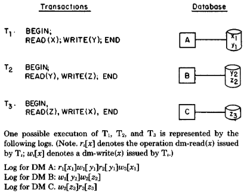

> **그림 4:** 실행을 로그로 모델링하기

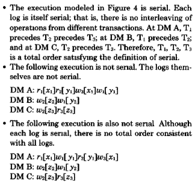

> **그림 5:** 직렬 및 비직렬 로그

저장된 데이터베이스에 액세스하는 유일한 작업은 **dm-read**와 **dm-write**입니다.
따라서 **DDBMS**의 다양한 **DM**에서 **dm-read**와 **dm-write**가 실행되는 모습으로 트랜잭션의 실행을 모델링하는 것으로 충분합니다.

이러한 취지에서 우리는 각 **DM**에서 **dm-read**와 **dm-write**가 처리되는 순서를 나타내는 **로그 집합(set of logs)** 으로
트랜잭션의 실행을 공식적으로 모델링합니다(그림 4 참조).
만약 트랜잭션들 사이에 **전순서(total order)** 가 존재하여, 그 순서상에서 $T_i$가 $T_j$보다 앞선다면,
두 트랜잭션이 모두 나타나는 모든 로그에서 $T_i$의 모든 작업이 $T_j$의 모든 작업보다 앞설 때 그 실행은 **직렬적(serial)** 입니다(그림 5 참조).

직관적으로, 이는 트랜잭션들이 모든 **DM**에서 직렬적으로, 그리고 **동일한 순서**로 실행됨을 의미합니다.

두 작업이 동일한 데이터 항목에 대해 수행되고 그 중 하나가 **dm-write**인 경우, 두 작업은 **충돌(conflict)** 한다고 합니다.
작업이 실행되는 순서는 오직 작업들이 **충돌**할 때만 **계산적으로 의미(computationally significant)** 가 있습니다.

충돌의 개념을 설명하기 위해 데이터 항목 $x$와 트랜잭션 $T_i$, $T_j$를 예로 들어보겠습니다.
만약 $T_i$가 **dm-read(x)** 를 발행하고 $T_j$가 **dm-write(x)** 를 발행한다면, $T_i$가 읽는 값은 일반적으로 **dm-read**가 **dm-write**보다 먼저 수행되는지
아니면 나중에 수행되는지에 따라 달라집니다.
마찬가지로, 두 트랜잭션이 모두 **dm-write(x)** 작업을 발행한다면, $x$의 최종 값은 어떤 dm-write가 마지막에 발생하는지에 따라 달라집니다.

이러한 충돌 상황을 각각 **읽기-쓰기(read-write, rw) 충돌**과 **쓰기-쓰기(write-write, ww) 충돌**이라고 부릅니다.

**충돌(Conflict)** 의 개념은 **실행의 동등성(equivalence of executions)** 을 특징짓는 데 도움이 됩니다.
두 실행(*PAPA77, PAPA79*)은

1. 각 **dm-read** 작업이 두 실행 모두에서 동일한 **dm-write**들에 의해 생성된 **데이터 항목 값(data item values)** 들을 읽고
2. 그리고 각 **데이터 항목(data item)** 에 대한 최종 **dm-write**가 두 실행 모두에서 동일하다면 **계산적으로 동등(computationally equivalent)** 합니다.

조건 (1)은 각 **트랜잭션(transaction)** 이 두 실행 모두에서 동일한 입력을 읽는 것을 보장하며 (따라서 동일한 **계산(computation)** 을 수행하게 함)
(2)와 결합되어, 그것은 두 실행이 **데이터베이스(database)** 를 동일한 **최종 상태(final state)** 로 남겨두는 것을 보장합니다.

이것으로부터 우리는 **직렬화 가능한 실행(serializable executions)** 을 정확하게 특성화할 수 있습니다.

**정리 1 (Theorem 1) (*PAPA77, PAPA79, STEA76*)**

$T = {T_1, \dots, T_n}$을 **트랜잭션(transactions)** 들의 집합이라 하고 $E$를 로그 ${L_1, \dots, L_m}$에 의해
모델링된 이 트랜잭션들의 **실행(execution)** 이라고 합시다.
만약 **서로 다른 트랜잭션(transactions)** $T_i$와 $T_j$로부터의 각 **충돌하는 작업(conflicting operations)** 쌍 $O_i$와 $O_j$에 대해,
$T_i$가 **전순서(total ordering)** 에서 $T_j$보다 앞서는 경우에만 임의의 로그 $L_1, \dots, L_m$에서 $O_i$가 $O_j$보다 앞선다면,
$E$는 **직렬화 가능(serializable)** 합니다.
**정리 1(Theorem 1)** 에서 가정한 **전순서(total order)** 는 **직렬화 순서(serialization order)** 라고 불립니다.
만약 트랜잭션들이 **직렬화 순서(serialization order)** 대로 **직렬적(serially)** 으로 실행되었다면,
트랜잭션들에 의해 수행된 **계산(computation)** 은 $E$에 의해 표현된 계산과 동일했을 것입니다.

**직렬화 가능성(serializability)** 을 달성하기 위해, **DDBMS**는 모든 실행이 **정리 1(Theorem 1)** 의 조건을 만족하도록 보장해야 하며,
구체적으로는 **충돌하는(conflicting) dm-read**와 **dm-write**가 특정한 상대적 순서로 처리되어야 합니다.
**동시성 제어(Concurrency control)** 는 **충돌하는 작업(conflicting operations)** 의 상대적 순서를 제어하는 활동입니다

- 그러한 제어를 수행하는 알고리즘은 **동기화 기법(synchronization technique)** 이라고 불립니다.

정확하기 위해서, **DDBMS**는 **정리 1(Theorem 1)** 의 조건을 보장하는 **동기화 기법(synchronization techniques)** 을 포함해야 합니다.

#### 2.2. 동시성 제어 패러다임 (A Paradigm for Concurrency Control)

**정리 1(Theorem 1)** 에서, **rw**와 **ww 충돌(conflicts)** 은 **충돌(conflict)** 이라는 일반적인 개념 아래 함께 다루어집니다.
그러나 우리는 이 두 가지 유형의 충돌을 구별함으로써 **직렬화 가능성(serializability)** 의 개념을 분해할 수 있습니다.
$E$를 **로그 집합(set of logs)** 에 의해 모델링된 실행이라고 합시다.
우리는 다양한 아래첨자가 있는 $\to$로 표시되는 $E$ 내 **트랜잭션(transactions)** 들에 대한 몇 가지 **이항 관계(binary relations)** 를 정의합니다.
**각 트랜잭션(transactions)** 쌍 $T_i$와 $T_j$에 대해,

1. $T_i \to_{rw} T_j$: 만약 $E$의 어떤 로그에서 $T_i$가 나중에 $T_j$가 쓰는 어떤 **데이터 항목(data item)** 을 읽는 경우
2. $T_i \to_{wr} T_j$: 만약 $E$의 어떤 로그에서 $T_i$가 나중에 $T_j$가 읽는 어떤 **데이터 항목(data item)** 에 쓰는 경우
3. $T_i \to_{ww} T_j$: 만약 $E$의 어떤 로그에서 $T_i$가 나중에 $T_j$가 쓰는 어떤 **데이터 항목(data item)** 에 쓰는 경우
4. $T_i \to_{rwr} T_j$: 만약 $T_i \to_{rw} T_j$ 또는 $T_i \to_{wr} T_j$인 경우
5. $T_i \to T_j$: 만약 $T_i \to_{rwr} T_j$ 또는 $T_i \to_{ww} T_j$인 경우

직관적으로, $\to$ (어떤 아래첨자든 포함하여)는 **"어떠한 직렬화에서도 반드시 선행해야 함(in any serialization must precede)"**을 의미합니다.
예를 들어, $T_i \to_{rw} T_j$는 **"어떠한 직렬화에서도 $T_i$는 반드시 $T_j$보다 앞서야 함"** 을 의미합니다.
이러한 해석은 **정리 1(Theorem 1)** 로부터 비롯됩니다.

- 만약 $T_i$가 $T_j$가 $x$에 쓰기 전에 $x$를 읽는다면, **정리 1(Theorem 1)** 에서의 가상적인 **직렬화(serialization)** 는 반드시 $T_j$보다 앞서는 $T_i$를
  가져야 합니다.

$E$에서의 작업들 간의 모든 **충돌(conflict)** 은 $\to$ 관계로 표현됩니다.
따라서 우리는 **정리 1(Theorem 1)** 을 $\to$의 관점에서 다시 기술할 수 있습니다.
**정리 1(Theorem 1)** 에 따르면, 만약 $\to$와 일치하는 **트랜잭션(transactions)** 들의 **전순서(total order)** 가 존재한다면
$E$는 **직렬화 가능(serializable)** 합니다.
이 후자의 조건은 $\to$가 **비순환적(acyclic)** 인 경우에만 성립합니다.
($\to$ 관계가 **비순환적(acyclic)** 이라는 것은
$T_1 = T_n$이 되는 $T_1 \to T_2, T_2 \to T_3, \dots, T_{n-1} \to T_n$과 같은 시퀀스가 존재하지 않음을 의미합니다.)
$\to$를 그것의 구성 요소인 $\to_{rwr}$ 및 $\to_{ww}$로 분해하고, 그것들을 사용하여 정리를 다시 기술해 봅시다.

**정리 2 (Theorem 2) (*BERN80a*)**

$\to_{rwr}$ 및 $\to_{ww}$가 실행 $E$와 연관되어 있다고 합시다.
$E$는 (a) $\to_{rwr}$ 및 $\to_{ww}$가 **비순환적(acyclic)** 이고, 그리고 (b) 모든 $\to_{rwr}$ 및
모든 $\to_{ww}$ 관계와 일치하는 **트랜잭션(transactions)** 들의 **전순서(total ordering)** 가 존재한다면 **직렬화 가능(serializable)** 합니다.

**정리 2(Theorem 2)** 는 **정리 1(Theorem 1)** 의 직접적인 결과입니다.
(실제로, **정리 2(Theorem 2)** 의 $(b)$ 부분은 본질적으로 이전 정리의 재진술입니다.)
그러나 **직렬화 가능성(serializability)** 을 특성화하는 이 방식은 문제를 더 단순한 부분들로 분해하는 방법을 시사합니다.
**정리 2(Theorem 2)** 는 두 가지 유형의 충돌과 일치하는 **트랜잭션(transactions)** 들의 **전순서(total ordering)** 가 존재해야 한다는 점을 제외하고는,
**rw** 및 **ww 충돌(conflicts)** 이 독립적으로 **동기화(synchronized)** 될 수 있음을 의미합니다.
이는 우리가 **비순환적(acyclic)** $\to_{rwr}$ 관계를 보장하기 위해 한 가지 기술(**읽기-쓰기 동기화(read-write synchronization)** 에 해당)을 사용하고,
**비순환적(acyclic)** $\to_{ww}$ 관계를 보장하기 위해 다른 기술(**쓰기-쓰기 동기화(write-write synchronization)**)을 사용할 수 있음을 시사합니다.
그러나, $\to_{rwr}$ 및 $\to_{ww}$가 모두 **비순환적(acyclic)** 인 것 외에도,
모든 $\to$ 관계와 일치하는 **하나의 직렬 순서(one serial order)** 가 또한 존재해야만 합니다.

이 **직렬 순서(serial order)** 는 **rw** 및 **ww 동기화 기법(synchronization techniques)** 을 하나로 묶는 시멘트입니다.

**직렬화 가능성(serializability)** 을 **rw** 및 **ww 동기화(synchronization)** 로 분해하는 것은
우리의 **동시성 제어(concurrency control)** 를 위한 패러다임의 초석입니다.
앞으로 **rw** 또는 **ww 동기화(synchronization)** 중 하나를 달성하는 알고리즘과
전체 **분산 동시성 제어(distributed concurrency control)** 문제를 해결하는 알고리즘을 구별하는 것이 중요할 것입니다.
우리는 전자 유형의 알고리즘에 대해서는 **동기화 기법(synchronization technique)** 이라는 용어를 사용하고,
후자에 대해서는 **동시성 제어 방법(concurrency control method)** 이라는 용어를 사용합니다.

### 3. 2단계 잠금에 기반한 동기화 기법 (SYNCHRONIZATION TECHNIQUES BASED ON TWO-PHASE LOCKING)

**2단계 잠금(Two-Phase Locking, 2PL)** 은 **병행 작업(concurrent operations)** 간의 **충돌(conflicts)** 을 명시적으로 탐지하고 방지함으로써
**읽기(reads)** 와 **쓰기(writes)** 를 **동기화(synchronizes)** 합니다.
데이터 항목 $x$를 읽기 전에, **트랜잭션(transaction)** 은 $x$에 대한 **읽기 잠금(readlock)** 을 "소유(own)"해야 합니다.
$x$에 쓰기 전에, 그것은 $x$에 대한 **쓰기 잠금(writelock)** 을 "소유(own)"해야 합니다.

**잠금(locks)** 의 소유권은 두 가지 규칙에 의해 제어됩니다.

1. 서로 다른 **트랜잭션(transactions)** 들은 **충돌하는 잠금(conflicting locks)** 을 동시에 소유할 수 없으며
2. 일단 **트랜잭션(transaction)** 이 **잠금(lock)** 의 소유권을 포기하면, 그것은 결코 추가적인 **잠금(locks)** 을 획득할 수 없습니다.

**충돌하는 잠금(conflicting lock)** 의 정의는 수행되는 **동기화(synchronization)** 유형에 따라 달라집니다

- **rw 동기화(rw synchronization)** 의 경우,
    - 두 **잠금(locks)** 이 동일한 **데이터 항목(data item)** 에 대한 것이고,
    - 그리고 하나는 **읽기 잠금(readlock)** 이며 다른 하나는 **쓰기 잠금(writelock)** 일 때 두 잠금은 **충돌(conflict)** 합니다
- **ww 동기화(ww synchronization)** 의 경우,
    - 두 잠금이 동일한 데이터 항목에 대한 것이고,
    - 그리고 둘 다 **쓰기 잠금(writelock)** 일 때 두 잠금은 **충돌(conflict)** 합니다.

두 번째 **잠금 소유 규칙(lock ownership rule)** 은 모든 **트랜잭션(transaction)** 이 **2단계(two-phase)** 방식으로 잠금을 획득하게 합니다.
**확장 단계(growing phase)** 동안 **트랜잭션(transaction)** 은 어떤 잠금도 해제하지 않고 잠금을 획득합니다.
**잠금(lock)** 을 해제함으로써 트랜잭션은 **수축 단계(shrinking phase)** 로 진입합니다.

이 단계 동안 **트랜잭션(transaction)** 은 잠금을 해제하며, **규칙 2(rule 2)** 에 의해 추가적인 잠금을 획득하는 것이 금지됩니다.
**트랜잭션(transaction)** 이 종료(또는 **중단(abort)**)될 때, 남아 있는 모든 잠금은 자동으로 해제됩니다.

흔한 변형 중 하나는 **트랜잭션(transactions)** 이 주요 실행을 시작하기 전에 모든 **잠금(locks)** 을 획득하도록 요구하는 것입니다.
이 변형은 **사전 선언(predeclaration)** 이라고 불립니다.
일부 시스템은 또한 **트랜잭션(transactions)** 이 종료될 때까지 모든 **잠금(locks)** 을 유지하도록 요구합니다.

**2단계 잠금(Two-phase locking, 2PL)** 은 올바른 **동기화 기법(synchronization technique)** 이며,
이는 **2PL**이 **rw (ww) 동기화**에 사용될 때 **비순환적(acyclic)** $\to_{rwr}$ ($\to_{ww}$) 관계를 달성함을 의미합니다(*BERs79b, EswA76, PAPA79*).
**2PL**에 의해 달성되는 **직렬화 순서(serialization order)** 는 **트랜잭션(transactions)** 이 **잠금(locks)**을 획득하는 순서에 의해 결정됩니다.

**트랜잭션(transaction)** 이 소유하게 될 모든 **잠금(locks)** 을 소유하게 되는 **확장 단계(growing phase)** 의 끝 시점을
그 트랜잭션의 **잠금 지점(locked point)** 이라고 부릅니다(*BERN79b*).
$E$를 **rw (ww) 동기화**를 위해 **2PL**이 사용된 실행이라고 합시다.
$E$에 의해 유도된 $\to_{rwr}$ ($\to_{ww}$) 관계는 모든 **트랜잭션(transaction)** 이
자신의 **잠금 지점(locked point)** 에서 실행되는 **직렬 실행(serial execution)** $E'$에 의해 유도된 관계와 동일합니다.
따라서 $E$의 **잠금 지점(locked points)** 들은 $E$에 대한 **직렬화 순서(serialization order)** 를 결정합니다.

#### 3.1. 기본 2PL 구현 (Basic 2PL Implementation)

**2PL**의 구현은 **2PL 사양(specification)** 에 따라 **잠금 요청(lock requests)** 과 **잠금 해제(lock releases)** 를 수신하고
처리하는 소프트웨어 모듈인 **2PL 스케줄러(2PL scheduler)** 를 구축하는 것과 같습니다.

**분산 데이터베이스(distributed database)** 에서 **2PL**을 구현하는 기본적인 방법은 데이터베이스와 함께 **스케줄러(schedulers)** 를 분산하여,
데이터 항목 $x$에 대한 **스케줄러(scheduler)** 를 $x$가 저장된 **DM**에 배치하는 것입니다.
이 구현에서 **읽기 잠금(readlocks)** 은 **dm-reads**에 의해 암시적으로 요청될 수 있으며,
**쓰기 잠금(writelocks)** 은 **prewrites**에 의해 암시적으로 요청될 수 있습니다.
만약 요청된 **잠금(lock)** 이 허용될 수 없는 경우, 해당 작업은 원하는 데이터 항목에 대한 **대기 큐(waiting queue)** 에 배치됩니다.
(이것은 섹션 3.5에서 논의된 것처럼 **교착 상태(deadlock)** 를 유발할 수 있습니다.)
**쓰기 잠금(Writelocks)** 은 **dm-writes**에 의해 암시적으로 해제됩니다.
그러나 **읽기 잠금(readlocks)** 을 해제하려면 특별한 **잠금 해제 작업(lock-release operations)** 이 필요합니다.
**dm-writes**가 **수축 단계(shrinking phase)** 의 시작을 알리기 때문에, 이러한 **잠금 해제(lock releases)** 는 **dm-writes**와 병렬로 전송될 수 있습니다.
**잠금(lock)** 이 해제되면, 해당 데이터 항목의 **대기 큐(waiting queue)** 에 있는 작업들은 **선입선출(first-in/first-out, FIFO)** 순서로 처리됩니다.

이 구현은 **중복 데이터(redundant data)** 를 "자동으로" 올바르게 처리한다는 점에 유의하십시오.
**논리적 데이터 항목(logical data item)** $X$가 복사본 $x_1, \dots, x_m$을 가지고 있다고 가정해 봅시다.
만약 **기본 2PL(basic 2PL)** 이 **rw 동기화(rw synchronization)** 를 위해 사용된다면,
**트랜잭션(transaction)** 은 임의의 복사본을 읽을 수 있으며 실제로 읽는 $X$의 복사본에 대해서만 **읽기 잠금(readlock)** 을 획득하면 됩니다.
그러나 **트랜잭션(transaction)** 이 $X$를 업데이트한다면, $X$의 모든 복사본을 업데이트해야 하므로
(**기본 2PL**이 **rw** 또는 **ww 동기화** 중 무엇을 위해 사용되든 상관없이) $X$의 모든 복사본에 대해 **쓰기 잠금(writelocks)** 을 획득해야 합니다.

#### 3.2 주 사본 2PL (Primary Copy 2PL)

**주 사본 2PL(Primary copy 2PL)** 은 **데이터 중복성(data redundancy)** 에 주의를 기울이는 **2PL 기법**입니다(*STos79*).
각 **논리적 데이터 항목(logical data item)** 의 복사본 중 하나가 **주 사본(primary copy)** 으로 지정됩니다.

- **논리적 데이터 항목**의 임의의 복사본에 액세스하기 전에, **주 사본**에 대해 적절한 **잠금(lock)** 을 획득해야 합니다.

**읽기 잠금(readlocks)** 의 경우, 이 기법은 **기본 2PL(basic 2PL)** 보다 더 많은 통신을 요구합니다.
$x_1$이 **논리적 데이터 항목** $X$의 **주 사본(primary copy)** 이고,
**트랜잭션(transaction)** $T$가 $X$의 다른 복사본인 $x_i$를 읽고자 한다고 가정해 봅시다.
$x_i$를 읽기 위해, $T$는 두 개의 **DM**($T$가 $x_1$을 잠글 수 있도록 $x_1$이 저장된 **DM**과 $x_i$가 저장된 **DM**)과 통신해야 합니다.
대조적으로, **기본 2PL(basic 2PL)** 하에서 $T$는 오직 $x_i$의 **DM**하고만 통신할 것입니다.

그러나 **쓰기 잠금(writelocks)** 의 경우, **주 사본 2PL(primary copy 2PL)** 은 추가적인 통신을 발생시키지 않습니다.
$T$가 $X$를 업데이트하고자 한다고 가정해 봅시다.
**기본 2PL(basic 2PL)** 하에서 $T$는 $X$의 모든 복사본에 **프리라이트(prewrites)** 를 발행하고(그에 따라 이 데이터 항목들에 대한 **쓰기 잠금**을 요청함),
그 후 모든 복사본에 **dm-writes**를 발행할 것입니다.
**주 사본 2PL(primary copy 2PL)** 하에서도 동일한 작업들이 요구되지만, 오직 $prewrite(x_1)$만이 **쓰기 잠금(writelock)** 을 요청할 것입니다.
즉, **프리라이트(prewrites)** 는 $x_1, \dots, x_m$에 대해 전송되지만,
$x_2, \dots, x_m$에 대한 **프리라이트**는 암시적으로 **쓰기 잠금(writelocks)** 을 요청하지 않습니다.

#### 3.3 투표 2PL (Voting 2PL)

**투표 2PL(Voting 2PL)** (또는 **다수결 합의 2PL(majority consensus 2PL)**)은
**데이터 중복성(data redundancy)** 을 활용하는 또 다른 **2PL** 구현 방식입니다.
**투표 2PL(Voting 2PL)** 은 Thomas(*THOM79*)의 **다수결 합의 기법(majority consensus technique)** 에서 파생되었으며
오직 **ww 동기화(ww synchronization)** 에만 적합합니다.

투표를 이해하기 위해, 우리는 이를 **2단계 커밋(two-phase commit)** 의 문맥에서 검토해야 합니다.
**트랜잭션(transaction)** $T$가 $X$에 쓰기를 원한다고 가정해 봅시다.
그것의 **TM**은 $X$의 복사본을 보유한 각 **DM**에 **프리라이트(prewrites)** 를 보냅니다.
**투표 프로토콜(voting protocol)** 의 경우, **DM**은 항상 즉시 응답합니다.
그것은 **프리라이트(prewrite)** 의 수신을 확인하고 **"잠금 설정(lock set)"** 또는 **"잠금 차단(lock blocked)"** 이라고 말합니다.
(**기본 구현(basic implementation)** 에서는 잠금이 설정될 때까지 전혀 응답하지 않을 것입니다.)

**TM**이 **DM**들로부터 확인 응답을 받은 후, **"잠금 설정(lock set)"** 응답의 수를 세는데 만약 그 수가 **과반수(majority)**를 구성한다면,
**TM**은 모든 잠금이 설정된 것처럼 행동합니다.
그렇지 않으면, 원래 **"잠금 차단(lock blocked)"** 이라고 말했던 **DM**들로부터의 **"잠금 설정(lock set)"** 작업을 기다립니다.
**교착 상태(Deadlocks)** 를 제외하면(섹션 3.5 참조), 결국 진행하기에 충분한 **"잠금 설정(lock set)"** 작업을 받게 될 것입니다.

한 번에 단 하나의 트랜잭션만이 $X$에 대한 잠금의 **과반수(majority)** 를 보유할 수 있으므로,
어떤 시점에도 $X$에 쓰는 단 하나의 트랜잭션만이 그것의 **두 번째 커밋 단계(second commit phase)** 에 있을 수 있습니다.
그 결과 $X$의 모든 복사본은 그것들에 적용된 동일한 **쓰기 순서(sequence of writes)** 를 갖게 됩니다.
**트랜잭션(transaction)** 의 **잠금 지점(locked point)** 은
그것의 **쓰기 집합(writeset)** 에 있는 각 데이터 항목에 대해 **쓰기 잠금(writelocks)** 의 과반수를 획득했을 때 발생합니다.
많은 데이터 항목을 업데이트할 때, **트랜잭션(transaction)** 은 임의의 **dm-writes**를 발행하기 전에 모든 데이터 항목에 대해 잠금의 **과반수(majority)** 를 획득해야 합니다.

원칙적으로, **투표 2PL(voting 2PL)** 은 **rw 동기화(rw synchronization)** 를 위해 조정될 수 있습니다.
$X$의 임의의 복사본을 읽기 전에 **트랜잭션(transaction)** 은 $X$의 모든 복사본에 대해 **읽기 잠금(readlocks)** 을 요청합니다

- 잠금의 **과반수(majority)** 가 설정되면, 트랜잭션은 임의의 복사본을 읽을 수 있습니다.

이 기법은 작동하지만 지나치게 강력합니다

- **정확성(Correctness)** 은 오직 $X$의 단일 복사본(즉, 읽히는 복사본) 만이 잠길 것을 요구하지만, 이 기법은 모든 복사본에 대해 잠금을 요청하기 때문입니다.

이러한 이유로 우리는 **투표 2PL(voting 2PL)** 이 **rw 동기화(rw synchronization)** 에는 부적절하다고 간주합니다.

#### 3.4. 중앙 집중식 2PL (Centralized 2PL)

**2PL 스케줄러(2PL schedulers)** 를 분산하는 대신, 스케줄러를 **단일 사이트(single site)** 에 집중화할 수 있습니다(*ALsB76a, GARC79a*).
어떤 사이트에서든 데이터에 액세스하기 전에, **중앙 2PL 스케줄러(central 2PL scheduler)** 로부터 적절한 **잠금(locks)** 을 획득해야 합니다.

예를 들어, $x$가 중앙 사이트에 저장되어 있지 않은 상황에서 **dm-read(x)** 를 수행하려면, **TM**은 먼저 중앙 사이트에 $x$에 대한 **읽기 잠금(readlock)** 을 요청하고,
중앙 사이트가 잠금이 설정되었음을 알릴 때까지 기다린 다음, $x$를 보유한 **DM**에게 **dm-read(x)** 를 보내야 합니다.
(통신을 일부 절약하기 위해, **TM**이 **잠금 요청(lock request)** 과 **dm-read(x)** 를 모두 중앙 사이트에 보내고
중앙 사이트가 **dm-read(x)** 를 $x$의 DM으로 직접 **전달(forward)** 하도록 할 수 있습니다.
그런 다음 **DM**은 **dm-read(x)** 가 처리되었을 때 **TM**에 응답합니다.)

**주 사본 2PL(primary copy 2PL)** 과 마찬가지로, 이 접근 방식은 **dm-reads**와 **프리라이트(prewrites)** 가
보통 **암시적으로(implicitly)** 잠금을 요청할 수 없기 때문에 **기본 2PL(basic 2PL)** 보다 더 많은 **통신(communication)** 을 요구하는 경향이 있습니다.

#### 3.5 교착 상태 탐지 및 방지 (Deadlock Detection and Prevention)

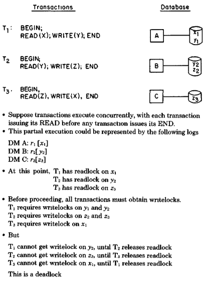

> **그림 6:** 교착 상태

앞서 언급된 **2PL** 구현들은 **트랜잭션(transactions)** 이 사용할 수 없는 **잠금(locks)** 을 기다리도록 강제합니다.
만약 이러한 기다림이 통제되지 않는다면, **교착 상태(deadlocks)** 가 발생할 수 있습니다(그림 6 참조).

**교착 상태(Deadlock)** 상황은 어떤 **트랜잭션(transactions)** 이 다른 어떤 **트랜잭션(transactions)** 을 기다리고 있는지를
나타내는 **유향 그래프(directed graphs)** 인 대기 그래프(waits-for graphs)(*HOLT72, KING74*)에 의해 특징지어질 수 있습니다.
그래프의 **노드(Nodes)** 는 **트랜잭션(transactions)** 을 나타내고, **에지(edges)** 는 **"대기(waiting-for)"** 관계를 나타냅니다.
만약 $T_i$가 현재 $T_j$에 의해 소유된 **잠금(lock)** 을 기다리고 있다면, **트랜잭션(transaction)** $T_i$에서 $T_j$로 **에지(edge)** 가 그려집니다.

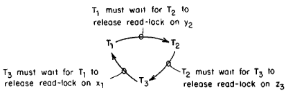

> **그림 7:** 그림 6의 대기 그래프

**대기 그래프(waits-for graph)** 가 **사이클(cycle)** 을 포함하고 있을 때에만 시스템에 **교착 상태(deadlock)** 가 존재합니다(그림 7 참조).

**교착 상태 해결(deadlock resolution)** 을 위해 두 가지 일반적인 기법인
**교착 상태 방지(deadlock prevention)** 와 **교착 상태 탐지(deadlock detection)** 를 사용할 수 있습니다.

**3.5.1 교착 상태 방지 (Deadlock Prevention)**

**교착 상태 방지(Deadlock prevention)** 는 시스템이 **교착 상태(deadlock)** 가 발생할 수도 있다고 "우려"될 때
**트랜잭션(transaction)** 을 **재시작(restarted)** 하는 "신중한(cautious)" 방식입니다.
**교착 상태 방지(deadlock prevention)** 를 구현하기 위해, **2PL 스케줄러(2PL schedulers)** 는 다음과 같이 수정됩니다.
**잠금 요청(lock request)** 이 거부되면, **스케줄러(scheduler)** 는
요청하는 **트랜잭션(transaction)**($T_i$라 함)과 현재 **잠금(lock)** 을 소유하고 있는 **트랜잭션(transaction)**($T_j$라 함)을 테스트합니다.

만약 $T_i$와 $T_j$가 테스트를 통과하면, $T_i$는 평소와 같이 $T_j$를 기다리는 것이 허용됩니다.
그렇지 않으면, 둘 중 하나는 **중단(aborted)** 됩니다.
만약 $T_i$가 **재시작(restarted)** 된다면, 그 **교착 상태 방지 알고리즘(deadlock prevention algorithm)** 은 **비선점형(nonpreemptive)** 이라고 불립니다.
만약 $T_j$가 **재시작(restarted)** 된다면, 그 알고리즘은 **선점형(preemptive)** 이라고 불립니다.

**스케줄러(scheduler)** 에 의해 적용되는 테스트는 만약 $T_i$가 $T_j$를 기다린다면 **교착 상태(deadlock)** 가 결과적으로 발생할 수 없음을 보장해야 합니다.
한 가지 간단한 접근 방식은 $T_i$가 $T_j$를 결코 기다리게 하지 않는 것입니다.
이것은 단순하게 **교착 상태(deadlock)** 를 방지하지만 많은 **재시작(restarts)** 을 강제합니다.

더 나은 접근 방식은 **트랜잭션(transactions)** 들에 **우선순위(priorities)** 를 할당하고,
$T_i$가 $T_j$를 기다릴 수 있는지 결정하기 위해 **우선순위(priorities)** 를 테스트하는 것입니다.
예를 들어, 만약 $T_i$가 $T_j$보다 낮은 **우선순위(priority)** 를 갖는다면 $T_i$가 $T_j$를 기다리도록 허용할 수 있습니다
(만약 $T_i$와 $T_j$가 동일한 **우선순위(priorities)** 를 가진다면, $T_i$는 $T_j$를 기다릴 수 없으며 그 반대의 경우도 마찬가지입니다).

이 테스트는 **대기 그래프(waits-for graph)** 의 모든 **에지(edge)** $(T_i, T_j)$에 대해
$T_i$가 $T_j$보다 낮은 **우선순위(priority)** 를 갖기 때문에 **교착 상태(deadlock)** 를 방지합니다.
**사이클(cycle)** 은 한 노드에서 자기 자신으로 가는 경로이고 $T_i$는 자기 자신보다 낮은 **우선순위(priority)** 를 가질 수 없으므로,
어떠한 **사이클(cycle)** 도 존재할 수 없습니다.

이전 접근 방식의 한 가지 문제는 **순환적 재시작(cyclic restart)** 이 가능하다는 것입니다.
어떤 불운한 **트랜잭션(transaction)** 은 결코 끝나지 못한 채 계속해서 **재시작(restarted)** 될 수 있습니다.
이 문제를 피하기 위해, Rosenkrantz 등 (*RosE78*)은 **우선순위(priorities)** 로 **"타임스탬프(timestamps)"** 를 사용할 것을 제안합니다.
직관적으로, **트랜잭션(transaction)** 의 **타임스탬프(timestamp)** 는 그것이 실행을 시작한 시간이며,
따라서 오래된 트랜잭션이 젊은 트랜잭션보다 높은 **우선순위(priority)** 를 갖습니다.

(*RosE78*)의 기법은 각 **트랜잭션(transaction)** 이 그것의 **TM**에 의해 유일한 **타임스탬프(timestamp)** 를 할당받을 것을 요구합니다.
**트랜잭션(transaction)** 이 시작될 때, **TM**은 로컬 클럭 시간을 읽고
**하위 비트(low-order bits)** 에 유일한 **TM 식별자(TM identifier)** 를 덧붙입니다(*THOM79*).
결과적으로 생성된 숫자가 원하는 **타임스탬프(timestamp)** 입니다.
**TM**은 또한 다음 클럭 틱까지 다른 **타임스탬프(timestamp)** 를 할당하지 않기로 동의합니다.

따라서 서로 다른 **TM**들에 의해 할당된 **타임스탬프(timestamps)** 는 (서로 다른 TM들이 서로 다른 식별자를 갖기 때문에) 그들의 **하위 비트(low-order bits)** 가 다르며,
반면 동일한 **TM**에 의해 할당된 **타임스탬프(timestamps)** 는 (해당 **TM**이 동일한 클럭 시간을 두 번 사용하지 않기 때문에)
그들의 **상위 비트(high-order bits)** 가 다릅니다.
그러므로 **타임스탬프(timestamps)** 는 시스템 전반에 걸쳐 유일합니다.
이 알고리즘은 서로 다른 사이트의 클럭들이 정밀하게 **동기화(synchronized)** 될 것을 요구하지 않는다는 점에 유의하십시오.

(*RosE78*)에서 두 가지 **타임스탬프 기반 교착 상태 방지(timestamp-based deadlock prevention)** 방식이 제안되었습니다.
**Wait-Die**는 **비선점형 기법(nonpreemptive technique)** 입니다.
**트랜잭션(transaction)** $T_i$가 $T_j$를 기다리려고 한다고 가정해 봅시다.
만약 $T_i$가 $T_j$보다 낮은 **우선순위(priority)** 를 갖는다면 (즉, $T_i$가 $T_j$보다 **나중(younger)** 에 시작되었다면), $T_i$는 기다리는 것이 허용됩니다.
그렇지 않으면, 그것은 **중단("사망", dies)** 되고 강제로 **재시작(restart)** 됩니다.
$T_i$가 **재시작(restart)** 될 때 새로운 **타임스탬프(timestamp)** 를 할당받지 않는 것이 중요합니다.

**Wound-Wait**는 **Wait-Die**에 대응하는 **선점형(preemptive)** 기법입니다.
만약 $T_i$가 $T_j$보다 높은 **우선순위(priority)** 를 갖는다면 $T_i$가 기다리고 그렇지 않으면 $T_j$가 **중단(aborted)** 됩니다.

**Wait-Die**와 **Wound-Wait** 모두 **순환적 재시작(cyclic restart)** 을 방지합니다.
그러나 **Wound-Wait**에서는 오래된 **트랜잭션(transaction)** 이 여러 번 **재시작(restarted)** 될 수 있는 반면,
**Wait-Die**에서 오래된 **트랜잭션(transactions)** 은 결코 **재시작(restart)** 되지 않습니다.
(*RosE78*)에서는 **Wound-Wait**가 전체적으로 더 적은 수의 **재시작(restarts)** 을 유도한다고 제안됩니다.

**2단계 커밋(two-phase commit)** 과 함께 **선점형 교착 상태 방지(preemptive deadlock prevention)** 를 사용할 때는 주의를 기울여야 합니다.

- **2단계 커밋(two-phase commit)** 의 두 번째 단계가 시작되면 **트랜잭션(transaction)** 은 절대 **중단(aborted)** 되어서는 안 됩니다.

만약 **선점형 기법(preemptive technique)** 이 $T_j$를 **중단(abort)** 하고자 한다면,
그것은 $T_j$의 **TM**과 확인하여 $T_j$가 두 번째 단계에 진입했을 경우 **중단(abort)** 을 취소합니다.
$T_j$가 두 번째 단계에 있다면 어떤 **트랜잭션(transactions)** 도 기다리고 있을 수 없으므로, 어떤 **교착 상태(deadlock)** 도 발생할 수 없습니다.

**자원 사전 순서화(Preordering of resources)** 는 **재시작(restarts)** 을 완전히 피하는 **교착 상태 회피 기법(deadlock avoidance technique)** 입니다.
이 기법은 **잠금의 사전 선언(predeclaration of locks)** 을 요구합니다 (각 **트랜잭션(transaction)** 은 실행 전에 모든 **잠금(locks)** 을 획득함).
**데이터 항목(Data items)** 들은 번호가 매겨지고 각 **트랜잭션(transaction)** 은 숫자 순서대로 한 번에 하나씩 **잠금(locks)** 을 요청합니다.

**트랜잭션(transaction)** 의 **우선순위(priority)** 는 그것이 소유한 가장 높은 번호의 잠금(lock) 번호입니다.
**트랜잭션(transaction)** 은 오직 더 높은 **우선순위(priority)** 를 가진 **트랜잭션(transactions)** 들만을 기다릴 수 있으므로,
**교착 상태(deadlocks)** 는 발생할 수 없습니다.
**사전 선언(predeclaration)** 을 요구하는 것 외에도, 이 기법의 주요 단점은 **잠금(locks)** 을 순차적으로 획득하도록 강제하여
**응답 시간(response time)** 을 증가시키는 경향이 있다는 것입니다.

**3.5.2 교착 상태 탐지 (Deadlock Detection)**

**교착 상태 탐지(Deadlock detection)** 에서, **트랜잭션(transactions)** 들은 통제되지 않은 방식으로 서로를 기다리며
실제로 **교착 상태(deadlock)** 가 발생할 때만 **중단(aborted)** 됩니다.
**교착 상태(Deadlocks)** 는 **대기 그래프(waits-for graph)** 를 명시적으로 구성하고 그것에서 **사이클(cycles)** 을 탐색함으로써 탐지됩니다.
(그래프에서의 **사이클(cycles)** 은 예를 들어 *AHO75*의 **알고리즘 5.2(Algorithm 5.2)** 를 사용하여 효율적으로 찾아질 수 있습니다.)

만약 **사이클(cycle)** 이 발견되면, **희생자(victim)** 라고 불리는 사이클 상의 한 **트랜잭션(transaction)** 이 **중단(aborted)** 되며,
그에 따라 **교착 상태(deadlock)** 를 해제합니다.
**희생자(victim)** 를 **재시작(restarting)** 하는 비용을 최소화하기 위해, **희생자 선택(victim selection)** 은
보통 사이클 상의 각 **트랜잭션(transaction)** 이 사용한 **자원의 양(amount of resources)** 에 근거합니다.

**분산 데이터베이스(distributed database)** 에서 **교착 상태 탐지(deadlock detection)** 를 구현하는 데 있어 주요한 어려움은 **대기 그래프(waits-for graph)**
를 효율적으로 구성하는 것입니다.
각 **2PL 스케줄러(2PL scheduler)** 는 해당 스케줄러에 국한된 **대기 관계(waits-for relationships)** 를 기반으로 **대기 그래프(waits-for graph)** 를 쉽게
구성할 수 있습니다.

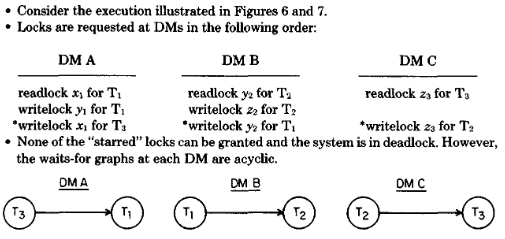

> **그림 8:** 다중 사이트 교착 상태

그러나 이러한 **로컬 대기 그래프(local waits-for graphs)** 는 분산 시스템의 모든 **교착 상태(deadlocks)** 를 특징짓기에 충분하지 않습니다 (그림 8 참조).
대신에, **로컬 대기 그래프(local waits-for graphs)** 들은 더 "전역적인(global)" **대기 그래프(waits-for graph)** 로 결합되어야 합니다.
(**중앙 집중식 2PL(Centralized 2PL)** 은 스케줄러가 하나만 존재하기 때문에 이 문제를 갖지 않습니다.)

우리는 **전역 대기 그래프(global waits-for graphs)** 를 구성하기 위한
두 가지 기법인 **중앙 집중식 및 계층적 교착 상태 탐지(centralized and hierarchical deadlock detection)** 를 설명합니다.
**중앙 집중식 접근 방식(centralized approach)** 에서는,
한 사이트가 분산 시스템을 위한 **교착 상태 탐지기(deadlock detector)** 로 지정됩니다(*GRAY78, STON79*).
주기적으로 (예: 몇 분마다) 각 **스케줄러(scheduler)** 는 자신의 **로컬 대기 그래프(local waits-for graph)** 를
**교착 상태 탐지기(deadlock detector)** 로 보냅니다.
**교착 상태 탐지기(deadlock detector)** 는 로컬 그래프들의 **합집합(union)** 을 구성함으로써
로컬 그래프들을 시스템 전체의 **대기 그래프(waits-for graph)** 로 결합합니다.

**중앙 집중식 및 계층적 교착 상태 탐지(centralized and hierarchical deadlock detection)** 는 세부 사항에서 다르지만,
둘 다 하나 이상의 **교착 상태 탐지기 사이트(deadlock detector sites)** 로 **로컬 대기 정보(local waits-for information)** 를 주기적으로 전송하는 것을 포함합니다.

이 과정의 **주기적 성격(periodic nature)** 은 두 가지 문제를 야기합니다.
첫째, **교착 상태(deadlock)** 가 탐지되지 않은 채 몇 분 동안 존재할 수 있으며, 이는 **응답 시간 저하(response-time degradation)** 를 유발합니다.
해결책인 **교착 상태 탐지기(deadlock detector)** 를 더 빈번하게 실행하는 것은 **교착 상태 탐지 비용(cost of deadlock detection)** 을 증가시킵니다.
둘째, **트랜잭션(transaction)** $T$가 동시성 제어(concurrency control) 이외의 이유(예: 사이트 다운)로 **재시작(restarted)** 될 수 있습니다.

$T$의 **재시작(restart)** 이 **교착 상태 탐지기(deadlock detector)** 에 전달될 때까지,
탐지기는 $T$를 포함하는 **대기 그래프(waits-for graph)** 에서 **사이클(cycle)** 을 발견할 수 있습니다.
그러한 **사이클(cycle)** 은 **팬텀 교착 상태(phantom deadlock)** 라고 불립니다.
**교착 상태 탐지기(deadlock detector)** 가 **팬텀 교착 상태(phantom deadlock)** 를 발견하면,
$T$ 이외의 다른 **트랜잭션(transaction)** 을 불필요하게 **재시작(restart)** 할 수 있습니다.
**투표 2PL(voting 2PL)** 에서의 **교착 상태(deadlocks)** 에 대해 불필요한 **재시작(restarts)** 을 피하기 위한 특별한 예방 조치도 필요합니다.

**교착 상태 탐지(deadlock detection)** 의 주요 비용은
**부분적으로 실행된 트랜잭션(partially executed transactions)** 들의 **재시작(restarting)** 입니다.
**사전 선언(Predeclaration)** 은 이 비용을 줄이는 데 사용될 수 있습니다.
**트랜잭션(transaction)** 이 실행되기 전에 **잠금(locks)** 을 획득함으로써,
시스템은 아직 실행되지 않은 **트랜잭션(transactions)** 들만 **재시작(restart)** 하게 될 것입니다.
따라서 **재시작(restart)** 에 의해 낭비되는 작업이 거의 없습니다.

### 4. 타임스탬프 순서에 기반한 동기화 기법 (SYNCHRONIZATION TECHNIQUES BASED ON TIMESTAMP ORDERING)

**타임스탬프 순서(Timestamp ordering, T/O)**는 **직렬화 순서(serialization order)** 가 **사전(a priori)** 에 선택되고
**트랜잭션 실행(transaction execution)** 이 이 순서를 따르도록 강제되는 기법입니다.
각 **트랜잭션(transaction)** 은 그것의 **TM**에 의해 유일한 **타임스탬프(timestamp)** 를 할당받습니다.
**TM**은 **트랜잭션(transaction)** 을 대신하여 발행된 모든 **dm-read**와 **dm-write**에 **타임스탬프(timestamp)** 를 부착하며,
**DM**들은 **충돌하는 작업(conflicting operations)** 들을 **타임스탬프 순서(timestamp order)** 대로 처리해야 합니다.
작업 $O$의 **타임스탬프(timestamp)**는 $ts(O)$로 표시됩니다.

**충돌하는 작업(conflicting operations)** 의 정의는 수행되는 **동기화(synchronization)** 유형에 따라 달라지며
**충돌하는 잠금(conflicting locks)** 과 유사합니다.
**읽기-쓰기 동기화(rw synchronization)** 의 경우, (a) 두 작업이 모두 동일한 **데이터 항목(data item)** 에 대해 작동하고,
(b) 하나는 **dm-read**이며 다른 하나는 **dm-write**일 때 두 작업은 **충돌(conflict)** 합니다.
**쓰기-쓰기 동기화(ww synchronization)** 의 경우, (a) 두 작업이 모두 동일한 **데이터 항목(data item)** 에 대해 작동하고,
(b) 둘 다 **dm-write**일 때 두 작업은 **충돌(conflict)** 합니다.

**T/O**가 **읽기-쓰기(rw) (쓰기-쓰기(ww)) 동기화(synchronization)** 에 사용될 때
**비순환적(acyclic)** $\to_{rwr}$ ($\to_{ww}$) 관계를 달성한다는 것은 증명하기 쉽습니다.
각 **DM**이 **충돌하는 작업(conflicting operations)** 을 **타임스탬프 순서(timestamp order)** 대로 처리하므로,
$\to_{rwr}$ ($\to_{ww}$) 관계의 각 **에지(edge)** 는 **타임스탬프 순서(timestamp order)** 에 있게 됩니다.
결과적으로, 그 관계의 모든 **경로(paths)** 는 **타임스탬프 순서(timestamp order)** 에 있으며,
모든 **트랜잭션(transactions)** 이 유일한 **타임스탬프(timestamps)** 를 가지므로 어떠한 **사이클(cycles)** 도 가능하지 않습니다.
또한, **타임스탬프 순서(timestamp order)** 는 유효한 **직렬화 순서(serialization order)** 입니다.

#### 4.1. 기본 T/O 구현 (Basic T/O Implementation)

**T/O**의 구현은 **dm-reads**와 **dm-writes**를 수신하고 **T/O 사양(T/O specification)**(*SHAP77a, SHAP77b*)에 따라
이러한 작업들을 출력하는 소프트웨어 모듈인 **T/O 스케줄러(T/O scheduler)** 를 구축하는 것과 같습니다.
실제로, **2단계 커밋(two-phase commit)** 이 제대로 작동하려면 **프리라이트(prewrites)** 또한
**T/O 스케줄러(T/O scheduler)** 를 통해 처리되어야 합니다.
**2PL**의 경우와 마찬가지로, **기본 T/O 구현(basic T/O implementation)** 은
데이터베이스와 함께 **스케줄러(schedulers)** 를 분산시킵니다(*BEBN80a*).

만약 **2단계 커밋(two-phase commit)** 을 무시한다면, **기본 T/O 스케줄러(basic T/O scheduler)** 는 매우 간단합니다.
각 **DM**에서, 그리고 **DM**에 저장된 각 **데이터 항목(data item)** $x$에 대해, **스케줄러(scheduler)** 는
처리된 모든 **dm-read(x)** 또는 **dm-write(x)** 중 가장 큰 **타임스탬프(timestamp)** 를 기록합니다.
이것들은 각각 $R-ts(x)$와 $W-ts(x)$로 표시됩니다.
**읽기-쓰기 동기화(rw synchronization)** 의 경우, **스케줄러(scheduler)** $S$는 다음과 같이 작동합니다.

**타임스탬프(timestamp)** $TS$를 가진 **dm-read(x)** 를 고려해 보십시오.
만약 $TS < W-ts(x)$이면, $S$는 **dm-read**를 거부하고 발행한 **트랜잭션(transaction)** 을 **중단(aborts)** 합니다.
그렇지 않으면 $S$는 **dm-read**를 출력하고 **$R-ts(x)$** 를 $max(R-ts(x), TS)$로 설정합니다.
**타임스탬프(timestamp)** $TS$를 가진 **dm-write(x)** 의 경우, $S$는 만약 $TS < R-ts(x)$이면 **dm-write**를 거부합니다.

- 그렇지 않으면 그것은 dm-write를 출력하고 $W-ts(x)$를 $max(W-ts(x), TS)$로 설정합니다.

**쓰기-쓰기 동기화(ww synchronization)** 의 경우, $S$는 만약 $TS < W-ts(x)$이면 **타임스탬프(timestamp)** $TS$를 가진 **dm-write(x)** 를 거부합니다;

- 그렇지 않으면 그것은 **dm-write**를 출력하고 **$W-ts(x)$**를 $TS$로 설정합니다.

**트랜잭션(transaction)** 이 **중단(aborted)** 되면, 그것은 **TM**에 의해 새롭고 더 큰 **타임스탬프(timestamp)** 를 할당받고 **재시작(restarted)** 됩니다.
**재시작(Restart)** 이슈들은 아래에서 더 자세히 논의됩니다.

**2단계 커밋(Two-phase commit)** 은 **프리라이트(prewrites)** 에 **타임스탬프(timestamping)** 를 찍고
**dm-writes** 대신 **프리라이트(prewrites)** 를 수락하거나 거부함으로써 통합됩니다.
일단 **스케줄러(scheduler)** 가 **프리라이트(prewrite)** 를 수락하면, 그것은 **dm-write**가 언제 도착하든 상관없이 해당 **dm-write**를 수락할 것을 보장해야 합니다.
**읽기-쓰기(rw)** (또는 **쓰기-쓰기(ww)**) **동기화(synchronization)** 의 경우,
일단 $S$가 **타임스탬프(timestamp)** $TS$를 가진 **prewrite(x)** 를 수락하면,
그것은 **dm-write(x)** 가 출력될 때까지 $TS$보다 큰 **타임스탬프(timestamp)** 를 가진 어떠한 **dm-read(x)** (또는 **dm-write(x)**)도 출력해서는 안 됩니다.
그 효과는 **2단계 커밋(two-phase commit)** 기간 동안 $x$에 **쓰기 잠금(writelock)** 을 설정하는 것과 유사합니다.

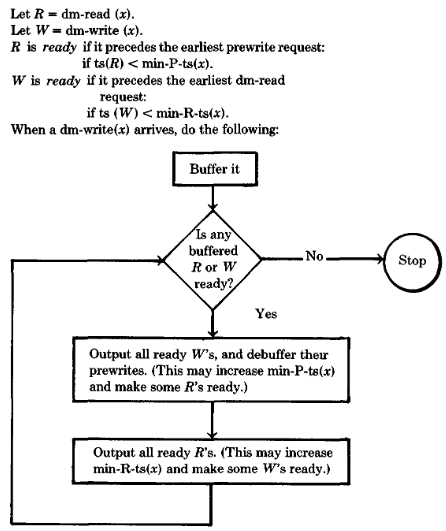

> **그림 9:** 기본 T/O 읽기-쓰기 동기화를 위한 버퍼 비우기

위의 규칙들을 구현하기 위해, $S$는 **dm-reads**, **dm-writes**, 그리고 **프리라이트(prewrites)** 를 **버퍼링(buffers)** 합니다.
$min-R-ts(x)$를 버퍼링된 임의의 **dm-read(x)** 의 최소 **타임스탬프(timestamp)** 라고 하고, $min-W-ts(x)$와 $min-P-ts(x)$를 유사하게 정의합니다.
**읽기-쓰기 동기화(Rw synchronization)** 는 다음과 같이 수행됩니다(그림 9):

1. $R$을 dm-read(x)라고 합시다.
    - 만약 $ts(R) < W-ts(x)$이면, $R$은 거부됩니다.
    - 그렇지 않고 만약 $ts(R) > min-P-ts(x)$이면, $R$은 **버퍼링(buffered)** 됩니다.
    - 그 외의 경우 $R$은 출력됩니다.

2. $P$를 **프리라이트(prewrite(x))** 라고 합시다.
    - 만약 $ts(P) < R-ts(x)$**이면, **$P$**는 거부됩니다.
    - 그렇지 않으면 $P$는 **버퍼링(buffered)** 됩니다.

3. $W$를 **dm-write(x)**라고 합시다.
    - $W$는 결코 거부되지 않습니다.
    - 만약 $ts(W) > min-R-ts(x)$이면, $W$는 **버퍼링(buffered)** 됩니다. (만약 $W$가 출력된다면 그것은 버퍼링된 **dm-read(x)** 가 거부되게 할 것입니다.)
    - 그 외의 경우 $W$는 출력됩니다.

4. $W$가 출력될 때, 대응하는 **프리라이트(prewrite)** 는 **디버퍼링(debuffered)** 됩니다.
    - 만약 이것이 $min-P-ts(x)$를 증가시킨다면, 버퍼링된 **din-reads**는 그 중 어떤 것이 출력될 수 있는지 확인하기 위해 **재테스트(retested)** 됩니다.
    - 만약 이것이 $min-R-ts(x)$를 증가시키게 된다면, 버퍼링된 **dm-writes** 또한 **재테스트(retested)** 되며, 이런 식으로 계속됩니다.

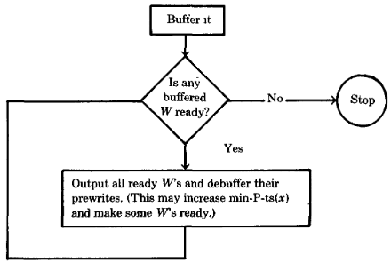

> **그림 10:** 기본 T/O 쓰기-쓰기 동기화를 위한 버퍼 비우기

**쓰기-쓰기 동기화(Ww synchronization)** 는 다음과 같이 수행됩니다(그림 10):

1. $P$를 **프리라이트(prewrite(x))** 라고 합시다.
    - 만약 $ts(P) < W-ts(x)$이면, $P$는 **거부(rejected)** 됩니다.
    - 그렇지 않으면 $P$는 **버퍼링(buffered)** 됩니다.

2. $W$를 **dm-write(x)** 라고 합시다.
    - $W$는 결코 **거부(rejected)** 되지 않습니다.
    - 만약 $ts(W) > min-P-ts(x)$이면, $W$는 **버퍼링(buffered)** 됩니다.
    - 그 외의 경우 $W$는 **출력(output)** 됩니다.

3. $W$가 **출력(output)** 될 때, 대응하는 **프리라이트(prewrite)** 는 **디버퍼링(debuffered)** 됩니다.
    - 만약 이것이 $min-P-ts(x)$*를 증가시키게 된다면, 버퍼링된 dm-writes는 그 중 어떤 것이 이제 **출력(output)** 될 수 있는지 확인하기 위해 **재테스트(retested)**
      됩니다.

**2PL**과 마찬가지로, 흔한 변형 중 하나는 **트랜잭션(transactions)** 이
그들의 **읽기 집합(readsets)** 과 **쓰기 집합(writesets)** 을 **사전 선언(predeclare)** 하여,
주요 실행을 시작하기 전에 모든 **dm-reads**와 **프리라이트(prewrites)** 를 발행하도록 요구하는 것입니다.
만약 모든 작업이 수락된다면, **트랜잭션(transaction)** 은 **재시작(restart)** 의 위험 없이 실행되는 것이 보장됩니다.

또 다른 변형은 더 작은 **타임스탬프(timestamps)** 를 가진 작업들을 기다리기 위해 작업 처리를 지연시키는 것입니다.
이 **휴리스틱(heuristic)** 의 극단적인 버전은 섹션 4.4에서 설명된 **보수적 T/O(conservative T/O)** 입니다.

#### 4.2. 토마스 쓰기 규칙 (The Thomas Write Rule)

**쓰기-쓰기 동기화(ww synchronization)** 의 경우, **기본 T/O 스케줄러(basic T/O scheduler)** 는 (*THOM79*)의 관찰을 사용하여 최적화될 수 있습니다.
$W$를 **dm-write(x)** 라고 하고, $ts(W) < W-ts(x)$라고 가정해 봅시다.
$W$를 거부하는 대신 우리는 간단히 그것을 무시할 수 있습니다.
우리는 이것을 **토마스 쓰기 규칙(Thomas Write Rule, TWR)** 이라고 부릅니다.

직관적으로, **TWR**은 오래된 정보를 데이터베이스에 저장하려고 시도하는 **dm-write**에 적용됩니다.
이 규칙은 $x$에 일련의 **dm-writes** 를 적용한 효과가 해당 **dm-writes**들이 **타임스탬프 순서(timestamp order)** 대로 적용되었을 때 발생했을 결과와 동일함을 보장합니다.

만약 **TWR**이 사용된다면, **쓰기-쓰기 동기화 알고리즘(ww synchronization algorithm)** 에 **2단계 커밋(two-phase commit)** 을 통합할 필요가 없습니다.
**ww 스케줄러(ww scheduler)** 는 항상 **프리라이트(prewrites)** 를 수락하고 **dm-writes**를 절대 **버퍼링(buffer)** 하지 않습니다.

#### 4.3 다중 버전 T/O (Multiversion T / O)

**읽기-쓰기 동기화(rw synchronization)** 를 위해 **기본 T/O 스케줄러(basic T/O scheduler)** 는
**다중 버전 데이터 항목(multiversion data items)**(*REED78*)을 사용하여 개선될 수 있습니다.
각 데이터 항목(data item) $x$에 대해 일련의 $R-ts$들과 **버전(versions)** 이라고 불리는 일련의 **($W-ts$, 값(value))** 쌍들이 존재합니다.
$x$의 $R-ts$들은 실행된 모든 **dm-read(x)** 작업들의 **타임스탬프(timestamps)** 를 기록하며,
**버전(versions)** 들은 실행된 모든 **dm-write(x)** 작업들의 **타임스탬프(timestamps)** 와 **값(values)** 을 기록합니다.
(실제로는 $R-ts$들과 **버전(versions)** 들을 영원히 저장할 수 없습니다.
오래된 **버전(versions)** 들과 **타임스탬프(timestamps)** 를 삭제하는 기법들은 섹션 4.5와 5.2.2에서 설명됩니다.)

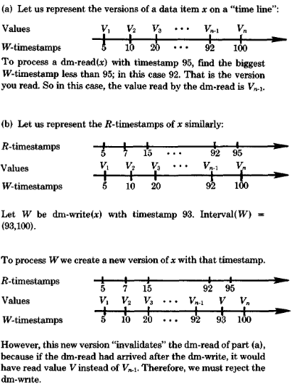

> **그림 11:** 다중 버전 읽기 및 쓰기

**다중 버전 T/O(Multiversion T / O)** 는 다음과 같이 **읽기-쓰기 동기화(rw synchronization)** 를 수행합니다
(**2단계 커밋(two-phase commit)** 은 무시함).
$R$을 **dm-read(x)** 라고 합시다.
$R$은 $ts(R)$보다 작은 가장 큰 **타임스탬프(timestamp)** 를 가진 $x$의 **버전(version)** 을 읽고, $ts(R)$을 $x$의 $R-ts$ 집합에 추가함으로써 처리됩니다.
그림 11a를 참조하십시오.
$R$**은 절대 거부되지 않습니다. $W$를 **dm-write(x)** 라고 하고, $interval(W)$를 $ts(W)$부터 $ts(W)$보다 큰 가장 작은 $W-ts(x)$까지의 구간이라고 합시다.
그림 11b를 참조하십시오.
만약 어떤 $R-ts(x)$가 $interval(W)$에 있다면, $W$는 거부됩니다.
그렇지 않으면 $W$는 출력되어 **타임스탬프(timestamp)** $ts(W)$를 가진 $x$의 새로운 **버전(version)** 을 생성합니다.

**다중 버전 T/O(multiversion T/O)** 의 정확성을 증명하기 위해,
모든 실행이 **타임스탬프 순서(timestamp order)** 의 **직렬 실행(serial execution)** 과 동일함을 보여야 합니다(*BERNS0b*).
$R$을 "순서에 어긋나게(**out of order**)" 처리된 **dm-read(x)** 라고 합시다.
즉, $R$이 **타임스탬프(timestamp)** 가 $ts(R)$를 초과하는 **dm-write(x)** 이후에 실행된다고 가정해 봅시다.
$R$은 $ts(R)$보다 큰 **타임스탬프(timestamps)** 를 가진 모든 **버전(versions)** 을 무시하므로,
$R$에 의해 읽힌 값은 **타임스탬프 순서(timestamp order)** 대로 처리되었을 때 읽었을 값과 동일합니다.
이제 $W$를 "순서에 어긋나게(**out of order**)" 처리된 **dm-write(x)** 라고 합시다.
즉, 그것이 **타임스탬프(timestamp)** 가 $ts(W)$를 초과하는 **dm-read(x)** 이후에 실행된다고 가정해 봅시다.
$W$가 거부되지 않았으므로, $ts(W) < TS < ts(dm-read)$를 만족하는 **타임스탬프(timestamp)** $TS$를 가진 $x$의 **버전(version)** 이 존재합니다.
다시 말하지만, 그 효과는 **타임스탬프 순서(timestamp-ordered)** 실행과 동일합니다.

**쓰기-쓰기 동기화(ww synchronization)** 의 경우, **다중 버전 T/O(multiversion T / O)** 는
본질적으로 **토마스 쓰기 규칙(Thomas Write Rule, TWR)** 의 장식된 버전입니다.
**dm-write(x)** 는 항상 **타임스탬프(timestamp)** $ts(dm-write)$를 가진 $x$의 새로운 **버전(version)** 을 생성하며 절대 거부되지 않습니다.

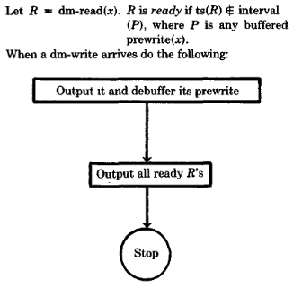

> **그림 12:** 다중 버전 T/O를 위한 버퍼 비우기

**2단계 커밋(two-phase commit)** 을 통합하는 것은
**기본 T/O(basic T/O)** 에서와 같이 **dm-reads**와 **프리라이트(prewrites)** (**dm-writes**는 제외)가 **버퍼링(buffered)** 될 것을 요구합니다.
$P$를 버퍼링된 **프리라이트(prewrite(x))** 라고 합시다.
$interval(P)$는 $ts(P)$부터 $ts(P)$보다 큰 가장 작은 $W-ts(x)$까지의 구간입니다.
**읽기-쓰기 동기화(Rw synchronization)** 는 다음과 같이 수행됩니다:

1. $R$을 **dm-read(x)** 라고 합시다.
    - $R$은 결코 **거부(rejected)** 되지 않습니다.
    - 만약 $ts(R)$이 어떤 버퍼링된 **프리라이트(prewrite(x))** 에 대한 **interval(prewrite(x))** 내에 있다면, $R$은 **버퍼링(buffered)** 됩니다.
    - 그 외의 경우 $R$은 **출력(output)** 됩니다.

2. $P$를 **프리라이트(prewrite(x))** 라고 합시다.
    - 만약 어떤 $R-ts(x)$가 **interval(P)** 내에 있다면, $P$는 **거부(rejected)** 됩니다.
    - 그 외의 경우 $P$는 **버퍼링(buffered)** 됩니다.

3. $W$를 **dm-write(x)** 라고 합시다.
    - $W$는 항상 즉시 **출력(output)** 됩니다.

4. $W$가 **출력(output)** 될 때, 그것의 **프리라이트(prewrite)** 는 **디버퍼링(debuffered)** 되며, 버퍼링된 dm-reads는 이제 **출력(output)** 될 수 있는지
   확인하기 위해 **재테스트(retested)** 됩니다.
    - 그림 12를 참조하십시오.

**2단계 커밋(Two-phase commit)** 은 **ww 동기화(ww synchronization)** 에 있어 문제가 되지 않는데,
이는 **ww 동기화(ww synchronization)** 에서 **dm-writes**가 결코 **거부(rejected)** 되지 않기 때문입니다.

#### 4.4. 보수적 T/O (Conservative T/O)

**보수적 타임스탬프 순서(Conservative timestamp ordering)** 는 **T/O 스케줄링(T / O scheduling)**(*BERN80a*) 동안
**재시작(restarts)** 을 제거하기 위한 기법입니다.
**스케줄러(scheduler)** 가 미래의 **재시작(restart)** 을 유발할 수 있는 **작업 $O$ (operation $O$)** 를 수신하면,
**스케줄러(scheduler)** 는 미래의 **재시작(restarts)** 이 불가능하다는 것이 확실해질 때까지 $O$를 지연시킵니다.

**보수적 T/O(Conservative T / O)** 는 각 **스케줄러(scheduler)** 가
각 **TM**으로부터 **타임스탬프 순서(timestamp order)** 대로 **dm-reads** (또는 **dm-writes**)를 수신할 것을 요구합니다.
예를 들어, 만약 **스케줄러** $S_j$가 $TM_i$로부터 **dm-read(x)** 에 이어 **dm-read(y)** 를 수신한다면, $ts(dm-read(x)) \le ts(dm-read(y))$입니다.
네트워크가 **FIFO 채널(FIFO channel)** 이라고 가정되므로, 이러한 **타임스탬프 순서화(timestamp ordering)** 는
$TM_i$가 $S_j$에게 **타임스탬프 순서(timestamp order)** 대로 **dm-reads** (또는 **dm-writes**)를 보내도록 요구함으로써 달성됩니다.

**보수적 T/O(Conservative T / O)** 는 정상적인 작동의 일부로 **dm-reads**와 **dm-writes**를 **버퍼링(buffers)** 합니다.
**스케줄러(scheduler)** 가 작업을 **버퍼링(buffers)** 할 때, 그것은 그 작업을 보낸 **TM**을 기억합니다.
$min-R-ts(TM_i)$를 $TM_i$로부터 온 임의의 버퍼링된 **dm-read**의 최소 **타임스탬프(timestamp)** 라고 합시다.
만약 그러한 **dm-read**가 버퍼링되어 있지 않다면 $min-R-ts(TM_i) = -\infty$입니다.
$min-W-ts(TM_i)$도 유사하게 정의합니다.

**보수적 T/O(Conservative T / O)** 는 다음과 같이 **읽기-쓰기 동기화(rw synchronization)** 를 수행합니다:

1. $R$을 **dm-read(x)** 라고 합시다.
    - 만약 시스템 내의 임의의 **TM**에 대해 $ts(R) > min-W-ts(TM)$이면, $R$은 **버퍼링(buffered)** 됩니다.
    - 그 외의 경우 $R$은 **출력(output)** 됩니다.

2. $W$를 **dm-write(x)** 라고 합시다.
    - 만약 임의의 **TM**에 대해 $ts(W) > min-R-ts(TM)$이면, $W$는 **버퍼링(buffered)** 됩니다.
    - 그 외의 경우 $W$는 **출력(output)** 됩니다.

3. $R$ 또는 $W$가 **출력(output)** 되거나 **버퍼링(buffered)** 될 때, 이것은 $min-R-ts(TM)$ 또는 $min-W-ts(TM)$를 증가시킬 수 있습니다.
    - 버퍼링된 작업들은 이제 **출력(output)** 될 수 있는지 확인하기 위해 **재테스트(retested)** 됩니다.

그 효과는 (a) **스케줄러(scheduler)** 가 모든 **TM**으로부터 버퍼링된 **dm-write**를 가지고 있고,
(b) $ts(R) <$ 임의의 버퍼링된 **dm-write**의 **최소 타임스탬프(minimum timestamp)** 인 경우에만 오직 $R$이 **출력(output)** 된다는 것입니다.

유사하게, (a) 모든 TM으로부터 버퍼링된 **dm-read**가 존재하고,
(b) $ts(W) <$ 임의의 버퍼링된 **dm-read**의 **최소 타임스탬프(minimum timestamp)** 인 경우에만 오직 $W$가 **출력(output)** 됩니다.
따라서 **스케줄러(scheduler)** 가 앞으로 수신하게 될 더 작은 **타임스탬프(timestamp)** 를 가진
모든 **dm-write** (또는 **dm-read**)를 수신한 경우에만 오직 $R$ (또는 $W$)가 **출력(output)** 됩니다.

**쓰기-쓰기 동기화(Ww synchronization)** 는 다음과 같이 수행됩니다:

1. $W$를 **dm-write(x)** 라고 합시다.
    - 만약 시스템 내의 임의의 **TM**에 대해 $ts(W) > min-W-ts(TM)$이면, $W$는 **버퍼링(buffered)** 됩니다.
    - 그 외의 경우 그것은 **출력(output)** 됩니다.

2. $W$가 **버퍼링(buffered)** 되거나 **출력(output)** 될 때, 이것은 $min-W-ts(TM)$를 증가시킬 수 있습니다.
    - 버퍼링된 dm-writes는 그에 따라 **재테스트(retested)** 됩니다.

그 결과 **스케줄러(scheduler)** 는 모든 **TM**으로부터 버퍼링된 **dm-write**를 가질 때까지 기다린 다음,
가장 작은 **타임스탬프(timestamp)** 를 가진 **dm-write**를 **출력(output)** 하게 됩니다.

**dm-writes**가 결코 **거부(rejected)** 되지 않으므로, **2단계 커밋(Two-phase commit)** 은
**보수적 T/O(conservative T / O)** 에 긴밀하게 통합될 필요가 없습니다.
업데이트된 모든 **데이터 항목(data items)** 에 대해 **프리라이트(prewrites)** 가 발행되어야 함에도 불구하고,
이러한 작업들은 **보수적 T/O 스케줄러(conservative T / O schedulers)** 에 의해 처리되지 않습니다.

**보수적 T/O(conservative T / O)** 의 위와 같은 구현은 세 가지 주요 문제점을 안고 있습니다.

1. 만약 어떤 **TM**이 어떤 **스케줄러(scheduler)** 에게 작업을 전혀 보내지 않는다면, 그 **스케줄러(scheduler)** 는 **"고착(get stuck)"** 되어 출력을 중단할 것입니다.
2. 첫 번째 문제를 피하기 위해, 모든 **TM**은 모든 **스케줄러(scheduler)** 와 정기적으로 통신해야 합니다.
    - 이는 대규모 네트워크에서는 **실행 불가능(infeasible)** 합니다.
3. 이 구현은 지나치게 보수적입니다.
    - 예를 들어, **ww 알고리즘(ww algorithm)** 은 단지 **충돌하는 작업(conflicting ones)** 뿐만 아니라 모든 **dm-writes**를 **타임스탬프 순서(timestamp
      order)** 대로 처리합니다.

이러한 문제들은 아래에서 다루어집니다.

**널 작업(Null Operations)**

첫 번째 문제를 해결하기 위해, **TM**들은 "**실제(real)**" **트래픽(traffic)** 이 없는 상황에서
주기적으로 각 **스케줄러(scheduler)** 에게 **타임스탬프(timestamped)** 가 찍힌 **널 작업(null operations)** 을 보내도록 요구받습니다.

**널 작업(null operation)** 은 오로지 **타임스탬프(timestamp)** 정보를 전달하여 그 결과 "**실제(real)**" **dm-read**들과
**프리라이트(prewrites)** 의 **차단(unblock)** 을 해제하는 것이 유일한 목적인 **dm-read** 또는 **dm-write**입니다.
**성급한 스케줄러(impatient scheduler)** 는 "**요청 메시지(request message)**"를 보냄으로써
**TM**에게 **널 작업(null operation)** 을 **촉구(prompt)** 할 수 있습니다.
예를 들어, **읽기-쓰기 동기화(rw synchronization)** 를 위해 **스케줄러** $S$가 **타임스탬프** $TS$를 가진 **dm-read**를 처리하고자 하지만,
$TM_i$로부터 **버퍼링된 dm-write(buffered dm-write)** 를 가지고 있지 않다고 가정해 봅시다.
$S$는 $TM_i$에게 $TS$보다 큰 **타임스탬프(timestamp)** 를 가진 **널-dm-write(null-dm-write)** 를 요청하는 메시지를 보낼 수 있습니다.

하나의 변형은 매우 큰 (아마도 무한한) **타임스탬프(timestamps)** 를 가진 **널 작업(null operations)**을 사용하는 것입니다.

예를 들어, 만약 $TM_i$가 $S$에게 dm-reads를 발행할 필요가 거의 없다면, $TM_i$는 $S$에게 추후 통지가 있을 때까지 $TM_i$가 $S$와 통신할 의도가 없음을 나타내는
**무한한 타임스탬프(infinite timestamp)** 를 가진 **널-dm-read(null-dm-read)** 를 보낼 수 있습니다.

**트랜잭션 클래스 (Transaction Classes)**

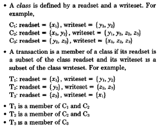

> **그림 13:** 트랜잭션 클래스

**트랜잭션 클래스(Transaction classes)**(*BER78a, BERN80d*)는 **보수적 T/O(conservative T / O)** 에서
통신을 줄이고 덜 보수적인 스케줄링 정책을 지원하기 위한 기법입니다.
**사전 선언(predeclaration)** 에서와 같이, 모든 트랜잭션의 **읽기 집합(readset)** 과 **쓰기 집합(writeset)** 이 사전에 알려져 있다고 가정합니다.

클래스는 **읽기 집합(readset)** 과 **쓰기 집합(writeset)** 에 의해 정의됩니다 (그림 13 참조).
만약 **readset(T)** 가 **readset(C)** 의 **부분 집합(subset)** 이고 **writeset(T)** 가 **writeset(C)** 의 **부분 집합(subset)** 이라면,
**트랜잭션** $T$는 **클래스** $C$의 구성원입니다. (클래스들은 반드시 **서로소(disjoint)** 일 필요는 없습니다.)

클래스 정의는 시스템의 정상적인 작동 중에 빈번하게 변경될 것으로 예상되지 않습니다.
클래스 정의를 변경하는 것은 **데이터베이스 스키마(database schema)** 를 변경하는 것과 유사하며, 이 논문의 범위를 벗어나는 메커니즘을 필요로 합니다.
우리는 클래스 정의가 그것을 필요로 하는 모든 사이트에서 사용 가능한 **정적 테이블(static tables)** 에 저장되어 있다고 가정합니다.

클래스들은 **TM**들과 연관됩니다.
**TM**에서 실행되는 모든 **트랜잭션(transaction)** 은 해당 **TM**과 연관된 **클래스(class)**의 구성원이어야 합니다.
만약 자신을 포함하는 클래스가 없는 **TM**에 **트랜잭션**이 제출되면, 해당 **트랜잭션**은 그 클래스를 가진 다른 **TM**으로 전달됩니다.

우리는 모든 **클래스**가 정확히 하나의 **TM**과 연관되고, 그 반대도 마찬가지라고 가정합니다.
$TM_i$와 연관된 **클래스**는 $C_i$로 표시됩니다.
두 개의 **TM**에서 **클래스** $C$의 구성원인 **트랜잭션**들을 실행하기 위해,
우리는 $C$와 동일한 정의를 가진 또 다른 **클래스** $C'$를 정의하고 $C$를 하나의 **TM**에, $C'$를 다른 **TM**에 할당합니다.
한 사이트에서 두 개의 클래스 구성원인 트랜잭션들을 실행하기 위해, 우리는 해당 사이트에서 두 개의 **TM**을 **멀티프로그래밍(multiprogram)** 합니다.

**클래스**들은 **보수적 T/O 스케줄러(conservative T / O schedulers)** 에 의해 다음과 같이 활용됩니다.
**읽기-쓰기 동기화(rw synchronization)** 를 고려하고, **스케줄러** $S$가 **dm-read(x)** 를 출력하기를 원한다고 가정해 봅시다.
모든 **TM**으로부터 더 작은 **타임스탬프(timestamps)** 를 가진 **dm-writes**를 기다리는 대신,
$S$는 자신의 **클래스 쓰기 집합(class writeset)** 에 $x$를 포함하고 있는 **TM**들로부터의 **dm-writes**만 기다리면 됩니다.
유사하게, **dm-write(x)** 를 처리하기 위해 $S$는 자신의 **클래스 읽기 집합(class readset)** 에 $x$를 포함하고 있는 **TM**들로부터
더 작은 타임스탬프를 가진 **dm-reads**만 기다리면 됩니다.
따라서 통신 요구 사항은 감소하고, **시스템의 병행성(concurrency)** 수준은 증가합니다.
**쓰기-쓰기 동기화(Ww synchronization)** 도 유사하게 진행됩니다.

**충돌 그래프 분석 (Conflict Graph Analysis)**

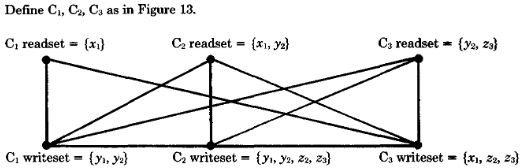

> **그림 14:** 충돌 그래프

**충돌 그래프 분석(Conflict graph analysis)** 은 **클래스(classes)** 를 사용하는 **보수적 T/O(conservative T / O)** 의 성능을
더욱 향상시키기 위한 기법입니다.
**충돌 그래프(conflict graph)** 는 서로 다른 **클래스(classes)** 에 속한 **트랜잭션(transactions)** 간의
잠재적인 **충돌(conflicts)** 을 요약하는 **무방향 그래프(undirected graph)** 입니다.

각 **클래스** $C_i$에 대해, 그래프는 $C_i$의 **읽기 집합(readset)** 과 **쓰기 집합(writeset)** 을
나타내는 $r_i$와 $w_i$로 표시된 두 개의 **노드(nodes)** 를 포함합니다.
그래프의 **에지(edges)** 는 다음과 같이 정의됩니다 (그림 14 참조):

1. 각 **클래스** $C_i$에 대해, $r_i$와 $w_i$ 사이에는 **수직 에지(vertical edge)** 가 존재합니다.
2. 각 **클래스 쌍** $C_i$와 $C_j$ ($i \neq j$)에 대해, 오직 $writeset(C_i)$와 $writeset(C_j)$가 교차할 때만 $w_i$와 $w_j$ 사이에 **수평 에지(
   horizontal edge)** 가 존재합니다.
3. 각 **클래스 쌍** $C_i$와 $C_j$ ($i \neq j$)에 대해, 오직 $readset(C_i)$와 $writeset(C_j)$가 교차할 때만 $r_i$와 $w_j$ 사이에 **대각선 에지(
   diagonal edge)** 가 존재합니다.

직관적으로, **수평 에지(horizontal edge)** 는 **ww 동기화(ww synchronization)** 를
목적으로 **스케줄러** $S$가 **dm-writes**를 지연시켜야 할 수도 있음을 나타냅니다.
**클래스** $C_i$와 $C_j$가 **수평 에지** $(w_i, w_j)$로 연결되어 있고, 이는 두 클래스의 **쓰기 집합(writeset)** 이 교차함을 의미한다고 가정해 봅시다.
만약 $S$가 $C_i$로부터 **dm-write**를 수신하면,
$C_j$로부터 더 작은 **타임스탬프(timestamps)** 를 가진 모든 **dm-writes**를 수신할 때까지 해당 **dm-write**를 지연시켜야 합니다.
마찬가지로, **대각선 에지(diagonal edge)** 는 $S$가 **rw 동기화(rw synchronization)** 를 위해 작업을 지연시켜야 할 수도 있음을 나타냅니다.

**충돌 그래프 분석(Conflict graph analysis)** 은 **직렬 가능하지 않은(nonserializable)** 동작을 유발하지 않는
**클래스 간 충돌(interclass conflicts)** 을 식별함으로써 상황을 개선합니다.
이는 동기화가 필요하지 않은 **수평 및 대각선 에지**를 식별하는 것에 해당합니다.

특히, **스케줄러**는 다음 중 하나에 해당할 때만 $C_i$와 $C_j$로부터의 **dm-writes**를 동기화하면 됩니다:

1. $w_i$와 $w_j$ 사이의 **수평 에지**가 **충돌 그래프**의 **사이클(cycle)** 에 포함되어 있거나
2. $C_i$의 **쓰기 집합**과 $C_j$의 **쓰기 집합**의 교집합 부분이 두 개 이상의 **DM**에 저장되어 있는 경우입니다(*BERN80C*).

즉, 조건 (1)과 (2)가 성립하지 않는다면, **스케줄러** $S$는 $C_i$와 $C_j$로부터의 **dm-writes**를 **타임스탬프 순서(timestamp order)** 대로 처리할 필요가 없습니다.
마찬가지로, 다음 중 하나에 해당할 때만 $C_i$로부터의 **dm-reads**와 $C_j$로부터의 **dm-writes**를 타임스탬프 순서대로 처리하면 됩니다:

1. $r_i$와 $w_j$ 사이의 **대각선 에지**가 **충돌 그래프**의 사이클에 포함되어 있거나
2. $C_i$의 **읽기 집합**과 $C_j$의 **쓰기 집합**의 교집합 부분이 두 개 이상의 **DM**에 저장되어 있는 경우입니다.

**클래스(classes)** 들이 정적으로 정의되므로, **충돌 그래프 분석(conflict graph analysis)** 또한 정적으로 수행됩니다.
이 분석은 어떤 **수평(horizontal)** 및 **수직(vertical)** 에지들이 **동기화(synchronization)** 를 필요로 하고 어떤 것들이 그렇지 않은지를 나타내는 테이블을 생성합니다.
이 테이블은 **클래스 정의**와 마찬가지로, 이를 필요로 하는 모든 **스케줄러(schedulers)** 에게 사전에 배포됩니다.

#### 4.5. 타임스탬프 관리 (Timestamp Management)

**T/O 스케줄러(T / O schedulers)** 에 대한 흔한 비판은 **타임스탬프(timestamps)** 를 저장하는 데 너무 많은 메모리가 필요하다는 것입니다.
이 문제는 오래된 **타임스탬프(timestamps)** 를 **"삭제(forgetting)"** 함으로써 극복할 수 있습니다.

**기본 T/O(basic T / O)** 에서 **타임스탬프(timestamps)** 는 "늦게 도착한(arrive late)" 작업들을 거부하기 위해 사용됩니다.
예를 들어, **타임스탬프(timestamp)** 가 $TS2$인 **dm-write(x)** 가
도착한 이후에 도착한 **타임스탬프** $TS1$ ($TS1 < TS2$)인 **dm-read(x)** 를 거부하는 경우입니다.
원칙적으로 $TS1$과 $TS2$는 임의의 양만큼 차이가 날 수 있습니다.
하지만 실제로는 이러한 **타임스탬프**들이 몇 분 이상 차이 날 가능성은 낮습니다.
결과적으로, **타임스탬프**들은 주기적으로 비워지는(purged) 작은 테이블들에 저장될 수 있습니다.

$R-ts$들은 $(x, R-ts)$ 형태의 항목을 가진 **R-테이블(R-table)** 에 저장됩니다.
임의의 **데이터 항목(data item)** $x$에 대해, 항목은 최대 하나만 존재합니다.
또한, 변수 $R-min$은 테이블에서 삭제된(purged) 임의의 **타임스탬프** 중 최대값을 나타냅니다.
$R-ts(x)$를 찾기 위해, **스케줄러(scheduler)** 는 **R-테이블**에서 $(x, TS)$ 항목을 검색합니다.
만약 그러한 항목이 발견되면, $R-ts(x) = TS$입니다.
그렇지 않으면 $R-ts(x) = R-min$입니다.
안전한 쪽을 택하기 위해(To err on the side of safety), **스케줄러**는 $R-ts(x) = R-min$이라고 가정합니다.

$R-ts(x)$를 업데이트하기 위해, **스케줄러**는 항목이 존재한다면 $(x, TS)$ 항목을 수정합니다.
그렇지 않으면 새로운 항목이 생성되어 테이블에 추가됩니다.
**R-테이블**이 가득 차면, **스케줄러**는 $R-min$에 적절한 값을 선택하고 테이블에서 더 작은 **타임스탬프**를 가진 모든 항목을 삭제합니다.
$W-ts$들도 유사하게 관리되며, **다중 버전 데이터베이스(multiversion databases)** 를 위해서도 이와 유사한 기법들이 고안될 수 있습니다.

**보수적 T/O(conservative T / O)** 를 위한 **타임스탬프** 유지는 훨씬 더 저렴한데,
이는 **보수적 T/O**가 **타임스탬프**가 찍힌 데이터가 아니라 오직 **타임스탬프**가 찍힌 **작업(operations)** 만을 필요로 하기 때문입니다.
만약 **보수적 T/O**가 **읽기-쓰기 동기화(rw synchronization)** 를 위해 사용된다면, 데이터 항목들의 $R-ts$들은 폐기될 수 있습니다.
만약 **보수적 T/O**가 **읽기-쓰기(rw)** 및 **쓰기-쓰기(ww)** 동기화 모두를 위해 사용된다면, $W-ts$들 또한 제거될 수 있습니다.

### 5. 통합 병행 제어 방법 (INTEGRATED CONCURRENCY CONTROL METHODS)

통합 병행 제어 방법은 두 가지 구성 요소(**읽기-쓰기(rw)** 및 **쓰기-쓰기(ww)** 동기화 기법)와
**정리 2(Theorem 2)** 의 조건 (b)를 달성하는 구성 요소 간의 **인터페이스(interface)** 로 구성됩니다.
여기서 조건 (b)란 모든 $\to_{rw}$ 및 $\to_{ww}$ 관계와 일치하는 트랜잭션들의 **전체 순서(total ordering)** 를 의미합니다.
이 섹션에서 우리는 섹션 3과 4의 기법들을 사용하여 구축할 수 있는 48가지 병행 제어 방법들을 나열합니다.

기존 문헌에는 약 20여 가지의 병행 제어 방법이 설명되어 있습니다.
사실상 그들 거의 모두는 **읽기-쓰기(rw)** 와 **쓰기-쓰기(ww)** 동기화 모두에 단일 동기화 기법(**2PL** 또는 **T/O**)을 사용합니다.
실제로 대부분의 방법은 두 종류의 동기화에 대해 단일 기법의 동일한 변형을 사용합니다.
그러나 이러한 **균질성(homogeneity)** 은 반드시 필요한 것도 아니며 특히 바람직하지도 않습니다.

예를 들어, 섹션 3.2의 분석은 **읽기-쓰기(rw) 동기화**를 위해 **기본 2PL(basic 2PL)** 을 사용하고
**쓰기-쓰기(ww) 동기화**를 위해 **주 사본 2PL(primary copy 2PL)** 을 사용하는 것이,
두 종류의 동기화 모두에 **기본 2PL** (또는 **주 사본 2PL**) 하나만 사용하는 것보다 우수할 수 있음을 시사합니다.

더 이색적인 조합들이 훨씬 더 나을 수도 있습니다.
예를 들어, **기본 2PL(basic 2PL)** 과 **TWR(Thomas Write Rule)** 을 결합할 수 있습니다.
이 방법에서 **쓰기-쓰기(ww) 충돌**은 결코 트랜잭션을 지연시키거나 재시작하게 만들지 않습니다.
즉, 여러 트랜잭션이 동일한 데이터 항목에 동시에 쓸 수 있게 됩니다 (섹션 5.3 참조).

섹션 5.1과 5.2에서 우리는 **읽기-쓰기(rw)** 및 **쓰기-쓰기(ww)** 동기화 모두에 **2PL** 및 **T/O** 기법을 사용하는 방법들을 설명합니다.
섹션 3과 4의 자료가 주어졌을 때 이 섹션들의 **병행 제어 방법(concurrency control methods)** 들은 설명하기 쉽습니다.
각 방법에 대한 설명은 각 **구성 요소 기법(component technique)** 에 대한 설명과 거의 다를 바 없습니다.

섹션 5.3에서 우리는 **2PL**과 **T/O** 기법을 결합한 24가지 **병행 제어 방법(concurrency control methods)** 을 나열합니다.
섹션 5.3에서 보여주듯이, 이 유형의 방법들은 **순수(pure) 2PL** 또는 **T/O** 방법으로는 달성할 수 없는 유용한 **속성(properties)** 들을 가지고 있습니다.

#### 5.1. 순수 2PL 방법 (Pure 2PL Methods)

섹션 3의 **2PL 동기화 기법(2PL synchronization techniques)** 은 다음과 같이 12가지의 주요 **2PL 방법(2PL methods)** 을 형성하도록 통합될 수 있습니다.

| 방법 (Method) | 읽기-쓰기 기법 (rw technique)      | 쓰기-쓰기 기법(ww technique)       |
|:-----------:|:-----------------------------|:-----------------------------|
|    **1**    | 기본 2PL (Basic 2PL)           | 기본 2PL (Basic 2PL)           |
|    **2**    | 기본 2PL (Basic 2PL)           | 주 사본 2PL (Primary copy 2PL)  |
|    **3**    | 기본 2PL (Basic 2PL)           | 투표 2PL (Voting 2PL)          |
|    **4**    | 기본 2PL (Basic 2PL)           | 중앙 집중식 2PL (Centralized 2PL) |
|    **5**    | 주 사본 2PL (Primary copy 2PL)  | 기본 2PL (Basic 2PL)           |
|    **6**    | 주 사본 2PL (Primary copy 2PL)  | 주 사본 2PL (Primary copy 2PL)  |
|    **7**    | 주 사본 2PL (Primary copy 2PL)  | 투표 2PL (Voting 2PL)          |
|    **8**    | 주 사본 2PL (Primary copy 2PL)  | 중앙 집중식 2PL (Centralized 2PL) |
|    **9**    | 중앙 집중식 2PL (Centralized 2PL) | 기본 2PL (Basic 2PL)           |
|   **10**    | 중앙 집중식 2PL (Centralized 2PL) | 주 사본 2PL (Primary copy 2PL)  |
|   **11**    | 중앙 집중식 2PL (Centralized 2PL) | 투표 2PL (Voting 2PL)          |
|   **12**    | 중앙 집중식 2PL (Centralized 2PL) | 중앙 집중식 2PL (Centralized 2PL) |

각 방법은 **교착 상태 해결 기법(deadlock resolution technique)** 의 선택에 의해 더욱 세분화될 수 있습니다 (섹션 3.5 참조).

각 **2PL rw 기법**과 각 **2PL ww 기법** 사이의 **인터페이스(interface)** 는 간단합니다.
그것은 "**2단계 속성(two-phasedness)**"이 보존되는 것만을 보장하면 되는데,
이는 어느 한 기법에 의해 **잠금(locks)** 이 해제되기 전에 **rw 기법**과 **ww 기법** 모두에 필요한 모든 **잠금(locks)** 이 획득되어야 함을 의미합니다.

**5.1.1. 읽기-쓰기 동기화를 위해 기본 2PL을 사용하는 방법들 (Methods Using Basic 2PL for rw Synchronization)**

**방법 1 ~ 4**는 **읽기-쓰기 동기화(rw synchronization)** 를 위해 **기본 2PL(basic 2PL)** 을 사용합니다.
사본 $x_1, \dots, x_m$을 가진 **논리적 데이터 항목 $X$ (logical data item $X$)** 를 가정해 봅시다.
$X$를 읽기 위해, **트랜잭션**은 $X$의 사본을 저장하고 있는 임의의 **DM**에게 **dm-read**를 보냅니다.
이 **dm-read**는 해당 **DM**에 있는 $X$의 사본에 대해 **읽기 잠금(readlock)** 을 암시적으로 요청합니다.
$X$를 쓰기 위해, **트랜잭션**은 $X$의 사본을 저장하는 모든 **DM**에 **프리라이트(prewrites)** 를 보냅니다.
이 **프리라이트**들은 대응하는 $X$의 사본들에 대해 **쓰기 잠금(writelocks)** 을 암시적으로 요청합니다.
이 네 가지 방법 모두에서, 이러한 **쓰기 잠금**들은 동일한 사본에 대한 **읽기 잠금**과 충돌하며,
해당 방법에서 사용하는 구체적인 **ww 동기화 기법**에 따라 동일한 사본에 대한 다른 **쓰기 잠금**들과도 충돌할 수 있습니다.

**쓰기 잠금**에 대한 **잠금 충돌 규칙(locking conflict rules)** 은 사본마다 다를 것이므로, 우리는 이를 세 가지 유형으로 구분합니다.

- **rw 쓰기 잠금 (rw writelock):** 동일한 데이터 항목에 대한 읽기 잠금하고만 충돌합니다.
- **ww 쓰기 잠금 (ww writelock):** 동일한 데이터 항목에 대한 ww 쓰기 잠금하고만 충돌합니다.
- **rww 쓰기 잠금 (rww writelock):** 읽기 잠금, ww 쓰기 잠금, 그리고 rww 쓰기 잠금 모두와 충돌합니다.

따라서, **읽기-쓰기 동기화**를 위해 **기본 2PL**을 사용하면, 모든 **프리라이트**는 **rw 쓰기 잠금**을 설정하며, **ww 기법**에 따라 더 강력한 잠금을 설정할 수도 있습니다.

1. **방법 1: ww 동기화를 위한 기본 2PL (Basic 2PL for ww synchronization)**
    - 모든 **쓰기 잠금 (writelocks)** 은 **rww 쓰기 잠금 (rww writelocks)** 입니다.
    - 즉, $i = 1, \dots, m$에 대하여, $x_i$에 대한 **쓰기 잠금**은 해당 사본 $x_i$에 대한 **읽기 잠금 (readlock)** 또는 **쓰기 잠금** 중 어느 하나와도 충돌합니다.
    - 이것은 **2PL**의 "표준적인" 분산 구현 방식입니다.
2. **방법 2: ww 동기화를 위한 주 사본 2PL (Primary copy 2PL for ww synchronization)**
    - **쓰기 잠금 (writelocks)** 은 오직 **주 사본 (primary copy)** 에서만 충돌합니다.
    - **주 사본**에는 **rww 쓰기 잠금**이 사용되는 반면, 다른 사본들에는 **rw 쓰기 잠금 (rw writelocks)** 이 사용됩니다.
3. **방법 3: ww 동기화를 위한 투표 2PL (Voting 2PL for ww synchronization)**
    - **데이터 매니저 (DM)** 는 $x_i$에 대해 **rww 쓰기 잠금** 설정을 시도함으로써 **프리라이트 (prewrite($x_i$))** 에 응답합니다.
    - 하지만 만약 다른 트랜잭션이 이미 $x_i$에 대한 **rww 쓰기 잠금**을 소유하고 있다면, **DM**은 **rw 쓰기 잠금**만을 설정하고 **rww 쓰기 잠금**에 대한 요청은 **대기(
      pending)** 상태로 둡니다.
    - 트랜잭션은 사본들의 **과반수 (majority)** 에 대해 **rww 쓰기 잠금**을 획득한 후에 $X$의 모든 사본에 쓸 수 있습니다.
    - 이는 (*GIFF79*)에서 제안된 방식과 유사합니다.
4. **방법 4: ww 동기화를 위한 중앙 집중식 2PL (Centralized 2PL for ww synchronization)**
    - $X$에 쓰기 위해, 트랜잭션은 먼저 **중앙 집중식 2PL 스케줄러 (centralized 2PL scheduler)** 로부터 $X$에 대한 **ww 쓰기 잠금 (ww writelock)** 을
      명시적으로 요청해야 합니다.
    - **프리라이트 (prewrites)** 에 의해 설정된 **rw 쓰기 잠금**들은 서로 결코 충돌하지 않습니다.

이 네 가지 방법 모두에서, **읽기 잠금(readlocks)** 은 **잠금 해제(lock releases)** 에 의해 명시적으로 해제되는 반면,
**쓰기 잠금(writelocks)** 은 **dm-writes**에 의해 암시적으로 해제됩니다.
**잠금 해제(lock releases)** 는 **dm-writes**와 병행하여 전송될 수 있습니다.

**방법 4(Method 4)** 에서는 모든 **dm-writes**가 실행된 후,
**중앙 집중식 스케줄러(centralized scheduler)** 에 보유된 **쓰기 잠금**들을 해제하기 위해 추가적인 **잠금 해제** 메시지를 보내야 합니다.

**5.1.2. 읽기-쓰기 동기화를 위해 주 사본 2PL을 사용하는 방법들 (Methods Using Primary Copy 2PL for rw Synchronization)**

**방법 5~8**은 **읽기-쓰기 동기화(rw synchronization)** 를 위해 **주 사본 2PL(primary copy 2PL)** 을 사용합니다.
사본 $x_1, \dots, x_m$을 가진 **논리적 데이터 항목 $X$ (logical data item $X$)** 를 고려하고, $x_1$이 **주 사본(primary copy)** 이라고 가정합시다.
$X$를 읽기 위해, **트랜잭션(transaction)** 은 $x_1$에 대한 **읽기 잠금(readlock)** 을 획득해야 합니다.
**트랜잭션**은 **dm-read($x_1$)** 을 발행함으로써 이 잠금을 획득할 수 있습니다.
또는, **트랜잭션**이 $x_1$의 **데이터 매니저(DM)** 에 명시적인 **잠금 요청(lock request)** 을 보낼 수도 있습니다.
잠금이 승인되면 해당 **트랜잭션**은 $X$의 어떤 사본이라도 읽을 수 있습니다.

$X$에 쓰기 위해, **트랜잭션**은 $X$의 사본을 저장하는 모든 **DM**에 **프리라이트(prewrites)** 를 보냅니다.
**프리라이트($x_1$)** 는 암시적으로 **rw 쓰기 잠금(rw writelock)** 을 요청합니다.
$X$의 다른 사본들에 대한 **프리라이트**들 또한 **ww 기법(ww technique)** 에 따라 **쓰기 잠금(writelocks)** 을 요청할 수 있습니다.

5. **방법 5: ww 동기화를 위한 기본 2PL (Basic 2PL for ww synchronization)**
    - $i = 2, \dots, m$에 대하여, **프리라이트(prewrite($x_i$))** 는 **ww 쓰기 잠금(ww writelock)** 을 요청합니다.
    - $x_1$에 대한 **쓰기 잠금(writelock)** 은 $x_1$에 대한 **읽기 잠금(readlocks)** 과도 반드시 충돌해야 하므로,
      **프리라이트(prewrite($x_1$))** 는 **rww 쓰기 잠금(rww writelock)** 을 요청합니다.
6. **방법 6: ww 동기화를 위한 주 사본 2PL (Primary copy 2PL for ww synchronization)**
    - **프리라이트(prewrite($x_1$))** 는 $x_1$에 대해 **rww 쓰기 잠금(rww writelock)** 을 요청합니다.
    - 다른 사본들에 대한 **프리라이트(prewrites)** 는 어떠한 잠금도 요청하지 않습니다.
    - 이 방법은 원래 (*STON79*)에 의해 제안되었으며, **Distributed INGRES(*STON77*)** 에서 사용됩니다.
7. **방법 7: ww 동기화를 위한 투표 2PL (Voting 2PL for ww synchronization)**
    - **스케줄러(scheduler)** 가 $i \neq 1$인 **프리라이트(prewrite($x_i$))** 를 수신하면, $x_i$에 대해 **ww 쓰기 잠금(ww writelock)** 설정을
      시도합니다.
    - **프리라이트(prewrite($x_1$))** 를 수신하면, $x_1$에 대해 **rww 쓰기 잠금(rww writelock)** 설정을 시도합니다.
    - 만약 **rww 쓰기 잠금** 설정이 불가능하다면, 해당 잠금을 기다리기 전에 (가능한 경우) $x_1$에 대해 **rw 쓰기 잠금(rw writelock)** 을 먼저 설정합니다.
    - 트랜잭션은 $X$의 사본들 중 **과반수(majority)** 에 대해 **ww (또는 rww) 쓰기 잠금**을 획득한 후 모든 사본에 쓸 수 있습니다.
8. **방법 8: ww 동기화를 위한 중앙 집중식 2PL (Centralized 2PL for ww synchronization)**
    - 트랜잭션들은 **중앙 집중식 2PL 스케줄러(centralized 2PL scheduler)** 로부터 **ww 쓰기 잠금(ww writelocks)** 을 획득합니다.
    - 따라서 **프리라이트(prewrite($x_1$))** 는 $x_1$에 대해 **rw 쓰기 잠금(rw writelock)** 만을 요청합니다.
    - $i = 2, \dots, m$에 대하여, **프리라이트(prewrite($x_i$))** 는 어떠한 잠금도 요청하지 않습니다.

**방법 5~8**에 대한 **잠금 해제(Lock releases)** 는 앞서 **섹션 5.1.1**에서 설명한 방식과 동일하게 처리됩니다.

**5.1.3. 읽기-쓰기 동기화를 위해 중앙 집중식 2PL을 사용하는 방법들 (Methods Using Centralized 2PL for rw Synchronization)**

남은 **2PL 방법**들은 **읽기-쓰기 동기화(rw synchronization)** 를 위해 **중앙 집중식 2PL(centralized 2PL)** 을 사용합니다.
논리적 데이터 항목 $X$의 어떤 사본이라도 읽거나 쓰기 전에, **트랜잭션(transaction)** 은 **중앙 집중식 2PL 스케줄러(centralized 2PL scheduler)** 로부터
$X$에 대한 **읽기 잠금(readlock)** 또는 **rw 쓰기 잠금(rw writelock)** 을 획득해야 합니다.
$X$를 쓰기 전에, **트랜잭션**은 또한 $X$의 사본을 저장하는 모든 **DM**에 **프리라이트(prewrites)** 를 보내야 합니다.
특정 방법에 따라, 이러한 **프리라이트**들 중 일부는 $X$의 사본들에 대해 암시적으로 **ww 쓰기 잠금(ww writelocks)** 을 요청합니다.

9. **방법 9: ww 동기화를 위한 기본 2PL (Basic 2PL for ww synchronization)**
    - 모든 **프리라이트(prewrite)** 는 **ww 쓰기 잠금(ww writelock)** 을 요청합니다.
10. **방법 10: ww 동기화를 위한 주 사본 2PL (Primary copy 2PL for ww synchronization)**
    - $x_1$이 $X$의 **주 사본(primary copy)** 이라면, **프리라이트($x_1$)** 가 **ww 쓰기 잠금(ww writelock)** 을 요청합니다.
    - 다른 사본들에 대한 **프리라이트**들은 어떠한 **쓰기 잠금**도 요청하지 않습니다.
11. **방법 11: ww 동기화를 위한 투표 2PL (Voting 2PL for ww synchronization)**
    - 모든 **프리라이트**가 **ww 쓰기 잠금** 설정을 시도합니다.
    - **트랜잭션**은 $X$의 사본들 중 **과반수(majority)** 에 대해 **ww 쓰기 잠금**을 획득한 후에 $X$의 모든 사본에 쓸 수 있습니다.
12. **방법 12: ww 동기화를 위한 중앙 집중식 2PL (Centralized 2PL for ww synchronization)**
    - 모든 **잠금(locks)** 은 중앙 **집중식 2PL 스케줄러**에서 획득됩니다.
    - $X$의 임의의 사본에 쓰기 전에, **중앙 집중식 스케줄러**로부터 $X$에 대한 **rww 쓰기 잠금(rww writelock)** 을 획득합니다.
    - **프리라이트**들은 잠금을 전혀 설정하지 않습니다.
    - **방법 12**는 **중앙 집중식 2PL**의 "표준(standard)" 구현 방식입니다 ((*ALSB76a*)에서는 **주 사이트(primary site)** 라고 불림).

**방법 9~12**에 대한 **잠금 해제(Lock releases)** 는 **섹션 5.1.1**에서와 동일하게 처리됩니다.

#### 5.2. 순수 T/O 방법 (Pure T/O Methods)

섹션 4(원문에는 5로 표기됨)의 타임스탬프 순서(T/O) 동기화 기법들 또한 통합되어 12가지 주요 **T/O 방법(T / O methods)** 을 형성할 수 있습니다.

| 방법 (Method) | 읽기-쓰기 기법 (rw technique)      | 쓰기-쓰기 기법(ww technique)              |
|:-----------:|:-----------------------------|:------------------------------------|
|    **1**    | 기본 T/O (Basic T/O)           | 기본 T/O (Basic T/O)                  |
|    **2**    | 기본 T/O (Basic T/O)           | 토마스 쓰기 T/O (Thomas Write Rule, TWR) |
|    **3**    | 기본 T/O (Basic T/O)           | 다중 버전 T/O (Multiversion T/O)        |
|    **4**    | 기본 T/O (Basic T/O)           | 보수적 T/O (Conservative T/O)          |
|    **5**    | 다중 버전 T/O (Multiversion T/O) | 기본 T/O (Basic T/O)                  |
|    **6**    | 다중 버전 T/O (Multiversion T/O) | 토마스 쓰기 T/O (Thomas Write Rule, TWR) |
|    **7**    | 다중 버전 T/O (Multiversion T/O) | 다중 버전 T/O (Multiversion T/O)        |
|    **8**    | 다중 버전 T/O (Multiversion T/O) | 보수적 T/O (Conservative T/O)          |
|    **9**    | 보수적 T/O (Conservative T/O)   | 기본 T/O (Basic T/O)                  |
|   **10**    | 보수적 T/O (Conservative T/O)   | 토마스 쓰기 T/O (Thomas Write Rule, TWR) |
|   **11**    | 보수적 T/O (Conservative T/O)   | 다중 버전 T/O (Multiversion T/O)        |
|   **12**    | 보수적 T/O (Conservative T/O)   | 보수적 T/O (Conservative T/O)          |

(2PL 방법 또한 12가지가 존재한다는 것은 우연의 일치입니다.)

**보수적 구성 요소(conservative component)** 를 포함하는 각 **T/O 방법(T / O method)** 은 **클래스(classes)** 와
**충돌 그래프 분석(conflict graph analysis)** 을 포함함으로써 더욱 정교해질 수 있습니다 (섹션 4.4.2 및 4.4.3 참조).

**읽기-쓰기(rw)** 및 **쓰기-쓰기(ww) 동기화 기법** 사이의 **인터페이스(interface)** 는 **2PL**에서보다 **T/O 방법(T / O methods)** 에서 훨씬 더 간단합니다.
유일한 요구 사항은 두 기법 모두 임의의 주어진 트랜잭션에 대해 동일한 **타임스탬프(timestamp)** 를 사용해야 한다는 것입니다.

**5.2.1 읽기-쓰기 동기화를 위해 기본 T/O를 사용하는 방법들 (Methods Using Basic T/O for rw Synchronization)**

**방법 1 ~ 4**는 **읽기-쓰기 동기화(rw synchronization)** 를 위해 **기본 T/O(basic T / O)** 를 사용합니다.
네 가지 방법 모두 각 **데이터 항목(data item)** 에 대해 $R-ts$가 필요합니다.
**방법 1, 2, 4**는 $W-ts$를 필요로 하는 반면, **방법 3**에서는 각 **데이터 항목**이 **타임스탬프가 찍힌 버전들의 집합(set of timestamped versions)** 을 가집니다.
**방법 3**의 경우, $W-ts(x)$를 $x$의 가장 큰 **타임스탬프(timestamp)** 라고 합시다.

각 방법은 **2단계 커밋(two-phase commitment)** 목적을 위해 **dm-reads**와 **프리라이트(prewrites)** 를 **버퍼링(buffers)** 합니다.
$min-R-ts(x)$와 $min-P-ts(x)$를 각각 **버퍼링된(buffered)** 임의의 **dm-read(x)** 와
**프리라이트(prewrite(x))** 의 **최소 타임스탬프(minimum timestamps)** 라고 합시다.

이 방법들은 다음과 같은 단계들로 설명될 수 있습니다.
$R$을 $dm-read(x)$, $P$를 **prewrite(x)**, $W$를 **dm-write(x)** 라고 정의합니다.

1. 만약 $ts(R) < W\text{-}ts(x)$이면, $R$은 **거부(rejected)** 됩니다.
    - 그렇지 않고 만약 $ts(R) > min\text{-}P\text{-}ts(x)$이면, $R$은 **버퍼링(buffered)** 됩니다.
    - 그 외의 경우 $R$은 **출력(output)** 되고 $R\text{-}ts(x)$는 $\max(R\text{-}ts(x), ts(R))$로 설정됩니다.
2. 만약 $ts(P) < R\text{-}ts(x)$ 이거나 조건 $(A)^6$ **(condition $(A)^6$)** 이 성립하면, $P$는 **거부(rejected)** 됩니다.
    - 그 외의 경우 $P$는 **버퍼링(buffered)** 됩니다.
3. 만약 $ts(W) > min\text{-}R\text{-}ts(x)$ 이거나 조건 $(B)^6$**(condition $(B)^6$)** 이 성립하면, $W$는 **버퍼링(buffered)** 됩니다.
    - 그 외의 경우 $W$는 **출력(output)** 되고 $W\text{-}ts(x)$는 $\max(W\text{-}ts(x), ts(W))$로 설정됩니다.
    - **방법 3**의 경우에는, 타임스탬프 $ts(W)$를 가진 $x$의 **새로운 버전(new version)** 이 생성됩니다.
4. $W$가 **출력(output)** 되면, 해당 **프리라이트 (prewrite)** 는 **버퍼에서 제거(debuffered)** 되고, **버퍼링된(buffered)** $dm\text{-}reads$
   와 $dm\text{-}writes$는 현재 **출력(output)** 될 수 있는 것이 있는지 확인하기 위해 **재테스트(retested)** 됩니다.

**방법 1: 쓰기-쓰기 동기화(ww synchronization)를 위한 기본 T/O (Basic T / O)**
**조건 (A)(Condition (A))** 는 $ts(P) < W\text{-}ts(x)$ 이고, **조건 (B)(condition (B))** 는 $ts(W) > min\text{-}P\text{-}ts(x)$
입니다.

$R$은 오직 $ts(R) > min\text{-}P\text{-}ts(x)$ 인 경우에만 **버퍼링(buffered)** 되므로,
$min\text{-}R\text{-}ts(x) > min\text{-}P\text{-}ts(x)$ 임에 유의하십시오.
또한, **조건 (B)** 가 주어진 $x$에 대한 $dm\text{-}writes$를 **타임스탬프 순서(timestamp order)** 대로
**출력(output)** 하도록 강제하기 때문에, $W$가 **출력(output)** 될 때 $ts(W) > W\text{-}ts(x)$ 입니다.

따라서 **단계 3**은 다음과 같이 단순화됩니다.

3. 만약 $ts(W) > min\text{-}P\text{-}ts(x)$ 이면, $W$는 **버퍼링(buffered)** 됩니다.
    - 그 외의 경우 $W$는 **출력(output)** 되고 $W\text{-}ts(x)$는 $ts(W)$로 설정됩니다.

**방법 2: 쓰기-쓰기 동기화(ww synchronization)를 위한 TWR (Thomas Write Rule)**

**조건 (A) (Conditions (A))** 와 **조건 (B) (Conditions (B))** 는 **무효(null)** 입니다.
하지만, 만약 $ts(W) < W\text{-}ts(x)$ 이면, $W$는 **데이터베이스(database)** 에 아무런 영향을 미치지 않습니다.

**방법 3: 쓰기-쓰기 동기화를 위한 다중 버전 T/O (Multiversion T / O)**

**방법 2**와 유사하나, $W$가 항상 $x$의 **새로운 버전(new version)** 을 생성한다는 점이 다릅니다.

**방법 4: 쓰기-쓰기 동기화(ww synchronization)를 위한 보수적 T/O(Conservative T / O)**

**조건 (A) (Condition (A))** 는 **무효(null)** 입니다.
각 **TM**에 대해, **$min\text{-}W\text{-}ts(TM)$**를 해당 **TM**으로부터 **버퍼링된(buffered)** 임의의 $dm\text{-}write$의 **최소 타임스탬프(
minimum timestamp)** 라고 합시다.
**조건 (B) (Condition (B))** 는 어떤 **TM**에 대해 $ts(W) > min\text{-}W\text{-}ts(TM)$ 인 경우입니다.
**방법 1**에서와 같이, 이것은 주어진 $x$에 대한 $dm\text{-}writes$가 **타임스탬프 순서(timestamp order)** 대로 **출력(output)** 되게 하며, **단계 3**은 다음과
같이 단순화됩니다.

3. 만약 $ts(W) > min\text{-}R\text{-}ts(x)$ 이거나 어떤 **TM**에 대해 $ts(W) > min\text{-}W\text{-}ts(TM)$ 이면, $W$는 **버퍼링(
   buffered)** 됩니다.
    - 그 외의 경우 $W$는 **출력(output)** 되고 $W\text{-}ts(x)$는 $ts(W)$로 설정됩니다.

**5.2.2. 다중 버전 T/O를 사용하는 읽기-쓰기 동기화 방법들 (Methods Using Multiversion T/O for rw Synchronization)**

**방법 5–8**은 **읽기-쓰기 동기화(rw synchronization)** 를 위해 **다중 버전 T/O(multiversion T/O)** 를 사용하며,
각 **데이터 항목(data item)** 에 대해 $R\text{-}ts$들의 집합과 **버전(versions)** 들의 집합을 필요로 합니다.
이 방법들은 다음 **단계**들로 설명될 수 있습니다.
$R$, $P$, $W$, $min\text{-}R\text{-}ts$, $min\text{-}W\text{-}ts$, 그리고 $min\text{-}P\text{-}ts$를 위와 같이 정의합니다.
**interval(P)** 를 $ts(P)$로부터 $W\text{-}ts(x) > ts(P)$인 가장 작은 $W\text{-}ts(x)$까지의 **구간(interval)** 으로 둡니다.

1. $R$은 결코 **거부(rejected)** 되지 않습니다.
    - 만약 $ts(R)$가 **버퍼링된(buffered)** 어떤 **prewrite(x)**에 대한 **interval(prewrite(x))** 내에 있다면, $R$은 **버퍼링 (buffered)**
      됩니다.
    - 그 외의 경우 $R$은 **출력(output)** 되고 $ts(R)$는 $x$의 $R\text{-}ts$들의 집합에 추가됩니다.
2. 만약 어떤 $R\text{-}ts(x)$가 **interval(P)** 내에 있거나 **조건 (A)** 가 성립하면, $P$는 **거부(rejected)** 됩니다.
    - 그 외의 경우 $P$는 **버퍼링 (buffered)** 됩니다.
3. 만약 **조건 (B)** 가 성립하면, $W$는 **버퍼링(buffered)** 됩니다.
    - 그 외의 경우 $W$는 **출력(output)** 되고 타임스탬프 $ts(W)$를 가진 $x$의 **새로운 버전(new version)** 을 생성합니다.
4. $W$가 **출력(output)** 되면, 그것의 **프리라이트(prewrite)** 는 **버퍼에서 제거(debuffered)** 되고, **버퍼링된(buffered)** $dm\text{-}reads$
   와 $dm\text{-}writes$는 **재테스트(retested)** 됩니다.

**방법 5: 쓰기-쓰기 동기화 (ww synchronization)를 위한 기본 T/O (Basic T / O)**
**조건 (A)** 는 $ts(P) < max\text{-}W\text{-}ts(x)$이고, **조건 (B)** 는 $ts(W) > min\text{-}P\text{-}ts(x)$입니다.

**조건 (A)** 는 $interval(P) = (ts(P), \infty)$ 임을 의미하며
어떤 $R\text{-}ts(x)$가 해당 구간에 속할 필요충분조건은 $ts(P) <$ **최대** $R\text{-}ts(x)$ (**maximum** $R\text{-}ts(x)$) 인 경우입니다.
따라서 **단계 2** 는 다음과 같이 단순화됩니다.

2. 만약 $ts(P) < max\text{-}W\text{-}ts(x)$ 이거나 $ts(P) < max\text{-}R\text{-}ts(x)$ 이면, $P$는 **거부 (rejected)** 됩니다.
    - 그 외의 경우 **버퍼링 (buffered)** 됩니다.

이러한 **단순화(simplification)** 덕분에, 이 방법은 오직 **최대** $R\text{-}ts(x)$ (**maximum** $R\text{-}ts(x)$) 가 저장될 것만을 요구합니다.

**조건 (B)** 는 주어진 **데이터 항목 (data item)** 에 대한 $dm\text{-}writes$가 **타임스탬프 순서 (timestamp order)** 로
**출력 (output)** 되도록 강제합니다.
이는 오래된 **버전(versions)** 들을 **"삭제(forgetting)"** 하기 위한 체계적인 기법을 지원합니다.
$max\text{-}W\text{-}ts(x)$를 최대 $W\text{-}ts(x)$라고 하고, $min\text{-}ts$를 데이터베이스 내의
모든 **데이터 항목**들에 대한 $max\text{-}W\text{-}ts(x)$의 최솟값이라고 합시다.

$min\text{-}ts$보다 작은 **타임스탬프**를 가진 $dm\text{-}write$는 향후에 결코 **출력(output)** 될 수 없습니다.
따라서 **갱신 트랜잭션 (update transactions)** 에 관한 한,
우리는 $min\text{-}ts$보다 작은 **타임스탬프**가 찍힌 모든 **버전(versions)** 들을 안전하게 **삭제(forget)** 할 수 있습니다.
**TM**들은 현재의 $min\text{-}ts$ 값을 계속 전달받아야 하며,
**질의 (queries) (읽기 전용 트랜잭션(read-only transactions))** 에는 $min\text{-}ts$보다 큰 **타임스탬프**가 할당되어야 합니다.
또한, 새로운 $min\text{-}ts$가 선택된 후에도, 더 작은 **타임스탬프**를 가진 활성 **질의(queries)** 들이 완료될 기회를 가질 수 있도록 오래된 버전들을 즉시 삭제해서는 안 됩니다.

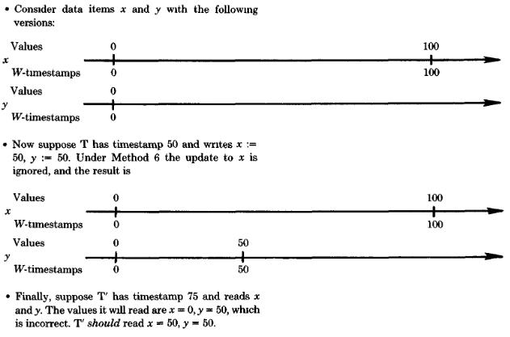

> **그림 15:** 방법 6에ㅔ서의 일관성 없는 검색

**방법 6: 쓰기-쓰기 동기화 (ww synchronization)를 위한 TWR (Thomas Write Rule)**

이 방법은 **부정확(incorrect)** 합니다.
**TWR**은 만약 $ts(W) < max\text{-}W\text{-}ts(x)$이면 $W$가 **무시(ignored)** 될 것을 요구합니다.
이는 나중에 발생하는 $dm\text{-}reads$가 **잘못된 데이터(incorrect data)** 를 읽게 만들 수 있습니다.
그림 15를 참조하십시오. (방법 6은 우리가 마주하게 될 유일하게 부정확한 방법입니다.)

**방법 7: 쓰기-쓰기 동기화 (ww synchronization)를 위한 다중 버전 T/O (Multiversion T / O)**

**조건 (A)** 와 **(B)** 는 **무효(null)** 입니다.
이 방법은 이전의 모든 방법들과 달리, $dm\text{-}writes$를 절대 **버퍼링(buffering)하지 않는다는 점에 유의하십시오.

**방법 8: 쓰기-쓰기 동기화 (ww synchronization)**를 위한 보수적 T / O (Conservative T / O)**

**조건 (A)** 는 **무효(null)** 입니다.
**조건 (B)** 는 어떤 **TM**에 대해 $ts(W) > min\text{-}W\text{-}ts(TM)$인 경우입니다.
**조건 (B)** 는 $dm\text{-}writes$가 **타임스탬프 순서(timestamp order)** 로 **출력(output)** 되도록 강제하며,
이는 $interval(P) = (ts(P), \infty)$ 임을 의미합니다.
**방법 5**에서와 같이, 이는 **단계 2**를 단순화합니다.

2. 만약 $ts(P) < max\text{-}R\text{-}ts(x)$ 이면, $P$는 **거부(rejected)** 됩니다.
    - 그 외의 경우 **버퍼링 (buffered)** 됩니다.

**방법 5**와 마찬가지로, 이 방법은 오직 **최대** $R\text{-}ts(x)$ (**maximum** $R\text{-}ts(x)$) 가 저장될 것만을 요구하며,
위에서 설명한 오래된 **버전 (versions)** 들에 대한 체계적인 **"삭제 (forgetting)"** 를 지원합니다.

**5.2.3. 읽기-쓰기 동기화를 위해 보수적 T/O를 사용하는 방법들 (Methods Using Conservative T/O for rw Synchronization**

남은 **T/O 방법**들은 **읽기-쓰기 동기화(rw synchronization)** 를 위해 **보수적 T/O (conservative T/O)** 를 사용합니다.
**방법 9**와 **10**은 각 **데이터 항목(data item)** 에 대해 $W\text{-}ts$들을 요구하며,
**방법 11**은 각 **데이터 항목**에 대해 **버전들의 집합(set of versions)** 을 요구합니다.
**방법 12**는 **데이터 항목 타임스탬프(data item timestamps)** 를 전혀 필요로 하지 않습니다.
$R$, $P$, $W$ 그리고 $min\text{-}P\text{-}ts$를 **섹션 5.2.1**에서와 같이 정의합니다.
$min\text{-}R\text{-}ts(TM)$ (또는 $min\text{-}W\text{-}ts(TM)$)를
해당 **TM**으로부터 **버퍼링된(buffered)** 임의의 $dm\text{-}read$ (또는 $dm\text{-}write$)의 **최소 타임스탬프 (minimum timestamp)** 라고 합시다.

1. 만약 어떤 **TM**에 대해 $ts(R) > min\text{-}W\text{-}ts(TM)$ 이면, $R$은 **버퍼링(buffered)** 됩니다.
    - 그 외의 경우 **출력(output)** 됩니다.
2. 만약 **조건 (A)** 가 성립하면, $P$는 **거부(rejected)** 됩니다.
    - 그 외의 경우 $P$는 **버퍼링(buffered)** 됩니다.
3. 만약 어떤 **TM**에 대해 $ts(W) > min\text{-}R\text{-}ts(TM)$ 이거나 **조건 (B)** 가 성립하면, $W$는 **버퍼링(buffered)** 됩니다.
    - 그 외의 경우 $W$는 **출력(output)** 됩니다.
4. $W$가 **출력(output)** 되면, 그것의 **프리라이트(prewrite)** 는 **버퍼에서 제거(debuffered)** 됩니다.
    - $R$ 또는 $W$가 **출력(output)** 되거나 **버퍼링(buffered)** 될 때, **버퍼링된(buffered)** $dm\text{-}reads$와 $dm\text{-}writes$는 현재
      **출력(output)** 될 수 있는 것이 있는지 확인하기 위해 **재테스트(retested)** 됩니다.

**방법 9: 쓰기-쓰기 동기화(ww synchronization)를 위한 기본 T/O (Basic T/O)**

**조건 (A)** 는 $ts(P) < W\text{-}ts(x)$ 이며, **조건 (B)** 는 $ts(W) > min\text{-}P\text{-}ts(x)$ 입니다.

**방법 10: 쓰기-쓰기 동기화(ww synchronization)를 위한 TWR(Thomas Write Rule)**

**조건 (A)** 와 **(B)** 는 **무효(null)** 입니다.
하지만, 만약 $ts(W) < W\text{-}ts(x)$ 이면, $W$는 **데이터베이스(database)** 에 아무런 영향을 미치지 않습니다.
이 방법은 본질적으로 **SDD-1 동기 제어(concurrency control)** (*BERN80d*) 방식이며, 비록 **SDD-1** 내에서는 이 방법이 여러 방식으로 개선되었습니다.
**SDD-1**은 통신을 줄이고 **병행성(concurrency)** 수준을 높이기 위해 **클래스(classes)** 와 **충돌 그래프 분석(conflict graph analysis)** 을 사용합니다.

또한, **SDD-1**은 **읽기 집합(read-sets)** 의 **사전 선언(predeclaration)** 을 요구하며,
오직 $dm\text{-}reads$에 대해서만 **보수적 스케줄링(conservative scheduling)** 을 강제합니다.
그렇게 함으로써 $dm\text{-}reads$가 $dm\text{-}writes$를 기다리도록 강제하지만,
$dm\text{-}writes$가 더 작은 **타임스탬프(timestamps)** 를 가진 모든 $dm\text{-}reads$를 기다려야 한다고 고집하지는 않습니다.
따라서 **SDD-1**에서는 $dm\text{-}reads$가 **거부(rejected)** 될 수 있습니다.

**방법 11: 쓰기-쓰기 동기화 (ww synchronization)를 위한 다중 버전 T/O (Multiversion T / O)**

**조건 (A)** 와 **(B)** 는 **무효(null)** 입니다.
$W$가 **출력(output)** 되면, 타임스탬프 $ts(W)$를 가진 $x$의 **새로운 버전(new version)** 을 생성합니다.
$R$이 **출력(output)** 되면, $ts(R)$보다 작은 가장 큰 타임스탬프를 가진 **버전(version)** 을 읽습니다.

이 방법은 **다중 버전 T/O**가 $dm\text{-}reads$가 **거부(rejected)** 되는 것을 "자동으로" 방지하고,
$dm\text{-}writes$를 **버퍼링(buffer)** 할 필요를 없게 만든다는 점을 주목함으로써 **최적화(optimized)** 될 수 있습니다.
따라서 **단계 3**은 다음과 같이 단순화될 수 있습니다.

3. $W$**는 즉시 출력(output)됩니다.**

**방법 12: 쓰기-쓰기 동기화(ww synchronization)를 위한 보수적 T / O (Conservative T / O)**

**조건 (A)** 는 **무효(null)** 입니다.
**조건 (B)** 는 어떤 **TM**에 대해 $ts(W) > min\text{-}W\text{-}ts(TM)$인 경우입니다.

그 효과는 **스케줄러(scheduler)** 가 앞으로 수신하게 될 작업들 중 $ts(W)$보다
작은 **타임스탬프(timestamps)** 를 가진 모든 작업들을 이미 수신한 경우에 $W$를 **출력(output)** 하는 것입니다.
**방법 12**는 (*CHEN80*, *KANE79*, 그리고 *SHAP77a*)에서 제안되었습니다.

#### 5.3. 2PL과 T/O의 혼합 방법 (Mixed 2PL and T / O Methods)

**2PL**과 **T/O**를 결합하는 방법들을 구축하는 데 있어 주요한 어려움은 두 기법 사이의 **인터페이스(interface)** 를 개발하는 데 있습니다.
각 기법은 **읽기-쓰기 (rw)** (또는 **쓰기-쓰기 (ww)**) 동기화를 위해 사용될 때 **비순환적(acyclic)** 인 $\to_{rw}$ (또는 $\to_{ww}$) 관계를 보장합니다.
**2PL**과 **T/O** 기법 사이의 **인터페이스(interface)** 는 결합된 $\to$ 관계(즉, $\to_{rw} \cup \to_{ww}$)가
**비순환적(acyclic)** 으로 유지되는 것을 보장해야 합니다.
즉, **인터페이스**는 **읽기-쓰기 기법(rw technique)** 에 의해 유도된 **직렬화 순서(serialization order)** 가
**쓰기-쓰기 기법(ww technique)** 에 의해 유도된 것과 일관되도록 보장해야 합니다.

**섹션 5.3.1**에서 우리는 이러한 보장을 가능하게 하는 **인터페이스**를 설명합니다.
그러한 **인터페이스**가 주어지면, 어떠한 **2PL** 기법도 어떠한 **T/O** 기법과 통합될 수 있습니다.
**섹션 5.3.2**와 **5.3.3**은 그러한 방법들을 설명합니다.

**5.3.1. 인터페이스 (The Interface)**

임의의 **2PL 기법(2PL technique)** 에 의해 유도된 **직렬화 순서(serialization order)** 는
동기화된 트랜잭션들의 **잠금 지점(locked points)** 에 의해 결정됩니다 (섹션 3 참조).
**T/O 기법(T/O technique)** 에 의해 유도된 **직렬화 순서(serialization order)** 는 동기화된 트랜잭션들의 **타임스탬프(timestamps)** 에 의해 결정됩니다.
따라서 **2P**L과 **T/O**를 연동(interface)하기 위해, 우리는 **잠금 지점(locked points)** 을 사용하여 **타임스탬프(timestamps)** 를 유도합니다(*BERN80b*).

각 데이터 항목과 연관된 것은 **잠금 타임스탬프(lock timestamp)** 인 $L\text{-}ts(x)$입니다.
트랜잭션 $T$가 $x$의 잠금을 설정할 때, 그것은 동시에 $L\text{-}ts(x)$를 **검색(retrieves)** 합니다.
$T$가 자신의 **잠금 지점(locked point)** 에 도달하면, 그것은 자신이 검색한 그 어떤 $L\text{-}ts$보다 큰 **타임스탬프** $ts(T)$를 할당받습니다.
$T$가 $x$에 대한 잠금을 해제할 때, $L\text{-}ts(x)$를 $\max(L\text{-}ts(x), ts(T))$가 되도록 업데이트합니다.

이러한 방식으로 생성된 **타임스탬프(Timestamps)** 는 **2PL**에 의해 유도된 **직렬화 순서(serialization order)** 와 일관됩니다.
즉, **2PL**에 의해 유도된 임의의 직렬화에서 $T_j$가 $T_k$보다 반드시 앞서야 한다면, $ts(T_j) < ts(T_k)$입니다.
이를 확인하기 위해, 임의의 직렬화에서 $T_1$이 $T_n$보다 앞서야 하는 트랜잭션 쌍 $T_1$과 $T_n$이 있다고 가정해 봅시다.

따라서 $i = 1, \dots, n-1$에 대하여 (a) $T_i$의 **잠금 지점(locked point)** 이 $T_{i+1}$의 **잠금 지점**보다 앞서고,
(b) $T_i$가 어떤 데이터 항목 $x$에 대한 잠금을 해제한 후 $T_{i+1}$이 $x$에 대한 잠금을 획득하는, 트랜잭션들 $T_1, T_2, \dots, T_{n-1}, T_n$이 존재합니다.
$T_{i+1}$에 의해 검색된 $L\text{-}ts(x)$를 $L$이라고 합시다.
그러면 $ts(T_i) < L < ts(T_{i+1})$ 이 성립하며, **귀납법(induction)** 에 의해 $ts(T_1) < ts(T_n)$ 이 됩니다.

**5.3.2 rw 동기화를 위해 2PL을 사용하는 혼합 방법**

**rw 동기화**(rw synchronization)에는 **2PL**이 사용되고 **ww 동기화**(ww synchronization)에는 **T/O**가 사용되는 **12가지의 주요 방법**(principal
methods)이 있습니다.

| 방법 (Method) | 읽기-쓰기 기법 (rw technique)     | 쓰기-쓰기 기법(ww technique)              |
|:-----------:|:----------------------------|:------------------------------------|
|    **1**    | 기본 2PL (Basic 2PL)          | 기본 T/O (Basic T/O)                  |
|    **2**    | 기본 2PL (Basic 2PL)          | 토마스 쓰기 T/O (Thomas Write Rule, TWR) |
|    **3**    | 기본 2PL (Basic 2PL)          | 다중 버전 T/O (Multiversion T/O)        |
|    **4**    | 기본 2PL (Basic 2PL)          | 보수적 T/O (Conservative T/O)          |
|    **5**    | 주 사본 2PL (Primary copy 2PL) | 기본 T/O (Basic T/O)                  |
|    **6**    | 주 사본 2PL (Primary copy 2PL) | 토마스 쓰기 T/O (Thomas Write Rule, TWR) |
|    **7**    | 주 사본 2PL (Primary copy 2PL) | 다중 버전 T/O (Multiversion T/O)        |
|    **8**    | 주 사본 2PL (Primary copy 2PL) | 보수적 T/O (Conservative T/O)          |
|    **9**    | 보수적 T/O (Conservative T/O)  | 기본 T/O (Basic T/O)                  |
|   **10**    | 보수적 T/O (Conservative T/O)  | 토마스 쓰기 T/O (Thomas Write Rule, TWR) |
|   **11**    | 보수적 T/O (Conservative T/O)  | 다중 버전 T/O (Multiversion T/O)        |
|   **12**    | 보수적 T/O (Conservative T/O)  | 보수적 T/O (Conservative T/O)          |

**방법 2**는 이 부류의 방법들을 가장 잘 예증하며, 우리가 상세히 설명하는 유일한 방법입니다.
**방법 2**는 저장된 모든 **데이터 항목**(data item)이 $L\text{-}ts$와 $W\text{-}ts$를 가질 것을 요구합니다.
(하나의 **타임스탬프**(timestamp)가 두 역할을 모두 수행할 수 있지만, 여기서는 이 **최적화**(optimization)를 고려하지 않습니다.)
$X$를 복사본 $x_1, \dots, x_m$을 가진 **논리적 데이터 항목**(logical data item)이라고 가정합시다.
$X$를 **읽기**(read) 위해, **트랜잭션** $T$($Transaction\ T$)는 $X$의 임의의 복사본(예: $x_i$)에 대해 **dm-읽기**(dm-read)를 발행합니다.
이 **dm-읽기**(dm-read)는 암시적으로 $x_i$에 대한 **읽기 잠금**(readlock)을 요청하며,
**읽기 잠금**(readlock)이 승인되면 $L\text{-}ts(x_i)$가 $T$에게 반환됩니다.
$X$에 **쓰기**(write) 위해, $T$는 $X$의 모든 복사본에 대해 **사전 쓰기**(prewrites)를 발행합니다.
이 **사전 쓰기**(prewrites)는 해당 복사본들에 대한 **rw 쓰기 잠금**(rw writelocks)을 암시적으로 요청하며,
각 **쓰기 잠금**(writelock)이 승인됨에 따라 해당 $L\text{-}ts$가 $T$에게 반환됩니다.
$T$가 모든 **잠금**(locks)을 획득하면, **5.3.1절**에서와 같이 $ts(T)$가 계산됩니다.
$T$는 $ts(T)$를 자신의 **dm-쓰기**(dm-writes)에 첨부하여 전송합니다.

**dm-쓰기**(dm-writes)는 **TWR**(Thomas Write Rule)을 사용하여 처리됩니다.
$W$를 $dm\text{-}write(x_j)$라고 합시다.
만약 $ts(W) > W\text{-}ts(x_j)$이면, **dm-쓰기**(dm-write)는 평상시처럼 처리됩니다($x_j$가 업데이트됨).
그러나 만약 $ts(W) < W\text{-}ts(x_j)$이면, $W$는 무시됩니다.

이 방법의 흥미로운 특성은 **쓰기 잠금**(writelocks)이 다른 **쓰기 잠금**(writelocks)과 절대 충돌하지 않는다는 것입니다.
**사전 쓰기**(prewrites)를 통해 획득한 **쓰기 잠금**(writelocks)은 오직 **rw 동기화**(rw synchronization)를 위해서만 사용되며,
**읽기 잠금**(readlocks)과만 충돌합니다.
이는 **쓰기 집합**(writesets)이 겹치더라도 **트랜잭션**(transactions)이 완료될 때까지 **동시**(concurrently)에 실행될 수 있도록 허용합니다.
이러한 **동시성**(concurrency)은 순수한 **2PL** 방식에서는 절대 불가능합니다.

**5.3.3. rw 동기화를 위해 T/O를 사용하는 혼합 방법**

**rw 동기화**(rw synchronization)에는 **T/O**가 사용되고 **ww 동기화**(ww synchronization)에는 **2PL**을 사용하는 **12가지의 주요 방법**(principal
methods) 또한 존재합니다.

| 방법 (Method) | 읽기-쓰기 기법 (rw technique)      | 쓰기-쓰기 기법(ww technique)      |
|:-----------:|:-----------------------------|:----------------------------|
|    **1**    | 기본 T/O (Basic T/O)           | 기본 2PL (Basic 2PL)          |
|    **2**    | 기본 T/O (Basic T/O)           | 주 사본 2PL (Primary copy 2PL) |
|    **3**    | 기본 T/O (Basic T/O)           | 투표 2PL (Voting 2PL)         |
|    **4**    | 기본 T/O (Basic T/O)           | 보수적 2PL (Conservative 2PL)  |
|    **5**    | 다중 버전 T/O (Multiversion T/O) | 기본 2PL (Basic 2PL)          |
|    **6**    | 다중 버전 T/O (Multiversion T/O) | 주 사본 2PL (Primary copy 2PL) |
|    **7**    | 다중 버전 T/O (Multiversion T/O) | 투표 2PL (Voting 2PL)         |
|    **8**    | 다중 버전 T/O (Multiversion T/O) | 보수적 2PL (Conservative 2PL)  |
|    **9**    | 보수적 T/O (Conservative T/O)   | 기본 2PL (Basic 2PL)          |
|   **10**    | 보수적 T/O (Conservative T/O)   | 주 사본 2PL (Primary copy 2PL) |
|   **11**    | 보수적 T/O (Conservative T/O)   | 투표 2PL (Voting 2PL)         |
|   **12**    | 보수적 T/O (Conservative T/O)   | 보수적 2PL (Conservative 2PL)  |

이 방법들은 모두 **쓰기 잠금의 사전 선언**(predeclaration of writelocks)을 요구합니다.
**rw 동기화**(rw synchronization)를 위해 **T/O**가 사용되므로, **트랜잭션**(transactions)은
**dm-읽기**(dm-reads)를 발행하기 전에 **타임스탬프**(timestamps)를 할당받아야 합니다.
그러나 **5.3.1절**의 **타임스탬프 생성 기법**(timestamp generation technique)은
**트랜잭션**(transaction)이 **타임스탬프**(timestamp)를 할당받기 전에 자신의 **잠금 지점**(locked point)에 도달해 있을 것을 요구합니다.

따라서 모든 **트랜잭션**(transaction)은 어떠한 **dm-읽기**(dm-reads)를 발행하기 전에 자신의 **잠금 지점**(locked point)에 있어야 합니다.
다시 말해, 모든 **트랜잭션**(transaction)은 자신의 **주요 실행**(main execution)을 시작하기 전에 모든 **쓰기 잠금**(writelocks)을 획득해야만 합니다.

이 방법들을 예증하기 위해, 우리는 **방법 17**을 설명합니다.
이 방법은 각각의 **저장된 데이터 항목**(stored data item)이 한 세트의 $R\text{-}ts$와
한 세트의 $(W\text{-}ts, value)$ **쌍**(즉, **버전**(versions))을 가질 것을 요구합니다.

임의의 데이터 항목의 $L\text{-}ts$는 해당 항목이 가진 $R\text{-}ts$와 $W\text{-}ts$들의 **최댓값**(maximum)입니다.

**주요 실행**(main execution)을 시작하기 전에, **트랜잭션** $T$는 자신의 **쓰기 집합**(writeset)에 있는
모든 **데이터 항목**(data item)의 모든 복사본에 대해 **사전 쓰기**(prewrites)를 발행합니다.
이 **사전 쓰기**(prewrites)들은 **ww 동기화**(ww synchronization), **rw 동기화**(rw synchronization),
그리고 이 기법들 사이의 **인터페이스**(interface)에서 역할을 수행합니다.

$P$를 **사전 쓰기**(prewrite)($x$)라고 합시다.
$P$의 **ww 역할**(ww role)은 $x$에 대한 **ww 쓰기 잠금**(ww writelock)을 요청하는 것입니다.
**잠금**(lock)이 승인되면, $L\text{-}ts(x)$가 $T$에게 반환됩니다.
이것이 $P$의 **인터페이스 역할**(interface role)입니다.

또한 **잠금**(lock)이 승인되면, $P$는 **버퍼링**(buffered)되며 **rw 동기화 메커니즘**(rw synchronization mechanism)은
$L\text{-}ts(x)$보다 큰 **타임스탬프**(timestamp)를 가진 **dm-쓰기**(dm-write)가 **보류**(pending) 중임을 통지받습니다.
이것이 그것의 **rw 역할**(rw role)입니다.
**트랜잭션** $T$가 자신의 모든 **쓰기 잠금**(writelocks)을 획득하면, **5.3.1절**에서와 같이 $ts(T)$가 계산되고 $T$는 **주요 실행**(main execution)을 시작합니다.
$T$는 $ts(T)$를 자신의 **dm-읽기**(dm-reads)와 **dm-쓰기**(dm-writes)에 첨부하며,
**rw 동기화**(rw synchronization)는 다음과 같이 **다중 버전 T/O**(multiversion T/O)에 의해 수행됩니다.

1. $R$을 **dm-읽기**(dm-read)($x$)라고 합시다.
    - 만약 ($T$에 의해 발행된 것을 제외하고) **버퍼링된 사전 쓰기**(buffered prewrite)($x$)가 존재하고, $L\text{-}ts(x) < ts(T)$라면, $R$은 **버퍼링**(
      buffered)됩니다.
    - 그렇지 않으면 $R$은 출력되고 $ts(T)$보다 작은 가장 큰 **타임스탬프**(timestamp)를 가진 $x$의 **버전**(version)을 읽습니다.
2. $W$를 **dm-쓰기**(dm-write)($x$)라고 합시다.
    - $W$는 즉시 출력되며 $ts(T)$를 **타임스탬프**(timestamp)로 갖는 $x$의 새로운 **버전**(version)을 생성합니다.
3. $W$가 출력되면, 그것의 **사전 쓰기**(prewrite)는 **디버퍼링**(debuffered)되고, $x$에 대한 **쓰기 잠금**(writelock)은 해제됩니다.
    - 이는 $L\text{-}ts(x)$가 $max(L\text{-}ts(x), ts(T)) = ts(T)$로 업데이트되도록 합니다.

이 방법의 한 가지 흥미로운 특성은 **ww 동기화**(ww synchronization)에 의해
발생하는 **교착 상태**(deadlocks)를 방지하거나 해결하기 위해서만 **재시작**(restarts)이 필요하다는 점입니다.
**rw 충돌**(rw conflicts)은 절대 **재시작**(restarts)을 일으키지 않습니다.
이러한 특성은 순수한 **2PL** 방법으로는 얻을 수 없습니다.
순수 **T/O** 방법으로는 얻을 수 있지만, **rw 동기화**(rw synchronization)를 위해 **보수적 T/O**(conservative T/O)를 사용하는 경우에만 가능합니다.
많은 경우 **보수적 T/O**(conservative T/O)는 과도한 **지연**(delay)을 초래하거나 그렇지 않으면 실행 불가능합니다.

**질의**(queries)에 대한 이 방법의 동작 또한 흥미롭습니다.
**질의**(queries)는 **쓰기 잠금**(writelocks)을 설정하지 않으므로, **타임스탬프 생성 규칙**(timestamp generation rule)이 적용되지 않습니다.
따라서 시스템은 **질의**(query)에 대해 원하는 어떠한 **타임스탬프**(timestamp)든 자유롭게 할당할 수 있습니다.

시스템은 작은 **타임스탬프**(timestamp)를 할당할 수 있는데, 이 경우 **질의**(query)는 오래된 데이터를 읽게 되지만
**버퍼링된 사전 쓰기**(buffered prewrites)에 의해 **지연**(delayed)될 가능성이 낮습니다.
또는 큰 **타임스탬프**(timestamp)를 할당할 수 있으며, 이 경우 **질의**(query)는 최신 데이터를 읽겠지만 **지연**(delayed)될 가능성이 더 높습니다.
그러나 어떤 **타임스탬프**(timestamp)가 선택되더라도, **질의**(query)는 **업데이트**(update)가 거절되게 할 수 없습니다.
이 특성은 어떠한 순수 **2PL**이나 **T/O** 방법으로도 쉽게 얻을 수 없습니다.

우리는 또한 이 방법이 **타임스탬프 순서**(timestamp order)로 **버전**(versions)들을 생성하며,
따라서 **오래된 버전**(old versions)들에 대한 **체계적인 망각**(systematic forgetting)이 가능하다는 점을 관찰합니다 (**5.2.2절** 참조).

또한, 이 방법은 오직 **최댓값**(maximum)인 $R\text{-}ts$만을 요구하며 더 작은 것들은 **즉시**(instantly) 잊혀질 수 있습니다.

### 결론

우리는 **분산 데이터베이스 동시성 제어 알고리즘**(distributed database concurrency control algorithms)의
설계 및 분석을 위한 **프레임워크**(framework)를 제시했습니다.
이 **프레임워크**(framework)는 두 가지 주요 구성 요소를 가집니다.

1. 다양한 **동시성 제어 알고리즘**(concurrency control algorithms)을 설명하기 위한 공통 용어와 개념을 제공하는 **시스템 모델**(system model),
2. 그리고 **동시성 제어 알고리즘**(concurrency control algorithms)을 **읽기-쓰기**(read-write) 및 **쓰기-쓰기**(write-write) **동기화 하위 알고리즘**(
   synchronization sub-algorithms)으로 분해하는 **문제 분해**(problem decomposition)입니다.

우리는 특정 **동시성 제어 알고리즘**(concurrency control algorithms)의 맥락 밖에서 **동기화 하위 알고리즘**(synchronization sub-algorithms)들을 고려했습니다.
사실상 알려진 모든 데이터베이스 **동기화 알고리즘**(synchronization algorithms)은
두 가지 기본 기술인 **2단계 잠금**(two-phase locking)(**2PL**)과 **타임스탬프 순서**(timestamp ordering) (**T/O**)의 변형입니다.
우리는 각 기술의 **주요 변형**(principal variations)들을 설명했으나, 모든 가능한 변형을 망라했다고 주장하지는 않습니다.
또한, 각 변형을 효과적으로 만들기 위해 해결되어야 하는 **부수적인 문제**(ancillary problems)(예: **교착 상태 해결**(deadlock resolution))들을 설명했습니다.

우리는 설명된 기술들을 통합하여 완전한 **동시성 제어 알고리즘**(concurrency control algorithms)을 형성하는 방법을 보여주었습니다.
우리는 **47개**의 **동시성 제어 알고리즘**(concurrency control algorithms)을 나열했으며, 그중 **25개**를 상세히 설명했습니다.
이 목록에는 이전에 문헌에서 설명된 거의 모든 **동시성 제어 알고리즘**(concurrency control algorithms)과 몇 가지 새로운 알고리즘이 포함되어 있습니다.
이러한 **최신 기술 수준**(state of the art)의 극단적인 통합은 상당 부분 앞서 설정한 우리의 **프레임워크**(framework) 덕분에 가능했습니다.

이 논문의 초점은 주로 **동기화 기법**(synchronization techniques)과 **동시성 제어 알고리즘**(concurrency control algorithms)의
**구조**(structure) 및 **정확성**(correctness)에 맞춰져 왔습니다.
우리는 매우 중요한 문제인 **성능**(performance)을 미결 상태로 남겨 두었습니다.

**동시성 제어 알고리즘**(concurrency control algorithms)의 주요 **성능 지표**(performance metrics)는
$System\ Throughput$(시스템 처리량)과 $Transaction\ Response\ Time$(트랜잭션 응답 시간)입니다.
네 가지 **비용 요인**(cost factors)이 이러한 지표들에 영향을 미칩니다.

- **사이트 간 통신**(intersite communication)
- **로컬 처리**(local processing)
- **트랜잭션 재시작**(transaction restarts)
- **트랜잭션 차단**(transaction blocking)

각 **비용 요인**(cost factor)이 **시스템 처리량**(system throughput)과 **응답 시간**(response time)에 미치는 영향은
**알고리즘**(algorithm)마다, **시스템**(system)마다, 그리고 **애플리케이션**(application)마다 다릅니다.
이러한 영향은 상세히 이해되지 않았으며, 성능에 대한 포괄적인 **정량적 분석**(quantitative analysis)은 **최신 기술 수준**(state of the art)을 벗어나 있습니다.
**Garcia-Molina(*GARC79a*)** 와 **Reis(*REIS79a*)** 의 최근 논문들이 그러한 분석을 향한 첫걸음을 내디뎠지만, 분명히 해야 할 일이 많이 남아 있습니다.

우리는 **분산 동시성 제어**(distributed concurrency control)에 관한 향후 연구가 알고리즘의 **성능**(performance)에 집중되기를 희망하며, 실제로 권장합니다.
우리가 살펴본 바와 같이 알려진 많은 방법들이 존재합니다.
이제 문제는 어떤 것이 **최선**(best)인지 결정하는 것입니다.

### 부록. 기타 동시성 제어 방법

이 **부록**(appendix)에서 우리는 **3 ~ 5절**의 **프레임워크**(framework)에 부합하지 않는
세 가지 **동시성 제어 방법**(concurrency control methods)을 설명합니다.
Badal *BADA79*, Bayer et al. *BAYE80*, 그리고 Casanova *CASA79*의 **검증자 방법**(certifier methods),
Thomas *THOM79*의 **다수결 합의 알고리즘**(majority consensus algorithm), 그리고 Ellis *ELLI77*의 **링 알고리즘**(ring algorithm)입니다.
우리는 이러한 방법들이 **DDBMS**에서 실용적이지 않다고 주장합니다.
**검증자 방법**(certifier methods)은 **중앙 집중형 DBMS**에서는 유망해 보이지만,
이러한 방법들이 **분산 시스템**(distributed systems)으로 올바르게 확장되기 위해서는 심각한 **기술적 문제**(technical problems)들이 해결되어야 합니다.
대조적으로, Thomas와 Ellis 알고리즘은 **DDBMS 동시성 제어**(DDBMS concurrency control)를 위해 제안된 가장 초기 알고리즘들에 속합니다.
이 알고리즘들은 해당 분야에 몇 가지 중요한 기술들을 도입했지만, 우리가 보게 될 것처럼 **최근의 발전**(recent developments)에 의해 추월당했습니다.

#### A1. 검증자 (Certifier)

**A1.1 검증 방식 (The Certifier Approach)**

**검증 방식**(certification approach)에서, **dm-reads**와 **사전 쓰기**(prewrites)는
어떠한 **동기화**(synchronization)도 없이 **DM**들에 의해 **선착순**(first-come/first-served)으로 처리됩니다.
**DM**들은 **rw 및 ww 충돌**에 관한 **요약 정보**(summary information)를 유지하며, 작업이 처리될 때마다 이를 업데이트합니다.
그러나 **dm-reads**와 **사전 쓰기**(prewrites)는 그러한 **충돌**(conflict)의 발견을 근거로 절대 **차단**(blocked)되거나 **거절**(rejected)되지 않습니다.

**동기화**(Synchronization)는 **트랜잭션**(transaction)이 **종료**(terminate)를 시도할 때 발생합니다.
**트랜잭션** $T$가 자신의 **END**를 발행할 때, **DBMS**는 $T$를 **검증**(certify)하고, 그에 따라 **커밋**(commit)할지 여부를 결정합니다.

이 결정이 어떻게 내려지는지 이해하기 위해, 우리는 "**전체**"(total) 실행과 "**커밋된**"(committed) 실행을 구별해야 합니다.
**트랜잭션**(transactions)의 **전체 실행**(total execution)은 특정 시점까지 시스템에 의해 처리된 모든 **작업**(operations)의 실행을 포함합니다.

**커밋된 실행**(committed execution)은 **전체 실행**(total execution)의 일부분으로,
오직 **커밋된 트랜잭션**(committed transactions)들을 대신하여 처리된 **dm-reads**와 **dm-writes**만을 포함합니다.
즉, **커밋된 실행**(committed execution)은 모든 **활성 트랜잭션**(active transactions)을 **중단**(aborting)하고
(재시작하지 않았을 때) 결과로 나타나는 **전체 실행**(total execution)입니다.

$T$가 자신의 **END**를 발행할 때, 시스템은 $T$의 실행으로 확장된 **커밋된 실행**(committed execution)이 **직렬 가능**(serializable)한지,
즉 $T$를 **커밋**(committing)한 후의 결과인 **커밋된 실행**(committed execution)이 여전히 **직렬 가능**(serializable)할지 테스트합니다.
만약 그렇다면 $T$는 **커밋**(committed)됩니다.
그렇지 않으면 $T$는 **재시작**(restarted)됩니다.

**검증**(certification)을 다른 접근 방식과 구별하는 두 가지 특성이 있습니다.
첫째, **동기화**(synchronization)는 오직 **재시작**(restarts)에 의해서만 달성되며, 절대 **차단**(blocking)에 의해서는 이루어지지 않습니다.
그리고 **둘째**, 재시작(restart) 여부에 대한 결정은 **트랜잭션**(transaction)이 실행을 마친 후에 내려집니다.
**3~5절**에서 논의된 어떠한 **동시성 제어 방법**(concurrency control method)도 이 두 가지 특성을 모두 만족하지 않습니다.

**검증**(certification)의 **근거**(rationale)는 **실행 시간 충돌**(run-time conflicts)에 관한
**낙관적인 가정**(optimistic assumption)에 기반합니다.
만약 **실행 시간 충돌**(run-time conflicts)이 거의 예상되지 않는다면, 대부분의 실행이 **직렬 가능**(serializable)하다고 가정하는 것입니다.
**동기화**(synchronization) 없이 **dm-reads**와 **prewrites**(사전 쓰기)를 처리함으로써,
**동시성 제어 방법**(concurrency control method)은 **트랜잭션**(transaction)이 처리되는 동안 이를 절대 **지연**(delay)시키지 않습니다.
트랜잭션이 종료될 때 오직 (빠르기를 희망하는) **검증 테스트**(certification test)만이 요구됩니다.
**낙관적인 트랜잭션 동작**(optimistic transaction behavior)이 주어진다면,
그 테스트는 대개 **트랜잭션**(transaction)을 **커밋**(committing)하는 결과로 이어지며, 따라서 **재시작**(restarts)은 거의 발생하지 않습니다.
그러므로 **검증**(certification)은 낙관적인 상황에서 **차단**(blocking)과 **재시작**(restarts)을 동시에 방지합니다.

**검증 동시성 제어 방법**(certification concurrency control method)은 **dm-reads**와 **prewrites**(사전 쓰기)가 처리될 때 그 정보를 저장하기 위한
**요약 알고리즘**(summarization algorithm)과, **트랜잭션**(transaction)이 종료될 때 그 정보를 사용하여 트랜잭션을 검증하기 위한
**검증 알고리즘**(certification algorithm)을 반드시 포함해야 합니다.
**요약 알고리즘**(summarization algorithm)에서의 주요 과제는
이미 **검증된 트랜잭션**(already-certified transactions)들에 대한 정보를 저장할 필요를 피하는 것입니다.
**검증 알고리즘**(certification algorithm)에서의 주요 과제는 **요약 정보**(summary information)의 **일관된 사본**(consistent copy)을 얻는 것입니다.
이를 위해 **검증 알고리즘**(certification algorithm)은 종종 자체적인 **동기화**(synchronization)를 수행해야 하며,
그 **비용**(cost)은 전체 방법의 비용에 포함되어야 합니다.

**A1.2 $\to$ 관계를 이용한 검증 (Certification Using the $\to$ Relation)**

한 가지 **검증 방법**(certification method)은 **dm-reads**와 **사전 쓰기**(prewrites)가 처리될 때 $\to$ **관계**를 구축하는 것입니다.
**트랜잭션**(transaction)을 **검증**(certify)하기 위해, 시스템은 $\to$가 **비순환적**(acyclic)인지 확인합니다(*BADA79, BAYE80, CASA79*).
$\to$를 구축하기 위해 각 **사이트**(site)는 각 **데이터 항목**(data item)을 읽거나 쓴 가장 최근의 **트랜잭션**(transaction)을 기억합니다.

**트랜잭션** $T_i$와 $T_j$가 데이터 항목 $x$를 (각각) 마지막으로 **읽고**(read) **쓴**(write) 트랜잭션이라고 가정해 봅시다.
만약 **트랜잭션** $T_k$가 이제 $dm\text{-}read(x)$를 발행한다면, $T_j \to T_k$가 해당 사이트의 **요약 정보**(summary information)에 추가되고,
$T_k$는 $x$를 읽은 마지막 트랜잭션으로서 $T_i$를 대체합니다.
이와 같이 $\to$의 조각들은 각 사이트에서의 **실행 시간 충돌**(run-time conflicts)을 반영하며 사이트들 사이에 분산됩니다.
**트랜잭션**(transaction)을 **검증**(certify)하기 위해, 시스템은 해당 트랜잭션이 $\to$ 내의 **사이클**(cycle)에 놓여 있지 않은지 확인해야 합니다(**2절의 정리 2** 참조).
**비순환성**(acyclicity)을 보장하는 것은 **직렬 가능성**(serializability)을 보장하기에 충분합니다.

이 **접근 방식**(approach)에는 두 가지 문제가 있습니다.
첫째, **검증된 트랜잭션**(certified transaction)의 모든 **업데이트**(updates)가 **커밋**(committed)되었더라도
$\to$에서 이를 삭제하는 것은 일반적으로 올바르지 않습니다.
예를 들어, 만약 $T_i \to T_j$이고 $T_i$는 **활성**(active) 상태이지만 $T_j$는 **커밋**(committed)된 상태라면, 여전히 $T_j \to T_i$가 발생할 가능성이 있습니다.
이때 $T_j$를 삭제하면 $T_i$가 검증(certified)될 때 사이클 $T_i \to T_j \to T_i$가 **감지되지 않은**(unnoticed) 채 지나가게 됩니다.

그러나 $\to$가 **무기한으로**(indefinitely) 커지도록 허용하는 것은 분명히 **실용적**(feasible)이지 않습니다.
이 문제는 **Casanova(*CASA79*)** 에 의해 **활성 트랜잭션**(active transactions)의 수에 **비례하는**(proportional to) 공간에
**커밋된 트랜잭션**(committed transactions)에 대한 정보를 **인코딩**(encoding)하는 방법으로 해결되었습니다.

**두 번째 문제**(second problem)는 어떠한 **트랜잭션**(transaction)을 **검증**(certify)하기 위해 **모든 사이트**(all sites)를 확인해야 한다는 점입니다.
해당 **트랜잭션**이 전혀 **데이터에 액세스**(accessed data)하지 않은 사이트들조차 $\to$의 **사이클 확인**(cycle checking)에 참여해야 합니다.
예를 들어, 우리가 **트랜잭션** $T$를 **검증**(certify)하려 한다고 가정해 봅시다.
$T$는 사이클 $T \to T_1 \to T_2 \to \dots \to T_{n-1} \to T_n \to T$에 포함될 수 있으며,
여기서 각 **충돌**(conflict) $T_k \to T_{k+1}$은 서로 다른 사이트에서 발생했을 수 있습니다.

아마도 $T$는 오직 **단 하나의 사이트**(one site)에서만 데이터에 액세스했을 수도 있지만,
$T$를 **검증**(certify)하기 위해서는 $n$개의 사이트에서 $\to$ **관계**를 조사해야 합니다.
우리가 아는 한, 이 문제는 현재 **해결되지 않은**(unsolved) 상태입니다.
즉, $\to$의 사이클을 확인하는 이 방식에 기반한 어떠한 올바른 **검증자**(certifier)라도
각각의 모든 **트랜잭션**(transaction)을 **검증**(certify)하기 위해 **모든 사이트**의 $\to$ 관계에 액세스해야만 합니다.
이 문제가 해결되기 전까지, 우리는 **분산 환경**(distributed environment)에서
**검증 방식**(certification approach)이 **비실용적**(impractical)이라고 판단합니다.

#### A2. Thomas의 다수결 합의 알고리즘 (Thomas's Majority Consensus Algorithm)

**A2.1 알고리즘 (Algorithm)**

**분산 동시성 제어**(distributed concurrency control)를 위해 발표된 최초의 알고리즘 중 하나는 *THOM79*에 기술된 **검증 방식**(certification method)입니다.
**Thomas**는 해당 알고리즘에서 **Thomas 쓰기 규칙**(Thomas Write Rule)(3.2.3절), **다수결 투표**(majority voting)(3.1.1절),
그리고 **검증**(certification)(부록 A1)을 포함한 몇 가지 중요한 **동기화 기법**(synchronization techniques)을 도입했습니다.
이러한 기법들은 개별적으로 고려될 때는 가치가 있지만,
우리는 **Thomas 알고리즘**(Thomas algorithm) 전체가 **분산 데이터베이스**(distributed databases)에는 적합하지 않다고 주장합니다.
우리는 먼저 이 알고리즘을 설명한 다음, 그것의 **분산 데이터베이스**(distributed databases)에 대한 적용에 대해 논평하겠습니다.

**Thomas의 알고리즘**은 모든 **논리적 데이터 항목**(logical data item)이 모든 사이트에 저장되는 **완전 중복 데이터베이스**(fully redundant database)를 가정합니다.
각 복사본은 그것에 마지막으로 쓴 **트랜잭션**(transaction)의 **타임스탬프**(timestamp)를 가집니다.

**트랜잭션**(transactions)은 **두 단계**(two phases)로 실행됩니다.
**첫 번째 단계**(first phase)에서 각 **트랜잭션**(transaction)은 **트랜잭션의 홈 사이트**(transaction's home site)라고 불리는 한 사이트에서 로컬로 실행됩니다.
데이터베이스가 **완전 중복**(fully redundant)이므로, 모든 사이트가 모든 트랜잭션의 **홈 사이트**(home site) 역할을 할 수 있습니다.
**트랜잭션**(transaction)은 실행을 시작할 때 고유한 **타임스탬프**(timestamp)를 할당받습니다.
실행 중에 그것은 읽은 각 **데이터 항목**(data item)의 **타임스탬프**(timestamp)를 기록하며,
데이터 항목에 **쓰기**(write)를 실행할 때 **업데이트 리스트**(update list)에 새로운 값을 기록함으로써 쓰기를 처리합니다.
모든 **트랜잭션**(transaction)은 쓰기 전에 **데이터 항목**(data item)의 복사본을 반드시 읽어야 한다는 점에 유의하십시오.

**트랜잭션**(transaction)이 종료되면, 시스템은 읽은 **데이터 항목 목록**(list of data items read)과
읽었을 당시의 **타임스탬프**(timestamps)들을 **업데이트 리스트**(update list)에 추가합니다.
추가로, **트랜잭션**(transaction) 자체의 **타임스탬프**(timestamp)가 **업데이트 리스트**(update list)에 추가됩니다.
이것으로 실행의 **첫 번째 단계**(first phase)가 완료됩니다.

**두 번째 단계**(second phase)에서 **업데이트 리스트**(update list)는 모든 사이트로 전송됩니다.
**업데이트 리스트**(update list)를 생성한 사이트를 포함한 각 사이트가 해당 **업데이트 리스트**(update list)에 대해 **투표**(votes)합니다.
직관적으로 말해서, 만약 사이트가 **트랜잭션**(transaction)을 **검증**(certify)할 수 있다면 해당 **업데이트 리스트**(update list)에 대해 **찬성**(yes) 투표를 합니다.
사이트가 찬성 투표를 한 후, 해당 **업데이트 리스트**(update list)는 그 사이트에서 **보류**(pending) 중이라고 합니다.
**투표**(vote)를 행사하기 위해 사이트는 **트랜잭션의 홈 사이트**(transaction's home site)로 메시지를 보내며,
홈 사이트는 **과반수**(majority)의 찬성 또는 반대 투표를 받으면 모든 사이트에 결과를 알립니다.
만약 **과반수**(majority)가 찬성하면 모든 사이트는 업데이트를 **커밋**(commit)해야 하며, 이는 **TWR**(Thomas Write Rule)을 사용하여 설치됩니다.
만약 **과반수**(majority)가 반대하면 모든 사이트는 업데이트를 **폐기**(discard)하라는 지시를 받고, **트랜잭션**(transaction)은 **재시작**(restarted)됩니다.

사이트가 **트랜잭션**(transaction)에 대해 "**찬성**"("yes") 투표를 할 수 있는 시기를 결정하는 규칙은 알고리즘의 **정확성**(correctness)에 있어 중추적입니다.
**업데이트 리스트** $U$에 대해 투표하기 위해, 사이트는 $U$의 **읽기 집합**(readset)에 있는 각 데이터 항목의 **타임스탬프**(timestamp)를
해당 사이트의 **로컬 데이터베이스**(local database)에 있는 동일한 데이터 항목의 **타임스탬프**(timestamp)와 비교합니다.
만약 어떤 데이터 항목이라도 데이터베이스 내의 **타임스탬프**(timestamp)가 $U$에 있는 것과 다르다면, 사이트는 **반대**(no) 투표를 합니다.

그렇지 않으면, 사이트는 $U$의 **읽기 집합**(readset) 및 **쓰기 집합**(writeset)을 해당 사이트에서
**보류 중인 각 업데이트 리스트**(pending update list)의 **읽기 집합** 및 **쓰기 집합**과 비교하며,
만약 $U$와 **보류 중인 어떠한 업데이트 리스트**(pending update lists) 사이에도 **rw 충돌**이 없다면 **찬성**(yes) 투표를 합니다.
만약 $U$와 그러한 **보류 중인 요청**(pending requests)들 중 하나 사이에 **rw 충돌**이 있고,
$U$의 **타임스탬프**(timestamp)가 충돌하는 모든 **보류 중인 업데이트 리스트**(pending update lists)의 것보다 크다면, 사이트는 **기권**(pass/abstain) 투표를 합니다.
만약 **rw 충돌**이 있지만 $U$의 **타임스탬프**(timestamp)가 충돌하는 **보류 중인 업데이트 리스트**(pending update list)의 것보다 작다면,
해당 사이트는 $U$를 **대기 큐**(wait queue)에 보관하고 충돌하는 요청이 해당 사이트에서 **커밋**(committed)되거나 **중단**(aborted)되었을 때 다시 시도합니다.

**투표 규칙**(voting rule)은 본질적으로 **검증 절차**(certification procedure)입니다.
**타임스탬프 비교**(timestamp comparison)를 수행함으로써,
사이트는 **트랜잭션**(transaction)이 **읽기 집합**(readset)을 읽은 이후로 해당 집합에 쓰기 작업이 발생하지 않았는지 확인합니다.

만약 이 비교가 충족된다면, 상황은 마치 **트랜잭션**(transaction)이 해당 사이트에서 자신의 **읽기 집합**(readset)에 **잠금**(locked)을 설정하고
투표할 때까지 그 **잠금**(locks)을 유지한 것과 같습니다.
이로써 **투표 규칙**(voting rule)은 **rw 2PL**에 근접한 **검증 규칙**(certification rule)을 통해 **rw 동기화(rw synchronization)** 를 보장합니다.
(이 사실은 *BERN79b*에서 정확하게 증명되었습니다.)

**투표 규칙**(voting rule)의 두 번째 부분, 즉 $U$가 **보류 중인 업데이트 리스트들**(pending update lists)에 대해 **rw 충돌**이 있는지 확인하는 단계는,
충돌하는 요청들이 **동시**(concurrently)에 **검증**(certified)되지 않도록 보장합니다.
한 가지 예시가 이 문제를 설명해 줍니다.
$T_1$이 $X$와 $Y$를 **읽고**(reads) $Y$를 **쓰는**(writes) 반면, $T_2$는 $X$와 $Y$를 **읽고**(reads) $X$를 **쓰는**(writes) 상황을 가정해 봅시다.
$T_1$과 $T_2$가 각각 사이트 $A$와 $B$에서 실행되고, $X$와 $Y$가 두 사이트 모두에서 $0$의 **타임스탬프**(timestamps)를 가지고 있다고 가정합시다.

$T_1$과 $T_2$가 **동시**(concurrently)에 실행되어 거의 같은 시간에 투표 준비가 된 **업데이트 리스트**(update lists)를 생성한다고 가정합니다.
어느 쪽도 상대방의 출력을 읽지 않았으므로, $T_1$이나 $T_2$ 중 하나는 반드시 **재시작**(restarted)되어야 합니다.
만약 둘 다 **커밋**(committed)된다면, 그 결과는 **직렬 불가능**(nonserializable)하게 될 것입니다.
그러나 $T_1$과 $T_2$의 **업데이트 리스트**(update lists) 모두 $A$와 $B$ 두 곳에서 **타임스탬프 비교**(timestamp comparison)를 (동시에) 충족할 것입니다.
이들이 둘 다 만장일치의 **찬성**(yes) 투표를 얻지 못하도록 막는 것이 바로 투표 규칙의 두 번째 부분입니다.

사이트가 **트랜잭션**(transactions) 중 하나에 대해 투표한 후에는,
첫 번째 트랜잭션이 더 이상 **보류**(pending) 상태가 아닐 때까지 다른 **트랜잭션**(transaction)에 대해 투표하는 것이 차단됩니다.
따라서 충돌하는 **트랜잭션**(transactions)들을 동시에 **검증**(certify)하는 것은 불가능합니다.
(우리는 이러한 **동시 검증**(concurrent certification)의 문제가 **A1.2절**의 알고리즘들에서도 존재한다는 점에 주목합니다.
이는 **분산 환경**(distributed environment)에서의 **검증 방식**(certification approach)이 가진 또 다른 기술적 어려움입니다.)

**투표 규칙**(voting rule)의 **두 번째 부분**(second part)으로 인해,
알고리즘은 **검증 단계**(certification step)가 하나의 **주 사이트**(primary site)에서 **원자적으로 실행**(atomically executed)된 것처럼 동작합니다.
만약 **검증**(certification)이 **주 사이트**(primary site)에 **중앙 집중화**(centralized)된다면,
그 **주 사이트**(primary site)에서의 **검증 단계**(certification step)는 투표 방식에서의 **과반수 결정**(majority decision)과 동일한 역할을 수행하게 될 것입니다.

**A2.2 정확성 (Correctness)**

(*THOM79*)에서 **Thomas**가 상세한 "**개연성**"(plausibility) 논거를 제공했음에도 불구하고,
**Thomas 알고리즘**(Thomas' algorithm)의 **직렬 가능성**(serializability)에 대한 단순한 증명은 지금까지 입증된 바 없습니다.
**투표 규칙**(voting rule)의 첫 번째 부분은 **2PL**을 함의하므로
**중앙 집중식 동시성 제어 방법**(centralized concurrency control method)에서 올바르게 사용될 수 있으며(*BERN79b*),
이 접근 방식에 기반한 **중앙 집중식 방법**(centralized method)이 (*KUNG81*)에서 제안되었습니다.
**투표 규칙**(voting rule)의 두 번째 부분은 **과반수**(majority)의 **찬성 표**(yes votes)를 받은 모든 충돌하는 **트랜잭션**(transaction) 쌍에 대해,
두 트랜잭션 모두에 찬성 투표를 한 모든 **사이트**(sites)가 두 트랜잭션에 대해 동일한 순서로 투표했음을 보장합니다.
이는 **검증 단계**(certification step)가 마치 **중앙 집중화**(centralized)된 것처럼 동작하게 함으로써, 이전 문단에서 예시로 든 문제를 방지합니다.

**A2.3 부분 중복 데이터베이스 (Partially Redundant Databases)**

**다수결 합의 알고리즘**(majority consensus algorithm)이 **분산 데이터베이스 환경**(distributed database environment)에서 유용하려면,
데이터베이스가 오직 **부분 중복**(partially redundant)인 경우에도 올바르게 작동하도록 **일반화**(generalized)되어야 합니다.
그러한 **일반화**(generalization)가 **성능의 심각한 저하**(serious degradation of performance)나
사용되는 기법 세트의 **완전한 변경**(complete change) 없이는 달성될 수 있을지 의심할 이유가 있습니다.

첫째로, **투표 알고리즘**(voting algorithm)이 모든 사이트가 정확히 동일한 **검증 테스트**(certification test)를 수행한다는 사실에 의존하기 때문에,
**다수결 합의 결정 규칙**(majority consensus decision rule)은 분명히 폐기되어야 합니다.
**부분 중복 데이터베이스**(partially redundant database)에서, 각 사이트는 해당 사이트에 저장된 데이터 항목의 **타임스탬프**(timestamps)만을 비교할 것이며,
**다수결 투표**(majority vote)의 의미는 사라질 것입니다.

만약 **다수결 투표**(majority voting)가 **동시적 검증 테스트**(concurrent certification tests)를 **동기화**(synchronize)하는 데 사용될 수 없다면,
분명히 그 대신 일종의 **상호 배제 메커니즘**(mutual exclusion mechanism)이 사용되어야 합니다.
그것의 목적은 두 개의 **충돌하는 트랜잭션**(conflicting transactions)이 **동시**(concurrent)에,
따라서 잠재적으로 부정확하게 **검증**(certification)되는 것을 방지하는 것이며, 이는 **잠금**(locking)에 해당할 것입니다.
**검증 단계**(certification step)를 **동기화**(synchronizing)하기 위해 **잠금**(locks)을 사용하는 것은
**Thomas 알고리즘**(Thomas' algorithm)의 정신에 부합하지 않는데, 왜냐하면 그 알고리즘의 주요 목표가 **잠금**(locking)을 피하는 것이었기 때문입니다.
하지만, **부분 중복 데이터베이스**(partially redundant database)에서 **검증**(certification)이 어떻게 올바르게 완수될 수 있는지 확인하기 위해
그러한 **잠금 메커니즘**(locking mechanism)을 검토해 볼 가치가 있습니다.

**트랜잭션** $T$를 처리하기 위해, 사이트는 평소와 같이 **업데이트 리스트**(update list)를 생성합니다.
그러나 데이터베이스가 **부분 중복**(partially redundant)이므로, $T$의 **읽기 집합**(readset)의 일부를 다른 사이트들로부터 읽어오는 것이 필요할 수 있습니다.
$T$가 **종료**(terminates)된 후,
그것의 **업데이트 리스트**(update list)는 $T$의 **읽기 집합**(readset) 또는 **쓰기 집합**(writeset)의 일부를 포함하는 모든 사이트로 전송됩니다.

**업데이트 리스트**(update list)를 **검증**(certify)하기 위해,
사이트는 먼저 **읽기 집합**(readset)과 **쓰기 집합**(writeset)에 **로컬 잠금**(local locks)을 설정하고,
그런 다음 (**완전 중복** 경우와 마찬가지로) **업데이트 리스트**(update list)의 **타임스탬프**(timestamps)를 데이터베이스의 **타임스탬프**와 비교합니다.
만약 그것들이 동일하다면, 사이트는 **찬성**(yes) 투표를 합니다.
그렇지 않으면 **반대**(no) 투표를 합니다.
업데이트를 **커밋**(commit)하기 위해서는 **만장일치**(unanimous vote)의 찬성 표가 필요합니다.
**로컬 잠금**(local locks)은 **투표 결정**(voting decision)이 완료될 때까지 해제될 수 없습니다.

부분 중복 데이터를 위한 이 버전의 **Thomas 알고리즘**이 올바르게 작동하기는 하지만, 그 성능은 **표준 2PL**(standard 2PL)보다 열등합니다.
이 알고리즘은 **2PL**에서와 동일한 **잠금**(locks)이 설정되어야 하며, 동일한 **교착 상태**(deadlocks)가 발생할 수 있습니다.
그럼에도 불구하고 **재시작**(restart) 확률은 **2PL**보다 높은데, 모든 **잠금**(locks)을 획득한 후에도
**검증 단계**(certification step)에서 여전히 "**거절**"(vote no)을 할 수 있기 때문입니다(이는 **2PL**에서는 발생할 수 없는 일입니다).

각 데이터 항목의 **주 복사본**(primary copy)을 지정하고 **주 복사본**(primary copy)에 대해서만
**타임스탬프 비교**(timestamp comparison)를 수행하여, 이를 **주 복사본 2PL**과 유사하게 만들어 이 알고리즘을 개선할 수 있습니다.
하지만 위와 동일한 이유로, 우리는 **주 복사본 2PL**이 이 버전의 **Thomas 알고리즘**보다 성능이 뛰어날 것으로 기대합니다.
따라서 우리는 **부분 중복 데이터베이스**(partially redundant database)를 위한 효율적인 버전의 **Thomas 알고리즘**을 제작하는 문제를 미결 상태로 남겨두어야 합니다.

**A2.4 성능 (Performance)**

**완전 중복**(fully redundant)의 경우에도, **다수결 합의 알고리즘**(majority consensus algorithm)의 성능은 그리 좋지 않습니다.
첫째, 각 사이트에서 **검증**(certification)과 **충돌 감지**(conflict detection)를 반복하는 것은
**직렬 가능성**(serializability)을 얻기 위해 필요한 것 이상입니다.
**중앙 집중식 검증자**(centralized certifier)가 똑같이 잘 작동할 것이며,
오직 한 사이트에서만 **검증**(certification)이 수행되도록 요구할 것입니다.
둘째, **실행 시간 충돌**(run-time conflicts)이 있을 때 이 알고리즘은 **재시작**(restarts)에 상당히 취약한데,
**재시작**(restarts)이 **트랜잭션 동기화**(synchronizing transactions)를 위해 사용 가능한 유일한 전략이며,
따라서 가장 **낙관적인 상황**(most optimistic circumstances)에서만 잘 작동할 것이기 때문입니다.
마지막으로, 심지어 낙관적인 상황에서도 (*GARC79a*)의 분석은 **중앙 집중식 2PL**(centralized 2PL)이
**다수결 합의 알고리즘**(majority consensus algorithm)보다 성능이 우수함을 나타냅니다.

**A2.5 신뢰성 (Reliability)**

**다수결 합의 알고리즘**(majority consensus algorithm)의 **성능 문제**(performance problems)에도 불구하고,
**신뢰성**(reliability) 측면에서 이 알고리즘들을 정당화하려 시도할 수 있습니다.
**과반수**(majority)의 사이트가 정상적으로 작동하는 한, 알고리즘은 원활하게 실행됩니다.
따라서 **투표 절차**(voting procedure)에 관한 한, **사이트 장애**(site failure) 처리는 **비용이 들지 않습니다**(free).

하지만 현재의 지식으로 볼 때, 이러한 정당화는 몇 가지 이유로 설득력이 없습니다.
첫째, 비록 사이트가 **복구**(recovers)될 때 비용이 들지 않더라도 말입니다.
*ALSB76a***에서와 같이 백업 사이트(backup sites)를 사용하는 중앙 집중식 알고리즘(centralized algorithm)은
Thomas 알고리즘의 대칭성(symmetry)은 부족하지만, 사이트 복구(site recovery)의 단순함 덕분에 훨씬 더 효율적일 수 있습니다.**
**또한, 다수결 합의 알고리즘(majority consensus algorithm)은 원자적 커밋(atomic commitment) 문제를 고려하지 않으며,
이 알고리즘에 2단계 커밋**(two-phase commit; 2PC)을 어떻게 통합할지도 불분명합니다.

전반적으로, **다수결 합의 알고리즘**(majority consensus algorithm)에 의해 처리되는 **신뢰성 위협**(reliability threats)들은
명시적으로 나열되지 않았으며, 대안적인 해결책들도 분석되지 않았습니다.
**투표**(voting)가 어느 정도의 **신뢰성**(reliability)을 확보하기 위한 가능한 기술인 것은 분명하지만,
그것이 어떤 상황에서 **비용 효율적**(cost-effective)인지는 알려져 있지 않습니다.

#### A3. Ellis의 링 알고리즘 (Ellis' Ring Algorithm)

**분산 데이터베이스 동시성 제어**(distributed database concurrency control) 문제에 대한 또 다른 초기 솔루션은
**링 알고리즘**(ring algorithm)(*ELLI77*)입니다.
**Ellis**는 주로 **병행 알고리즘**(concurrent algorithms)의 **정확성**(correctness)을 증명하기 위해
$L\ systems$라고 불리는 **증명 기법**(proof technique)에 관심이 있었습니다.
그는 자신의 **동시성 제어 방법**(concurrency control method)을 주로 $L\text{-}system$ 증명을 설명하기 위한 예시로 개발했으며,
그것의 성능에 대해서는 어떠한 주장도 하지 않았습니다.

이 알고리즘은 단지 **수학적 기법**(mathematical techniques)을 설명하기 위한 의도였기 때문에,
**Ellis**는 **수학적 편의**(mathematical convenience)를 위해 알고리즘에 여러 **제한 사항**(restrictions)을 두었으며,
이는 실제 환경에서 이를 **비실용적**(infeasible)하게 만듭니다.
그럼에도 불구하고, 이 알고리즘은 문헌에서 상당한 주목을 받았으며, **완결성**(completeness)을 위해 우리는 이를 간략히 논의합니다.

**Ellis의 알고리즘**은 다음과 같은 제한 사항들을 가지고 **분산 동시성 제어**(distributed concurrency control) 문제를 해결합니다.

1. 데이터베이스는 반드시 **완전 중복**(fully redundant)이어야 합니다.
2. **통신 매체**(communication medium)는 반드시 **링**(ring) 형태여야 하며, 따라서 각 **사이트**(site)는 링 상의 자신의 **후속자**(successor)와만 통신할 수
   있습니다.
3. 각 **사이트 간 통신 링크**(site-to-site communication link)는 **파이프라인**(pipelined) 방식입니다.
4. 각 **사이트**(site)는 한 번에 **하나**(1) 이하의 **활성 업데이트 트랜잭션**(active update transaction)만을 감독할 수 있습니다.
5. 데이터베이스의 어떠한 복사본을 업데이트하기 위해서, **트랜잭션**은 먼저 **모든 사이트**(all sites)에 있는 **전체 데이터베이스**(entire database)에 대한 **잠금**(lock)을
   획득해야 합니다.

**제한 사항 5**의 효과는 모든 트랜잭션이 **직렬로**(serially) 실행되도록 강제하는 것입니다.
어떠한 **병렬 처리**(concurrent processing)도 불가능합니다.
이 이유만으로도, 알고리즘은 근본적으로 **비실용적**(impractical)입니다.

실행하기 위해, **업데이트 트랜잭션**(update transaction)은 링 주위를 이동하며
(본질적으로) **각 사이트에서 전체 데이터베이스**(entire database at each site)에 대한 **잠금**(lock)을 획득합니다.
그러나 **잠금 충돌 규칙**(lock conflict rules)은 비표준입니다.
사이트 $A$에서 시작된 트랜잭션의 잠금 요청은, 만약 $B = C$이고 ($A = B$이거나 $A$의 우선순위 $< B$의 우선순위)인 경우, 사이트
$B$에서 시작된 트랜잭션이 보유한 잠금과 사이트 $C$에서 충돌합니다.
링에 의해 유도된 **데이지 체인 통신**(daisy-chain communication)은 이 잠금 규칙과 결합되어 **교착 상태 감지**(deadlock detection)를 요구하지 않고
**재시작**(restarts)을 유도하지 않는 **교착 상태 없는 알고리즘**(deadlock-free algorithm)을 생성합니다.
알고리즘에 대한 자세한 설명은 *GARC79a*에 나타나 있습니다.

분산 데이터베이스 환경에서 이 알고리즘에는 몇 가지 문제가 있습니다.
첫째, 위에서 언급했듯이 트랜잭션이 **직렬로 실행**(execute serially)되도록 강제합니다.
둘째, 오직 **완전 중복 데이터베이스**(fully redundant database)에만 적용됩니다.
그리고 셋째, **데이지 체인 통신**(daisy-chain communication)은 각 트랜잭션이 한 번에 한 사이트씩 잠금을 획득할 것을 요구하며,
이는 **통신 지연**(communication delay)이 시스템의 **사이트 수**(number of sites)에 (최소한) **선형적으로 비례**(linearly proportional)하게 만듭니다.

첫 번째 문제를 완화하는 **Ellis 알고리즘**의 수정된 버전이 *GARC79a*에서 제안되었습니다.
이러한 개선에도 불구하고, 성능 분석은 **링 알고리즘**(ring algorithm)이 **중앙 집중식 2PL**(centralized 2PL)보다 열등함을 나타냅니다.
그리고 물론, 수정된 알고리즘도 여전히 마지막 두 가지 문제로 고통받습니다.
