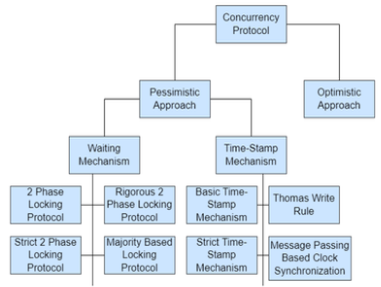
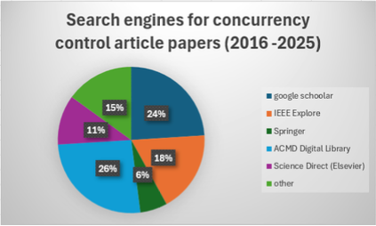
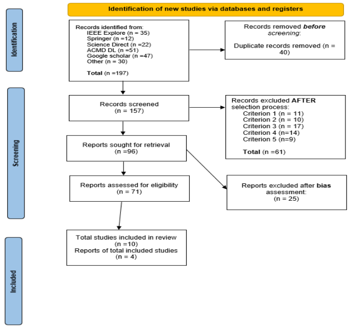

# [논문 번역] Concurrency Control in Distributed Databases: A Systematic Review (2025)

## 논문 정보

- **제목:** Concurrency Control in Distributed Databases: A Systematic Review
- **저자:** Tshidiso Lloyd Molema, Bukohwo Michael Esiefarienrhe
- **학술지/발행처:** IJCS (2025)
- **참고 링크:
  ** [IJCS 논문 링크](https://www.researchgate.net/publication/399343238_Concurrency_Control_in_Distributed_Databases_A_Systematic_Review)

---

## 논문 번역

### 0. 초록

본 논문은 분산 데이터베이스 시스템에서 사용되는 **동시성 제어 기술**에 대한 포괄적인 검토를 제공합니다.
본 연구는 2016년에서 2025년 사이에 발표된 논문 및 기타 학술 문헌을 조사하여 최근의 발전 동향에 초점을 맞춥니다.
**PRISMA 2020 가이드라인**을 사용하여 주요 데이터베이스 전반에서 197개의 과학 및 학술 연구를 선별하였으며, 그중 10개의 논문이 상세 분석을 위한 최종 기준을 충족했습니다.
이 검토 보고서는 동시성 제어 접근 방식을 네 가지 영역, 즉 **잠금 유형, 성능, 정확성, 효율성**으로 분류합니다.
각 분류는 **처리량(throughput), 지연 시간(latency), 탐지 정확도, 확장성**, 그리고 이러한 지표를 향상시키기 위해 적용된 기술을 기준으로 평가됩니다.
연구 결과에 따르면, 전통적인 알고리즘은 일반적인 조건에서는 일관된 성능을 유지하지만 경합이 심한 상황에서는 어려움을 겪는 경우가 많습니다.
대조적으로, **다중 버전 동시성 제어(MVCC)** 및 **낙관적 기술**은 확장성을 개선하지만 높은 **중단(abortion)율**을 초래합니다.
워크로드 프로파일링에 의존하는 새로운 **적응형 기술**은 동적 환경에서 점차 유망한 가능성을 보여주고 있습니다.
본 검토 보고서는 이러한 추세를 강조하고 회복 탄력적인 분산 시스템을 위한 향후 연구 방향을 제시합니다.

### 1. 서론

최근 몇 년 동안 분산 데이터베이스 관리 시스템(DDMS)의 발전은 고가용성, 결함 허용(내결함성), 그리고 확장성을 요구하는 애플리케이션에서 필수적인 요소가 되었습니다.
이 시스템들은 지리적으로 분산된 사용자들로부터의 트랜잭션이 신뢰성 있고 일관되게 처리되도록 보장하기 위해 동시성 제어에 의존합니다.
데이터베이스는 가용 컴퓨터 자원을 통해 데이터를 효율적으로 처리하기 위해 여러 기술을 적용하도록 설계되었습니다.
잠금(lock), 타임스탬프 순서(timestamp ordering), 직렬화 가능성(serializability) 및 결정적 스케줄링(deterministic scheduling)에 관한 과거 연구에서 도입된 기초
이론들은 현재 프로토콜의 지침이 되는 원칙들에 영향을 주었습니다.
타임스탬프 순서, 2단계 잠금, 결정적 스케줄링과 같은 고전적인 접근 방식들은 널리 채택되고 있으나, 현대 분산 플랫폼의 동적이고 이질적인 워크로드 특성을 지원하기에는 여전히 불충분하고 역부족입니다.

이러한 전통적인 접근 방식의 성능을 조사한 연구는 시스템이 여러 서버로 확장됨에 따라 발생하는 잠금 경합(lock contention), 지연 시간 증가, 처리량 감소와 같은 근본적인 문제들을 강조합니다.
컴퓨팅 워크로드가 클라우드 서비스, 마이크로서비스 및 지리적으로 분산된 아키텍처로 확장됨에 따라 새로운 형태의 동시성 제어가 등장했습니다.
낙관적 동시성 제어, 다중 버전 동시성 제어 및 하이브리드 방식에 관한 연구는 높은 경합 상황에서 향상된 확장성과 감소된 충돌률을 보여주거나, 버전 유지 관리로 인해 증가된 저장 오버헤드를 보여줍니다.
분산 캐싱, 메모리 관리 및 대규모 데이터 처리에 관한 연구들은 여러 지역에 걸친 분산 서버에서 데이터 양이 증가함에 따라 성능을 유지하면서 정확성을 유지하는 것이 복잡성을 초래한다는 사실을 더욱 입증했습니다.
이는 현재의 분산 환경이 요구하는 신뢰성, 지연 시간 및 효율성 요건을 일관되게 충족하는 접근 방식들이 아직 개발되지 않았음을 보여줍니다.

데이터 집약적 애플리케이션의 급격한 발전과 더불어 분산 시스템으로의 전환은 전통적 및 현대적 관점 모두에서 동시성 제어를 개선해야 할 필요성을 제기합니다.
비록 연구들이 특정 기술들을 평가해 왔으나, 이는 정확성, 성능, 확장성 및 실무적 관련성 과제 전반에 걸쳐 기술들을 비교하는 데 있어 제한적인 분석만을 제공했습니다.
이러한 시스템의 정확성과 효율성은 여전히 해결해야 할 동시성 제어의 중요한 측면으로 남아 있으며, 이는 최적의 성능을 유지하면서도 일관된 데이터를 유지하기 위해 여러 트랜잭션이 실행되는 상태를 의미합니다.
병행 지향적인 분산 데이터베이스 애플리케이션의 개발은 지역 간 데이터 전송을 즉각적으로 혁신하고자 합니다.

따라서 동시성 제어는 단순한 잠금 방식에서 최적의 수준에서 작동하는 고급스러우면서도 유연한 프로토콜로 전환되었습니다.
여기에는 다중 버전 동시성 제어(MVCC), 결정적 스케줄링, 타임스탬프 순서, 그리고 강한 엄격 2단계 잠금(SS2PL) 등이 포함됩니다.
2단계 잠금은 잠금 경합으로 인한 처리량 및 확장성 저하를 대가로 직렬화 가능성과 원자성 모두를 우선시하며, 이로 인해 다양한 환경의 대규모 마이크로서비스에는 처리량 측면에서 적합하지 않게 됩니다.
따라서 중앙 집중식에서 웹 서비스, 마이크로서비스 및 지리적으로 분산된 지역으로의 시스템 진화는 트랜잭션 관리에서 동시성 제어 개념이 갖는 근본적인 뒷받침이 집약적이고 기하급수적으로 성장했음을 나타냅니다.

그러므로 본 체계적 문헌 고찰은 분산 데이터베이스 시스템에서 사용되는 동시성 제어 기술들을 조사하고, 최근 연구 결과들을 종합하며, 다양한 조건에서의 효과성을 평가합니다.
이 검토 보고서의 결과는 연구자들이 현재의 동향을 이해하는 것을 돕고, 기존 해결책들의 강점과 한계를 식별하며, 효율적이고 신뢰할 수 있는 분산 데이터베이스 개발을 향한 미래의 연구 방향을 제공하는 것을 목표로
합니다.

 그림 1. 동시성 제어의 유형

그림 1은 하드웨어 및 워크로드의 변화에 대응하여 스케줄러가 사용하는 다양한 프로토콜을 묘사합니다.
이러한 프로토콜은 비직렬화 가능 동작(non-serializable behavior)이 발생할 가능성이 높아 결과적으로 트랜잭션 지연이 초래되는 **비관적(pessimistic)** 방식과, 비직렬화 가능 동작이
존재하지 않음을 보장하고 발생할 경우 이를 선제적으로 해결하는 **낙관적(optimistic)** 방식으로 분류됩니다.

기술의 발전은 정확성 유지와 병행성 증가 사이의 균형을 보장합니다.
최적화된 동시성 제어를 제공하는 강화된 접근 방식들은 가용성, 일관성, 확장성 사이의 트레이드오프(상충 관계)를 확보하면서 트랜잭션을 조정하는 데 필수적입니다.
전통적 방식의 한계로 인해 적응형 및 다중 버전 동시성 제어 접근 방식에 대한 새로운 연구 경로가 필요하게 되었습니다.
대규모 애플리케이션의 급격한 발전은 효과적이고 효율적인 분산 데이터베이스 시스템에 대한 수요를 증폭시켰습니다.

하지만 이는 전체 시스템의 신뢰성을 저해할 수 있는 갱신 손실(lost updates) 및 읽기 불일치(read inconsistencies)와 같은 데이터 이상 현상을 방지하기 위한 신중한 설계 접근 방식을 필요로
합니다.
이러한 현대적 접근 방식은 통신 오버헤드를 줄이면서도 시스템의 회복 탄력성과 효율성을 최적화하는 것을 목표로 하며, 다양한 환경에서의 동적 워크로드를 개선하고자 합니다.
신기술들은 분산화, 잠금 최소화, 그리고 프로세스를 조정하는 지능적인 접근 방식으로의 전환을 지향합니다.

이러한 전환의 배경은 특히 분산, 클라우드 기반 및 모바일 애플리케이션에서 통신 오버헤드를 감수하더라도 확장 가능한 데이터베이스와 애플리케이션을 보장하기 위함입니다.
따라서 이러한 기술의 채택을 통해 높은 처리량 기반의 애플리케이션은 병목 현상을 방지하면서 병행 트랜잭션을 효율적으로 처리할 수 있습니다.

분산 데이터베이스 관리 시스템의 신뢰성을 선제적으로 훼손하는 지속적인 과제 중 하나는 교착 상태(deadlocks)입니다.
상당한 지연 시간, 복잡성 및 시스템 성능을 저해하는 오버헤드가 발생하기 쉬운 단일 및 다중 사이클 탐지 방법에 대한 광범위한 연구에도 불구하고, 교착 상태 문제는 매우 두드러지게 나타납니다.
본 연구는 분산 데이터베이스의 동시성 제어 현황과 진화하는 분산 데이터베이스 분야에 대한 최근 몇 년간 연구자들의 기여를 비판적으로 밝혀내고자 하는 필요성에 의해 추진되었습니다.

### 2. 방법

본 연구에서 사용된 체계적 문헌 고찰 방법은 분산 데이터베이스 관리 시스템(DBMS)의 동시성 제어에 관한 현재 문헌을 식별, 비판적 평가, 분석 및 종합하는 데 있어 투명하고 엄격하며 재현 가능한 단계를
제공합니다.
체계적 문헌 고찰 보고를 위한 PRISMA 2020 가이드라인에 따라 다양한 데이터베이스를 조사함으로써 맥락 특화적 동시성 제어 프로토콜들을 철저히 검토했습니다.
이러한 접근 방식은 그림 3에 표시된 것처럼 키워드 검색 문자열, 선정 및 분석 과정의 투명한 실행과 문서화를 가능하게 합니다.
본 연구는 분산 데이터베이스 시스템의 동시성 제어와, 끊임없이 진화하는 분산 시스템 및 환경의 동시성 제어 분야에 대한 연구자들의 기여를 포괄적으로 이해하고자 합니다.

본 연구는 교착 상태(deadlock) 탐지의 중요성을 강조하는 분산 환경에서의 설계, 개발 및 평가 기술과 같은 동시성 제어의 다양한 측면을 보고하는 논문들을 찾았습니다.
주요 목표는 교착 상태가 중요한 구성 요소로 논의된 교착 상태 관련 연구를 다루는 논문들의 맥락적 뉘앙스에 대한 포괄적인 이해를 제공하는 것이었습니다.
초기에는 IEEE Xplore, Springer, ACM Digital Library, ScienceDirect, Google Scholar, 기타(Scopus, arXiv, Citebase Search,
CiteULike, CiteSeer, Compendex)와 같은 다양한 검색 엔진에서 수집된 197개의 논문을 검토했으며, 최종 포함 기준 세트를 충족한 논문은 10개뿐이었습니다.

이러한 검색 엔진은 그림 2에 나타난 바와 같이 다음의 검색 키워드를 통해 2016년부터 2025년까지의 학술 저널 및 논문을 수집하는 데 활용되었습니다:
> “Concurrency control”, “Transaction processing”, “distributed transactions”, “Locking”, “Two-phase locking”,
> “multi-version concurrency control OR optimistic concurrency control”, “Replicated database”, “NOSQL”.

이 키워드들은 더 복잡한 검색 문자열을 구축하기 위해 다음과 같이 논리 연산자와 결합되었습니다:

> “distributed database AND concurrency control OR concurrency control techniques in distributed systems” 
> “database replicas OR distributed database AND two-phase locking OR timestamp ordering” 
> “transaction management AND cloud database AND concurrency control protocols”

### 3. 선정 과정

#### 3.1. 포함 기준

본 연구는 다음과 같은 포함 기준 1~2를 충족하는 논문을 포함했습니다.

1. **포함 기준 1:** 영어로 작성되었으며, 오픈 액세스 여부와 관계없이 전체 텍스트(full text)를 확인할 수 있는 논문
2. **포함 기준 2:** 피어 리뷰(동료 검토)를 거친 컨퍼런스 논문집 또는 학술지 논문

#### 3.2. 제외 기준

본 연구는 아래의 제외 기준 1~4 중 하나라도 해당하는 논문은 제외했습니다.

1. **제외 기준 1:** 2016년에서 2025년 사이에 출판되지 않은 연구.
2. **제외 기준 2:** 성능 평가 결과를 제시하지 않은 연구.
3. **제외 기준 3:** 초록(abstract)만 열람 가능하고 전체 텍스트(full text)를 확보할 수 없는 연구.
4. **제외 기준 4:** 영어로 작성되지 않은 연구.

#### 3.3. 품질 기준

처리량(throughput), 지연 시간(latency), 정확성(accuracy), 오버헤드(overhead) 등과 같은 성능 지표를 적절히 다루며 분산 데이터베이스의 동시성 제어를 다루는 논문들만이 본 검토
보고서에 활용되었습니다.

그림 4는 본 연구의 논문 선정 절차를 보여줍니다.
초기에는 다양한 데이터베이스에서 총 197개의 논문이 식별되었습니다.
중복된 논문 40개를 제거한 후, 추가 선별(screening)을 위해 총 157개의 논문이 남았습니다.
이와 유사하게, 섹션 2.1.1에서 논의된 사전에 정의된 제외 기준에 따라 61개의 기록이 추가로 제외되었으며, 각 기준에 따라 제외된 논문 수의 세부 내역이 할당되었습니다.
그 후 본 연구는 원문 확보(retrieval) 대상인 96개의 논문을 검토하였으며, 그중 71개의 논문이 성공적으로 평가되어 적격한 것으로 간주되었습니다.
이후 품질 기준에 따라 25개의 기록이 추가로 제외되었습니다.
최종적으로 10개의 논문이 포함 기준을 충족하여 본 검토의 대상이 되었으며, 포함된 논문과 관련된 4개의 보고서가 함께 포함되었습니다.

### 4. 결과 및 논의

동시성 제어는 시스템에서 병행 연산을 실행할 때 정확성을 보장하는 것을 목표로 하며, 운영체제, 프로그래밍 및 데이터베이스 분야에서 널리 알려진 개념입니다.
Wang과 Qian의 연구는 **RDMA(원격 직접 메모리 접근)** 환경에서의 동시성 제어를 탐구했습니다.
이들은 통신 지연이 두드러지는 환경에서 **NOWAIT, WAITDIE**와 같은 경량 잠금 기반 방식이 **OCC(낙관적 동시성 제어)** 및 **MVCC(다중 버전 동시성 제어)** 보다 높은 처리량을 기록하며
성능이 더 우수하다는 점을 강조했습니다.
이들의 연구 결과는 분산 시스템에서 낙관적 및 다중 버전 방식이 더 우월하다고 보는 전통적인 견해를 개선하고자 했습니다.
그러나 이는 시스템이 구조적인 분산 특성을 인식하고 이를 고려할 수 있을 만큼 지능적이어야 함을 의미합니다.

이와 일치하게, Wang은 높은 경합(high contention) 상황에서 OCC의 성능이 저하된다는 점을 실증적으로 뒷받침하는 **PC3**를 제안했습니다.
이는 낙관적 방식의 한계를 해결하고자 하는 새로운 접근 방식들에 대한 관심이 높아지고 있다는 주장을 입증합니다.
반대로, Wang 등이 제시한 확장 가능한 낙관적 결정론적 동시성 제어 프로토콜인 **DODO**는 대안적인 접근 방식을 제시했습니다.
이 프로토콜은 커밋 순서를 고정하는 동시에 **지연 결정(lazy decision)** 과 **조기 쓰기 가시성(early write visibility)** 을 통합함으로써, 트랜잭션 패턴에 대한 사전 지식 없이도
취소율을 낮추고 확장성을 높였습니다.

전통적인 결정론적 기술의 시스템 취약성이 드러나기도 했습니다.
분산 클라우드 트랜잭션에 대한 평가 결과, 자원 조정 실패 시 차단(blocking)되기 쉽다는 점이 밝혀졌으며, 이는 **2단계 커밋(2PC)** 프로토콜의 지속적인 사용에 의문을 제기했습니다.
Wang이 확장성을 개선하기는 했지만, 다양한 워크로드에 대한 가정은 다채롭고 동적인 클라우드 기반 배포 환경에서는 적합하지 않거나 제한적일 수 있습니다.

Arika와 Chaudhry는 논의를 모바일 및 실시간 시스템으로 확장했습니다.
시간적 제약을 준수하지 않는 중앙 집중식 프로토콜은 시급한 해결이 필요하며, 응답 기반(response-based) 접근 방식이 무엇보다 중요하다고 제안했습니다.
따라서 결정론적 방식, RDMA, 혹은 이동성(mobility) 여부와 관계없이, 프로토콜을 각 맥락의 특정 제약 조건에 맞추는 것이 중요하다는 점이 두 가지 대조적인 아이디어 모두에서 강조됩니다.

이와 유사하게, Lin 등은 공격적인 데이터 배치(aggressive data placement)를 활용하여 분산 트랜잭션을 로컬 트랜잭션으로 변환함으로써 **2PC를 제거**하는 데 집중했습니다.
이를 통해 커밋 조정을 강화하면서 왕복 시간(round-trip)을 잠재적으로 줄이고자 했습니다.
Gbaranwi와 Asagba는 분산 시스템에서 동기화의 중요성을 검토하며, **ACID 특성**을 보존하기 위해 적절한 동시성 제어 기술이 매우 중요하다고 주장했습니다.
또한 병행 연산을 관리하기 위한 전제 조건으로서 견고한 기술의 필요성을 강조했습니다.

마지막으로, Jitendra 등은 중첩 트랜잭션(nested transaction) 모델이 구조적으로 적응해야 하는 반면, 평면 트랜잭션(flat transactions)은 장기 실행 작업(long-lived
operations)을 처리하는 데 부적합하다고 언급했습니다.
즉, 중첩 트랜잭션 제어를 통해 병렬성을 달성할 수 있다는 것입니다.
OCC나 2PC와 같은 전통적인 접근 방식에서의 발전은 단순한 교체가 아니라 점진적인 개선을 보여주었습니다.
각 방식은 서로의 약점을 보완하는 동시에 새로운 과제에 직면해 있습니다.
이러한 해결책들은 분산 시스템의 기술적 발전에 발맞추어 진화하는 프로토콜을 엄격하게 개발하는 것을 목표로 합니다.

#### 4.1. 동시성 제어 기술 (Concurrency Control Techniques)

동시성은 분산 데이터베이스 시스템을 낮은 경합 상태에서 예측 가능하고 높은 처리량과 낮은 지연 시간 기반의 프로세스 실행으로 개선하여 정확성을 보장합니다.
Zhang 등은 다중 지역 트랜잭션을 직렬화하는 데 중점을 둔 그래프 기반 동시성 제어를 조사했으며, 이는 더 낮은 처리량 값을 달성했습니다.
이러한 한계를 해결하기 위해, 이후의 낙관적 접근 방식들이 특히 커밋 단계에서 잠금보다 검증을 우선시하는 획기적인 방법으로 도입되었으며, 이는 더 확장 가능한 동시성 제어 프로토콜을 향한 중요한 진전을 강조했습니다.
셀룰러 데이터베이스는 우선순위 스케줄링과 함께 낙관적 방식을 채택하여 트랜잭션 취소율을 낮추고, 상당한 자원 효율성과 적시 응답을 이끌어냈습니다.

지정된 커밋 순서를 우선시하는 DODO와 같은 방법들은 분산된 노드 전반에서 동적으로 확장되는 최신 기술들을 개선했으며, 사전 지식에 대한 의존도에서 벗어나 16.5의 처리량으로 작동했습니다.
Nguyen과 Kawashima의 하이브리드 동시성 제어에 대한 추가적인 발전은 빠른 응답성을 옹호하는 분산형 기술을 조사했으며, 지연 시간을 최대 1.5배 낮추고 처리량을 최대 1.6배 향상시켰습니다.
이는 탈중앙화가 정확성과 효율성을 보장하는 데 있어 동시성 제어의 역할을 어떻게 강화하는지 보여줍니다.

또한, Lungu와 Nyirenda는 마이크로서비스 환경의 분산 트랜잭션 전반에서 ACID 특성을 보존하기 위해 동시성 제어를 통합하는 마이크로서비스 기반 아키텍처를 검토하여 분산 시스템 전반에서 확장 가능하고
일관되며 신뢰할 수 있고 효율적인 성능을 보장했습니다.
게다가 Arika와 Cheruiyot은 노드 장애 조건에서도 원자적으로 효율적이고 데이터 일관성을 보장하는 2PC 및 3PC와 같은 프로토콜을 조사하여, 분산 노드 전반의 신뢰성을 강화함으로써 중단된 프로세스를 복구
가능하게 만들었으며, 이를 신뢰할 수 있는 분산 데이터베이스 아키텍처를 위한 근본적인 개념으로 자리매김했습니다.

Haroon에 따르면 객체 지향 분산 데이터베이스는 극심한 어려움을 겪으며, 시스템의 신뢰성은 충돌하는 연산에 대해 공유 자원을 보호하면서 병행 트랜잭션 전반의 직렬화 가능성을 보장하기 위해 2PL 및 MVCC와
같은 견고한 기술에 의존합니다.
이는 공유 자원의 조작을 제거했습니다.
또한 Neha와 Banita는 시스템 성능 저하의 잠재적 원인을 조사하고 전통적인 접근 방식이 동적 환경에서 처리량 및 응답 시간의 증가와 정비례한다고 의견을 밝혔습니다.
이는 이러한 통찰들이 동시성 제어가 장애 상황에서 데이터 정확성을 선제적으로 보호하고, 객체 지향 시스템에서 정확성과 신뢰성을 유지하며, 다양한 다중 사용자 환경에서 확장성과 효율성을 향상시키는 메커니즘이라는 논거와
밀접하게 연관되어 있음을 보여줍니다.

### 5. 분산 데이터베이스 시스템에서 동시성 제어의 한계

동시성 제어의 필요성에도 불구하고, 시스템의 핵심 구성 요소로서 그것이 정확성에 크게 의존하는 것은 다양한 기술들에 기반하고 있습니다.
반면에 동시성 제어는 동적인 환경에서 프로세스의 병행 실행을 효율적으로 이해하기 위해 일관되고 정확하며 회복 탄력적인 시스템을 가능하게 하는 데 결정적입니다.

따라서 병행 연구들의 결과는 각 부류의 프로토콜이 그 적용 가능성을 제한하는 고유한 한계를 가지고 있음을 입증했습니다.
원자성은 일반적으로 **2PC(2단계 커밋)** 와 **3PC(3단계 커밋)** 에 의해 보장됩니다.
하지만 Arika와 Cheruiyot에 따르면, 2PC는 조정 실패를 초래하는 차단(blockages)을 겪으며 지연 시간을 더욱 증가시키고, 통신 오버헤드를 발생시켜 비효율적입니다.
이는 적은 워크로드 하에서 처리량을 $35\%$ 향상시키고 중앙 집중식 환경에 적합한 **ASOCC**와 같은 낙관적 접근 방식과 대비됩니다.

마찬가지로, 진보된 낙관적 접근 방식들도 상당한 한계를 보입니다.
예를 들어, **OCC2T**는 처리량 증가와 함께 확장성을 유지하지만, 높은 경합 시스템에서는 성능 저하를 겪으며 처리량을 대가로 팬텀 이상 현상(phantom anomalies)을 초래합니다.
**MVCC(다중 버전 동시성 제어)** 가 병행 읽기 및 쓰기를 선제적으로 허용하여 처리량을 높임에도 불구하고, Bondugula는 기존의 다양한 버전들에 기반한 데이터 이상 현상, 불일치 및 통신 오버헤드를
밝혀냈습니다.

지리적 분산 환경에서의 일관성과 성능 사이의 트레이드오프가 강조됩니다.
특히 Ferreira 등은 지리적 분산 NoSQL 데이터베이스에서 강한 일관성(strong consistency)을 강제하는 것이 약한 일관성 수준에 비해 막대한 성능 저하를 겪으며, 이는 처리량 감소와 지연 시간
증가로 이어져 성능과 엄격한 일관성 조치 사이의 차이를 부각시킨다고 보고합니다.
따라서 **GeoTP**와 같은 높은 지연 시간 기반의 접근 방식은 장기간의 잠금 경합 기간이 잠재적으로 처리량 감소를 초래할 수 있음을 보여주었습니다.

목표는 특히 동적인 환경에서 최소한의 지연 시간, 처리량 및 통신 오버헤드로 효율적으로 작동하고 다양한 워크로드에 따라 확장되는 완전한 병행 호환 시스템을 실현하는 것이었습니다.
본 연구는 정확성, 효율적인 응답 시간, 확장성 및 최소한의 통신 오버헤드 측면에서 실행 가능한 결론을 제시하기 위해 존재하는 최신 기술의 한계점을 분석하는 것을 목표로 했습니다.

확장성, 일관성 및 가용성 사이의 트레이드오프에 대해 집중적인 연구가 이루어졌음에도 불구하고, 이론적 모델과 실제 배포 사이의 간극을 메워야 할 필요성은 여전히 존재합니다.
연구자들은 현실 세계의 시나리오 요건을 해결하지 못하는 많은 알고리즘을 제안해 왔으며, 이는 종종 예상되는 성능을 저해하는 네트워크 변동, 하드웨어 장애 및 운영 조건을 포함합니다.
마찬가지로, 많은 접근 방식이 대역폭과 전력 소비를 최적화하기 위해 중복된 복제 전략에 의존하기 때문에 자원 오버헤드는 여전히 충분히 연구되지 않은 과제로 남아 있습니다.

마지막으로, 특히 분산 동시성 제어에서 운영상의 복잡성에 대한 추가적인 과제들이 도입되었습니다.
동시성 버그와 데이터 이상 현상을 빈번하게 겪는 시스템은 동적인 환경에서 잠금 관리 및 충돌 탐지의 상충되는 구현으로 인해 시스템 성능을 저해할 수 있습니다.
게다가 분산 시스템을 디버깅하고 유지 관리하는 데는 종종 과소평가되는 전문 지식과 자원이 필요하며, 이는 인간적 요소가 동시성 제어의 효율성에 있어 주요한 제약이 되게 합니다.

블록체인, IoT, 자율 주행 차량 및 에지 컴퓨팅에서 동시성 제어의 새로운 적용 가능성은 결함 허용 능력이 부족한 전통적인 접근 방식의 약점을 지속적으로 노출시키고 있습니다.
효율적인 시스템에 대한 필요성과 엄격한 지연 시간 요구 사항은 2단계 잠금과 같은 전통적인 접근 방식이 이러한 한계를 해결할 수 없기 때문에 많은 분야가 대안적인 접근 방식을 찾도록 영향을 미쳤습니다.
결과적으로 이러한 문제들은 운영적이고 맥락적인 문제가 되어 새로운 적응형 접근 방식의 개발을 요구하게 됩니다.

### 6. 결론 및 향후 연구

이 검토 보고서는 동시성 제어가 신뢰할 수 있고 일관된 고성능 분산 데이터베이스 시스템을 달성하는 데 여전히 핵심적임을 보여줍니다.
분석 결과, 전통적인 방법들은 강력한 정확성을 보장하지만, 현대의 워크로드는 확장성 이점 덕분에 다중 버전 및 낙관적 동시성 제어와 같은 접근 방식과 점점 더 호환되고 있습니다.
연구를 통해 대규모 및 분산 환경에서의 지연 시간, 결함 허용(내결함성), 그리고 충돌 해결과 관련된 지속적인 과제들이 아직 고급 적응형 기술에 의해 해결되지 않았음이 밝혀졌습니다.

본 연구의 결과는 신흥 분산 아키텍처에서 동시성 제어 접근 방식의 선택과 설계를 안내하는 데 유용합니다.
또한 연구자들이 특정 성능 및 일관성 요건에 어떤 접근 방식이 가장 적합한지 식별하는 데 도움이 되는 비교 분석을 제공합니다.
향후 연구는 다양한 조건에서 신뢰성과 일관성을 유지하면서 통신 오버헤드를 최소화하기 위해, 다양한 워크로드에 따라 확장되는 적응형 접근 방식을 개발하는 데 주로 집중해야 합니다.
특히 교착 상태(deadlock)에 대한 고급 탐지 및 해결 기술의 추가 개발은 더욱 회복 탄력적이고 효율적인 분산 데이터베이스 시스템을 구축하는 데 필수적일 것입니다.
