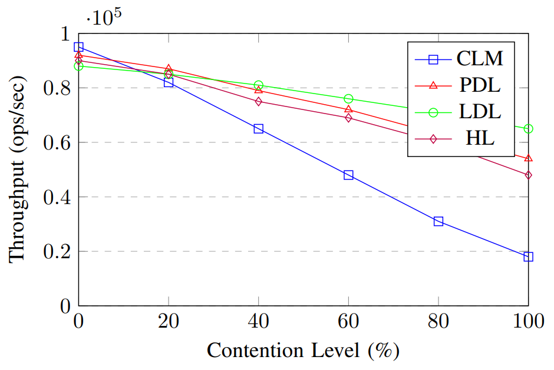
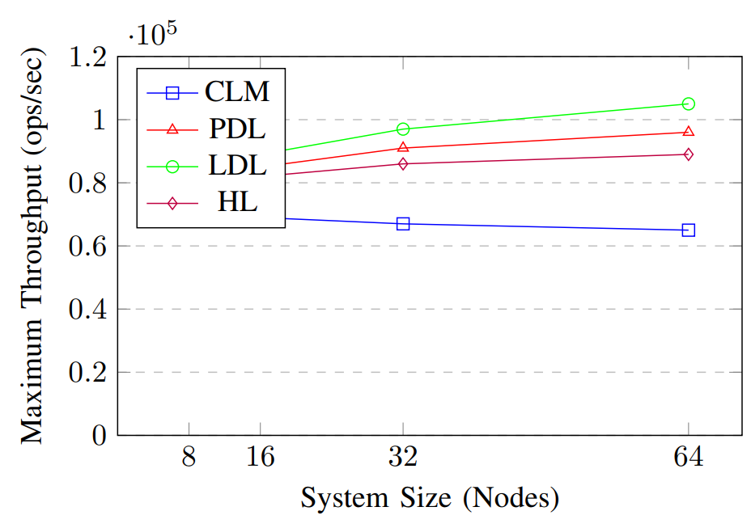

# [논문 번역] Distributed Locking: Performance Analysis and Optimization Strategies (2025)

## 논문 정보

- **제목:** Distributed Locking: Performance Analysis and Optimization Strategies
- **저자:** Andre Rodriguez, Wiliam Osborn
- **학술지/발행처:** arXiv (2025)
- **참고 링크:** [arXiv 논문 링크](https://arxiv.org/abs/2504.03073)

---

## 논문 번역

### 0. 초록

분산 락(Distributed Locking) 메커니즘은 분산 시스템에서 데이터의 **일관성과 무결성을 보장**하는 데 있어 가장 근간이 되는 필수 요소입니다.
본 논문은 다양한 워크로드(Workload) 조건 하에서 **분산 락 알고리즘의**의 성능 특성을 중심으로 이에 대한 **포괄적인 분석**을 제시합니다.
그리고 **전통적인 중앙 집중형 락(Centralized Locking)** 방식과 **최신 분산 프로토콜**을 비교 분석하며 이를 **처리량(Throughput), 지연 시간(Latency), 확장성(
Scalability)** 지표를 기준으로 평가합니다.
본 연구의 실험 결과에 따르면 최적화된 **분산 락(Distributed Locking) 프로토콜**은 **강한 일관성(Strong Consistency)** 보장을 유지하면서도 **높은 경합(
High-contention)** 상황에서 중앙 집중형 방식보다 **최대 68% 더 우수한 성능**을 달성할 수 있음을 입증하였습니다.
더 나아가, 본 연구에서는 **지리적 분산 배포**(Geo-distributed Deployments; 지리적 분산 배포는 리전(Region) 간의 거리가 먼 배포 환경을 의미합니다. 예: 미국 동부와 유럽 간의
배포 환경) 환경에서 발생하는 **조정 오버헤드(Coordination overhead)** 를 대폭 절감할 수 있는 새로운 **분산 락 최적화 기법**을 제안합니다.
본 연구의 결과는 현대적 분산 시스템을위한 **효율적인 동시성 제어(Concurrency control) 메커니즘** 설계와 관련하여, 지속적으로 축적되고 있는 **학술적 지식 체계**에 기여할 것으로 기대됩니다.

- **색인:** 분산 시스템(Distributed Systems), 분산 락(Distributed Locking), 동시성 제어(Concurrency Control), 일관성(Consistency), 성능 최적화(
  Performance Optimization)

### 1. 서론

분산 시스템은 현대 컴퓨팅 인프라에서 **선택이 아닌 필수(Ubiquitous; 어디에나 존재하는)** 요소로 자리 잡았으며 글로벌 이커머스 플랫폼부터 실시간 데이터 분석 서비스에 이르기까지 광범위한 애플리케이션을
구동하는 **핵심 동력**으로 자리 잡았습니다.
시스템의 규모가 확장됨에 따라, 성능을 유지하는 동시에 데이터의 일관성을 보장하는 작업은 점차 더욱 까다로운 도전 과제가 되고 있습니다.
분산 락 프로토콜은 분산된 노드 간의 **공유 자원에 대한 동시 접근(Concurrent Access)** 을 제어하고 **경쟁 상태(Race Conditions)** 을 방지하여 시스템의 **정합성(
Correctness)** 을 보장하는 데 중추적인 역할을 수행합니다.

전통적인 분산 락 방식은 대개 **중앙 집중형 락 관리자(Centralized Lock Manager)** 에 의존하며 이는 **고가용성 환경(High-scale Environments)** 에서 시스템의 성능을
저하시키는 **병목 지점(Bottlenecks)** 이 될 가능성이 큽니다.
최근의 기법들은 락 관리 책임을 여러 노드에 **분산**시킴으로써 **확장성**을 개선하지만 이와 동시에 복잡한 **조정 과제(Coordination Challenges)** 를 야기한다는 특징이 있습니다.
이러한 접근 방식들 간의 **상충 관계(Trade-offs)** 는 시스템 아키텍트들이 반드시 검토해야 할 **중대한 설계 고려 사항**입니다.

본 논문에서는 **분산 락 메커니즘**에 대한 **체계적인 평가**를 수행하며 다음과 같은 **연구 기여점(Contributions)** 을 제시합니다.

- 다양한 워크로드 패턴 및 시스템 규모 하에서 **중앙 집중형 방식**과 **분산 락 방식**을 비교 분석한 **포괄적인 분석 결과**를 제시합니다.
- **지리적 분산** 락 시나리오에서 발생하는 **조정 오버헤드**를 절감하기 위한 **새로운 최적화 기법**들을 제안합니다.
- 복수의 **클라우드 제공업체(Multiple Cloud Providers; 예: AWS, GCP, Azure 등)** 환경에서 **실제 서비스와 유사한 워크 로드(Realistic Workloads)** 를
  적용하여 **실증적 평가(Empirical Evaluation)** 결과를 제시합니다.
- 애플리케이션의 특성에 기반하여 적절한 **락 전략**을 선택할 수 있도록 돕는 **성능 가이드 라인**을 제시합니다.

본 연구 결과는 모든 시나리오에 최적인 단일 접근 방식은 존재하지 않으나 특정 워크로드 패턴에 최적화되어 **정교하게 설계된 분산 프로토콜**이 대규모 환경에서 **중앙 집중형 방식의 성능보다 월등한 성능을 발휘**
할 수 있음을 입증합니다.

### 2. 배경 지식 및 관련 연구

#### A. 분산 락의 기초

분산 락 프로토콜은 분산 시스템 전반의 복수 프로세스가 **공유 자원(Shared Resources)** 에 대한 **접근을 조정(Coordinate)** 할 수 있도록 지원합니다.
이러한 프로토콜들은 분산 환경에 내제된 다음과 같은 몇 가지 **기술적 난제(Challenges)**들을 반드시 해결해야 합니다.

**일관성 보장(Consistency guarantees)** 은 복수의 프로세스가 공유 데이터에 접근할 때 제공되는 **격리(Isolation) 수준의 강도**를 규정합니다.
**강한 일관성 모델**(예: 엄격한 직렬화 가능성)은 단일 노드 시스템과 유사한 수준의 보장을 제공하지만 흔히 **성능 저하를 수반**하며 반면 **완화된 모델(Weaker Models)** 은 성능 향상을 위해
일부 **이상 현상(Anomalies)** 을 허용하기도 합니다.

**CAP 정리**는 분산 시스템에서 **일관성(Consistency)**, **가용성(Availability)**, 그리고 파티션 용인(Partition Tolerance)** 을 동시에 모두 충족하는 것이
불가능하다는 점을 입증합니다.
**락 프로토콜**은 애플리케이션의 요구사항에 근거하여 이러한 속성들 사이에서 명시적인 **상충 관계(Trade-offs)**를 결정해야 합니다.

#### B. 중앙 집중형 락 방식

중앙 집중형 락 방식은 시스템 내의 모든 락 관리 책임을 전담하는 **단일 코디네이터(Single Coordinator)** 를 활용합니다.
이러한 방식은 **개념적으로는 단순**하지만 다음과 같은 몇 가지 **한계점**에 직면하게 됩니다.

- **단일 장애점(Single Point of Failure):** 락 관리자가 시스템의 **핵심 컴포넌트**가 됨에 따라, 해당 관리자의 장애 발생 시 시스템 전체의 기능이 마비되거나 막대한 영향을 받을 수 있는
  **구조적 취약성**을 지닙니다.
- **확장성 병목 현상(Scalability Bottlenecks):** 시스템 규모가 확장됨에 따라, 중앙 락 관리자에 요청이 집중되면서 처리 능력을 초과하는 **과부하(Overwhelmed)** 상태에 빠질 수
  있습니다.
- **네트워크 지연(Network Latency):** 지리적으로 분산된 배포 환경에서, 중앙 관리자와 멀리 떨어진 **원격 노드(Remote Nodes)** 들은 락을 획득하는 과정에서 더 높은 지연 시간을 겪게
  됩니다.

이러한 한계에도 불구하고, 중앙 집중형 방식은 **설계의 단순성**과 **예측 가능한 동작 방식** 덕분에 실무에서 여전히 널리 사용되고 있습니다.
구글의 **Chubby**와 아파치의 **ZooKeeper** 같은 시스템은 실제 운영 환경에서 널리 사용되는 **중앙 집중형 락 서비스**를 제공합니다.

#### C. 분산 락 프로토콜

분산 락 프로토콜은 시스템 내의 **여러 노드(Multiple Nodes)** 에 걸쳐 **락 관리 책임**을 분산시킵니다.
이러한 접근 방식은 중앙 집중형 락 방식이 지닌 다수의 한계점을 해결하는 반면, 분산 환경 특유의 새로운 **기술 난제**들을 야기합니다.

Paxos 및 Raft와 같은 **쿼럼 기반 프로토콜(Quorum-based Protocols)** 은 락을 부여하기 전 **과 반수 노드(Majority of Nodes)** 간의 합의를 필수적으로 요구하며, 이를
통해 **강한 일관성 보장**을 제공합니다.
이러한 프로토콜들은 노드 장애에 대한 **내결함성(Fault Tolerance)** 을 갖추고 있으나, 합의 과정에서 불가피한 **조정 오버헤드**를 유발합니다.

**리스 기반 프로토콜(Lease-based Protocols)** 은 한정된 기간 동안 락을 부여함으로써 노드 장애의 영향을 완화하지만, 동시에 정교한 **타임아웃 관리**를 필요로 합니다.
이러한 프로토콜들의 유효성은 각 노드 간의 **시계 동기화**(Clock Synchronization; 분산된 서버들이 동일한 시간 정보를 공유하는 것) 수준에 크게 의존합니다.

**낙관적 락(Optimistic Locking)** 방식은 자원경합(Conflicts)이 드물게 발생할 것이라고 가정하며, 작업을 확정(Commit)하기 직전에 이 가정이 유효한지 검증을 수행합니다.
이러한 방식은 **경합 수준이 낮은(Low-Contention) 워크로드** 환경에서 탁월한 성능을 제공하지만, 경합이 빈번해질 경우 비용이 많이 드는 **충돌 해결(Conflict Resolution)** 과정을
필요로 할 수 있습니다.

### 3. 시스템 모델 및 방법론

#### A. 시스템 모델

본 연구에서는 비동기 네트워크(Asynchronous Network)상에서 **메시지 패싱(Message Passing)** 방식으로 통신하는 $n$개의 노드로 구성된 분산 시스템 모델을 상정합니다.
각 노드는 독립적으로 중단(Crash)될 수 있는 **Fail-stop 모델**(노드가 결함을 일으키면 즉시 작동을 멈추고 임의 잘못된 동작을 하지 않는다고 가정하는 모델)을 따르며, 장애 발생 이후 **복구(
Recovery)** 가 가능함을 전제로 합니다.
네크워크상에서는 임의의 **메시지 지연(Message Delays)** 이 발생할 수 있으며, 제한된 기간 동안 노드 간 통신이 단절되는 **네트워크 파티션(Network Partitioning)** 현상이 나타날
수 있음을 가정합니다.

본 모델 내에서, 우리는 다음과 같은 **특성(Characteristics)** 들을 기준으로 각 락 프로토콜을 평가합니다.

- **정합성(Correctness):** 프로토콜은 **상호 배제(Mutual Exclusion)** 를 반드시 보장해야 하며, 다수의 프로세스가 동일한 락을 동시에 점유하는 상황을 방지해야 합니다.
- **활성(Liveness):** 프로토콜은 노드 장애가 발생한 상황에서도 시스템의 **진행(Progress)** 을 보장해야 하며, **교착 상태(Deadlock)** 및 **라이브락**(Livelock;
  프로세스들이 상태를 계속 바꾸며 움직이고는 있지만, 실제로는 아무런 진전이 없는 상태, 예: 무한 재시도) 현상을 방지해야 합니다.
- **성능(Performance):** 다양한 워크로드 조건 하에서의 **처리량(Throughput), 지연 시간(Latency)** 및 **자원 활용률(Resource Utilization)** 을 기준으로
  측정합니다.
- **확장성(Scalability):** 시스템의 규모가 확장됨에 따라 성능을 일관되게 유지할 수 있는 능력을 의미합니다.

#### B. 실험 환경

본 연구의 실험 평가는 북미, 유럽, 아시아의 지리적 리전(Geographic Regions)에 분산된 64개의 컴퓨팅 노드로 구성된 테스트베드에서 수행되었습니다.
각 노드는 **16코어 CPU**, **64GB RAM**을 탐재하였으며, **10Gbps 네트워크** 대역폭으로 연결되었습니다.
본 연구에서는 다음과 같은 프로토콜을 포함하여, **중앙 집중형(Centralized)** 및 **분산형** 락 프로토콜을 모두 구현하였습니다.

- **중앙 집중형 락 관리자(Centralized Lock Manager, CLM):** 모든 락 요청을 전담하여 처리하는 단일 노드 기반의 구현체입니다.
- **Paxos 기반 분산 락(Paxos-based Distributed Locking, PDL):** 과반수 합의(Majority Agreement)를 필요로 하는 **쿼럼 기반 프로토콜**입니다.
- **리스 기반 분산 락(Lease-based Distributed Locking, LDL):** 자동 만료(Automatic expiration) 기능이 포함된 **시한성 락(Time-limited Locks)
  ** 을 부여하는 프로토콜입니다.
- **계층형 락(Hierarchical Locking, HL):** 로컬(Local) 및 글로벌(Global) 락 전략을 결합한 **다계층 접근 방식**입니다.

워크로드는 다양한 수준의 **경합(Contention), 지역성(Locality), 요청률(Request Rates)** 을 포함하여 실제 애플리케이션 패턴을 모사하는 **자체 벤치마크 프레임워크(Custom
Benchmark Framework)** 를 통해 생성되었습니다.
모든 실험은 시스템을 안정화하기 위한 **5분간의 예열(Warm-up) 단계**를 거친 후 **30분 동안** 진행되었으며, 데이터 측정값은 **10초 간격**으로 수집되었습니다.

### 4. 성능 평가

#### A. 처리량 분석

본 연구에서는 다양한 **경합** 수준에 따른 각 락 프로토콜의 처리량을 평가하였습니다.
여기서 경합은 **두 개의 연속적인 연산이 동일한 자원을 대상으로 할 확률**로 정의됩니다.

낮은 경합(0~20%) 상황에서 중앙 집중형 락 관리자(CLM)는 초당 최대 95,000회의 연산(Operations Per Second)을 처리하며 경쟁력 있는 성능을 나타냈습니다.
이는 주로 충돌이 드문 상황에서 발생하는 최소한의 **조정 오버헤드** 때문입니다.
그러나 경합이 증가함에 따라 CLM의 성능은 급격히 저하되며, **100% 경합 상황**에서는 초당 연산 수가 **18,000회(18,000 OPS)** 까지 급락하는 양상을 보였습니다.

이와 대조적으로, 분산 프로토콜은 경합이 심화되는 환경에서도 상대적으로 높은 처리량을 유지하는 양상을 보였습니다.
리스 기반 분산 락(LDL) 프로토콜은 고경합 상황에서 가장 우수한 성능을 나타냈으며, **100% 경합 환경**에서도 **초당 65,000회(65,000 OPS)** 의 처리량을 유지하였습니다.
이는 동일한 조건에서 CLM 대비 **261%의 성능 향상**을 달성한 결과입니다.

#### B. 지연 시간 분석

본 연구에서는 다양한 시스템 규모를 대상으로 락 획득 시 발생하는 **평균 및 99분위(99th Percentile, P99) 지연 시간**을 측정하였습니다.
아래의 표는 중간 수준의 경합(40%) 워크로드 환경에서 도출된 실험 결과들을 나타냅니다.

| 시스템 규모 (Nodes) | 평균 지연 시간 CLM | 평균 지연 시간 LDL | P99 지연 시간 CLM | P99 지연 시간 LDL |
|:-----------------:|:---------------:|:---------------:|:----------------:|:----------------:|
|         8         |     12.3 ms     |     15.7 ms     |     47.1 ms      |     38.2 ms      |
|        16         |     18.7 ms     |     18.3 ms     |     68.5 ms      |     42.6 ms      |
|        32         |     29.5 ms     |     20.1 ms     |     112.8 ms     |     48.9 ms      |
|        64         |     48.2 ms     |     22.8 ms     |     187.4 ms     |     53.7 ms      |

위의 표에서 확인할 수 있듯이, CLM은 조정 오버헤드가 적어 소규모 배포 환경(8개 노드)에서 더 낮은 평균 지연 시간을 나타냅니다.
그러나 시스템 규모가 확장됨에 따라 CLM의 지연 시간은 유의미하게 증가하며, 8개 노드에서 64개 노드로 확장될 때 평균 지연 시간이 **292%** 까지 급증하는 것으로 나타났습니다.
더욱 우려스러운 부분은 꼬리 지연 시간(Tail Latency, P99)으로, 대규모 배포 환경에서 **187ms**를 상회하는 것으로 나타났습니다.

반면, LDL은 시스템 규모의 변화에도 보다 안정적인 성능을 유지하였으며, 노드 수가 8개에서 64개로 확장되는 동안 평균 지연 시간의 증가폭은 **45%** 에 불과했습니다.
이러한 안정성은 보다 예측 가능한 성능(Predicatable Performance)을 제공한다는 점에서, 엄격한 지연 시간 요구사항을 가진 애플리케이션에 매우 필수적입니다.
꼬리 지연 시간의 차이는 특히 주목할 만한데, 64개 노드 환경에서 LDL의 P99 지연 시간은 CLM보다 **71% 더 낮게** 측정되었습니다.

#### C. 확장성 분석

본 연구에서는 확장성을 평가하기 위해 시스템 규모가 증가함에 따라 달성 가능한 **최대 지속 가능 처리량(Maximum Sustainable Throughput)** 을 측정하였습니다.
아래 그림은 중간 수준의 경합(40%) 워크로드 환경에서 도출된 이러한 결과들을 보여줍니다.

중앙 집중형 락 관리자(CLM)는 낮은 확장성을 보였으며, 시스템 규모가 8개에서 64개 노드로 확장됨에 따라 처리량이 **9.7% 감소**하는 결과를 나타냈습니다.
이러한 성능 감소는 컴퓨팅 자원의 추가에도 불구하고 발생하며, 이는 중앙 집중형 방식(Centralized Approach)이 가진 근본적인 병목 현상을 극명하게 드러냅니다.

반면, 분산 프로토콜은 자원 투입에 따라 성능이 향상되는 **양의 확장성(Positive Scaling)** 특성을 입증하였습니다.
LDL은 가장 우수한 확장성을 나타냈으며, 시스템 규모가 8개에서 64개 노드로 확장됨에 따라 처리량이 **29.6% 증가**하는 결과를 보였습니다.
이러한 성능 향상은 시스템 규모가 확장됨에 따라 **락 지역성(Lock Locality)** 은 높아지고, **글로벌 조정(Global Coordination)** 오버헤드는 감소했기 때문으로 분석됩니다.

#### D. 지리적 분산 영향 분석

본 연구에서는 단일 리전 내 배포와 3개의 지리적 리전에 분산된 배포 환경을 비교함으로써, **지리적 분산**이 락 성능에 미치는 영향을 평가하였습니다.
아래 표는 이러한 조건에서의 각 프로토콜별 평균 락 획득 지연 시간을 나타냅니다.

| 배포 환경(Deployment) |   CLM    |   PDL   |   LDL   |   HL    |
|:-----------------:|:--------:|:-------:|:-------:|:-------:|
|   단일 리전(Single)   | 29.5 ms  | 20.1 ms | 20.1 ms | 23.6 ms |
|   멀티 리전(Multi)    | 127.8 ms | 72.3 ms | 65.7 ms | 48.9 ms |
|  증가율(Increase %)  |   333%   |  260%   |  227%   |  107%   |

지리적 분산은 모든 프로토콜의 성능에 지대한 영향을 미치나 그 영향의 정도는 각 프로토콜의 아키텍처에 따라 상이하게 나타납니다.
중앙 집중형 락 관리자(CLM)는 멀티 리전 배포 환경에서 지연 시간이 **333%나 급증**하며 가장 심각한 성능 저하를 나타냈습니다.
이러한 급격한 증가는 지리적 위치에 관계없이 모든 노드가 단일 락 관리자(Single Lock Manager)와 통신해야 하는 구조에 주로 기인합니다.

계층적 락(HL)은 지연 시간 증가폭이 **107%** 에 불과하여, 지리적 분산 환경에서 가장 우수한 성능을 입증하였습니다.
이러한 이점은 가능한 경우 로컬 락 획득을 우선시하고, 반드시 필요한 경우에만 전역 조정(Global Coordination)을 수행하는 HL의 **다계층 설게(Multilevel Design)** 에서 기인합니다.

### 5. 최적화 전략

본 연구에서 수행한 성능 분석 결과를 바탕으로, 현대적 컴퓨팅 환경에서의 분산 락을 위한 몇 가지 최적화 전략을 다음과 같이 제안하고자 합니다.

#### A. 지역성 인지 기반의 락 배치 (Locality-Aware Lock Placement)

액세스 패턴(Access Patterns)을 분석하고 락을 가장 빈번하게 접근하는 노드와 인접한 곳에 배치함으로써, 네트워크 지연 시간을 단축하고 전반적인 성능을 향상시킬 수 있습니다.
지역성 인지 기반의 락 배치를 구현한 결과, 지리적 분산 환경에서 평균 락 획득 지연 시간을 **37%** 단축하였습니다.
이 접근 방식의 핵심 구성 요소는 다음과 같습니다.

- 자원 액세스 패턴의 동적 모니터링
- 관찰된 패턴 기반의 락 관리 책임 재할당
- 패턴 변화 시 중단 방지를 위한 점진적 마이그레이션

이러한 접근 방식은 최적화된 배치(Optimized Placement)를 통해 얻는 이득이 마이그레이션 비용을 상회하는, **안정적인 액세스 패턴(Stable Access Patterns)** 을 가진 워크로드에 특히 효과적입니다.

#### B. 적응형 리스 기간 설정 (Adaptive Lease Duration)

기존의 리스 기반 프로토콜(Lease-based Protocols)은 고정된 리스 기간(Fixed Lease Durations)을 사용하는데, 이는 동적으로 변화하는 워크로드 환경에서 최적의 성능을 발휘하지 못할 수 있습니다.
본 연구에서는 관찰된 **경합도(Contention)** 및 **장애율(Failure Rates)** 에 따라 리스 기간을 동적으로 조정하는 **적응형 리스 기간 메커니즘**을 구현하였습니다.

**경합도가 높은 상황**에서는 리스 기간을 짧게 설정함으로써 **락 회전율(Lock Turnover)** 을 높이고, 결과적으로 대기 시간을 단축할 수 있습니다.
경합도가 낮은 상황에서는 리스 기간을 길게 설정함으로써 조정 오버헤드를 줄일 수 있습니다.
본 연구의 실험 결과에 따르면, 워크로드 변동성이 큰 환경에서 **적응형 리스 기간(Adaptive Lease Duration)** 메커니즘은 고정 기간 방식 대비 처리량(Throughput)을 **최대 42%** 향상시키는 것으로 나타났습니다.

#### C. 하이브리드 락 전략 (Hybrid Locking Strategies)

본 연구에서는 자원 특성에 기반하여 서로 다른 프로토콜의 강점을 결합한 **하이브리드 락(Hybrid Locking) 접근 방식**을 개발하였습니다.

- 빈번하게 액세스되고 경합도가 높은 자원에는 효율적인 충돌 해결(Conflict Resolution) 메커니즘을 결합한 **낙관적 락(Optimistic Locking)** 을 적용하여 성능을 최적화합니다.
- 엄격한 일관성(Strict Consistency) 요구사항이 있는 핵심 자원들은 **쿼럼 기반(Quorum-based)** 프로토콜을 사용하여 데이터의 무결성을 보장합니다.
- 액세스 패턴(Access Patterns)이 예측 가능한 자원의 경우, 적응형 기간(Adaptive Durations) 설정을 지원하는 리스 기반 프로토콜을 활용합니다.

이 하이브리드 접근 방식은 모든 자원에 대해 단일 프로토콜을 일괄 적용했을 때와 비교하여, 전체 시스템 처리량(Throughput)에서 **28%** 의 성능 향상을 입증하였습니다.
본 방식의 핵심 과제는 자원을 정확하게 분류하는 것과 단일 시스템 내에서 다중 프로토콜을 운용함에 따라 발생하는 복잡성 증가를 관리하는 데 있습니다.

### 6. 결론 및 향후 연구 방향

분산 락 프로토콜에 대한 종합적인 분석 결과, 모든 시나리오에 최적인 단일 접근 방식은 존재하지 않으나, **대규모 및 지리적 분산 환경**에서는 분산형 프로토콜이 중앙 집중형 방식보다 성능 면에서 월등히 우수함이 입증되었습니다.
리스 기반 분산 락은 특히 경합도가 높은 환경에서 가장 우수한 종합 성능을 나타냈으며, 계층적 락은 지리적 분산 배포 환경에서 탁월한 성능을 발휘하였습니다.

본 연구에서 제안한 최적화 전략들인 **지역성 인지 기반의 락 배치, 적응형 리스 기간, 하이브리드 락 전략**은 특정 워크로드 특성 및 배포 환경에 유동적으로 대응함으로써 시스템 성능을 더욱 향상시킵니다.
본 실험 결과는 제안된 접근 방식들의 유효성을 입증하며, 베이스 라인(Baseline; 비교 대상이 된 기존의 표준 프로토콜, 예: 중앙 집중형 락이나 최적화되지 않은 기본 분산 락) 구현 대비 **최대 68%의 성능 향상**을 기록하였습니다.

향후 연구에서는 다음과 같은 몇 가지 유망한 연구 방향을 모색할 예정입니다.

- 락 구성 요소 간의 통신 경로를 최적화하기 위해 소프트웨어 정의 네트워크(SND)와의 통합
- 머신러닝 기반 액세스 패턴 예측 및 선제적 락 배치
- 복잡한 장애 시나리오 기반 분산 락 프로토콜의 형식 검증 및 정확성 확보
- 전용 하드웨어 가속 기반의 분산 코디네이션 프리미티브 최적화 탐구

분산 시스템이 지속적으로 진화함에 따라, 성능과 정확성을 모두 보장하기 위한 효율적인 락 메커니즘은 앞으로도 핵심적인 역할을 할 것입니다.
본 논문에서 제시한 분석 결과와 최적화 방안을 바탕으로, 시스템 설계자는 각자의 구체적인 요구사항과 제약 조건을 고려하여 최적의 락 전략을 수립할 수 있을 것입니다.
