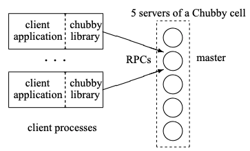
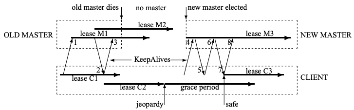

# [논문 번역] The Chubby lock service for loosely-coupled distributed systems (2006)

## 논문 정보

- **제목:** The Chubby lock service for loosely-coupled distributed systems
- **저자:** Mike Burrows
- **학술지/발행처:** ACM OSDI 2006
- **참고 링크:** [OSDI 논문 링크](https://research.google/pubs/the-chubby-lock-service-for-loosely-coupled-distributed-systems/)

---

## 논문 번역

### 0. 초록

우리는 느슨하게 결합된(loosely-coupled) 분산 시스템을 위해 신뢰할 수 있는 (비록 저용량이지만) 저장소뿐만 아니라 **성긴 잠금(coarse-grained locking)** 을 제공하도록 의도된
**Chubby 잠금 서비스**에 대한 우리의 경험을 기술합니다.
Chubby는 **조언적 잠금(advisory locks)** 을 갖춘 분산 파일 시스템과 매우 유사한 인터페이스를 제공하지만, 설계의 강조점은 높은 성능보다는 **가용성과 신뢰성**에 있습니다.
이 서비스의 많은 인스턴스가 1년 이상 사용되어 왔으며, 그중 몇몇은 각각 수만 명의 클라이언트를 동시에 처리하고 있습니다.
본 논문은 초기 설계와 예상된 사용 사례를 설명하고, 이를 실제 사용 사례와 비교하며, 그 차이를 수용하기 위해 설계를 어떻게 수정해야 했는지 설명합니다.

### 1. 서론

본 논문은 **Chubby**라 불리는 잠금 서비스를 설명합니다.
이 서비스는 고속 네트워크로 연결된 상당한 수의 소형 머신들로 구성된 **느슨하게 결합된(loosely-coupled) 분산 시스템** 내에서 사용되도록 설계되었습니다.
예를 들어, 하나의 **Chubby 인스턴스**(Chubby 셀(cell)로도 알려짐)는 1Gbit/s 이더넷으로 연결된 만 대의 4-프로세서 머신들에 서비스를 제공할 수 있습니다.
대부분의 Chubby 셀은 단일 데이터 센터나 기계실 내에 국한되지만, 복제본(**replicas**)들이 수천 킬로미터씩 떨어져 있는 Chubby 셀도 최소 하나 이상 운영하고 있습니다.

이 잠금 서비스의 목적은 클라이언트들이 자신들의 활동을 동기화하고 환경에 대한 기본적인 정보에 합의할 수 있도록 하는 것입니다.
주요 목표에는 신뢰성, 적절히 큰 규모의 클라이언트 집단에 대한 가용성, 그리고 이해하기 쉬운 시맨틱(semantics)이 포함되었습니다.
처리량과 저장 용량은 부차적인 것으로 간주되었습니다.
Chubby의 클라이언트 인터페이스는 파일 전체 읽기 및 쓰기를 수행하는 단순한 파일 시스템과 유사하며, 여기에 조언적 잠금(advisory locks)과 파일 수정과 같은 다양한 이벤트 알림 기능이 추가되었습니다.

우리는 개발자들이 시스템 내에서 **성긴 단위의(coarse-grained) 동기화**를 처리하고, 특히 동일한 사양의 서버 집합 중에서 **리더를 선출**하는 문제를 해결하는 데 Chubby가 도움이 될
것으로 기대했습니다.
예를 들어, 구글 파일 시스템(Google File System)은 GFS 마스터 서버를 지명하기 위해 Chubby 잠금을 사용하며, 빅테이블(Bigtable)은 마스터 선출, 마스터가 제어하는 서버들을 발견하는
용도, 그리고 클라이언트가 마스터를 찾을 수 있게 하는 용도 등 여러 가지 방식으로 Chubby를 사용합니다.

또한, GFS와 빅테이블 모두 Chubby를 소량의 메타데이터를 저장하기 위한 잘 알려진 가용 위치로 사용하며, 사실상 Chubby를 자신들의 분산 데이터 구조의 **루트(root)** 로 사용합니다.
일부 서비스들은 여러 서버 간에 작업을 (굵은 입자 단위로) 분할하기 위해 잠금을 사용합니다.

Chubby가 배포되기 전에는 구글의 대부분의 분산 시스템은 (작업이 중복되어도 해가 없는 경우) 프라이머리(primary) 선출을 위해 임시적인(ad hoc) 방식들을 사용하거나, (정확성이 필수적인 경우)
운영자의 개입을 필요로 했습니다.
전자의 경우, Chubby는 컴퓨팅 노력을 소량 절약할 수 있게 해주었습니다.
후자의 경우, 장애 발생 시 더 이상 인간의 개입이 필요하지 않게 된 시스템들에서 가용성이 크게 향상되었습니다.

분산 컴퓨팅에 익숙한 독자라면 동료들(peers) 사이에서 프라이머리(primary)를 선출하는 것이 **분산 합의 문제(distributed consensus problem)** 의 한 사례임을 인식할 것이며,
우리가 **비동기 통신(asynchronous communication)** 을 사용하는 해결책을 필요로 한다는 점을 깨달을 것입니다.
이 용어는 패킷의 손실, 지연 및 순서 변경을 허용하는 이더넷(Ethernet)이나 인터넷(Internet)과 같은 대다수의 실제 네트워크 동작을 설명합니다.

(실무자들은 보통 환경에 대해 더 강한 가정을 하는 모델 기반의 프로토콜을 경계해야 합니다.)
비동기 합의는 **Paxos 프로토콜**에 의해 해결됩니다.
동일한 프로토콜이 Oki와 Liskov에 의해 사용되었으며(그들의 뷰스탬프 복제(viewstamped replication)에 관한 논문 참조), 이러한 동등성은 다른 이들에 의해 언급된 바 있습니다.
실제로 우리가 지금까지 접한 비동기 합의를 위한 모든 작동 프로토콜은 그 핵심에 Paxos를 두고 있습니다.

Paxos는 타이밍 가정 없이 **안전성(safety)** 을 유지하지만, **활성(liveness)** 을 보장하기 위해서는 시계(clocks)가 도입되어야 합니다.
이는 Fischer 등의 불가능성 결과(FLP Impossibility)를 극복합니다.

Chubby를 구축한 것은 위에서 언급한 요구사항을 충족하기 위해 필요한 엔지니어링적 노력이었으며, 연구 목적은 아니었습니다.
우리는 새로운 알고리즘이나 기술을 주장하지 않습니다.
이 논문의 목적은 우리가 한 일과 그 이유를 설명하는 것이지, 이를 옹호하려는 것이 아닙니다.

이어지는 섹션에서 우리는 Chubby의 설계와 구현, 그리고 경험에 비추어 그것이 어떻게 변화했는지를 설명합니다.
또한 Chubby가 사용된 예상치 못한 방식들과 실수로 판명된 기능들에 대해서도 설명합니다.
합의 프로토콜이나 RPC 시스템의 세부 사항처럼 이미 다른 문헌에서 다루고 있는 내용은 생략합니다.

### 2. 설계

#### 2.1. 근거

혹자는 우리가 (비록 매우 신뢰할 수 있는 것일지라도) 중앙 집중식 잠금 서비스에 접속하는 라이브러리가 아니라, Paxos를 구현한 라이브러리를 구축했어야 한다고 주장할 수도 있습니다.
클라이언트 Paxos 라이브러리는 (네임 서비스 외에) 다른 서버에 의존하지 않을 것이며, 서비스가 상태 머신(state machines)으로 구현될 수 있다는 가정하에 프로그래머들에게 표준 프레임워크를 제공할
것입니다.
실제로 우리는 Chubby와 독립적인 그러한 클라이언트 라이브러리를 제공하고 있습니다.

그럼에도 불구하고, 잠금 서비스는 클라이언트 라이브러리에 비해 몇 가지 장점이 있습니다.
첫째, 우리 개발자들은 때때로 우리가 원하는 방식으로 고가용성을 계획하지 않습니다.
흔히 그들의 시스템은 적은 부하와 느슨한 가용성 보장을 가진 프로토타입으로 시작하며, 예외 없이 코드는 합의 프로토콜과 함께 사용하기 위해 특별히 구조화되어 있지 않습니다.
서비스가 성숙해지고 클라이언트를 확보함에 따라 가용성이 더 중요해지며, 복제와 프라이머리 선출이 기존 설계에 추가됩니다.
분산 합의를 제공하는 라이브러리로도 이를 수행할 수 있지만, 잠금 서버를 사용하면 기존 프로그램 구조와 통신 패턴을 더 쉽게 유지할 수 있습니다.

예를 들어, 마스터를 선출한 후 기존 파일 서버에 쓰는 작업은 기존 시스템에 단 두 개의 문(statements)과 하나의 RPC 파라미터만 추가하면 됩니다.
마스터가 되기 위해 잠금을 획득하고, 쓰기 RPC와 함께 추가적인 정수(잠금 획득 횟수)를 전달하며, 지연된 패킷에 대비하기 위해 획득 횟수가 현재 값보다 낮을 경우 파일 서버에서 쓰기를 거부하는 if 문을 추가하는
방식입니다.
우리는 이 기술이 기존 서버들을 합의 프로토콜에 참여시키는 것보다 더 쉽다는 것을 발견했으며, 특히 전환 기간 동안 호환성이 유지되어야 하는 경우 더욱 그러했습니다.

둘째, 프라이머리(primary)를 선출하거나 구성 요소 간에 데이터를 분할하는 우리의 많은 서비스는 그 결과를 알리기(advertising) 위한 메커니즘이 필요합니다.
이는 클라이언트가 적은 양의 데이터를 저장하고 가져올 수 있도록, 즉 작은 파일을 읽고 쓸 수 있도록 해야 함을 시사합니다.

이 작업은 네임 서비스로도 수행할 수 있지만, 클라이언트가 의존하는 서버의 수를 줄일 수 있고 프로토콜의 일관성 기능들을 공유할 수 있다는 점에서 잠금 서비스 자체가 이 작업에 매우 적합하다는 것이 우리의
경험이었습니다.
네임 서버로서 Chubby가 성공할 수 있었던 것은 시간 기반 캐싱(time-based caching)이 아닌 **일관된 클라이언트 캐싱(consistent client caching)** 을 사용한 덕분이 큽니다.

특히 개발자들은 DNS의 TTL(time-to-live) 값과 같은 캐시 타임아웃을 직접 선택하지 않아도 된다는 점을 매우 높게 평가했습니다.
이러한 타임아웃 값은 잘못 선택할 경우 높은 DNS 부하를 초래하거나 클라이언트의 장애 복구(fail-over) 시간을 길게 만들 수 있기 때문입니다.

셋째, 잠금 기반 인터페이스는 우리 프로그래머들에게 더 익숙합니다.
Paxos의 복제 상태 머신(replicated state machine)과 배타적 잠금(exclusive locks)과 관련된 임계 구역(critical sections) 모두 프로그래머에게 순차적 프로그래밍(
sequential programming)의 환상을 제공할 수 있습니다.
하지만 많은 프로그래머는 이전에 잠금을 접해본 적이 있으며, 자신이 잠금을 사용하는 법을 안다고 생각합니다.

아이러니하게도, 그러한 프로그래머들은 대개 틀리며, 특히 분산 시스템에서 잠금을 사용할 때 더욱 그렇습니다.
비동기 통신이 이루어지는 시스템에서 독립적인 머신 장애가 잠금에 미치는 영향을 고려하는 사람은 거의 없기 때문입니다.
그럼에도 불구하고, 잠금이 주는 겉모습뿐인 친숙함은 프로그래머들이 분산 의사결정을 위한 신뢰할 수 있는 메커니즘을 사용하도록 설득하는 과정에서의 장애물을 극복하게 해줍니다.

마지막으로, 분산 합의 알고리즘은 결정을 내리기 위해 쿼럼(quorums)을 사용하므로, 높은 가용성을 달성하기 위해 여러 개의 복제본을 사용합니다.
예를 들어, Chubby 자체는 대개 각 셀마다 5개의 복제본을 두며, 그중 3개가 가동 중이어야 셀이 정상 작동합니다.
대조적으로, 클라이언트 시스템이 잠금 서비스를 사용한다면, 단 하나의 클라이언트만으로도 잠금을 획득하고 안전하게 작업을 진행할 수 있습니다.

따라서 잠금 서비스는 신뢰할 수 있는 클라이언트 시스템이 작업을 진행하는 데 필요한 서버의 수를 줄여줍니다.
막연한 의미에서, 잠금 서비스는 클라이언트 시스템의 구성원 중 과반수 미만이 가동 중일 때도 올바른 결정을 내릴 수 있도록 해주는 범용적인 선거인단(electorate)을 제공하는 방법으로 볼 수 있습니다.

어떤 이들은 이 마지막 문제를 다른 방식으로 해결하는 것을 상상할 수도 있습니다.
여러 서버를 사용하여 Paxos 프로토콜의 "수락자(acceptors)"를 제공하는 "합의 서비스"를 구축하는 것입니다.

잠금 서비스와 마찬가지로, 합의 서비스는 단 하나의 활성 클라이언트 프로세스만으로도 클라이언트가 안전하게 작업을 진행할 수 있도록 해줍니다.
이와 유사한 기술이 비잔틴 결함 허용(Byzantine fault tolerance)에 필요한 상태 머신의 수를 줄이기 위해 사용된 바 있습니다.
하지만 합의 서비스가 오직 잠금을 제공하기 위해서만 사용되는 것이 아니라고 가정한다면(이 경우 사실상 잠금 서비스와 다를 바 없게 됨), 이 접근 방식은 위에서 설명한 다른 문제들을 전혀 해결하지 못합니다.

이러한 논거들은 두 가지 핵심적인 설계 결정을 시사합니다:

- 우리는 합의를 위한 라이브러리나 서비스가 아닌 **잠금 서비스**를 선택했습니다.
- 별도의 두 번째 서비스를 구축하고 유지 관리하는 대신, 선출된 프라이머리(primaries)가 자신과 자신의 파라미터들을 알릴 수 있도록 **작은 파일을 제공(serve small-files)** 하는 기능을
  선택했습니다.

우리의 예상된 사용 방식과 환경에 따라 다음과 같은 몇 가지 결정이 내려졌습니다:

- Chubby 파일을 통해 자신의 프라이머리(primary)를 알리는 서비스는 수천 명의 클라이언트를 가질 수 있습니다. 따라서 우리는 가급적 많은 서버가 필요하지 않으면서도 수천 명의 클라이언트가 이 파일을
  관찰할 수 있도록 허용해야 합니다.
- 복제된 서비스의 클라이언트와 복제본들은 서비스의 프라이머리가 언제 변경되는지 알고 싶어 할 수 있습니다. 이는 폴링(polling)을 피하기 위해 이벤트 알림 메커니즘이 유용할 것임을 시사합니다.
- 클라이언트가 주기적으로 파일을 폴링할 필요가 없더라도, 많은 개발자를 지원하다 보면 실제로 그렇게 하는 경우가 많습니다. 따라서 파일 캐싱(caching)이 바람직합니다.
- 우리 개발자들은 직관적이지 않은 캐싱 시맨틱(semantics)에 혼란을 느끼므로, 우리는 일관된 캐싱(consistent caching)을 선호합니다.
- 금전적 손실과 수감(jail time)을 모두 피하기 위해, 우리는 액세스 제어(access control)를 포함한 보안 메커니즘을 제공합니다.

일부 독자들에게는 놀라운 선택일 수 있겠으나, 우리는 잠금이 짧은 시간(초 단위 혹은 그 이하) 동안만 유지되는 **세밀한(fine-grained)** 방식의 사용을 기대하지 않습니다.
대신, 우리는 **성긴(coarse-grained)** 방식의 사용을 기대합니다.
예를 들어, 애플리케이션은 잠금을 사용하여 프라이머리(primary)를 선출할 수 있으며, 이 프라이머리는 이후 상당한 시간(아마도 몇 시간 또는 며칠 동안) 해당 데이터에 대한 모든 접근을 처리하게 됩니다.
이 두 가지 사용 스타일은 잠금 서버에 대해 서로 다른 요구사항을 시사합니다.

성긴 잠금(Coarse-grained locks)은 잠금 서버에 훨씬 적은 부하를 가합니다.
특히 잠금 획득률은 대개 클라이언트 애플리케이션의 트랜잭션 속도와 아주 약한 상관관계만을 가집니다.
성긴 잠금은 드물게 획득되므로, 잠금 서버의 일시적인 가용성 중단이 클라이언트를 지연시키는 일이 적습니다.
반면에 클라이언트 간의 잠금 이전은 비용이 많이 드는 복구 절차를 필요로 할 수 있으므로, 잠금 서버의 장애 복구(fail-over)로 인해 잠금이 소실되는 것을 원치 않을 것입니다.
따라서 성긴 잠금이 잠금 서버의 장애에도 살아남는 것이 좋으며, 그렇게 하는 데 드는 오버헤드에 대해서는 우려가 거의 없습니다.
또한 이러한 잠금은 가용성이 다소 낮은 적은 수의 잠금 서버로도 많은 클라이언트를 충분히 지원할 수 있게 해줍니다.

세밀한 잠금(Fine-grained locks)은 이와 다른 결론으로 이어집니다.
잠금 서버가 아주 잠깐이라도 가동 불능 상태가 되면 많은 클라이언트가 중단될 수 있습니다.
잠금 서비스에서의 트랜잭션 비율이 클라이언트들의 통합 트랜잭션 비율과 함께 증가하기 때문에, 성능과 서버를 마음대로 추가할 수 있는 능력은 매우 중요한 관심사입니다.

잠금 서버 장애 시 잠금을 유지하지 않음으로써 잠금 오버헤드를 줄이는 것이 유리할 수 있으며, 잠금이 짧은 기간 동안만 유지되기 때문에 이따금 잠금을 해제하는 것에 따른 시간적 패널티는 심각하지 않습니다.
(클라이언트는 네트워크 파티션 중에 잠금을 잃을 것에 대비해야 하므로, 잠금 서버의 장애 복구(fail-over) 시 잠금을 잃는 것은 새로운 복구 경로를 도입하지 않습니다.)

Chubby는 오직 **성긴(coarse-grained)** 잠금만을 제공하도록 의도되었습니다.
다행히 클라이언트가 자신의 애플리케이션에 맞게 조정된 **세밀한(fine-grained)** 잠금을 직접 구현하는 것은 간단합니다.
애플리케이션은 자신의 잠금들을 여러 그룹으로 분할하고, Chubby의 성긴 잠금을 사용하여 이러한 잠금 그룹을 애플리케이션 전용 잠금 서버에 할당할 수 있습니다.

이러한 세밀한 잠금을 유지하는 데 필요한 상태 정보는 거의 없습니다.
서버는 드물게 업데이트되고 휘발되지 않으며 단조 증가하는 **획득 카운터(acquisition counter)** 만 유지하면 됩니다.
클라이언트는 잠금을 해제할 때 소실된 잠금을 인지할 수 있으며, 단순한 고정 길이 **임대(lease)** 방식을 사용한다면 프로토콜을 단순하고 효율적으로 만들 수 있습니다.
이 방식의 가장 중요한 이점은 클라이언트 개발자들이 자신의 부하를 지원하는 데 필요한 서버의 **자원 할당(provisioning)** 에 책임을 지면서도, 직접 **합의(consensus)** 를 구현해야 하는
복잡성에서는 벗어날 수 있다는 점입니다.

#### 2.2. 시스템 구조

Chubby는 RPC를 통해 통신하는 두 개의 주요 구성 요소인 **서버**와 클라이언트 애플리케이션이 링크하는 **라이브러리**로 구성됩니다(그림 1 참조).
Chubby 클라이언트와 서버 사이의 모든 통신은 클라이언트 라이브러리에 의해 중개됩니다.
선택적인 세 번째 구성 요소인 프록시 서버는 섹션 3.1에서 논의됩니다.

Chubby 셀은 **복제본(replicas)** 이라 불리는 소수의 서버(보통 5대)로 구성되며, (예를 들어 서로 다른 랙에 배치하는 등) 상관 결함(correlated failure)의 가능성을 줄이도록
배치됩니다.

복제본들은 **분산 합의 프로토콜**을 사용하여 **마스터**를 선출합니다.
마스터는 복제본 과반수의 투표를 얻어야 하며, 동시에 해당 복제본들로부터 **마스터 임대(master lease)** 라고 불리는 수 초의 간격 동안 다른 마스터를 선출하지 않겠다는 약속을 받아야 합니다.
마스터가 계속해서 과반수의 투표를 얻는 한, 마스터 임대는 복제본들에 의해 주기적으로 갱신됩니다.

복제본들은 단순한 데이터베이스의 사본을 유지하지만, 오직 **마스터**만이 이 데이터베이스에 대한 읽기와 쓰기를 시작합니다.
다른 모든 복제본은 합의 프로토콜을 통해 전송된 마스터의 업데이트 내용을 단순히 복제할 뿐입니다.

클라이언트는 DNS에 나열된 복제본(replicas)들에 **마스터 위치 요청(master location requests)** 을 보냄으로써 마스터를 찾습니다.
마스터가 아닌 복제본들은 해당 요청에 대해 현재 마스터의 식별 정보를 반환하는 방식으로 응답합니다.

일단 클라이언트가 마스터의 위치를 파악하면, 마스터가 응답을 중단하거나 자신이 더 이상 마스터가 아님을 나타낼 때까지 모든 요청을 해당 마스터에게 직접 보냅니다.
**쓰기 요청(Write requests)** 은 합의 프로토콜을 통해 모든 복제본으로 전파되며, 해당 쓰기가 셀 내 복제본의 **과반수(majority)** 에 도달했을 때 승인(acknowledged)됩니다.

반면, **읽기 요청(Read requests)** 은 마스터 단독으로 처리합니다.
마스터 임대(master lease)가 만료되지 않은 동안에는 다른 마스터가 존재할 수 없으므로 이 방식은 안전합니다.

만약 마스터에 장애가 발생하면, 다른 복제본들은 자신들의 마스터 임대가 만료되는 시점에 선거 프로토콜을 실행합니다.
새로운 마스터는 보통 몇 초 안에 선출됩니다.
예를 들어, 최근 두 번의 선거는 각각 6초와 4초가 걸렸으나, 때로는 30초까지 길어지는 경우도 있습니다.

만약 복제본(replica) 하나가 장애를 일으켜 몇 시간 동안 복구되지 않으면, 단순한 교체 시스템이 유휴 풀(free pool)에서 새로운 머신을 선택하여 그 위에 잠금 서버 바이너리를 실행합니다.
그런 다음 DNS 테이블을 업데이트하여, 장애가 발생한 복제본의 IP 주소를 새 복제본의 IP 주소로 교체합니다.

현재 마스터는 주기적으로 DNS를 폴링하며 결국 이 변경 사항을 인지하게 됩니다.
그 후 마스터는 셀 데이터베이스에 기록된 셀 구성원 목록을 업데이트하며, 이 목록은 일반적인 복제 프로토콜을 통해 모든 구성원 간에 일관되게 유지됩니다.

그동안 새 복제본은 파일 서버에 저장된 백업과 활성 복제본들로부터 전달받은 업데이트를 조합하여 데이터베이스의 최신 사본을 확보합니다.
새 복제본이 현재 마스터가 커밋(commit)을 기다리고 있는 요청을 처리하고 나면, 비로소 해당 복제본은 새로운 마스터 선거에서 투표할 권한을 얻게 됩니다.

#### 2.3. 파일, 디렉터리 및 핸들

Chubby는 UNIX와 유사하지만 그보다 더 단순한 파일 시스템 인터페이스를 제공합니다.
이는 일반적인 방식과 마찬가지로 슬래시(/)로 구분된 이름 구성 요소를 가진 엄격한 파일 및 디렉터리 트리 구조로 구성됩니다.
전형적인 이름의 예는 다음과 같습니다:

`/ls/foo/wombat/pouch`

`ls` 접두사는 모든 Chubby 이름에 공통적으로 사용되며, 잠금 서비스(lock service)를 의미합니다.
두 번째 구성 요소(`foo`)는 Chubby 셀의 이름이며, DNS 조회를 통해 하나 이상의 Chubby 서버로 해석됩니다.
`local`이라는 특수한 셀 이름은 클라이언트의 로컬 Chubby 셀이 사용되어야 함을 나타내는데, 이는 대개 같은 건물 내에 있어 접근 가능성이 가장 높은 셀을 의미합니다.
이름의 나머지 부분인 `/wombat/pouch`는 지정된 Chubby 셀 내에서 해석됩니다.
다시 한번 UNIX의 방식을 따라, 각 디렉터리는 자식 파일 및 디렉터리의 목록을 포함하고, 각 파일은 해석되지 않은 바이트 시퀀스(uninterpreted bytes)를 포함합니다.

Chubby의 명명(naming) 구조가 파일 시스템을 닮았기 때문에, 우리는 자체적인 전용 API뿐만 아니라 구글 파일 시스템(GFS)과 같은 다른 파일 시스템에서 사용하는 인터페이스를 통해서도 애플리케이션이
Chubby를 이용할 수 있도록 만들 수 있었습니다.
이는 기본적인 브라우징 및 네임스페이스 조작 도구를 작성하는 데 필요한 노력을 크게 줄여주었으며, 일반적인 Chubby 사용자들을 교육할 필요성 또한 감소시켰습니다.

Chubby의 설계는 분산 처리를 용이하게 하기 위해 UNIX와는 몇 가지 면에서 다릅니다.
서로 다른 디렉터리에 있는 파일들이 서로 다른 Chubby 마스터에 의해 서비스될 수 있도록 하기 위해, 우리는 파일을 한 디렉터리에서 다른 디렉터리로 이동시키는 작업을 노출하지 않으며, 디렉터리 수정 시간을
유지하지 않습니다.
또한 경로 의존적인 권한 시맨틱(즉, 파일에 대한 접근이 해당 파일로 이어지는 경로상의 디렉터리들이 아닌 파일 자체의 권한에 의해 제어되는 방식)을 피합니다.
파일 메타데이터를 캐싱하기 쉽게 만들기 위해 시스템은 마지막 접근 시간을 공개하지 않습니다.

네임스페이스는 오직 파일과 디렉터리만을 포함하며, 이를 통칭하여 **노드(nodes)** 라고 부릅니다.
이러한 각 노드는 자신의 셀 내에서 단 하나의 이름만을 가집니다.
심볼릭 링크(symbolic links)나 하드 링크(hard links)는 존재하지 않습니다.

노드는 **영구적(permanent)** 이거나 **임시적(ephemeral)** 일 수 있습니다.
모든 노드는 명시적으로 삭제될 수 있지만, 임시 노드는 어떤 클라이언트도 해당 노드를 열고 있지 않을 때(디렉터리의 경우 비어 있을 때) 자동으로 삭제됩니다.
임시 파일은 임시용 파일로 사용되거나, 다른 이들에게 특정 클라이언트가 살아있음을 알리는 지표로 사용됩니다.
모든 노드는 권고 읽기/쓰기 잠금(advisory reader/writer lock) 역할을 할 수 있으며, 이러한 잠금에 대해서는 섹션 2.4에서 더 자세히 설명합니다.

각 노드는 다양한 메타데이터를 가지고 있으며, 여기에는 노드에 대한 읽기, 쓰기 및 해당 노드의 ACL 이름 변경을 제어하는 데 사용되는 세 가지 **액세스 제어 목록(ACL)** 이름이 포함됩니다.
따로 재정의(override)하지 않는 한, 노드는 생성 시 부모 디렉터리의 ACL 이름을 상속받습니다.
ACL 자체는 해당 셀의 로컬 네임스페이스에서 잘 알려진 부분인 ACL 디렉터리에 위치한 파일들입니다.
이러한 ACL 파일들은 **주체(principals)** 이름들의 단순한 목록으로 구성되며, 독자들은 여기서 Plan 9의 그룹(groups)을 떠올릴 수도 있을 것입니다.
따라서 만약 파일 F의 쓰기 ACL 이름이 `foo`이고, ACL 디렉터리에 `bar`라는 항목이 포함된 `foo`라는 파일이 있다면, 사용자 `bar`는 F에 쓸 수 있는 권한을 가집니다.
사용자는 RPC 시스템에 내장된 메커니즘을 통해 인증됩니다.
Chubby의 ACL은 단순히 파일이기 때문에, 유사한 액세스 제어 메커니즘을 사용하고자 하는 다른 서비스들도 이를 자동으로 이용할 수 있습니다.

노드별 메타데이터에는 클라이언트가 변경 사항을 쉽게 감지할 수 있도록 하는 **4가지 단조 증가(monotonically-increasing) 64비트 숫자**가 포함됩니다:

- **인스턴스 번호(instance number):** 동일한 이름을 가졌던 이전의 그 어떤 노드보다 큰 번호입니다.
- **내용 생성 번호(content generation number, 파일 전용):** 파일의 내용이 작성(쓰기)될 때마다 증가합니다.
- **잠금 생성 번호(lock generation number):** 노드의 잠금 상태가 '자유(free)'에서 '보유(held)'로 전환될 때마다 증가합니다.
- **ACL 생성 번호(ACL generation number):** 노드의 ACL 이름이 작성될 때마다 증가합니다.

또한 Chubby는 클라이언트가 파일의 차이 여부를 확인할 수 있도록 **64비트 파일 내용 체크섬(checksum)** 을 노출합니다.

클라이언트는 UNIX의 파일 기술자(file descriptor)와 유사한 **핸들(handles)** 을 얻기 위해 노드를 엽니다.
핸들에는 다음과 같은 정보가 포함됩니다:

- **체크 디지트(check digits):** 클라이언트가 핸들을 직접 생성하거나 추측하는 것을 방지합니다. 덕분에 전체 액세스 제어 확인은 핸들이 생성될 때만 수행하면 됩니다. (파일 기술자를 위조할 수 없기
  때문에 `open` 시에만 권한 비트를 확인하고, 이후의 읽기/쓰기 시에는 확인하지 않는 UNIX와 비교할 수 있습니다.)
- **시퀀스 번호(sequence number):** 마스터가 해당 핸들이 자신에 의해 생성된 것인지, 아니면 이전 마스터에 의해 생성된 것인지 식별할 수 있게 해줍니다.
- **모드 정보(mode information):** `open` 시에 제공됩니다. 이는 오래된 핸들이 새로 재시작된 마스터에게 제시되었을 때, 마스터가 자신의 상태를 재구성(recreate)할 수 있도록
  돕습니다.

#### 2.4. 잠금과 시퀀서 (Locks and sequencers)

모든 Chubby 파일과 디렉터리는 **읽기-쓰기 잠금(reader-writer lock)** 으로 작동할 수 있습니다.
즉, 하나의 클라이언트 핸들이 **배타적(exclusive, 쓰기)** 모드로 잠금을 보유하거나, 원하는 수만큼의 클라이언트 핸들이 **공유(shared, 읽기)** 모드로 잠금을 보유할 수 있습니다.
대부분의 프로그래머에게 익숙한 뮤텍스(mutex)와 마찬가지로, 이 잠금들은 **권고(advisory)** 방식입니다.
즉, 이 잠금들은 동일한 잠금을 획득하려는 다른 시도와만 충돌합니다.
'F'라는 이름의 잠금을 보유하고 있다고 해서 파일 F에 접근하는 데 필수적인 것도 아니며, 다른 클라이언트가 해당 파일에 접근하는 것을 막지도 않습니다.
우리는 잠금을 보유하지 않은 클라이언트가 잠긴 객체에 접근할 수 없게 만드는 **강제(mandatory)** 잠금 방식을 거부했는데, 그 이유는 다음과 같습니다:

- Chubby 잠금은 잠금과 관련된 파일뿐만 아니라, 종종 다른 서비스에 의해 구현된 리소스를 보호합니다. 강제 잠금을 의미 있는 방식으로 적용하려면 이러한 서비스들을 대대적으로 수정해야 했을 것입니다.
- 디버깅이나 관리 목적으로 잠긴 파일에 접근해야 할 때, 사용자가 애플리케이션을 강제로 종료하게 만들고 싶지 않았습니다. 복잡한 시스템에서는 관리용 소프트웨어가 사용자에게 애플리케이션 종료나 재부팅을 지시하여 강제
  잠금을 해제하는 식의 개인용 컴퓨터(PC) 스타일 접근법을 사용하기 어렵습니다.
- 우리 개발자들은 "잠금 X를 보유 중임"과 같은 단언문(assertions)을 작성하는 전통적인 방식으로 오류를 점검하므로, 강제 점검을 통해 얻는 이득이 거의 없습니다. 잠금을 보유하지 않았을 때 버그가 있거나
  악의적인 프로세스가 데이터를 손상시킬 기회는 여전히 많기 때문에, 강제 잠금이 제공하는 추가적인 보호 장치가 큰 가치가 없다고 판단했습니다.

Chubby에서 어느 모드로든(공유 또는 배타적 모드) 잠금을 획득하려면 **쓰기 권한(write permission)** 이 필요합니다.
이는 권한이 없는 독자(unprivileged reader)가 잠금을 점유함으로써 쓰기 작업자(writer)의 진행을 방해(starvation)하는 것을 방지하기 위함입니다.

분산 시스템에서 잠금(locking)은 통신이 일반적으로 불확실하고 프로세스가 독립적으로 장애를 일으킬 수 있기 때문에 매우 복잡합니다.
따라서 잠금 L을 보유한 프로세스가 요청 R을 발행한 직후 장애가 발생할 수 있습니다.
그사이 다른 프로세스가 L을 획득하여 모종의 작업을 처리하고 난 뒤에야 원래의 요청 R이 목적지에 도착할 수 있습니다.
만약 R이 뒤늦게 도착하여 실행된다면, 이는 더 이상 L의 보호를 받지 못하는 상태이며 잠재적으로 일관성이 깨진 데이터를 대상으로 작업하게 될 위험이 있습니다.
메시지를 순서와 상관없이 수신하게 되는 이 문제는 이미 널리 연구되어 왔습니다.
해결책으로는 가상 시간(virtual time)이나, 모든 참여자의 관찰 결과와 일치하는 순서로 메시지가 처리되도록 보장하여 문제를 회피하는 가상 동기화(virtual synchrony) 등이 있습니다.

기존의 복잡한 시스템에서 모든 상호작용에 시퀀스 번호를 도입하는 것은 비용이 많이 듭니다.
대신, Chubby는 잠금을 사용하는 상호작용에만 시퀀스 번호를 도입할 수 있는 수단을 제공합니다.
잠금 보유자는 언제든지 **시퀀서(sequencer)** 를 요청할 수 있는데, 이는 잠금 획득 직후의 잠금 상태를 설명하는 불투명한 바이트 문자열(opaque byte-string)입니다.
여기에는 잠금의 이름, 획득된 모드(배타적 또는 공유), 그리고 **잠금 생성 번호**가 포함됩니다.
클라이언트는 해당 작업이 잠금에 의해 보호되기를 원할 때 이 시퀀서를 서버(예: 파일 서버)에 전달합니다.
수신 서버는 시퀀서가 여전히 유효한지, 그리고 적절한 모드를 가지고 있는지 확인해야 하며, 만약 그렇지 않다면 요청을 거부해야 합니다.
시퀀서의 유효성은 서버의 Chubby 캐시를 통해 확인하거나, 서버가 Chubby와 별도의 세션을 유지하고 싶지 않은 경우 서버가 관찰한 가장 최근의 시퀀서와 비교하여 확인할 수 있습니다.
이 시퀀서 메커니즘은 관련 메시지에 문자열 하나를 추가하는 것만으로 충분하며, 개발자들에게 설명하기도 매우 쉽습니다.

우리는 시퀀서가 사용하기 쉽다고 생각하지만, 중요한 프로토콜들은 천천히 진화합니다.
따라서 Chubby는 시퀀서를 지원하지 않는 서버에 대해, 지연되거나 순서가 바뀐 요청으로 인한 위험을 줄일 수 있는 불완전하지만 더 쉬운 메커니즘을 제공합니다.
클라이언트가 정상적인 방식으로 잠금을 해제하면, 예상한 대로 즉시 다른 클라이언트가 해당 잠금을 점유할 수 있습니다.
그러나 보유자의 장애나 통신 두절로 인해 잠금이 자유(free) 상태가 된 경우, 잠금 서버는 **잠금 지연(lock-delay)** 이라 불리는 기간 동안 다른 클라이언트가 그 잠금을 점유하는 것을 방지합니다.
클라이언트는 현재 최대 1분까지 잠금 지연 시간을 지정할 수 있습니다.
이 제한은 결함이 있는 클라이언트가 잠금(및 관련 리소스)을 임의로 아주 오랫동안 사용할 수 없게 만드는 것을 방지합니다.
비록 불완전하긴 하지만, 잠금 지연은 메시지 지연이나 재시작으로 인해 발생하는 일상적인 문제들로부터 수정되지 않은 서버와 클라이언트를 보호해 줍니다.

#### 2.5. 이벤트 (Events)

Chubby 클라이언트는 핸들을 생성할 때 다양한 이벤트에 가입(subscribe)할 수 있습니다.
이러한 이벤트들은 Chubby 라이브러리의 **업콜(up-call)** 을 통해 클라이언트에 비동기적으로 전달됩니다.
이벤트의 종류는 다음과 같습니다:

- **파일 내용 수정(file contents modified):** 주로 파일을 통해 광고되는 서비스의 위치를 모니터링하는 데 사용됩니다.
- **자식 노드 추가, 제거 또는 수정(child node added, removed, or modified):** 미러링을 구현하는 데 사용됩니다. (새로운 파일을 발견할 수 있게 해 줄 뿐만 아니라, 자식
  노드에 대한 이벤트를 반환함으로써 참조 횟수(reference counts)에 영향을 주지 않고 임시 파일을 모니터링할 수 있게 해줍니다.)
- **Chubby 마스터 장애 복구(Chubby master failed over):** 다른 이벤트들이 유실되었을 수 있으므로 데이터를 다시 스캔해야 함을 클라이언트에게 경고합니다.
- **핸들 및 잠금 무효화(a handle and its lock has become invalid):** 이는 대개 통신 문제를 시사합니다.
- **잠금 획득(lock acquired):** 프라이머리(primary)가 언제 선출되었는지 확인하는 데 사용될 수 있습니다.
- **다른 클라이언트로부터의 충돌하는 잠금 요청(conflicting lock request from another client):** 잠금의 캐싱을 가능하게 합니다.

이벤트는 해당 작업이 발생한 **후에** 전달됩니다.
따라서 클라이언트가 파일 내용이 변경되었다는 알림을 받았다면, 그 이후에 파일을 읽었을 때 반드시 새로운 데이터(또는 그보다 더 최신의 데이터)를 보게 될 것임을 보장합니다.

언급된 마지막 두 이벤트는 거의 사용되지 않으며, 사후에 돌이켜보면 생략될 수도 있었습니다.
예를 들어, 프라이머리(primary) 선출 이후 클라이언트들은 단순히 프라이머리가 존재한다는 사실을 아는 것보다 새로운 프라이머리와 통신해야 할 필요가 있습니다.
따라서 그들은 새로운 프라이머리가 자신의 주소를 파일에 기록했음을 나타내는 **파일 수정 이벤트**를 기다립니다.
이론적으로 **충돌하는 잠금 이벤트(conflicting lock event)** 는 클라이언트가 Chubby 잠금을 사용하여 캐시 일관성을 유지함으로써 다른 서버에 저장된 데이터를 캐싱할 수 있게 해줍니다.
충돌하는 잠금 요청에 대한 알림은 클라이언트에게 잠금과 관련된 데이터 사용을 마칠 것을 지시하게 됩니다.
즉, 대기 중인 작업을 마무리하고, 수정 사항을 홈 위치로 플러시(flush)하며, 캐싱된 데이터를 폐기하고 잠금을 해제하는 일련의 과정을 밟는 것입니다.
그러나 지금까지는 아무도 이러한 사용 방식을 채택하지 않았습니다.

#### 2.6. API

클라이언트는 Chubby 핸들을 다양한 연산을 지원하는 **불투명 구조체(opaque structure)** 에 대한 포인터로 취급합니다.
핸들은 오직 `Open()`을 통해서만 생성되며, `Close()`를 통해 파괴됩니다.

`Open()`은 UNIX의 파일 기술자(file descriptor)와 유사한 **핸들(handle)** 을 생성하기 위해 특정 이름의 파일이나 디렉터리를 엽니다.
Chubby API 중 오직 이 호출만이 **노드 이름**을 직접 인자로 받으며, 그 외의 모든 연산은 생성된 핸들을 통해 이루어집니다.

이름은 기존의 **디렉터리 핸들(directory handle)** 을 기준으로 평가됩니다.
라이브러리는 항상 유효한 루트("/")에 대한 핸들을 제공합니다.
이러한 디렉터리 핸들 방식은 여러 추상화 계층이 포함된 멀티스레드 프로그램에서 프로그램 전체의 '현재 디렉터리(current directory)'를 사용할 때 발생하는 문제점들을 피할 수 있게 해줍니다.

클라이언트는 `Open()` 호출 시 다음과 같은 다양한 옵션을 지정할 수 있습니다:

- **핸들 사용 방식:** 읽기, 쓰기 및 잠금, ACL 변경 중 어떻게 사용될지 지정합니다. 클라이언트에게 적절한 권한이 있는 경우에만 핸들이 생성됩니다.
- **이벤트 전달:** 수신하고자 하는 이벤트들을 지정합니다(2.5 참고).
- **잠금 지연(Lock-delay):** 해당 핸들에 적용할 잠금 지연 시간을 설정합니다(2.4 참고).
- **생성 여부:** 새로운 파일이나 디렉터리를 생성해야 하는지(또는 반드시 생성해야 하는지)를 결정합니다. 파일을 생성할 때 호출자가 초기 내용과 초기 ACL 이름을 함께 제공할 수 있으며, 반환값을 통해 실제로
  파일이 새로 생성되었는지 여부를 확인할 수 있습니다.

`Close()`는 열린 핸들을 닫습니다.
이후 해당 핸들을 사용하는 것은 허용되지 않으며, 이 호출은 결코 실패하지 않습니다.
이와 관련된 호출인 `Poison()`은 핸들을 닫지는 않으면서, 해당 핸들에 대해 진행 중인(outstanding) 작업 및 이후의 작업들이 모두 실패하도록 만듭니다.
이는 클라이언트가 다른 스레드에서 수행 중인 Chubby 호출을 취소하고 싶을 때, 해당 스레드들이 접근하고 있는 메모리가 할당 해제될(deallocating) 걱정 없이 안전하게 작업을 중단할 수 있게 해줍니다.

핸들에서 작동하는 주요 호출(calls)은 다음과 같습니다.

`GetContentsAndStat()`은 파일의 내용과 메타데이터를 모두 반환합니다.
파일 내용은 원자적으로, 그리고 전체가 읽힙니다.
우리는 대용량 파일 사용을 지양하기 위해 부분 읽기와 쓰기를 피했습니다.
관련된 호출인 `GetStat()`은 메타데이터만을 반환하며, `ReadDir()`은 디렉터리 자식 노드들의 이름과 메타데이터를 반환합니다.

`SetContents()`는 파일의 내용을 기록합니다.
선택적으로, 클라이언트는 파일에 대해 **비교 후 교체(compare-and-swap)** 를 시뮬레이션할 수 있도록 내용 생성 번호(content generation number)를 제공할 수 있으며, 내용은 생성
번호가 최신일 경우에만 변경됩니다.
파일의 내용은 항상 원자적으로, 그리고 전체가 기록됩니다.
관련된 호출인 `SetACL()`은 노드와 연관된 ACL 이름에 대해 유사한 작업을 수행합니다.

`Delete()`는 자식 노드가 없는 경우에 해당 노드를 삭제합니다.

`Acquire()`, `TryAcquire()`, `Release()`는 잠금을 획득하고 해제합니다.

`GetSequencer()`는 이 핸들이 보유한 모든 잠금을 설명하는 시퀀서(2.4 참고)를 반환합니다.

`SetSequencer()`는 시퀀서를 핸들과 연관시킵니다.
시퀀서가 더 이상 유효하지 않게 되면 해당 핸들에 대한 후속 작업들은 실패하게 됩니다.

`CheckSequencer()`는 시퀀서가 유효한지 확인합니다(2.4 참조).

핸들이 생성된 이후 노드가 삭제되었다면, 비록 그 후에 파일이 다시 생성되었더라도 호출은 실패합니다.
즉, 핸들은 파일 이름이 아니라 파일의 특정 인스턴스(instance)와 연관됩니다.
Chubby는 모든 호출에 대해 액세스 제어 확인을 적용할 수 있지만, `Open()` 호출은 항상 확인합니다(2.3 참조).

위의 모든 호출은 호출 자체에 필요한 다른 매개변수 외에도 **작업 매개변수(operation parameter)** 를 받습니다.
작업 매개변수는 모든 호출과 연관될 수 있는 데이터 및 제어 정보를 보유합니다.
특히, 클라이언트는 작업 매개변수를 통해 다음을 수행할 수 있습니다:

- 호출을 비동기로 만들기 위한 콜백(callback) 제공,
- 이러한 호출의 완료 대기, and/or
- 확장된 오류 및 진단 정보 획득

클라이언트는 이 API를 사용하여 다음과 같이 프라이머리 선출(primary election)을 수행할 수 있습니다.
모든 잠재적 프라이머리들은 잠금 파일을 열고 잠금 획득을 시도합니다.
한 명이 성공하여 프라이머리가 되고, 나머지는 복제본(replicas)으로 활동합니다.
프라이머리는 `SetContents()`를 사용하여 자신의 신원을 잠금 파일에 기록하며, 이를 통해 클라이언트와 복제본들이 (아마도 파일 수정 이벤트(2.5)에 응답하여) `GetContentsAndStat()`으로
파일을 읽어 프라이머리를 찾을 수 있게 합니다.
이상적으로는 프라이머리가 `GetSequencer()`로 시퀀서를 획득한 후 이를 자신이 통신하는 서버들에 전달하며, 서버들은 `CheckSequencer()`를 통해 해당 클라이언트가 여전히 프라이머리인지 확인해야
합니다.
시퀀서를 확인할 수 없는 서비스에는 잠금 지연(lock-delay)이 사용될 수 있습니다(2.4).

#### 2.7. 캐싱 (Caching)

읽기 트래픽을 줄이기 위해, Chubby 클라이언트는 파일 데이터와 노드 메타데이터(파일의 부재 정보 포함)를 메모리에 유지되는 일관된 **라이트스루(write-through)** 캐시에 저장합니다.
캐시는 아래에서 설명할 **리스(lease)** 메커니즘에 의해 유지되며, 각 클라이언트가 무엇을 캐싱하고 있을지 목록을 유지하는 마스터가 보내는 **무효화(invalidation)** 를 통해 일관성이 유지됩니다.
이 프로토콜은 클라이언트가 일관된 Chubby 상태를 보거나, 아니면 에러를 보게 됨을 보장합니다.

파일 데이터나 메타데이터가 변경되려 할 때, 마스터는 해당 데이터를 캐싱하고 있을 가능성이 있는 모든 클라이언트에게 **무효화(invalidation)** 를 보내는 동안 수정을 차단(block)합니다.
이 메커니즘은 다음 섹션에서 더 자세히 다룰 KeepAlive RPC 위에서 작동합니다.
무효화 신호를 받으면, 클라이언트는 무효화된 상태를 플러시(flush)하고 다음 KeepAlive 호출을 통해 수신을 확인(acknowledge)합니다.
수정 작업은 서버가 각 클라이언트의 캐시가 무효화되었음을 확인한 후에만 진행되는데, 이는 클라이언트가 무효화를 승인했거나 클라이언트의 캐시 리스(lease)가 만료되었기 때문입니다.

캐시 무효화가 승인되지 않은 상태로 남아 있는 동안 마스터는 해당 노드를 캐싱 불가능(uncachable)으로 취급하기 때문에, 오직 한 번의 무효화 절차만 필요합니다.
이 방식은 읽기 작업이 항상 지연 없이 처리될 수 있게 해주며, 이는 읽기가 쓰기보다 훨씬 많은 상황에서 유용합니다.
대안으로는 무효화가 진행되는 동안 노드에 접근하는 호출을 차단하는 방식이 있는데, 이는 간헐적인 지연을 대가로 성급한 클라이언트들이 무효화 기간에 캐싱되지 않은 접근을 시도하며 마스터에 폭주하는 일을 방지합니다.
만약 이것이 문제가 된다면, 과부하가 감지될 때 전략을 전환하는 하이브리드 방식을 채택하는 것을 고려해 볼 수 있습니다.

캐싱 프로토콜은 단순합니다.
변경 시 캐시된 데이터를 **무효화(invalidate)** 할 뿐, 절대 업데이트하지 않습니다.
무효화 대신 업데이트를 하는 방식도 (구현상으로는) 똑같이 간단하겠지만, 업데이트 전용 프로토콜은 한도 끝도 없이 비효율적일 수 있습니다.
파일을 한 번 액세스했던 클라이언트가 무기한으로 업데이트를 수신하게 되어, 무한한 수의 불필요한 업데이트를 초래할 수 있기 때문입니다.

엄격한 일관성(strict consistency)을 제공하는 데 따르는 오버헤드에도 불구하고, 우리는 프로그래머들이 더 약한 모델들을 사용하기 어려워할 것이라고 판단하여 이를 거절했습니다.
이와 유사하게, 모든 메시지에서 클라이언트가 시퀀스 번호를 교환해야 하는 가상 동기화(virtual synchrony)와 같은 메커니즘은, 이미 다양한 통신 프로토콜이 존재하는 환경에서는 부적절하다고 간주되었습니다.

데이터와 메타데이터를 캐싱하는 것 외에도, Chubby 클라이언트는 열린 핸들을 캐싱합니다.
따라서 클라이언트가 이전에 열었던 파일을 다시 여는 경우, 첫 번째 `Open()` 호출만이 반드시 마스터로의 RPC로 이어집니다.
이 캐싱은 클라이언트가 관찰하는 의미론(semantics)에 결코 영향을 주지 않도록 사소한 방식으로 제한됩니다.
애플리케이션이 휘발성 파일(ephemeral files)의 핸들을 닫았다면 이를 열린 상태로 유지할 수 없으며, 잠금을 허용하는 핸들은 재사용될 수 있지만 여러 애플리케이션 핸들에 의해 동시에 사용될 수는 없습니다.
이 마지막 제한은 클라이언트가 마스터로 향하는 진행 중인(outstanding) `Acquire()` 호출을 취소하기 위한 부수 효과로 `Close()`나 `Poison()`을 사용할 수 있기 때문에 존재합니다.

Chubby의 프로토콜은 클라이언트가 잠금을 캐싱하는 것을 허용합니다.
즉, 동일한 클라이언트에 의해 다시 사용될 수 있기를 바라며 잠금을 엄격히 필요한 시간보다 더 오래 보유하는 것을 허용합니다.
다른 클라이언트가 충돌하는 잠금을 요청하면 이벤트가 잠금 보유자에게 이를 알리며, 이를 통해 보유자는 다른 곳에서 잠금이 필요한 바로 그 시점에 잠금을 해제할 수 있습니다(2.5 참조).

#### 2.8. 세션과 KeepAlive (Sessions and KeepAlives)

Chubby 세션은 Chubby 셀과 Chubby 클라이언트 사이의 관계입니다.
이는 일정 시간 동안 존재하며, **KeepAlive**라고 불리는 주기적인 핸드셰이크(handshake)에 의해 유지됩니다.
Chubby 클라이언트가 마스터에게 달리 알리지 않는 한, 클라이언트의 핸들, 잠금, 그리고 캐시된 데이터는 세션이 유효하게 유지되는 동안 모두 유효하게 유지됩니다.
(하지만 세션 유지를 위한 프로토콜은 세션을 유지하기 위해 클라이언트가 캐시 무효화를 승인하도록 요구할 수도 있습니다. 아래 내용을 참조하십시오.)

클라이언트는 Chubby 셀의 마스터와 처음 접촉할 때 새로운 세션을 요청합니다.
클라이언트는 자신이 종료될 때, 또는 세션이 유휴 상태(열린 핸들이 없고 1분 동안 호출이 없는 상태)인 경우 세션을 명시적으로 종료합니다.

각 세션은 연관된 **리스(lease)** 를 가집니다.
이는 마스터가 세션을 일방적으로 종료하지 않겠다고 보장하는, 미래로 연장된 시간 간격입니다.
이 간격의 끝을 **세션 리스 타임아웃(session lease timeout)** 이라고 부릅니다.
마스터는 이 타임아웃을 미래로 더 연장할 수 있지만, 과거의 시점으로 앞당길 수는 없습니다.

마스터는 세 가지 상황에서 리스 타임아웃을 연장합니다.
세션 생성 시, 마스터 페일오버(fail-over) 발생 시(아래 참조), 그리고 클라이언트의 KeepAlive RPC에 응답할 때입니다.
KeepAlive를 수신하면, 마스터는 일반적으로 클라이언트의 이전 리스 기간이 만료에 가까워질 때까지 해당 RPC를 차단(반환되지 않도록 유지)합니다.
이후 마스터는 RPC가 클라이언트에 반환되도록 허용하여, 클라이언트에게 새로운 리스 타임아웃을 알립니다.
마스터는 타임아웃을 임의의 양만큼 연장할 수 있습니다.
기본 연장 기간은 12초이지만, 과부하된 마스터는 처리해야 할 KeepAlive 호출 횟수를 줄이기 위해 더 큰 값을 사용할 수 있습니다.
클라이언트는 이전 응답을 받은 직후 즉시 새로운 KeepAlive를 시작합니다.
이로써 클라이언트는 마스터에 거의 항상 차단된 KeepAlive 호출이 존재하도록 보장합니다.

KeepAlive 응답은 클라이언트의 리스를 연장하는 것뿐만 아니라, 이벤트와 캐시 무효화(invalidation)를 클라이언트에게 다시 전달하는 데에도 사용됩니다.
전달할 이벤트나 무효화가 발생하면 마스터는 (원래 만료 시점까지 기다리지 않고) KeepAlive가 조기에 반환되도록 허용합니다.
이벤트를 KeepAlive 응답에 **편승(piggybacking)** 시키는 방식은 클라이언트가 캐시 무효화를 승인하지 않고는 세션을 유지할 수 없도록 보장하며, 모든 Chubby RPC가 클라이언트에서 마스터
방향으로만 흐르게 합니다.
이는 클라이언트를 단순화할 뿐만 아니라, 한 방향으로의 연결 시작만 허용하는 방화벽 환경에서도 프로토콜이 원활하게 작동할 수 있게 해줍니다.

클라이언트는 마스터의 리스 타임아웃을 보수적으로 추정한 **로컬 리스 타임아웃**을 유지합니다.
이 로컬 타임아웃이 마스터의 것과 차이가 나는 이유는, 클라이언트가 KeepAlive 응답이 전송되는 데 걸린 시간(in flight)과 마스터의 시계가 흐르는 속도에 대해 보수적인 가정을 해야 하기 때문입니다.
일관성 유지를 위해, 서버의 시계는 클라이언트의 시계보다 정해진 상수 비율 이상으로 빠르게 흐르지 않아야 한다는 제약 조건이 필요합니다.

클라이언트의 로컬 리스 타임아웃이 만료되면, 마스터가 자신의 세션을 종료했는지 여부가 불확실해집니다.
클라이언트는 캐시를 비우고 비활성화하며, 이 상태를 세션이 **위험(jeopardy)** 상태에 있다고 합니다.
클라이언트는 기본적으로 45초인 **유예 기간(grace period)** 이라 불리는 추가 시간 동안 대기합니다.
클라이언트의 유예 기간이 끝나기 전에 클라이언트와 마스터가 KeepAlive를 성공적으로 교환하면, 클라이언트는 캐시를 다시 활성화합니다.
그렇지 않으면 클라이언트는 세션이 만료된 것으로 간주합니다.
이는 Chubby 셀에 접근할 수 없게 되었을 때 Chubby API 호출이 무한정 차단(block)되지 않도록 하기 위한 조치입니다.
통신이 재구축되기 전에 유예 기간이 끝나면 호출은 에러를 반환합니다.

Chubby 라이브러리는 유예 기간(grace period)이 시작될 때 **위험(jeopardy)** 이벤트를 통해 애플리케이션에 알릴 수 있습니다.
세션이 통신 문제를 견뎌내고 살아남은 것이 확인되면 **안전(safe)** 이벤트가 클라이언트에게 계속 진행할 것을 알리며, 반대로 세션이 타임아웃되면 **만료(expired)** 이벤트가 전송됩니다.
이러한 정보를 통해 애플리케이션은 세션 상태가 불확실할 때 스스로를 **정지(quiesce, 일시적 활동 중단)** 상태로 만들 수 있으며, 문제가 일시적인 것으로 판명되면 재시작 없이도 복구할 수 있습니다.
이는 초기 구동 오버헤드(startup overhead)가 큰 서비스에서 서비스 중단을 방지하는 데 매우 중요할 수 있습니다.

클라이언트가 특정 노드에 대한 핸들 $H$를 보유하고 있을 때, 연관된 세션이 만료되어 $H$에 대한 어떤 작업이 실패한다면, 이후의 모든 작업(`Close()`와 `Poison()` 제외)도 동일한 방식으로
실패하게 됩니다.
클라이언트는 이 특성을 이용해 네트워크나 서버 중단이 발생하더라도 일련의 작업 시퀀스 중 임의의 중간 부분이 유실(subsequence loss)되는 것이 아니라,
오직 **마지막 부분(suffix loss)만 유실**되도록 보장할 수 있습니다.
결과적으로, 여러 단계의 복잡한 변경 사항을 수행한 뒤 **최종 기록(final write)** 작업을 통해 이 전체 과정이 성공적으로 완료되었음을 표시하는 것이 가능해집니다.

#### 2.9. 페일오버 (Fail-overs)

마스터가 실패하거나 다른 이유로 마스터 권한(mastership)을 상실하면, 세션, 핸들, 그리고 잠금에 관한 메모리 내 상태를 폐기합니다.
세션 리스에 대한 결정적인(authoritative) 타이머는 마스터에서 실행되므로, 새 마스터가 선출될 때까지 세션 리스 타이머는 중지됩니다.
이는 클라이언트의 리스를 연장하는 것과 결과적으로 동일하므로 프로토콜상 허용됩니다.
마스터 선출이 빠르게 이루어지면, 클라이언트는 자신의 로컬(근사치) 리스 타이머가 만료되기 전에 새 마스터와 접촉할 수 있습니다.
만약 선출이 오래 걸린다면, 클라이언트는 캐시를 플러시하고 새 마스터를 찾는 동안 유예 기간(grace period) 동안 대기합니다.
결과적으로 유예 기간 덕분에 일반적인 리스 타임아웃을 초과하는 페일오버 상황에서도 세션이 유지될 수 있습니다.

그림 2는 클라이언트가 세션을 유지하기 위해 유예 기간(grace period)을 사용해야 하는, 시간이 다소 소요되는 **마스터 페일오버(master fail-over)** 과정 중의 이벤트 시퀀스를 보여줍니다.
시간은 왼쪽에서 오른쪽으로 흐르지만, 실제 시간 척도(scale)를 그대로 반영한 것은 아닙니다.

클라이언트 세션 리스는 예전 마스터와 새 마스터가 보는 관점(위쪽의 M1-3)과 클라이언트가 보는 관점(아래쪽의 C1-3) 모두 굵은 화살표로 표시되어 있습니다.
위를 향한 사선 화살표는 **KeepAlive 요청**을, 아래를 향한 사선 화살표는 그에 대한 **응답**을 나타냅니다.

- 원래의 마스터는 클라이언트에 대해 세션 리스 **M1**을 가지고 있으며, 클라이언트는 이에 대한 보수적인 근사치인 **C1**을 가집니다.
- 마스터는 KeepAlive 응답 2를 통해 클라이언트에게 알리기 전에 리스 **M2**를 확정(commit)하며, 클라이언트는 자신의 리스 관점인 **C2**를 연장할 수 있게 됩니다.
- 마스터는 다음 KeepAlive에 응답하기 전에 중단(dies)되며, 새 마스터가 선출될 때까지 어느 정도 시간이 흐릅니다.
- 결국 클라이언트의 리스 근사치(**C2**)가 만료됩니다. 이때 클라이언트는 캐시를 플러시(flush)하고 유예 기간(grace period) 타이머를 시작합니다.

이 기간 동안 클라이언트는 마스터 측에서 자신의 리스가 만료되었는지 여부를 확신할 수 없습니다.
클라이언트는 세션을 종료(tear down)하지는 않지만, 애플리케이션이 일관되지 않은 데이터를 관찰하는 것을 방지하기 위해 자신의 API에 대한 모든 애플리케이션 호출을 **차단(block)** 합니다.
유예 기간이 시작될 때, Chubby 라이브러리는 애플리케이션이 세션 상태를 다시 확신할 수 있을 때까지 스스로 **활동을 정지(quiesce)** 할 수 있도록 '위험(jeopardy)' 이벤트를 전달합니다.

마침내 새로운 마스터 선출이 성공합니다.
마스터는 우선 이전 마스터가 클라이언트에 대해 유지했을 리스 기간의 보수적인 근사치인 **M3**를 사용합니다.
클라이언트가 새 마스터에게 보내는 첫 번째 KeepAlive 요청(4)은 잘못된 마스터 에포크(epoch) 번호를 가지고 있어 거절됩니다
(상세 내용은 아래에 기술).

재시도된 요청(6)은 성공하지만, M3가 이미 보수적으로 설정되었기 때문에 일반적으로 마스터 리스를 더 연장하지는 않습니다.
그러나 그 응답(7)을 통해 클라이언트는 자신의 리스(**C3**)를 다시 한번 연장할 수 있게 되며, 선택적으로 애플리케이션에 세션이 더 이상 위험(jeopardy) 상태가 아님을 알립니다.
유예 기간(grace period)이 리스 C2의 끝과 리스 C3의 시작 사이의 간격을 커버할 만큼 충분히 길었기 때문에, 클라이언트는 약간의 지연 외에 아무런 장애도 겪지 않았습니다.
만약 유예 기간이 그 간격보다 짧았다면, 클라이언트는 세션을 포기하고 애플리케이션에 실패를 보고했을 것입니다.

클라이언트가 새 마스터와 접촉하면, 클라이언트 라이브러리와 마스터는 서로 협력하여 애플리케이션에 아무런 장애도 발생하지 않은 것과 같은 **환상(illusion)** 을 제공합니다.
이를 위해 새 마스터는 이전 마스터가 가졌던 메모리 내 상태에 대한 보수적인 근사치를 재구성해야 합니다.
마스터는 이 작업을 (일반적인 데이터베이스 복제 프로토콜을 통해 복제되어) 디스크에 안정적으로 저장된 데이터를 읽고, 일부는 클라이언트로부터 상태 정보를 얻으며, 나머지는 보수적인 가정을 통해 수행합니다.
데이터베이스에는 각 세션, 보유한 잠금, 그리고 휘발성 파일(ephemeral file)들이 기록되어 있습니다.

새로 선출된 마스터는 다음과 같은 절차를 밟습니다.

1. **새로운 클라이언트 에포크(epoch) 번호를 선택**합니다. 클라이언트는 모든 호출 시 이 번호를 제시해야 합니다. 마스터는 이전 에포크 번호를 사용하는 클라이언트의 호출을 거부하고 새 에포크 번호를
   제공합니다. 이를 통해 새 마스터가 (동일한 장비에서 실행되었던 경우를 포함하여) 이전 마스터에게 전송되었던 아주 오래된 패킷에 응답하지 않도록 보장합니다.
2. 새 마스터는 마스터 위치 확인 요청(master-location requests)에는 응답할 수 있지만, **처음에는 세션 관련 작업은 처리하지 않습니다.**
3. 데이터베이스에 기록된 **세션 및 잠금에 대한 인메모리 데이터 구조를 구축**합니다. 세션 리스는 이전 마스터가 사용했을 수 있는 최대치까지 연장됩니다.
4. 이제 마스터는 클라이언트가 **KeepAlive를 수행하는 것은 허용**하지만, 그 외의 세션 관련 작업은 허용하지 않습니다.
5. 각 세션에 **페일오버 이벤트를 발송**합니다. 이로 인해 클라이언트는 (무효화 신호를 놓쳤을 가능성이 있으므로) 캐시를 플러시하고, 다른 이벤트가 유실되었을 수 있음을 애플리케이션에 경고합니다.
6. 마스터는 각 세션이 **페일오버 이벤트를 승인(acknowledge)하거나 세션이 만료될 때까지 대기**합니다.
7. 이제 마스터는 **모든 작업의 진행을 허용**합니다.
8. 클라이언트가 페일오버 이전에 생성된 핸들을 사용하는 경우(핸들 내의 시퀀스 번호로 판단), 마스터는 해당 **핸들의 인메모리 표현을 재구성**하고 호출을 수락합니다. 이렇게 재구성된 핸들이 닫히면 마스터는 이를
   메모리에 기록하여 현재 마스터 에포크 내에서는 다시 재구성될 수 없도록 합니다. 이는 지연되거나 중복된 네트워크 패킷이 실수로 닫힌 핸들을 부활시키는 것을 방지합니다. (결함이 있는 클라이언트가 미래의
   에포크에서 닫힌 핸들을 재구성할 수도 있지만, 클라이언트 자체가 이미 비정상인 상태이므로 이는 무해합니다.)
9. 일정 시간(예: 1분)이 지난 후, 마스터는 **열린 핸들이 없는 휘발성 파일(ephemeral files)을 삭제**합니다. 클라이언트는 페일오버 후 이 기간 내에 휘발성 파일에 대한 핸들을 갱신(
   refresh)해야 합니다. 이 메커니즘으로 인해, 휘발성 파일을 사용하던 마지막 클라이언트가 페일오버 중에 세션을 잃을 경우 해당 파일이 즉시 사라지지 않을 수 있다는 부작용이 있습니다.

시스템의 다른 부분보다 훨씬 적게 실행되는 이 **페일오버 코드**가 "흥미로운 버그들의 풍부한 온상"이었다는 사실에 독자들은 그리 놀라지 않을 것입니다.

#### 2.10. 데이터베이스 구현 (Database Implementation)

Chubby의 첫 번째 버전은 **Berkeley DB**의 복제 버전을 데이터베이스로 사용했습니다.
Berkeley DB는 바이트 문자열 키를 임의의 바이트 문자열 값에 매핑하는 B-트리(B-trees)를 제공합니다.
우리는 경로 이름(path name)에 포함된 구성 요소(component)의 개수를 기준으로 먼저 정렬하는 키 비교 함수를 설치했습니다.
이를 통해 노드들을 경로 이름별로 키를 지정하면서도, 정렬 순서상 **형제 노드(sibling nodes)들이 서로 인접하게 유지**되도록 했습니다.
Chubby는 경로 기반 권한(path-based permissions)을 사용하지 않기 때문에, 각 파일 액세스 시 데이터베이스에서 단 한 번의 조회(lookup)만으로 충분합니다.

Berkeley DB는 서버 집합 전체에 데이터베이스 로그를 복제하기 위해 분산 합의 프로토콜(distributed consensus protocol)을 사용합니다.
여기에 마스터 리스(master lease) 기능이 추가되자 Chubby의 설계와 일치하게 되었고, 덕분에 구현이 매우 수월해졌습니다.

Berkeley DB의 B-트리 코드는 널리 사용되고 성숙한 상태였지만, 복제(replication) 코드는 추가된 지 얼마 되지 않아 사용자층이 적었습니다.
소프트웨어 유지보수업체는 가장 인기 있는 제품 기능의 유지보수와 개선에 우선순위를 둘 수밖에 없습니다.
Berkeley DB 유지보수 팀이 우리가 겪은 문제들을 해결해 주긴 했지만, 우리는 복제 코드를 사용하는 것이 감수하고 싶은 것보다 더 큰 리스크를 수반한다고 느꼈습니다.
그 결과, 우리는 Birrell 등이 설계한 방식과 유사하게 **로그 선행 기입(write-ahead logging)** 및 **스냅샷(snapshotting)** 기능을 사용하는 단순한 데이터베이스를 직접
작성했습니다.
이전과 마찬가지로 데이터베이스 로그는 분산 합의 프로토콜을 사용하여 레플리카들 사이에 분산됩니다.
Chubby는 Berkeley DB의 기능을 거의 사용하지 않았기 때문에, 이러한 재작성(rewrite)을 통해 시스템 전체를 대폭 단순화할 수 있었습니다.
예를 들어, 우리에게는 원자적(atomic) 연산은 필요했지만 일반적인 트랜잭션 기능은 필요하지 않았기 때문입니다.

#### 2.11. 백업 (Backup)

매 몇 시간마다 각 Chubby 셀의 마스터는 데이터베이스의 **스냅샷(snapshot)** 을 다른 건물에 위치한 GFS(Google File System) 파일 서버에 기록합니다.
다른 건물을 이용하는 이유는 건물이 파손되는 재난 상황에서도 백업을 보존하기 위함이며, 동시에 시스템 내에서 **순환 의존성(cyclic dependencies)** 이 발생하는 것을 방지하기 위해서입니다.
만약 같은 건물에 있는 GFS 셀을 사용한다면, 그 GFS 셀이 마스터 선출을 위해 해당 Chubby 셀에 의존하고 있을 가능성이 있기 때문입니다.
백업은 재해 복구(disaster recovery) 기능을 제공할 뿐만 아니라, 현재 서비스 중인 레플리카들에 부하를 주지 않고도 새로 교체된 레플리카의 데이터베이스를 초기화할 수 있는 수단을 제공합니다.

#### 2.12. 미러링 (Mirroring)

Chubby는 파일 컬렉션을 한 셀에서 다른 셀로 **미러링(mirroring)** 하는 기능을 제공합니다.
파일 크기가 작고, 파일이 추가, 삭제 또는 수정될 때 이벤트 메커니즘(2.5)이 미러링 코드에 즉각적으로 알림을 주기 때문에 미러링 속도가 매우 빠릅니다.
네트워크 문제가 없다면, 변경 사항은 1초도 안 되어 전 세계 수십 개의 미러에 반영됩니다.
만약 특정 미러에 접속할 수 없는 경우, 해당 미러는 연결이 복구될 때까지 변경되지 않은 상태로 유지됩니다.
이후 연결이 재개되면 **체크섬(checksum)** 을 비교하여 업데이트된 파일을 식별하고 동기화합니다.

Chubby는 파일 모음을 한 셀에서 다른 셀로 미러링할 수 있는 기능을 제공합니다.
파일 크기가 작고, 파일이 추가, 삭제 또는 수정될 때 이벤트 메커니즘이 미러링 코드에 즉각적으로 알림을 주기 때문에 미러링 속도가 매우 빠릅니다.
네트워크 문제가 없다면 변경 사항은 전 세계 수십 개의 미러에 1초도 안 되어 반영됩니다.
만약 특정 미러에 접속할 수 없는 경우에는 연결이 복구될 때까지 해당 미러는 변경되지 않은 상태로 유지되며, 이후 업데이트된 파일들은 체크섬을 비교하여 식별됩니다.
미러링은 주로 전 세계에 분산된 다양한 컴퓨팅 클러스터로 설정 파일을 복사하는 데 사용됩니다.
'global'이라는 이름의 특수한 셀은 `/ls/global/master`라는 서브트리를 포함하고 있으며, 이는 다른 모든 Chubby 셀의 `/ls/cell/slave` 서브트리로 미러링됩니다.
이 global 셀이 특별한 이유는 5개의 레플리카가 전 세계적으로 멀리 떨어진 지역들에 위치해 있어 조직 내 대부분의 곳에서 거의 항상 접근이 가능하기 때문입니다.

global 셀에서 미러링되는 파일들에는 Chubby 자체의 액세스 제어 목록(ACL)을 비롯하여, Chubby 셀 및 기타 시스템들이 모니터링 서비스에 자신의 존재를 알리는 데 사용하는 다양한 파일들이 포함됩니다.
또한 클라이언트가 Bigtable 셀과 같은 대규모 데이터 세트의 위치를 찾을 수 있게 해주는 포인터나 다른 시스템들을 위한 수많은 설정 파일들도 이 방식을 통해 전달됩니다.

### 3. 확장성을 위한 메커니즘 (Mechanisms for Scaling)

Chubby의 클라이언트는 개별 프로세스 단위이기 때문에, Chubby는 예상보다 훨씬 더 많은 수의 클라이언트를 처리해야 합니다.
실제로 9만 개의 클라이언트가 하나의 Chubby 마스터와 직접 통신하는 경우도 있었는데, 이는 관련된 물리 장비의 수를 훨씬 초과하는 수치입니다.
셀당 마스터는 단 하나뿐이고 마스터가 실행되는 장비 역시 클라이언트의 장비와 사양이 동일하기 때문에, 클라이언트들은 마스터를 압도적인 차이로 과부하시킬 수 있습니다.
따라서 가장 효과적인 확장 기술은 마스터와의 통신을 상당한 비율로 줄이는 것입니다.
마스터에 심각한 성능 버그가 없다고 가정할 때, 마스터 측에서의 미세한 요청 처리 개선은 큰 효과가 없습니다.
이에 따라 우리는 다음과 같은 여러 접근 방식을 사용합니다.

- 우리는 Chubby 셀을 얼마든지 생성할 수 있습니다. 클라이언트는 원격 장비에 의존하는 상황을 피하기 위해 거의 항상 (DNS로 찾은) 가까운 셀을 사용합니다. 일반적인 배포 방식은 수천 대의 장비가 있는
  데이터 센터당 하나의 Chubby 셀을 사용하는 것입니다.
- 마스터는 부하가 심할 때 KeepAlive RPC 처리 횟수를 줄이기 위해 리스 시간을 기본 12초에서 최대 약 60초까지 늘릴 수 있습니다. KeepAlive는 단연 가장 지배적인 요청 유형이며(4.1절
  참조), 이를 제때 처리하지 못하는 것이 과부하된 서버의 전형적인 실패 모드입니다. 클라이언트들은 다른 호출의 지연 시간 변화에는 대체로 둔감한 편입니다.
- Chubby 클라이언트는 서버에 보내는 호출 횟수를 줄이기 위해 파일 데이터, 메타데이터, 파일의 부재 정보, 그리고 열린 핸들을 캐싱합니다.
- 우리는 Chubby 프로토콜을 DNS와 같은 덜 복잡한 프로토콜로 변환해 주는 프로토콜 변환 서버를 사용합니다. 이들 중 일부는 아래에서 더 자세히 다룹니다.

여기서는 Chubby의 확장성을 더욱 높여줄 것으로 기대하는 두 가지 익숙한 메커니즘인 프록시(proxies)와 파티셔닝(partitioning)에 대해 설명합니다.
이 기능들은 아직 실제 운영 환경에서 사용하고 있지는 않지만, 이미 설계가 완료되어 조만간 도입될 예정입니다.
현재로서는 5배 이상의 확장성을 고려해야 할 필요성은 느끼지 못하고 있는데, 여기에는 두 가지 이유가 있습니다.
첫째, 하나의 데이터 센터에 배치하거나 단일 서비스 인스턴스에 의존하게 만들 장비의 수에는 한계가 있기 때문입니다.
둘째, Chubby 클라이언트와 서버에 유사한 사양의 장비를 사용하므로, 하드웨어 성능 향상으로 장비당 클라이언트 수가 늘어나면 그만큼 서버의 처리 용량도 함께 증가하기 때문입니다.

#### 3.1. 프록시 (Proxies)

Chubby 프로토콜은 다른 클라이언트의 요청을 Chubby 셀로 전달하는 신뢰할 수 있는 프로세스인 프록시를 통해 중계될 수 있습니다(양단에서 동일한 프로토콜이 사용됩니다).
프록시는 KeepAlive와 읽기 요청을 모두 처리함으로써 서버의 부하를 줄여주지만, 프록시 캐시를 거쳐 가는 쓰기 트래픽은 줄이지 못합니다.
하지만 클라이언트 캐싱을 적극적으로 사용하더라도 쓰기 트래픽은 Chubby의 평상시 워크로드에서 $1\%$도 채 되지 않기 때문에(4.1 참조), 프록시를 도입하면 클라이언트 수를 대폭 늘릴 수 있습니다.
만약 프록시 하나가 $N_{proxy}$개의 클라이언트를 담당한다면 KeepAlive 트래픽은 $N_{proxy}$만큼 줄어드는데, 이 수치는 1만 개 이상이 될 수도 있습니다.
프록시 캐시는 읽기 트래픽을 평균적인 읽기 공유량인 약 10분의 1 수준으로 줄일 수 있습니다(4.1).
하지만 현재 Chubby 부하에서 읽기가 차지하는 비중은 $10\%$ 미만이므로, KeepAlive 트래픽을 절감하는 효과가 훨씬 더 중요합니다.

프록시는 쓰기 작업과 최초 읽기 작업 시 RPC 과정을 하나 더 추가하게 됩니다.
또한, 프록시를 사용하는 각 클라이언트는 프록시 서버와 Chubby 마스터라는, 장애가 발생할 수 있는 두 대의 장비에 의존하게 되므로 셀의 일시적인 가용성 저하가 이전보다 최소 두 배는 더 자주 발생할 것이라고
예상할 수도 있습니다.

눈치 빠른 독자라면 2.9절에서 설명한 페일오버 전략이 프록시 환경에서는 최선이 아니라는 점을 알아차렸을 것입니다.
이 문제에 대해서는 4.4절에서 더 자세히 논의합니다.

#### 3.2. 파티셔닝 (Partitioning)

2.3절에서 언급했듯이, Chubby의 인터페이스는 셀의 네임스페이스를 서버 간에 분할할 수 있도록 설계되었습니다.
아직은 이 기능이 필요하지 않았지만, 코드는 디렉터리별로 네임스페이스를 파티셔닝할 수 있도록 구현되어 있습니다.
이 기능이 활성화되면 하나의 Chubby 셀은 $N$개의 파티션으로 구성되며, 각 파티션은 독자적인 레플리카 세트와 마스터를 갖게 됩니다.
디렉터리 $D$에 속한 모든 노드 $D/C$는 $P(D/C) = hash(D) \pmod N$으로 결정되는 파티션에 저장됩니다.
이때 $D$에 대한 메타데이터는 $D$의 부모인 $D'$를 기준으로 결정되는 별도의 파티션 $P(D) = hash(D') \pmod N$에 저장될 수 있다는 점에 유의해야 합니다.

파티셔닝은 파티션 간의 통신을 최소화하면서 대규모 Chubby 셀을 운영할 수 있도록 설계되었습니다.
Chubby에는 하드 링크, 디렉터리 수정 시간 기록, 디렉터리 간 이름 변경(rename) 작업이 없지만, 그럼에도 불구하고 몇몇 작업은 파티션 간의 통신을 필요로 합니다.

- **ACL(액세스 제어 목록)** 은 그 자체가 파일이기 때문에, 권한 확인을 위해 한 파티션이 다른 파티션에 접근해야 할 수도 있습니다. 하지만 ACL 파일은 쉽게 캐싱되며, 오직 `Open()`과
  `Delete()` 호출 시에만 ACL 확인이 필요합니다. 게다가 대부분의 클라이언트는 ACL 확인이 필요 없는 공개된 파일을 읽습니다.
- 디렉터리가 삭제될 때, 해당 디렉터리가 비어 있는지 확인하기 위해 파티션 간 호출이 필요할 수 있습니다.

각 파티션은 대부분의 호출을 다른 파티션과 독립적으로 처리하기 때문에, 이러한 통신이 성능이나 가용성에 미치는 영향은 미미할 것으로 예상됩니다.

파티션 수 $N$이 매우 크지 않은 한, 각 클라이언트는 대부분의 파티션과 접촉하게 될 것입니다.
따라서 파티셔닝은 개별 파티션의 읽기 및 쓰기 트래픽을 $N$분의 1로 줄여주지만, KeepAlive 트래픽까지 반드시 줄여주는 것은 아닙니다.
만약 Chubby가 더 많은 클라이언트를 처리해야 하는 상황이 온다면, 우리의 전략은 프록시와 파티셔닝을 결합하여 사용하는 것입니다.

### 4. 사용 현황, 의외의 결과들, 그리고 설계상의 오류 (Use, surprises and design errors)

#### 4.1. 사용 현황 및 동작 (Usage and behavior)

다음 표는 특정 Chubby 셀의 스냅샷을 기반으로 집계한 통계 수치입니다.
RPC 속도는 10분간의 측정 기간을 통해 산출되었습니다.
이 수치들은 구글에서 운영되는 일반적인 셀들의 전형적인 모습을 보여줍니다.

위 통계에서 가장 눈에 띄는 점은 전체 RPC 중 **KeepAlive가 차지하는 압도적인 비중**입니다.
초당 700건의 요청 중 KeepAlive를 제외하면 단 40건에 불과하다는 사실은, 앞서 확장성을 위해 왜 리스 타임아웃 조절과 프록시가 핵심적인 역할을 하는지 잘 보여줍니다.
또한, 파일의 평균 크기가 매우 작다는 점은 Chubby가 대용량 데이터 저장소가 아닌, 조정(coordination)과 메타데이터 관리를 위한 서비스임을 다시 한번 확인시켜 줍니다.

통계 수치를 통해 몇 가지 사실을 확인할 수 있습니다.

- 많은 파일이 이름 지정(naming) 용도로 사용되고 있습니다(4.3절 참조).
- 설정, 액세스 제어 및 (파일 시스템의 슈퍼블록과 유사한) 메타데이터 파일들이 흔히 발견됩니다.
- 부정 캐싱(negative caching, 파일이 없다는 사실을 캐싱하는 것)이 유의미한 비중을 차지합니다.
- 캐시된 파일 하나당 평균적으로 약 10개($230k / 24k \approx 10$)의 클라이언트가 사용 중입니다.
- 잠금을 보유한 클라이언트는 거의 없으며, 공유 잠금(shared locks)은 매우 드뭅니다. 이는 잠금이 주로 마스터 선출(primary election)이나 레플리카 간의 데이터 파티셔닝 용도로 사용된다는
  점과 일맥상통합니다.

결과적으로 RPC 트래픽은 세션 유지를 위한 KeepAlive가 지배적입니다.
그 외에 약간의 읽기 작업(캐시 미스 발생 시)이 존재하며, 쓰기 작업이나 잠금 획득은 극히 적은 편입니다.

이제 우리 셀에서 발생하는 장애의 전형적인 원인들에 대해 간략히 설명하겠습니다.
마스터가 선출되어 서비스를 제공할 의사가 있는 상태를 (낙관적으로) '정상 가동(up)' 상태라고 가정할 때, 몇 주간 샘플 셀들을 조사한 결과 총 700셀-일(cell-days)의 데이터에서 61건의 장애가
기록되었습니다.
데이터 센터 전체를 중단시키는 유지보수로 인한 장애는 제외했으며, 네트워크 혼잡, 일반 유지보수, 과부하, 그리고 운영자·소프트웨어·하드웨어 오류 등 그 외의 모든 원인은 포함했습니다.

대부분의 장애는 15초 이하였으며, 52건은 30초 미만이었습니다.
우리의 애플리케이션 대부분은 30초 미만의 Chubby 장애에는 큰 영향을 받지 않습니다.
나머지 9건의 장애 원인은 네트워크 유지보수(4건), 네트워크 연결 문제 의심(2건), 소프트웨어 오류(2건), 그리고 과부하(1건)였습니다.

수십 셀-년(cell-years)에 걸친 운영 기간 동안, 저희는 총 6번의 데이터 손실을 겪었습니다.
그 원인은 데이터베이스 소프트웨어 오류(4건)와 운영자의 실수(2건)였으며, 하드웨어 오류로 인한 손실은 단 한 건도 없었습니다.
아이러니하게도 운영상의 실수는 소프트웨어 오류를 피하기 위해 업그레이드를 진행하던 중에 발생했습니다.
또한, 마스터가 아닌 레플리카(non-master replicas)에서 소프트웨어로 인해 발생한 데이터 손상 사례를 두 차례 복구한 적이 있습니다.

Chubby의 데이터는 모두 RAM에 저장되므로 대부분의 연산 비용이 매우 저렴합니다.
운영 서버의 평균 요청 지연 시간은 셀이 과부하 상태에 도달하기 전까지는 부하 정도와 상관없이 1밀리초(ms) 미만을 꾸준히 유지합니다.
하지만 과부하가 임박하면 지연 시간이 급격히 증가하고 세션이 끊기기 시작합니다.

과부하는 보통 활성 세션이 9만 개를 넘어서면서 발생하지만, 예외적인 상황에서도 나타날 수 있습니다.
예를 들어 클라이언트들이 동시에 수백만 건의 읽기 요청을 보내거나(4.3절 참고), 클라이언트 라이브러리의 실수로 일부 읽기 작업에서 캐싱이 비활성화되어 초당 수만 건의 요청이 쏟아지는 경우가 이에 해당합니다.

대부분의 RPC가 KeepAlive이기 때문에, 서버는 활성 클라이언트가 많더라도 세션 리스 기간을 늘림으로써 낮은 평균 요청 지연 시간을 유지할 수 있습니다(3절 참고).
또한 쓰기 요청이 일시적으로 폭주할 때는 그룹 커밋(group commit)을 통해 요청당 실제 작업량을 줄이기도 하지만, 이런 상황은 드물게 발생합니다.

클라이언트 측에서 측정된 RPC 읽기 지연 시간은 RPC 시스템과 네트워크 사양에 따라 제한됩니다.
로컬 셀의 경우 1ms 미만이지만, 지구 반대편(antipodes) 사이에서는 250ms까지 늘어납니다.
쓰기 작업(잠금 연산 포함)은 데이터베이스 로그 업데이트로 인해 추가로 5~10ms가 더 소요되지만, 최근에 장애가 발생한 클라이언트가 해당 파일을 캐싱하고 있었던 경우에는 최대 수십 초까지 지연될 수 있습니다.
하지만 이러한 쓰기 지연 시간의 가변성은 쓰기 작업 자체가 매우 드물게 발생하기 때문에 서버의 평균 요청 지연 시간에는 거의 영향을 미치지 않습니다.

클라이언트들은 세션이 끊기지 않는 한 지연 시간의 변화에 꽤 둔감한 편입니다.
한때는 무분별하게 요청을 보내는 클라이언트들을 억제하기 위해 `Open()` 호출에 인위적인 지연을 추가하기도 했는데, 개발자들은 이 지연이 10초를 넘어가고 반복적으로 적용될 때야 비로소 눈치를 채기 시작했습니다.
이를 통해 우리가 발견한 핵심은 Chubby의 확장성이 서버 자체의 성능보다는 **서버와의 통신 횟수를 줄이는 것에** 달려 있다는 사실입니다.
따라서 우리는 서버의 읽기/쓰기 코드 경로를 최적화하는 데 큰 노력을 들이지 않았습니다.
치명적인 버그가 없는지만 확인한 뒤, 훨씬 더 효과적인 확장 메커니즘을 구축하는 데 집중했습니다.
반면, 클라이언트가 초당 수천 번씩 접근하는 로컬 캐시에 성능 버그가 생기면 개발자들이 즉각 알아차리기 때문에, 이 부분은 훨씬 민감하게 관리되었습니다.

#### 4.2. 자바 클라이언트 (Java clients)

구글의 인프라는 대부분 C++로 작성되었지만, 점차 자바(Java)로 작성되는 시스템이 늘어나고 있었습니다.
이러한 흐름은 복잡한 클라이언트 프로토콜과 만만치 않은 클라이언트 측 라이브러리를 가진 Chubby에게 예상치 못한 문제를 안겨주었습니다.

자바는 다른 언어로 작성된 라이브러리와 링크하는 과정을 다소 번거롭게 만듦으로써, 점진적인 도입보다는 애플리케이션 전체의 이식성을 장려하는 경향이 있습니다.
자바에서 비네이티브(non-native) 라이브러리에 접근하는 일반적인 메커니즘은 JNI(Java Native Interface)이지만, 이는 속도가 느리고 사용하기 까다로운 것으로 여겨집니다.
구글의 자바 프로그래머들은 JNI를 매우 싫어한 나머지, 이를 피하기 위해 대규모 라이브러리들을 직접 자바용으로 재작성하고 이를 유지보수하는 부담을 기꺼이 감수하려 했습니다.

Chubby의 C++ 클라이언트 라이브러리는 서버 코드와 맞먹는 7,000라인에 달하며, 클라이언트 프로토콜 자체도 매우 섬세한 설계가 요구됩니다.
이를 자바 버전으로 유지보수하는 데는 상당한 주의와 비용이 들 수밖에 없었고, 그렇다고 캐싱 기능이 빠진 구현체를 사용한다면 Chubby 서버에 엄청난 부담을 주게 될 상황이었습니다.
결국 자바 사용자들은 Chubby의 클라이언트 API와 밀접하게 대응하는 단순한 RPC 프로토콜을 제공하는 **프로토콜 변환 서버(protocol-conversion server)** 를 별도로 실행하여 사용하게
되었습니다.
지금 돌이켜보아도, 이 추가적인 서버를 작성하고 실행하며 유지보수하는 데 들어가는 비용을 어떻게 하면 피할 수 있었을지는 딱히 분명하지 않습니다.

#### 4.3. 이름 서비스로서의 활용 (Use as a name service)

Chubby는 원래 잠금 서비스로 설계되었지만, 실제로는 이름 서버(name server)로 가장 널리 사용되고 있다는 사실을 발견했습니다.
일반적인 인터넷 이름 체계인 DNS의 캐싱은 시간을 기반으로 합니다.
DNS 엔트리에는 생존 시간(TTL)이 있으며, 이 기간 내에 갱신되지 않은 데이터는 폐기됩니다.
보통은 적절한 TTL 값을 정하는 것이 간단하지만, 장애가 발생한 서비스를 즉시 교체해야 하는 상황에서는 TTL이 매우 짧아질 수밖에 없고, 이는 DNS 서버의 과부하로 이어집니다.

예를 들어, 구글의 개발자들이 수천 개의 프로세스가 포함된 작업을 실행하고 각 프로세스가 서로 통신하게 되면, DNS 조회 횟수는 프로세스 수의 제곱에 비례하여 늘어납니다.
만약 오작동하는 클라이언트를 큰 지연 없이 교체하기 위해 TTL을 60초로 설정한다고 가정해 봅시다.
60초는 우리 환경에서 그리 짧은 교체 시간으로 여겨지지 않음에도 불구하고, 단 3천 개의 클라이언트로 구성된 단일 작업의 DNS 캐시를 유지하기 위해서만 초당 15만 건의 조회가 필요하게 됩니다.
(참고로 2.6GHz Xeon CPU 2개를 탑재한 DNS 서버가 초당 약 5만 건의 요청을 처리할 수 있습니다.)
더 큰 규모의 작업은 더 심각한 문제를 일으키며, 이런 작업이 동시에 여러 개 실행될 수도 있습니다.
이처럼 예측 불가능한 DNS 부하 변동은 Chubby가 도입되기 전까지 구글에 매우 심각한 문제였습니다.

반면, Chubby의 캐싱은 명시적인 무효화(invalidation) 방식을 사용합니다.
덕분에 데이터의 변경이 없는 한, 클라이언트는 일정한 비율의 세션 KeepAlive 요청만으로도 무한한 수의 캐시 엔트리를 무기한 유지할 수 있습니다.
2.6GHz Xeon CPU 2개를 탑재한 Chubby 마스터 한 대가 (프록시 없이) 직접 통신하는 9만 개의 클라이언트를 처리하는 모습이 확인되기도 했는데, 여기에는 앞서 설명한 것과 같은 복잡한 통신 패턴을
가진 대규모 작업들도 포함되어 있었습니다.
각 이름을 개별적으로 폴링(polling)하지 않고도 신속하게 이름 업데이트를 제공할 수 있다는 이점이 매우 매력적이었기에, 현재 Chubby는 구글 내부 시스템 대부분의 이름 서비스를 담당하고 있습니다.

Chubby의 캐싱 덕분에 단일 셀이 수많은 클라이언트를 감당할 수 있게 되었음에도 불구하고, 여전히 부하 스파이크(load spikes)는 골칫거리였습니다.
Chubby 기반의 이름 서비스를 처음 배포했을 때, 3천 개의 프로세스로 구성된 작업을 하나 시작하는 것만으로도(이 과정에서 9백만 건의 요청이 발생함) Chubby 마스터를 마비시킬 수 있었습니다.
이 문제를 해결하기 위해 우리는 이름 엔트리들을 배치(batch) 단위로 그룹화하는 방식을 선택했습니다.
이를 통해 단 한 번의 조회만으로 해당 작업 내에 있는 수많은(보통 100개 정도의) 관련 프로세스들에 대한 이름 매핑 정보를 한꺼번에 반환하고 캐싱할 수 있게 되었습니다.

Chubby가 제공하는 캐싱 세만틱은 이름 서비스(name service)에 필요한 것보다 훨씬 더 정교합니다.
이름 해석(name resolution)에는 완전한 일관성보다는 시의적절한 알림(notification) 정도만 있으면 충분하기 때문입니다.
그 결과, 이름 조회를 위해 특별히 설계된 단순한 프로토콜 변환 서버를 도입함으로써 Chubby의 부하를 줄일 수 있는 기회가 생겼습니다.
만약 처음부터 Chubby가 이름 서비스로 사용될 것을 예견했더라면, 이러한 단순하면서도 번거로운 추가 서버를 만들지 않도록 더 일찍 완전한 프록시(full proxies)를 구현했을 것입니다.
또 다른 프로토콜 변환 서버로 **Chubby DNS 서버**가 존재합니다.
이 서버는 Chubby 내에 저장된 이름 데이터를 DNS 클라이언트가 사용할 수 있게 해줍니다.
이 서버는 DNS 이름에서 Chubby 이름으로의 전환을 원활하게 하고, 브라우저와 같이 쉽게 변경할 수 없는 기존 애플리케이션들을 수용하는 데 매우 중요한 역할을 합니다.

#### 4.4. 페일오버의 문제점 (Problems with fail-over)

마스터 페일오버(2.9)를 위한 초기 설계에서는 마스터가 새로운 세션이 생성될 때마다 이를 데이터베이스에 기록해야 했습니다.
Berkeley DB 버전의 잠금 서버에서는 많은 프로세스가 동시에 시작될 때 세션을 생성하는 오버헤드가 문제가 되었습니다.
과부하를 피하기 위해, 서버는 세션이 처음 생성될 때가 아니라, 해당 세션이 첫 번째 수정, 잠금 획득 또는 휘발성 파일 오픈을 시도할 때 데이터베이스에 저장하도록 수정되었습니다.
또한, 활성 세션들은 각 KeepAlive 시에 일정한 확률로 데이터베이스에 기록되었습니다.
이로써 읽기 전용 세션들을 위한 쓰기 작업이 시간상으로 분산되었습니다.

과부하를 피하기 위해 이 최적화가 필요했지만, 이는 생성된 지 얼마 안 된 읽기 전용 세션이 데이터베이스에 기록되지 않을 수 있고, 따라서 페일오버가 발생할 경우 해당 세션들이 폐기될 수 있다는 바람직하지 않은
부작용을 낳습니다.
비록 이러한 세션들이 잠금을 보유하고 있지는 않지만, 이는 안전하지 않습니다.
만약 기록된 모든 세션이 폐기된 세션들의 리스(lease)가 만료되기 전에 새 마스터에게 체크인을 완료한다면, 폐기된 세션들은 한동안 오래된 데이터(stale data)를 읽게 될 가능성이 있기 때문입니다.
실제로는 이런 일이 드문데, 대규모 시스템에서는 일부 세션이 체크인에 실패하여 새 마스터가 어쨌든 최대 리스 시간 동안 대기하게 될 것이 거의 확실하기 때문입니다.
그럼에도 불구하고, 우리는 이러한 현상을 방지하고, 현재의 방식이 프록시에 초래하는 복잡한 문제를 피하기 위해 페일오버 설계를 수정했습니다.

새로운 설계 하에서는 세션을 데이터베이스에 기록하는 것을 완전히 피하고, 대신 마스터가 현재 핸들을 재생성하는 것과 동일한 방식으로 세션을 재생성합니다(2.9).
이제 새로운 마스터는 모든 세션이 체크인했는지 여부를 알 수 없으므로, 작업을 진행하기 전에 반드시 최악의 경우를 가정한 전체 리스 타임아웃(lease timeout) 동안 대기해야 합니다(2.9).
이 역시 실제로는 모든 세션이 체크인하지 않을 가능성이 높기 때문에 실질적인 영향은 거의 없습니다.

세션을 디스크상의 상태 없이 재생성할 수 있게 됨에 따라, 프록시 서버는 마스터가 인지하지 못하는 세션들을 관리할 수 있습니다.
오직 프록시만 사용할 수 있는 추가 연산을 통해 프록시는 잠금이 연결된 세션을 변경할 수 있습니다.
이를 통해 프록시 장애 시, 하나의 프록시가 다른 프록시로부터 클라이언트를 인계받을 수 있습니다.
마스터 측에서 추가로 필요한 유일한 변경 사항은, 새로운 프록시가 잠금이나 휘발성 파일 핸들을 회수(claim)할 기회를 가질 때까지 프록시 세션과 관련된 것들을 포기하지 않도록 보장하는 것입니다.

#### 4.5. 남용하는 클라이언트 (Abusive clients)

구글의 프로젝트 팀들은 자유롭게 자신들만의 Chubby 셀을 구축할 수 있지만, 그렇게 하는 것은 유지보수 부담을 가중시키고 추가적인 하드웨어 자원을 소모합니다.
따라서 많은 서비스가 공유 Chubby 셀을 사용하며, 이로 인해 다른 클라이언트의 잘못된 동작으로부터 개별 클라이언트를 격리하는 것이 중요해집니다.
Chubby는 단일 회사 내부에서 운영되도록 의도되었으므로, 이를 겨냥한 악의적인 서비스 거부(DoS) 공격은 드뭅니다.
하지만 우리 개발자들의 실수, 오해, 그리고 서로 다른 기대치는 공격과 유사한 결과를 초래하곤 합니다.

우리가 취한 대책 중 일부는 꽤 강압적입니다.
예를 들어, 프로젝트 팀들이 Chubby를 어떻게 사용할 계획인지 검토하고, 그 검토 결과가 만족스러울 때까지 공유 Chubby 네임스페이스에 대한 접근을 거부합니다.
이러한 접근 방식의 문제점은 개발자들이 자신들의 서비스가 미래에 어떻게 사용될지, 그리고 그 사용량이 얼마나 늘어날지 예측하지 못하는 경우가 많다는 것입니다.
독자들은 우리 스스로도 Chubby가 어떻게 사용될지 예측하지 못했다는 사실에서 아이러니를 느낄 것입니다.

우리 검토의 가장 중요한 측면은 Chubby의 자원(RPC 비율, 디스크 공간, 파일 수) 사용량이 해당 프로젝트가 처리하는 데이터 양이나 사용자 수에 따라 선형적으로(또는 그보다 더 가쁘게) 증가하는지 판단하는
것입니다.
어떠한 선형적 증가든 Chubby의 부하를 합리적인 범위로 줄이기 위해 조정 가능한 보정 파라미터를 통해 완화되어야 합니다.
그럼에도 불구하고 우리의 초기 검토는 충분히 철저하지 못했습니다.

이와 관련된 문제는 대부분의 소프트웨어 문서에 성능에 대한 조언이 부족하다는 점입니다.
한 팀이 작성한 모듈이 1년 뒤 다른 팀에 의해 재사용되어 처참한 결과를 초래할 수도 있습니다.
인터페이스 설계자들에게 그들의 인터페이스가 나빠서가 아니라, 다른 개발자들이 RPC 비용을 덜 인지하고 있을 수 있기 때문에 인터페이스를 변경해야 한다면 이를 설명하기가 때로는 어렵습니다.

아래에 우리가 마주쳤던 몇 가지 문제 사례들을 나열합니다.

- **공격적인 캐싱의 부재 (Lack of aggressive caching):**
    - 원래 우리는 파일이 존재하지 않는다는 사실(부정 캐싱)을 캐싱하거나, 오픈된 파일 핸들을 재사용하는 것이 얼마나 절실히 필요한지 제대로 인식하지 못했습니다.
    - 교육을 시도했음에도 불구하고, 개발자들은 파일이 존재하지 않을 때 무한히 재시도하는 루프를 작성하거나, 파일을 한 번만 열면 될 상황에서 반복적으로 파일을 열고 닫으며 폴링(poll)하는 코드를 정기적으로
      작성하곤 합니다.
    - 처음에는 짧은 기간 동안 동일한 파일에 대해 수많은 `Open()` 시도를 하는 애플리케이션에 지수적으로 증가하는 지연 시간(exponentially-increasing delays)을 도입하여 이러한
      재시도 루프에 대응했습니다.
    - 어떤 경우에는 개발자들이 인정한 버그가 드러나기도 했지만, 종종 우리가 교육에 더 많은 시간을 할애해야 하는 결과를 낳았습니다.
    - 결국에는 반복되는 `Open()` 호출 비용을 저렴하게 만드는 것이 더 쉬운 해결책이었습니다.
- **쿼터의 부재 (Lack of quotas):**
    - Chubby는 대량의 데이터를 저장하는 시스템으로 의도되지 않았기에 저장 용량 쿼터(quotas)가 없었습니다.
    - 돌이켜보면 이는 순진한 생각이었습니다.
    - 구글의 한 프로젝트에서 데이터 업로드를 추적하기 위해 일부 메타데이터를 Chubby에 저장하는 모듈을 작성했습니다.
    - 초기에는 업로드가 드물었고 소수의 인원으로 제한되어 공간 사용량이 한정적이었습니다.
    - 그러나 다른 두 서비스가 더 넓은 범위의 사용자의 업로드를 추적하기 위해 동일한 모듈을 사용하기 시작했습니다.
    - 필연적으로 이 서비스들은 Chubby 사용량이 극단에 달할 때까지 성장했습니다.
    - 단일 1.5MByte 파일을 사용자 작업이 있을 때마다 매번 전체를 다시 썼으며, 해당 서비스가 사용하는 전체 공간은 다른 모든 Chubby 클라이언트를 합친 것보다 많아졌습니다.
    - 우리는 파일 크기 제한(256kBytes)을 도입하고, 해당 서비스들이 더 적합한 저장 시스템으로 이전하도록 권고했습니다.
    - 하지만 바쁜 인력들이 유지보수하는 운영 시스템에 중대한 변화를 주는 것은 어려운 일이었고, 데이터를 다른 곳으로 옮기는 데 약 1년이 걸렸습니다.
- **발행/구독 (Publish/subscribe):**
    - Chubby의 이벤트 메커니즘을 Zephyr 스타일의 발행/구독(publish/subscribe) 시스템으로 사용하려는 시도가 여러 차례 있었습니다.
    - Chubby의 강력한 보장 기능과 캐시 일관성 유지를 위해 업데이트 대신 무효화(invalidation) 방식을 사용하는 특성은, 아주 사소한 사례를 제외한 모든 발행/구독 모델에서 Chubby를 느리고
      비효율적으로 만듭니다.
    - 다행히 이러한 사용 사례들은 애플리케이션을 재설계하는 비용이 너무 커지기 전에 모두 발견되어 차단되었습니다.

#### 4.6. 교훈 (Lessons learned)

여기서는 우리가 얻은 교훈들과, 만약 기회가 주어진다면 시도해 보고 싶은 기타 설계 변경 사항들을 나열합니다.

**개발자들은 가용성을 거의 고려하지 않는다**

우리는 개발자들이 실패 확률에 대해 거의 생각하지 않으며, Chubby와 같은 서비스를 마치 항상 가용 상태인 것처럼 취급하는 경향이 있다는 것을 발견했습니다.
예를 들어, 우리 개발자들은 한때 Chubby가 새 마스터를 선출할 때 수십 분이 소요되는 복구 절차를 시작하는 수백 대의 머신을 사용하는 시스템을 구축한 적이 있습니다.
이는 단 한 번의 실패로 인한 결과를 시간 측면과 영향을 받는 머신의 수 측면 모두에서 100배나 확대시켰습니다.
우리는 개발자들이 짧은 Chubby 장애에 대비하여 계획을 세움으로써, 그러한 이벤트가 그들의 애플리케이션에 거의 혹은 전혀 영향을 미치지 않기를 바랍니다.
이것이 2.1절에서 논의된 조립성 잠금(coarse-grained locking)을 옹호하는 논거 중 하나입니다.

또한 개발자들은 서비스가 '가동 중(up)'인 것과 그 서비스가 자신의 애플리케이션에 '가용(available)'한 것 사이의 차이를 이해하지 못합니다.
예를 들어, 글로벌 Chubby 셀(2.12 참고)은 지리적으로 멀리 떨어진 두 개 이상의 데이터 센터가 동시에 다운되는 일이 드물기 때문에 거의 항상 가동 중입니다.
그러나 특정 클라이언트가 관찰하는 가용성은 대개 클라이언트의 로컬 Chubby 셀이 보여주는 가용성보다 낮습니다.
첫째, 로컬 셀은 클라이언트로부터 네트워크 파티션(분리)이 발생할 가능성이 적고, 둘째로 로컬 셀이 유지보수로 인해 다운되더라도 그 유지보수는 클라이언트에게도 직접 영향을 미치므로 클라이언트가 Chubby의 불능
상태를 감지하지 못하기 때문입니다.

우리의 API 선택 또한 개발자들이 Chubby 장애를 처리하는 방식에 영향을 줄 수 있습니다.
예를 들어, Chubby는 마스터 페일오버가 발생했을 때 클라이언트가 이를 감지할 수 있는 이벤트를 제공합니다.
의도는 다른 이벤트들이 유실되었을 수 있으므로 클라이언트가 가능한 변경 사항들을 확인하도록 하려는 것이었습니다.
불행히도 많은 개발자는 이 이벤트를 수신했을 때 자신의 애플리케이션을 충돌(crash)시키는 쪽을 선택했고, 이는 결과적으로 그들 시스템의 가용성을 상당히 감소시켰습니다.
차라리 중복된 "파일 변경" 이벤트를 보내거나, 페일오버 중에 어떠한 이벤트도 유실되지 않도록 보장하는 편이 더 나았을 것입니다.

현재 우리는 개발자들이 Chubby의 가용성, 특히 글로벌 셀의 가용성에 대해 지나치게 낙관하는 것을 방지하기 위해 세 가지 메커니즘을 사용합니다.
첫째, 앞서 언급했듯이(4.5) 프로젝트 팀이 Chubby를 어떻게 사용할 계획인지 검토하고, 그들의 가용성이 Chubby에 너무 밀접하게 묶이게 되는 기법들을 사용하지 않도록 조언합니다.
둘째, 현재는 개발자들이 Chubby 장애로부터 자동으로 격리될 수 있도록 일부 고수준 작업을 수행하는 라이브러리를 제공합니다.
셋째, 각 Chubby 장애에 대한 사후 분석(post-mortem)을 Chubby 및 운영 절차의 버그를 제거하는 수단뿐만 아니라, Chubby 가용성에 대한 애플리케이션의 민감도를 줄이는 수단으로도 활용합니다.
이 두 가지 모두 우리 시스템의 전반적인 가용성을 향상시키는 결과를 낳을 수 있습니다.

**세밀한 잠금(Fine-grained locking)은 무시될 수도 있었습니다.**

2.1절의 끝부분에서 우리는 클라이언트들이 세밀한 잠금을 제공하기 위해 실행할 수 있는 서버 설계를 스케치했습니다.
지금까지 우리가 그러한 서버를 작성할 필요가 없었다는 점은 아마도 놀라운 일일 것입니다.
우리 개발자들은 대개 자신의 애플리케이션을 최적화하기 위해 불필요한 통신을 제거해야 한다는 사실을 발견하며, 이는 종종 조립성 잠금(coarse-grained locking)을 사용하는 방법을 찾는 것을 의미합니다.

**부적절한 API 선택은 예상치 못한 영향을 미칩니다.**

대부분의 경우 우리 API는 잘 진화해 왔지만, 한 가지 실수가 눈에 띕니다.
오래 걸리는 호출을 취소하기 위한 수단으로 `Close()`와 `Poison()` RPC를 사용했는데, 이들은 해당 핸들에 대한 서버 상태까지 파기해 버립니다.
이로 인해 잠금을 획득할 수 있는 핸들을 여러 스레드 등이 공유하는 것이 불가능해졌습니다.
우리는 오픈된 핸들을 더 많이 공유할 수 있도록 `Cancel()` RPC를 추가하는 방안을 고려 중입니다.

**RPC 사용은 전송 프로토콜에 영향을 미칩니다.**

KeepAlive는 클라이언트의 세션 리스(lease)를 갱신하는 용도와 마스터에서 클라이언트로 이벤트 및 캐시 무효화(invalidation)를 전달하는 용도 모두로 사용됩니다.
이러한 설계는 클라이언트가 캐시 무효화를 확인(acknowledge)하지 않고서는 세션 리스를 갱신할 수 없게 만드는, 자동적이면서도 바람직한 결과를 가져옵니다.

이는 프로토콜 선택에 있어 갈등을 일으켰다는 점만 제외하면 이상적으로 보입니다.
TCP의 백오프(back off) 정책은 Chubby 리스와 같은 상위 계층의 타임아웃을 고려하지 않기 때문에, 네트워크 혼잡이 심할 때 TCP 기반의 KeepAlive는 많은 세션 유실을 초래했습니다.
우리는 어쩔 수 없이 TCP 대신 UDP를 통해 KeepAlive RPC를 보내야 했습니다.
UDP에는 혼잡 제어 메커니즘이 없으므로, 우리는 상위 계층의 시간 제한(time-bound)을 반드시 지켜야 하는 경우에만 UDP를 사용하는 것을 선호합니다.

우리는 일반적인 상황에서 이벤트와 무효화를 전달하기 위해 KeepAlive와 동일한 방식으로 사용되는 추가적인 TCP 기반 `GetEvent()` RPC를 프로토콜에 보강할 수도 있습니다.
이 경우에도 KeepAlive 응답에는 여전히 확인되지 않은 이벤트 목록이 포함되어, 결과적으로 이벤트가 반드시 확인되도록 보장할 것입니다.

### 5. 관련 연구와의 비교 (Comparison with related work)

Chubby는 이미 잘 정립된 아이디어들에 기반하고 있습니다.
Chubby의 캐시 설계는 분산 파일 시스템에 관한 연구에서 유래되었습니다.
Chubby의 세션과 캐시 토큰은 Echo에서의 동작과 유사하며, 세션은 V 시스템에서의 리스(lease) 오버헤드를 줄여줍니다.
범용 잠금 서비스를 노출한다는 아이디어는 VMS에서 찾아볼 수 있는데, 비록 그 시스템은 초기에 저지연 상호작용을 가능하게 하는 특수 목적의 고속 상호 연결망(interconnect)을 사용했지만 말입니다.
캐싱 모델과 마찬가지로, Chubby의 API는 파일 시스템 모델에 기반하고 있으며, 여기에는 파일 시스템과 유사한 네임스페이스가 단지 파일뿐만 아니라 그 이상의 용도로도 편리하다는 아이디어가 포함되어 있습니다.

Chubby는 성능과 저장 용량에 대한 지향점 측면에서 Echo나 AFS와 같은 분산 파일 시스템과 다릅니다.
클라이언트는 대량의 데이터를 읽고 쓰거나 저장하지 않으며, 데이터가 캐싱되어 있지 않는 한 높은 처리량이나 심지어 낮은 지연 시간조차 기대하지 않습니다.
대신 일관성, 가용성, 그리고 신뢰성을 기대하는데, 이러한 속성들은 성능의 중요도가 낮을 때 더 달성하기 쉽습니다.
Chubby의 데이터베이스는 크기가 작기 때문에, 우리는 많은 수의 사본을 온라인에 저장할 수 있습니다(보통 5개의 복제본과 몇 개의 백업).
우리는 하루에 여러 번 전체 백업을 수행하며, 데이터베이스 상태의 체크섬(checksum)을 통해 몇 시간마다 복제본들을 서로 비교합니다.
일반적인 파일 시스템의 성능 및 저장 요구사항을 완화함으로써, 우리는 단일 Chubby 마스터로 수만 명의 클라이언트를 수용할 수 있습니다.
많은 클라이언트가 정보를 공유하고 활동을 조정할 수 있는 중앙 지점을 제공함으로써, 우리는 시스템 개발자들이 직면했던 일련의 문제들을 해결했습니다.

문헌에 기술된 수많은 파일 시스템과 잠금 서버들로 인해 포괄적인 비교는 불가능하므로, 우리는 한 가지에 대해 자세히 설명하기로 했습니다.
Boxwood의 잠금 서버를 비교 대상으로 선택했는데, 이는 최근에 설계되었고 Chubby와 마찬가지로 느슨하게 결합된(loosely-coupled) 환경에서 실행되도록 설계되었음에도 불구하고, 흥미로운 부분과
부수적인 부분 모두에서 Chubby와 여러모로 설계가 다르기 때문입니다.

Chubby는 잠금, 신뢰할 수 있는 소규모 파일 저장 시스템, 그리고 세션/리스 메커니즘을 단일 서비스에 구현합니다.
반면, Boxwood는 이를 각각 잠금 서비스, Paxos 서비스(상태를 위한 신뢰할 수 있는 저장소), 그리고 장애 감지 서비스의 세 가지로 분리합니다.
Boxwood 시스템 자체는 이 세 가지 구성 요소를 함께 사용하지만, 다른 시스템에서는 이러한 빌딩 블록들을 독립적으로 사용할 수 있습니다.
우리는 이러한 설계의 차이가 타겟 대상의 차이에서 비롯된 것이라고 추측합니다.
Chubby는 새로운 분산 시스템을 만드는 전문가부터 관리용 스크립트를 작성하는 초보자까지 다양한 사용자와 애플리케이션 조합을 대상으로 했습니다.
우리 환경에서는 익숙한 API를 가진 대규모 공유 서비스가 매력적으로 보였습니다.
반면, Boxwood는 (적어도 우리가 보기에는) 코드를 공유할 수는 있지만 반드시 함께 사용할 필요는 없는 프로젝트를 진행하는, 소수의 더 숙련된 개발자들에게 적합한 툴킷을 제공합니다.

많은 경우 Chubby는 Boxwood보다 더 고수준의 인터페이스를 제공합니다.
예를 들어, Chubby는 잠금과 파일 네임스페이스를 결합한 반면, Boxwood의 잠금 이름은 단순한 바이트 시퀀스입니다.
Chubby 클라이언트는 기본적으로 파일 상태를 캐싱합니다.
Boxwood Paxos 서비스의 클라이언트는 잠금 서비스를 통해 캐싱을 직접 구현할 수도 있겠지만, 아마도 Boxwood가 자체적으로 제공하는 캐싱을 사용할 것입니다.

두 시스템은 서로 다른 기대치에 따라 선택된 확연히 다른 기본 파라미터를 가지고 있습니다.
각 Boxwood 장애 감지기(failure detector)는 각 클라이언트로부터 200ms마다 통신을 받으며 타임아웃은 1초입니다.
반면 Chubby의 기본 리스 기간은 12초이며 KeepAlive는 7초마다 교환됩니다.
Boxwood의 하위 구성 요소들은 가용성을 위해 2개 또는 3개의 복제본을 사용하지만, 우리는 보통 셀당 5개의 복제본을 사용합니다.
그러나 이러한 선택들만으로 깊은 설계 차이를 암시하는 것은 아니며, 오히려 더 많은 클라이언트 머신을 수용하거나 다른 프로젝트와 공유되는 랙(racks)의 불확실성에 대응하기 위해 이러한 시스템의 파라미터들이 어떻게
조정되어야 하는지를 나타내는 지표입니다.

더 흥미로운 차이점은 Chubby에는 있지만 Boxwood에는 없는 '유예 기간(grace period)'의 도입입니다.
(유예 기간은 클라이언트가 세션이나 잠금을 잃지 않고 긴 Chubby 마스터 장애를 버텨낼 수 있게 해준다는 점을 상기하십시오.
Boxwood의 "유예 기간"은 Chubby의 "세션 리스"와 동등한 것으로, 다른 개념입니다.)
다시 한번 말하지만, 이 차이는 두 시스템의 규모와 실패 확률에 대한 서로 다른 기대의 결과입니다.
마스터 페일오버는 드물게 발생하지만, Chubby 잠금을 잃는 것은 클라이언트에게 매우 큰 비용이 들기 때문입니다.

마지막으로, 두 시스템의 잠금은 서로 다른 목적을 위해 의도되었습니다.
Chubby 잠금은 더 무겁고 외부 자원을 안전하게 보호하기 위해 시퀀서(sequencers)가 필요한 반면, Boxwood 잠금은 더 가볍고 주로 Boxwood 내부에서 사용될 목적으로 만들어졌습니다.

### 6. 요약 (Summary)

Chubby는 구글의 분산 시스템 내에서 활동의 조립성 동기화(coarse-grained synchronization)를 목적으로 설계된 분산 잠금 서비스입니다.
이 서비스는 이름 서비스(name service) 및 설정 정보 저장소로서 더욱 폭넓게 사용되고 있음이 확인되었습니다.

그 설계는 서로 잘 맞물리는 잘 알려진 아이디어들에 기반하고 있습니다.
즉, 결함 허용(fault tolerance)을 위한 소수 복제본 간의 분산 합의, 단순한 세맨틱을 유지하면서도 서버 부하를 줄이기 위한 일관된 클라이언트 측 캐싱, 적시의 업데이트 알림, 그리고 친숙한 파일 시스템
인터페이스입니다.
우리는 캐싱, 프로토콜 변환 서버, 그리고 단순한 부하 적응 방식을 사용하여 Chubby 인스턴스당 수만 개의 클라이언트 프로세스까지 확장할 수 있도록 했습니다.
향후 프록시와 파티셔닝을 통해 이를 더욱 확장할 계획입니다.

Chubby는 구글의 주요 내부 이름 서비스가 되었습니다.
이는 MapReduce와 같은 시스템을 위한 일반적인 랑데부(rendezvous) 메커니즘이며, 저장 시스템인 GFS와 Bigtable은 중복된 복제본 중에서 프라이머리(primary)를 선출하기 위해 Chubby를
사용합니다.
또한, 액세스 제어 목록(ACL)과 같이 높은 가용성을 요구하는 파일들을 위한 표준 저장소이기도 합니다.
